# 云原生生态系统

## 软件架构的演进

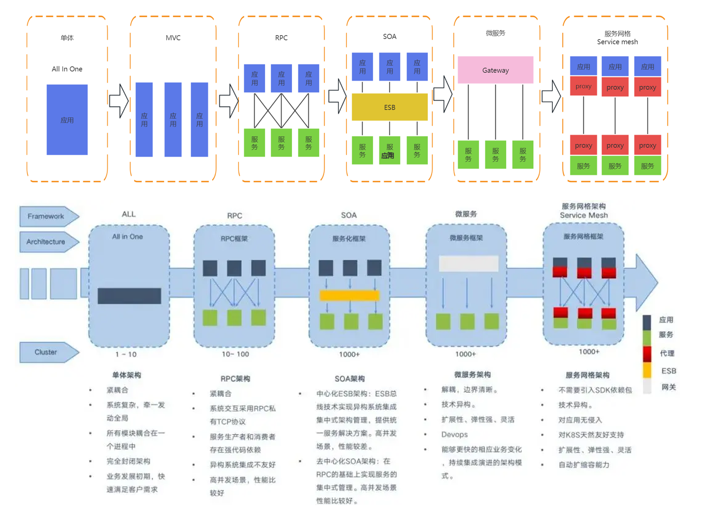

## 云计算

云计算是一种按使用量付费的模式，这种模式提供可用的、便捷的、按需的网络访问， 进入可配置的计 算资源共享池（资源包括网络，服务器，存储，应用软件，服务），这些资源能够被快速提供，只需投 入很少的管理工作，或与服务供应商进行很少的交互

## CNCF和云原生

[CNCF Landscape](https://landscape.cncf.io/)


**云原生的代表技术包括容器、服务网格、微服务、不可变基础设施和声明式API。**

CNCF 项目成熟度分级

*   sandbox 沙箱
*   incubating 孵化
*   graduated 毕业

[Graduated and Incubating Projects | CNCF](https://www.cncf.io/projects/)

CNCF 路线图 Trail Map

1.   容器化
2.   CI/CD
3.    应用定义与编排
4.   监控&分析
5.   服务代理、服务发现和服务网格
6.    网络&策略
7.   分布式数据库与存储
8.   流与消息处理
9.   镜像私库&运行环境
10.   软件分发

# Kubernetes 介绍和架构

Kubernetes 用于管理云平台中多个主机上的容器化的应用，Kubernetes的目标是让部署容器化的应用 简单并且高效,Kubernetes提供了应用部署，规划，更新，维护的强大和灵活的机制。

[Kubernetes](https://kubernetes.io/)

[kubernetes/kubernetes: Production-Grade Container Scheduling and Management](https://github.com/kubernetes/kubernetes)

## Kubernetes 架构

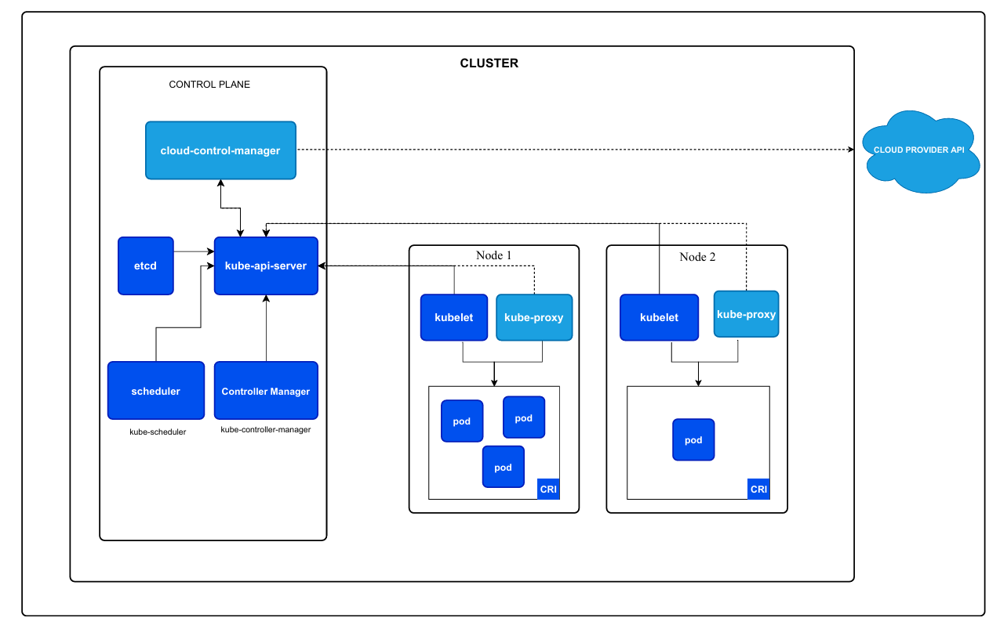主机节点主要有两种类型

*   Master节点
    *   管理(控制)节点
    *   Master 节点主要由 API Server 、Controller-Manager 和Scheduler 三个组件，以及一个用于存储 集群状态的 Etcd存储服务组成
*   Node节点
    *   工作worker节点或者Minion节点
    *   Node节点则主要包含 Kubelet 、Kube Proxy 及容器运行时（ 当前docker 仍是最为常用的实现） 三个组件，它们承载运行各类应用容器


## Kubernetes 组件

kubernetes组件分成三种

*   Control Plane  Components 控制平台组件
*   Node Components 节点组件
*   Addons 附件（插件）

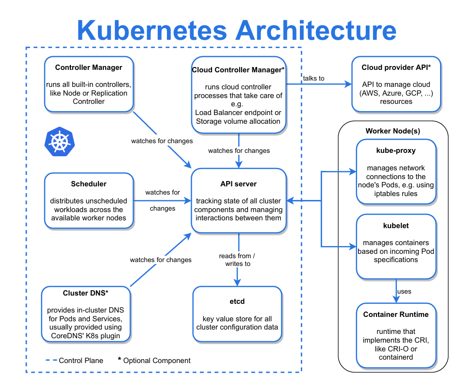

### 控制平面组件

控制平面的组件做出有关集群的全局决策（例如，调度），以及检测和响应集群事件（例如，当部署的 replicas 无法达到要求时，自动启动新的Pod）。Control Plane组件可以在群集中的任何计算机上运 行。但是，为简单起见，通常在同一台计算机上启动所有Control Plane组件，并且不在该计算机上运行 用户容器。

#### kube-apiserver

Kubernetes API server 是整个集群的访问入口, 为 API 对象验证并配置数据，包括 pods、 services、  replication controllers和其它 api 对象 ,API Server 提供 REST 操作和到集群共享状态的前端，所有其他 组件通过它进行交互

API server  对应的程序为kube-apiserver,利用**6443**/tcp对外提供服务

是整个Kubernetes集群的唯一入口

#### kube-controller-manager

Controller Manager作为集群内部的管理控制中心，负责集群内的 NodeNode、PodPod副本、服务端 点（ Endpoint）、命名空间（Namespace）、 服务账号（ tServiceAccount）、资源定额 （ResourceQuota）的管理，当某个 Node异常宕机时， Controller Manager会及时发现并执行自动化 修复流程，确保kubernetes集群尽可以处于预期的工作状态。

#### kube-scheduler

kube-scheduler 调度器，负责为Pod挑选出评估这一时刻相应的最合适的运行节点

#### Cluster Store (etcd)

Kubernetes 需要使用 key/value数据存储系统 Clustrer Store， 用于保存所有集群状态数据， 支持分布 式集群功能

通常为奇数个节点实现,如3,5,7等,通过节点间通过 **raft** 协议进行选举

etcd 由CoreOS公司用GO语言开发

#### cloud-controller-manager (可选)

cloud-controller-manager运行与基础云提供商交互的控制器。

### 节点组件(工作平面组件)

#### kubelet

kubelet是运行worker节点的集群代理

它会监视已分配给worker 节点的 pod,主要负责监听节点上 Pod的状态,同时负责上报节点和节点上面 Pod的状态

负责与Master节点通信，并管理节点上面的Pod。

*   向 master 节点报告 node 节点的状态 
*   接受master的指令并在 Pod 中创建容器 
*   在 node 节点执行容器的健康性检查 
*   返回 Pod 运行状态 
*   准备 Pod 所需的数据卷

kubelet 支持三个主要标准接口

*   CRI: Container Runtime Interface, 当前使用 Containerd 实现容器管理 
*   CNI: Container Network Interface,Network Plugin通过此接口提供Pod 网络功能 
*   CSI:  Container Storage Interface, 提供存储服务标准接口

#### kube-proxy

kube-proxy 是运行在每个 node 上的集群的网络代理，通过在主机上维护网络规则并执行连接转发来实 现 Kubernetes 服务访问 。

kube-proxy 专用于负责将Service资源的定义转为node本地的实现,是**打通Pod网络在Service网络**的关 键所在

Kube-proxy 即负责Pod之间的通信和负载均衡，将指定的流量分发到后端正确的机

有两种模式实现

*   iptables模式：将Service资源的定义转为适配当前节点视角的iptables规则 
*   ipvs模式：将Service资源的定义转为适配当前节点视角的ipvs和少量iptables规则

#### Container Runtime

Kubernetes支持几种容器运行时：Docker， containerd，CRI-O专为Kubernetes以及Kubernetes  CRI（容器运行时接口）的任何实现而设计的轻量级容器运行时

### 附件 Addons

插件负责扩展Kubernetes集群的功能的应用程序，通常以Pod形式托管运行于Kubernetes集群之上

插件使用Kubernetes资源来实现集群功能。因为它们提供了集群级功能，所以插件的命名空间资源属于 kube-system命名空间。

以下 **Network 和DNS** 插件是必选插件,其余是可选的重要插件

#### Network 附件

网络插件，经由CNI(Container Network Interface)接口，负责为Pod提供专用的通信网络

当前网络插件有多种实现,目前常用的CNI网络插件有calico和flannel

#### DNS 域名解析

虽然并非严格要求其他附加组件，但是所有Kubernetes群集都应具有群集DNS，因为许多示例都依赖 它。

除了传统IT环境中的DNS服务器之外，Kubernetes集群DNS 也是一个专用DNS服务器，它为 Kubernetes服务提供DNS记录。

由Kubernetes启动的容器会在其DNS搜索中自动包括此DNS服务器，目前常用DNS应用：CoreDNS， kube-dns

#### 外网入口

为服务提供外网入口，如：Ingress Controller，nginx，Contour等

#### Web UI（Dashboard）

Dashboard仪表板是Kubernetes集群的通用基于Web的UI。它允许用户管理集群中运行的应用程序以 及集群本身并进行故障排除

#### Container Resource Monitoring 容器资源监控

Prometheus

#### Cluster-level Logging 集群级日志

一个集群级别的日志记录机制是负责保存容器日志到提供有搜索和浏览接口的中央日志存储，如： Fluentd-elasticsearch,PLG等

#### 负载均衡器

OpenELB 是适用于非云端部署的Kubernetes环境的负载均衡器，可利用BGP和ECMP协议达到性能最优 和高可用性

## Kubernetes 组件间安全通信

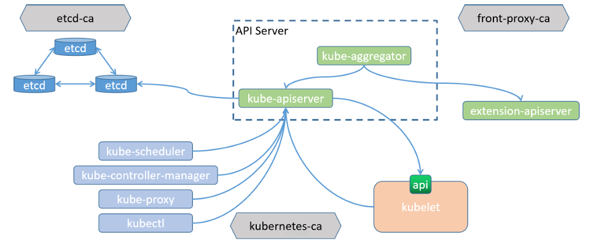

三套CA机制

*   etcd-ca    ETCD集群内部的 TLS 通信 
*   kubernetes-ca  kubernetes集群内部节点间的双向 TLS 通信 
*   front-proxy-ca Kubernetes集群与外部扩展服务简单双向 TLS 通信

## Kubernetes 相关术语

### Pod

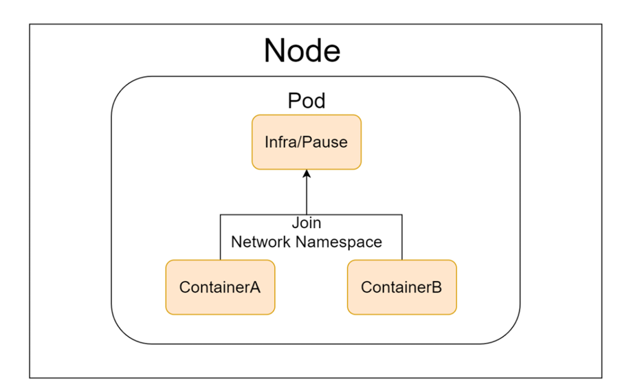

Pod是其运行应用及应用调度的最小逻辑单元

**本质上是共享Network、IPC和UTS名称空间以及存储资源的容器集**

各容器共享网络协议栈、网络设备、路由、IP地址和端口等，但Mount、PID和USER仍隔离

每个Pod上还可附加一个存储卷（Volume）作为该主机的外部存储，独立于Pod的生命周期，可由Pod 内的各容器共享

模拟“不可变基础设施”，删除后可通过资源清单重建 

具有动态性，可容忍误删除或主机故障等异常 

存储卷可以确保数据能超越Pod的生命周期

在设计上，仅应该将具有“超亲密”关系的应用分别以不同容器的形式运行于同一Pod内部

### Service

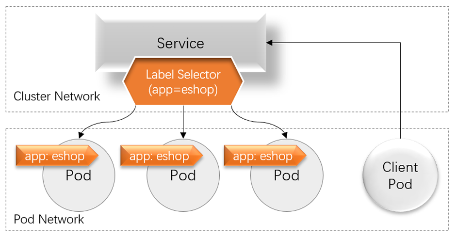

Pod具有动态性，其IP地址也会在基于配置清单重构后重新进行分配，因而需要**服务发现机制**的支撑

**Kubernetes使用Service资源和DNS服务（CoreDNS）进行服务发现**

Service能够为一组提供了相同服务的Pod提供负载均衡机制，其IP地址（Service IP，也称为Cluster  IP）即为客户端流量入口

一个Service对象存在于集群中的各节点之上，不会因个别节点故障而丢失，可为Pod提供固定的前端入 口

Service使用标签选择器（Label Selector）筛选并匹配Pod对象上的标签（Label），从而发现Pod仅具 有符合其标签选择器筛选条件的标签的Pod才可

### Workloads

Pod虽然是运行应用的原子单元，并不需要我们直接管理每个 Pod。

可以使用负载资源 workload resources  来替你管理一组 Pods。 这些资源配置  控制器来确保合适类型的、处于运行状态的 Pod 个数是正确的，与你所指定的状态相一致。 

其**生命周期管理和健康状态监测由kubelet负责完成**，而诸如**更新、扩缩容和重建等应用编排功能**需要由 专用的控制器实现，这类控制器即工作负载型控制器

### Network Model

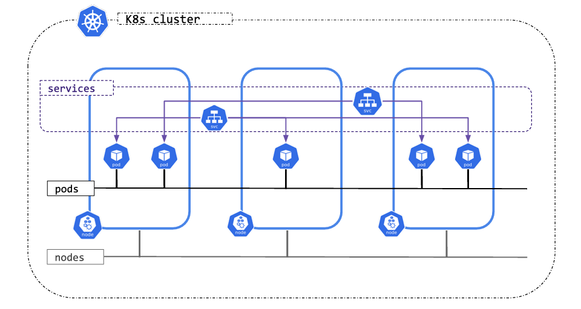

Kubernetes集群上默认会存在三个分别用于Node、Pod和Service的网络

由node内核中的路由模块，以及iptables/netfilter和ipvs等完成网络间的流量转发

安装Kubernetes时,需要分别指定三个网络的网段地址

*   节点网络（主机网络）
    *   集群节点间的通信网络，并负责打通与集群外部端点间的通信
    *   节点网络的IP地址配置在集群节点**主机的物理接口**上
    *   网络及各节点地址需要于Kubernetes部署前完成配置，非由Kubernetes管理
    *   需要由管理员或借助于主机虚拟化管理程序实现
*   Pod网络
    *   为集群上的Pod对象提供的网络
    *   Pod网络 IP地址配置在**Pod的虚拟网络接口**上
    *   每个pod 从此网络动态获取地址,且每次重启pod后IP地址可能会变化
    *   虚拟网络，需要经由CNI网络插件实现，例如Flannel、Calico、Cilium等
*   Service网络
    *   主要用于解决 pod 使用动态地址问题
    *   在部署Kubernetes集群时指定，各Service对象使用的地址将从该网络中分配
    *   Service网络的IP地址并不配置在任何物理接口,而是存在于每个节点内核中其相关的iptables或ipvs 规则中

Kubernetes网络中主要存在4种类型的通信流量

*   同一Pod内的容器间通信
*   Pod间的通信
*   Pod与Service间的通信
*   集群外部流量与Service间的通信

## 容器运行时接口（CRI）

CRI是kubernetes定义的一组gRPC服务。Kubelet作为客户端，基于gRPC协议通过Socket和容器运行时 通信。

CRI 是一个插件接口，它使 kubelet 能够使用各种容器运行时，无需重新编译集群组件。

Kubernetes 集群中需要在每个节点上都有一个可以正常工作的容器运行时， 这样 kubelet 能启动 Pod  及其容器。

容器运行时接口（CRI）是 kubelet 和容器运行时之间通信的主要协议。

CRI 包括两类服务：

*   镜像服务（Image Service）
    *   镜像服务提供下载、检查和删除镜像的远程程序调用。
*   运行时服务（Runtime Service）
    *   运行时服务包含用于管理容器生命周期，以及与容器交互的调用的远程程序调用。

**容器运行时**

对于容器运行时主要有两个级别：Low Level(使用接近内核层) 和 High Level(使用接近用户层)目前，市 面上常用的容器引擎有很多，主要有下图的那几种。

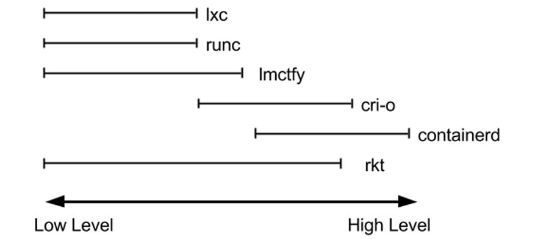

dockershim, containerd 和cri-o都是遵循CRI的容器运行时，称为高层级运行时（High-level  Runtime）

其他的容器运营厂商最底层的**runc**提供，并由 Open Container Initiative 组织维护

目前Docker仍然是最主流的容器引擎 技术。

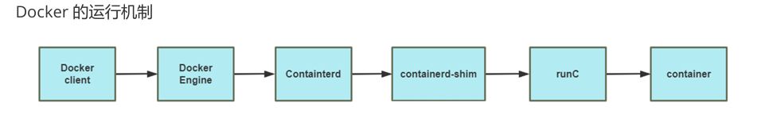

dockershim, containerd 和cri-o对比

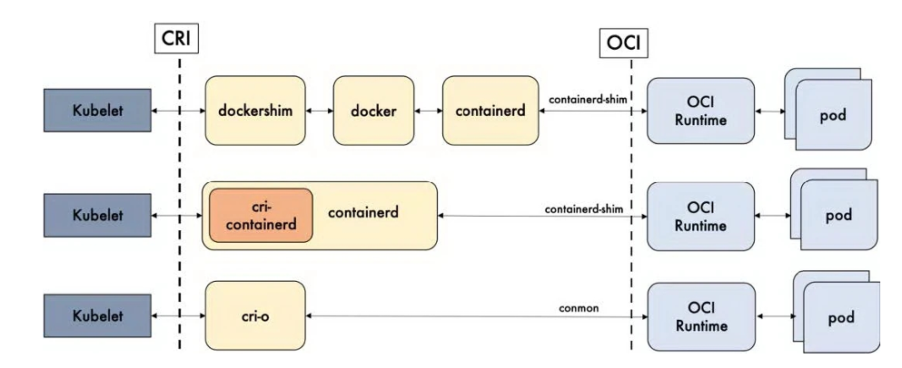


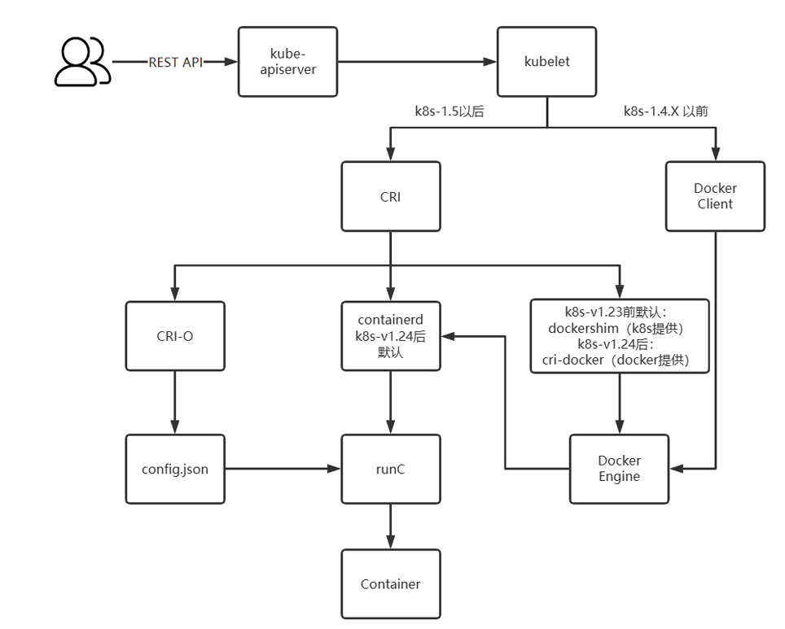

# Kubernetes 集群部署

## Kubernetes 集群组件运行模式

*   独立组件模式
    *   各关键组件都以二进制方式部署于主机节点上，并以守护进程形式运行

各附件Add-ons 则以Pod形式运行 

需要实现各种证书的申请颁发 

**部署过程繁琐复杂**

可使用kubeasz（实际上是ansible剧本）

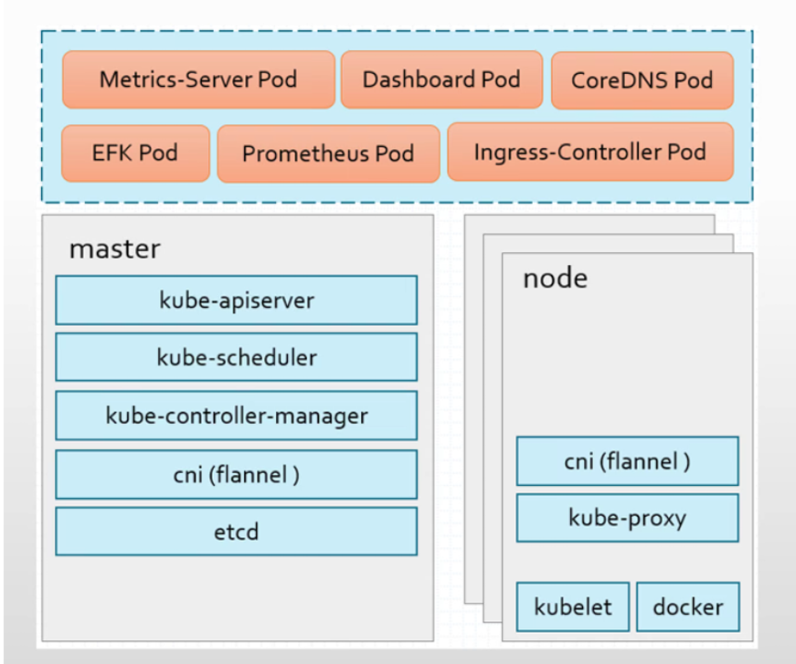


*   静态Pod模式
    *   kubelet和容器运行时docker以二进制部署，运行为守护进程
    *   除此之外所有组件为Pod 方式运行

控制平台各组件以静态Pod对象运行于Master主机之上

静态Pod由kubelet所控制实现创建管理,而无需依赖kube-apiserver等控制平台组件

kube-proxy等则以Pod形式运行

使用kubernetes官方提供的**kubeadm**工具实现kubernetes集群方便快速的部署

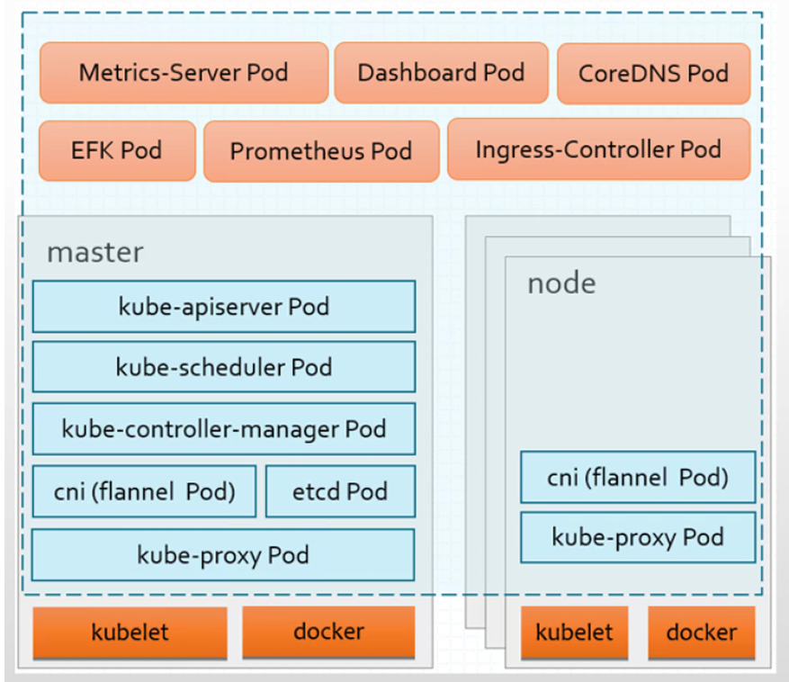

## 部署架构

### HA topology - stacked etcd

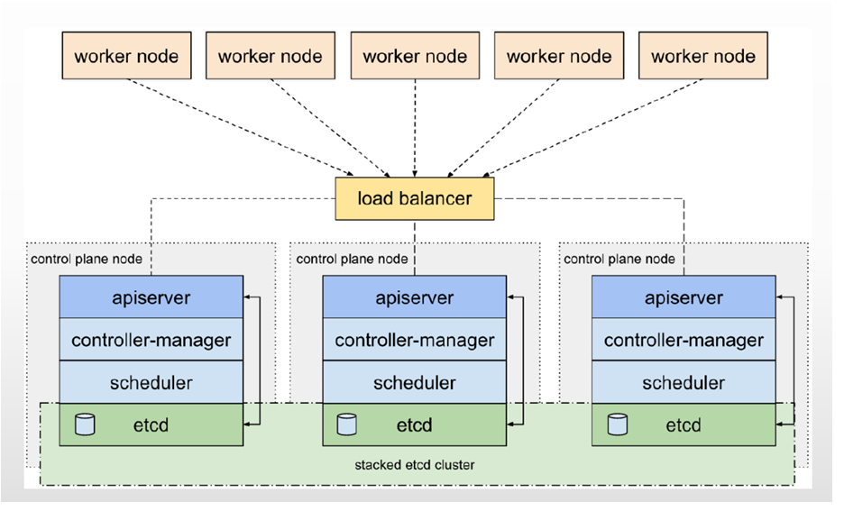

### HA topology - external etcd

拆分出etcd（外置）

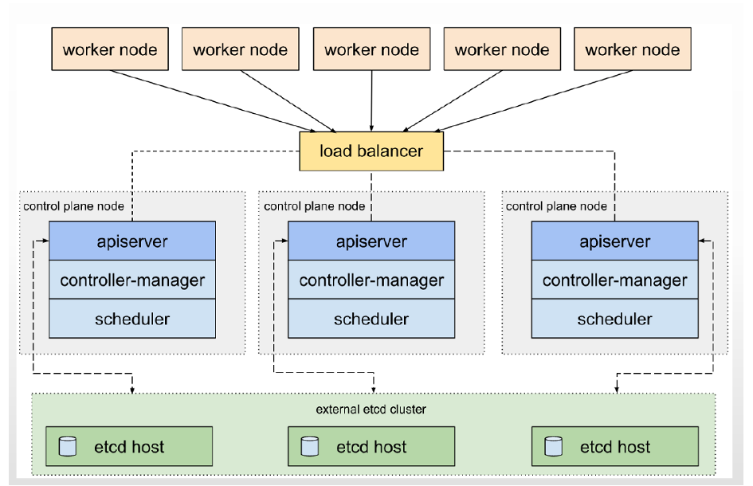

## 运行 Minikube cluster

将所有节点集中于一台主机

**仅用于用于测试环境**

**手动部署 Minikube cluster**

[minikube start | minikube](https://minikube.sigs.k8s.io/docs/start/?arch=%2Fwindows%2Fx86-64%2Fstable%2F.exe+download)

```shell
apt update && apt install docker.io

useradd -G docker -m -s /bin/bash  loong
vim /etc/sudoers
loong ALL=(ALL) NOPASSWD: /usr/bin/docker

su - loong
curl -LO https://github.com/kubernetes/minikube/releases/latest/download/minikube-linux-amd64
sudo install minikube-linux-amd64 /usr/local/bin/minikube && rm minikube-linux-amd64

# 启动,注意:内存必须大于3G才能启动
minikube start
#验证
minikube kubectl -- get po -A
minikube kubectl -- get nodes
```

## 基于Kubeadm和 Docker 部署 kubernetes 高可用集群

[Bootstrapping clusters with kubeadm | Kubernetes](https://kubernetes.io/docs/setup/production-environment/tools/kubeadm/)

 kubeadm是Kubernetes社区提供的集群构建工具

*   负责执行构建一个最小化可用集群并将其启动等必要的基本步骤 
*   Kubernetes集群全生命周期管理工具，可用于实现集群的部署、升级/降级及卸载等 
*   kubeadm仅关心如何初始化并拉起一个集群，其职责仅限于下图中背景蓝色的部分
*   蓝色的部分以外的其它组件还需要自行部署

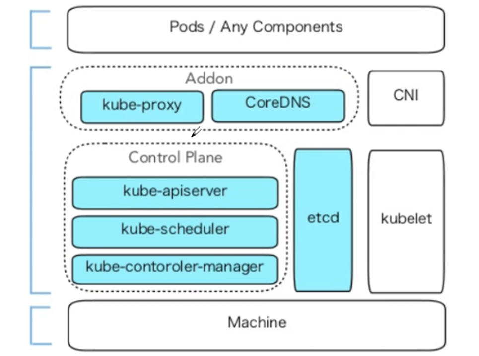

### 部署架构

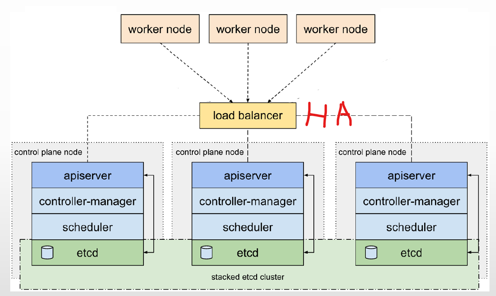

| IP         | 主机名            | 角色                                                         |
| ---------- | ----------------- | ------------------------------------------------------------ |
| 10.0.0.101 | master1.l00n9.icu | K8s 集群主节点 1                                             |
| 10.0.0.102 | master1.l00n9.icu | K8s 集群主节点 2                                             |
| 10.0.0.103 | master1.l00n9.icu | K8s 集群主节点 3                                             |
| 10.0.0.104 | node1.l00n9.icu   | K8s 集群工作节点 1                                           |
| 10.0.0.105 | node1.l00n9.icu   | K8s 集群工作节点 2                                           |
| 10.0.0.106 | node1.l00n9.icu   | K8s 集群工作节点 3                                           |
| 10.0.0.107 | ha1.l00n9.icu     | K8s 主节点访问入口 1 <br>提供高可用及负载均衡（haproxy，keepalived） |
| 10.0.0.108 | ha1.l00n9.icu     | K8s 主节点访问入口 2 <br/>提供高可用及负载均衡（haproxy，keepalived） |
| 10.0.0.109 | harbor.l00n9.icu  | 容器镜像仓库（可选）                                         |
| 10.0.0.110 | kubeapi.l00n9.icu | VIP，在ha1和ha2主机实现                                      |

**网络地址规划**

```shell
物理主机网络       10.0.0.0/24
集群pod网络       --pod-network-cidr=10.244.0.0/16
应用service网络   --service-cidr=10.96.0.0/12
```

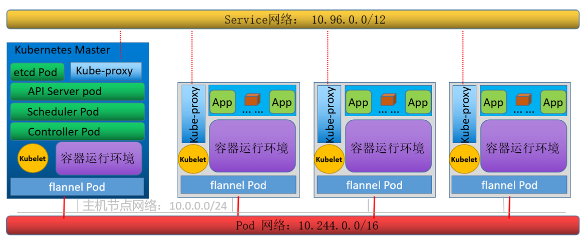

### 初始环境准备

[Installing kubeadm | Kubernetes](https://kubernetes.io/docs/setup/production-environment/tools/kubeadm/install-kubeadm/)

*   硬件准备环境: 每个主机**至少2G以上内存,CPU2核以上** 
*   操作系统: 最小化安装支持Kubernetes的Linux系统 
*   唯一的主机名，MAC地址以及product_uuid和主机名解析 
*   保证各个节点网络配置正确,并且保证通信正常 
*   禁用 swap  
*   禁用 SELinux 
*   放行Kubernetes使用到的相关端口或禁用firewalld/iptables 
*   配置正确的时区和时间同步 
*   内核参数优化  
*   所有节点实现基于 ssh key 验证(可选)

#### 打通个主机免密码认证（可选）

脚本实现

[-shell-/多主机免密登录脚本 at main · l00ng-n1/-shell-](https://github.com/l00ng-n1/-shell-/tree/main/多主机免密登录脚本)

#### 唯一的主机名，MAC地址以及product_uuid和主机名解析

**product_uuid**

```shell
cat /sys/class/dmi/id/product_uuid

for i in {101..108};do ssh 10.0.0.$i cat /sys/class/dmi/id/product_uuid; done
c3784d56-1811-8ec6-80e7-9e20ad96475f
62114d56-27c1-6106-f023-eb17ab86f5ea
94844d56-fd08-5d1b-9c7c-54b1f8874b6e
15554d56-d40c-d50a-cdb2-07db76a7ab9f
23e94d56-290a-647f-59b5-c268f69a7542
05e44d56-1735-2780-87fd-497fe1ad2450
577d4d56-1a8b-e0bc-99a2-d1f72c014593
e3634d56-b797-c813-11f3-5bf147725f19
```

**唯一的主机名**

```shell
hostnamectl set-hostname master1.l00n9.icu

hostnamectl set-hostname node1.l00n9.icu

hostnamectl set-hostname ha1.l00n9.icu
```

**主机名解析**

```shell
vim /etc/hosts
10.0.0.100 devops.l00n9.icu  devops

10.0.0.101 master1.l00n9.icu master1
10.0.0.102 master2.l00n9.icu master2
10.0.0.103 master3.l00n9.icu master3

10.0.0.104 node1.l00n9.icu   node1
10.0.0.105 node2.l00n9.icu   node2
10.0.0.106 node3.l00n9.icu   node3

10.0.0.107 ha1.l00n9.icu     ha1
10.0.0.108 ha2.l00n9.icu     ha2

10.0.0.109 harbor.l00n9.icu  harbor

# keepalived的VIP
10.0.0.110 kubeapi.l00n9.icu kubeapi
```

#### 需要开放的端口

[Ports and Protocols | Kubernetes](https://kubernetes.io/docs/reference/networking/ports-and-protocols/)

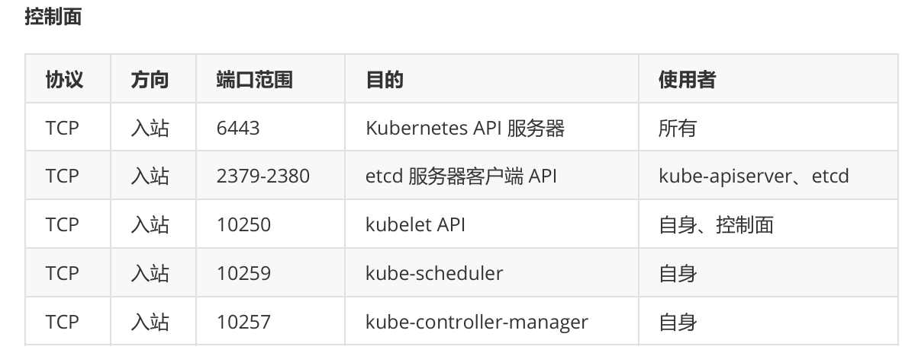

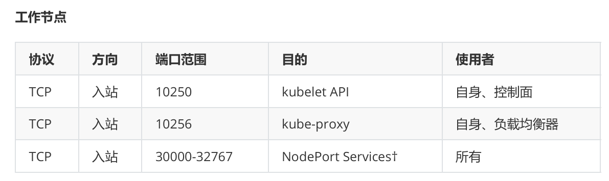

#### 主机时间同步

```shell
timedatectl set-timezone Asia/Shanghai

apt install  chrony -y

vim /etc/chrony/chrony.conf
pool ntp.aliyun.com        iburst maxsources 2

systemctl enable chrony
systemctl restart chrony

chronyc    sources 
```

#### 禁用 SELinux

```shell
setenforce 0
sed -i 's#^\(SELINUX=\).*#\1disabled#' /etc/sysconfig/selinux
```

#### 关闭防火墙

```shell
# RHEL/CentOS/Rocky系统
systemctl disable --now firewalld 

# Ubuntu系统
ufw disable
```


#### 禁用 swap  

```shell
# 方法1
swapoff -a
sed -i  '/swap/s/^/#/' /etc/fstab

# 方法2
systemctl stop swap.img.swap
systemctl mask swap.img.swap 或者 systemctl mask swap.target

# 方法3
swapoff -a
systemctl mask swap.target
```


```shell
for i in {100..109};do ssh 10.0.0.$i swapoff -a; done
for i in {100..109};do ssh 10.0.0.$i systemctl mask swap.target; done
```

#### 内核优化

根据硬件和业务需求,对内核参数做相应的优化

**注意:安装docker时会自动修改内核参数**

### harbor部署

docker

```shell
# Add Docker's official GPG key:
sudo apt-get update
sudo apt-get install ca-certificates curl
sudo install -m 0755 -d /etc/apt/keyrings
sudo curl -fsSL https://download.docker.com/linux/ubuntu/gpg -o /etc/apt/keyrings/docker.asc
sudo chmod a+r /etc/apt/keyrings/docker.asc

# Add the repository to Apt sources:
echo \
  "deb [arch=$(dpkg --print-architecture) signed-by=/etc/apt/keyrings/docker.asc] https://download.docker.com/linux/ubuntu \
  $(. /etc/os-release && echo "${UBUNTU_CODENAME:-$VERSION_CODENAME}") stable" | \
  sudo tee /etc/apt/sources.list.d/docker.list > /dev/null
sudo apt-get update

sudo apt-get install docker-ce docker-ce-cli containerd.io docker-buildx-plugin docker-compose-plugin
```

下载

```shell
wget https://github.com/goharbor/harbor/releases/download/v2.7.1/harbor-offline-installer-v2.7.1.tgz

tar xvf harbor-offline-installer-v2.7.1.tgz
```

配置

```shell
cp harbor/harbor.yml.tmpl harbor/harbor.yml

vim harbor.yml
hostname = 10.0.0.101          
#修改此行,指向当前主机IP 或 FQDN,建议配置IP
harbor_admin_password = 123456
data_volume: /data/harbor      
#建议修改数据目录路径，使用大容量的高速磁盘，默认为/data

#如果不使用https，还需要将下面行注释掉
#https:
#  port: 443
#  certificate: /your/certificate/path
#  private_key: /your/private/key/path
```

运行

```shell
./install.sh --with-trivy
# Trivy 是一个由 Aqua Security 开发的开源漏洞扫描器，用于检测容器镜像（如 Docker 镜像）中的已知漏洞。

#安装harbor后会自动开启很多相关容器
docker ps
```

### haproxy & keepalived 高可用的反向代理

#### keepalived

```shell
apt -y install keepalived 

vim /etc/keepalived/keepalived.conf

systemctl restart keepalived.service
```

ha1的keepalived配置

```shell
global_defs {
   router_id ha1.l00n9.icu  #指定router_id,#在ha2上为ha2.l00n9.icu
}

vrrp_script check_haproxy {
    #script "/etc/keepalived/check_haproxy.sh"
    script "killall -0 haproxy"
    interval 1
    weight -30
    fall 3
    rise 2
    timeout 2
}

vrrp_instance VI_1 {
    state MASTER            
    interface eth0
    garp_master_delay 10
    virtual_router_id 66 
    priority 100           
    advert_int 1
    authentication {
        auth_type PASS
        auth_pass 123456   
    }
    virtual_ipaddress {
        10.0.0.110/24 dev eth0  label eth0:1  #指定VIP,ha1和ha2此值必须相同
    }
    track_script {
        check_haproxy 
    }
 }
```

ha2的keepalived配置

```shell
global_defs {
   router_id ha2.l00n9.icu  #不同
}

vrrp_instance VI_1 {
    state BACKUP   # 不同            
    interface eth0
    garp_master_delay 10
    virtual_router_id 66 
    priority 80  # 不同           
    advert_int 1
    authentication {
        auth_type PASS
        auth_pass 123456   
    }
    virtual_ipaddress {
        10.0.0.110/24 dev eth0  label eth0:1
    }
 }
```

#### haproxy

```shell
apt -y install haproxy
```

内核参数，可绑定没拥有的IP

```shell
echo "net.ipv4.ip_nonlocal_bind = 1" >> /etc/sysctl.conf
sysctl -p 
```

配置

```shell
vim /etc/haproxy/haproxy.cfg
# 追加
listen stats
    mode http
    bind 0.0.0.0:8888
    stats enable
    log global
    stats uri /status
    stats auth admin:123456
    
 listen  kubernetes-api-6443
    bind 10.0.0.110:6443
    mode tcp 
    server master1 10.0.0.101:6443 check inter 3s fall 3 rise 3 
    server master2 10.0.0.102:6443 check inter 3s fall 3 rise 3 
    server master3 10.0.0.103:6443 check inter 3s fall 3 rise 3
    
systemctl restart haproxy.service
```

### docker安装与配置

master节点与node节点

```shell
apt -y install docker.io
docker version
```

### 安装 cri-dockerd与配置

[Mirantis/cri-dockerd: dockerd as a compliant Container Runtime Interface for Kubernetes](https://github.com/Mirantis/cri-dockerd)

```shell
wget https://github.com/Mirantis/cri-dockerd/releases/download/v0.3.16/cri-dockerd_0.3.16.3-0.ubuntu-jammy_amd64.deb

dpkg -i cri-dockerd_0.3.16.3-0.ubuntu-jammy_amd64.deb
```

配置 cri-dockerd

从国内 cri-dockerd 服务无法下载 k8s.gcr.io上面相关镜像,导致无法启动,所以需要修改 cri-dockerd 使用国内镜像源

```shell
vim /lib/systemd/system/cri-docker.service
ExecStart=/usr/bin/cri-dockerd --container-runtime-endpoint fd:// --pod-infra-container-image registry.aliyuncs.com/google_containers/pause:3.10

systemctl daemon-reload && systemctl restart cri-docker.service
```

### 配置所有节点指向harbor(可选)

```shell
sed -Ei '/^ExecStart/s#$# --insecure-registry harbor.l00n9.icu#' /lib/systemd/system/docker.service
systemctl daemon-reload
systemctl restart docker.service
```

### kubeadm, kubelet,kubectl 相关包安装

所有 master 和 node 节点都安装kubeadm, kubelet相关包

所有 master 节点都安装kubectl 相关包（node也可以安装，但无法使用）

通过国内镜像站点阿里云安装

[kubernetes镜像_kubernetes下载地址_kubernetes安装教程-阿里巴巴开源镜像站](https://developer.aliyun.com/mirror/kubernetes?spm=a2c6h.13651102.0.0.50241b11HCaZTF)

```shell
apt-get update && apt-get install -y apt-transport-https
curl -fsSL https://mirrors.aliyun.com/kubernetes-new/core/stable/v1.32/deb/Release.key | gpg --dearmor -o /etc/apt/keyrings/kubernetes-apt-keyring.gpg
echo "deb [signed-by=/etc/apt/keyrings/kubernetes-apt-keyring.gpg] https://mirrors.aliyun.com/kubernetes-new/core/stable/v1.32/deb/ /" | tee /etc/apt/sources.list.d/kubernetes.list
apt-get update
apt-get install -y kubelet kubeadm kubectl

apt list  kubeadm kubectl kubelet

# 安装最新版本的k8s相关包,安装kubeadm时会自动安装kubelet和kubectl
apt -y install kubeadm
```

**kubeadm 命令补全**

```shell
kubeadm completion bash > /etc/profile.d/kubeadm_completion.sh
source /etc/profile.d/kubeadm_completion.sh
```


### kubeadm初始化


在master1节点上执行（只在一个master节点上执行）

```shell
# --kubernetes-version指定安装的版本
# --token-ttl #共享令牌（token）的过期时长，默认为24小时，0表示永不过期；
# 确保/run/cri-dockerd.sock存在
kubeadm init --kubernetes-version=v1.32.3 --control-plane-endpoint kubeapi.l00n9.icu  --pod-network-cidr 10.244.0.0/16 --service-cidr 10.96.0.0/12  --image-repository registry.aliyuncs.com/google_containers --token-ttl=0 --upload-certs --cri-socket=unix:///run/cri-dockerd.sock

#如果执行失败，可以执行下面命令恢复后，再执上面命令
kubeadm  reset
```

将最后的输出信息复制保存，以防丢失

```shell
Your Kubernetes control-plane has initialized successfully!

To start using your cluster, you need to run the following as a regular user:

  mkdir -p $HOME/.kube
  sudo cp -i /etc/kubernetes/admin.conf $HOME/.kube/config
  sudo chown $(id -u):$(id -g) $HOME/.kube/config

Alternatively, if you are the root user, you can run:

  export KUBECONFIG=/etc/kubernetes/admin.conf

You should now deploy a pod network to the cluster.
Run "kubectl apply -f [podnetwork].yaml" with one of the options listed at:
  https://kubernetes.io/docs/concepts/cluster-administration/addons/

You can now join any number of control-plane nodes running the following command on each as root:

  kubeadm join kubeapi.l00n9.icu:6443 --token 0z5brz.v7chkkjxthk6kgqp \
        --discovery-token-ca-cert-hash sha256:8205da364eb3d30270f8967a67f1f0019ff759895c0e4fc512a27a452883d155 \
        --control-plane --certificate-key cae1de2ba72b5faaab26ab2fd26a8663169ef8ae3f8f1e6f985f3aa3dd017047

Please note that the certificate-key gives access to cluster sensitive data, keep it secret!
As a safeguard, uploaded-certs will be deleted in two hours; If necessary, you can use
"kubeadm init phase upload-certs --upload-certs" to reload certs afterward.

Then you can join any number of worker nodes by running the following on each as root:

kubeadm join kubeapi.l00n9.icu:6443 --token 0z5brz.v7chkkjxthk6kgqp \
        --discovery-token-ca-cert-hash sha256:8205da364eb3d30270f8967a67f1f0019ff759895c0e4fc512a27a452883d155 
```

```shell
mkdir -p $HOME/.kube
sudo cp -i /etc/kubernetes/admin.conf $HOME/.kube/config
sudo chown $(id -u):$(id -g) $HOME/.kube/config
```

也可以基于文件初始化kubernetes集群

```shell
#将默认配置输出至文件
kubeadm config print init-defaults  > kubeadm-init.yaml

#修改后的初始化文件内容，修改下面共7项设置
vim kubeadm-init.yaml
ttl: 48h0m0s                        # 指定token有效期,默认24小时,0s为永不失效
advertiseAddress: 10.0.0.101        # 指定当前主机IP
name: master1.wang.org              # 指定主机名
controlPlaneEndpoint: kubeapi.wang.org:6443  # 添加此行,配置基于 VIP 的 Endpoint
imageRepository: registry.aliyuncs.com/google_containers  # 修改为国内的镜像地址
kubernetesVersion: v1.32.3          # 指定版本，必须项
dnsDomain: l00n9.icu                # 指定域名，必须项
podSubnet: 10.244.0.0/16            # 添加此行,指定Pod的网段，必须项
serviceSubnet: 10.96.0.0/12         # 指定网段，必须项

# 基于文件执行 k8s master 初始化
kubeadm init --config kubeadm-init.yaml
```

### 其他master节点加入集群

```shell
# --cri-socket=unix:///run/cri-dockerd.sock要补在末尾
kubeadm join kubeapi.l00n9.icu:6443 --token 0z5brz.v7chkkjxthk6kgqp \
        --discovery-token-ca-cert-hash sha256:8205da364eb3d30270f8967a67f1f0019ff759895c0e4fc512a27a452883d155 \
        --control-plane --certificate-key cae1de2ba72b5faaab26ab2fd26a8663169ef8ae3f8f1e6f985f3aa3dd017047 --cri-socket=unix:///run/cri-dockerd.sock
```

### node节点加入集群

```shell
# --cri-socket=unix:///run/cri-dockerd.sock要补在末尾
kubeadm join kubeapi.l00n9.icu:6443 --token 0z5brz.v7chkkjxthk6kgqp \
        --discovery-token-ca-cert-hash sha256:8205da364eb3d30270f8967a67f1f0019ff759895c0e4fc512a27a452883d155 --cri-socket=unix:///run/cri-dockerd.sock
```

### 验证

master节点上

```shell
kubectl get nodes
NAME                STATUS     ROLES           AGE     VERSION
master1.l00n9.icu   NotReady   control-plane   8m15s   v1.32.3
master2.l00n9.icu   NotReady   control-plane   43s     v1.32.3
master3.l00n9.icu   NotReady   control-plane   38s     v1.32.3
node1.l00n9.icu     NotReady   <none>          99s     v1.32.3
node2.l00n9.icu     NotReady   <none>          94s     v1.32.3
node3.l00n9.icu     NotReady   <none>          92s     v1.32.3

# 验证 k8s 集群状态
kubectl get cs
Warning: v1 ComponentStatus is deprecated in v1.19+
NAME                 STATUS    MESSAGE   ERROR
controller-manager   Healthy   ok        
scheduler            Healthy   ok        
etcd-0               Healthy   ok 

# 验证证书信息
kubectl  get csr
NAME        AGE     SIGNERNAME                                    REQUESTOR                 REQUESTEDDURATION   CONDITION
csr-2qrx4   3m52s   kubernetes.io/kube-apiserver-client-kubelet   system:bootstrap:0z5brz   <none>              Approved,Issued
csr-8x7gp   3m4s    kubernetes.io/kube-apiserver-client-kubelet   system:bootstrap:0z5brz   <none>              Approved,Issued
csr-d4v9v   3m59s   kubernetes.io/kube-apiserver-client-kubelet   system:bootstrap:0z5brz   <none>              Approved,Issued
csr-qcjjw   2m58s   kubernetes.io/kube-apiserver-client-kubelet   system:bootstrap:0z5brz   <none>              Approved,Issued
csr-qz6lk   3m55s   kubernetes.io/kube-apiserver-client-kubelet   system:bootstrap:0z5brz   <none>              Approved,Issued
```

### 配置网络组件

在第一个master节点（只在一个master节点上执行）

[flannel-io/flannel: flannel is a network fabric for containers, designed for Kubernetes](https://github.com/flannel-io/flannel/)

```shell
kubectl apply -f https://github.com/flannel-io/flannel/releases/latest/download/kube-flannel.yml

# 或
wget https://github.com/flannel-io/flannel/releases/latest/download/kube-flannel.yml
kubectl apply -f kube-flannel.yml

# 如果有问题,可以用下面命令删除上面创建的网络
kubectl delete -f kube-flannel.yml

# 将装好的导出，再在其他节点上导入
docker save ghcr.io/flannel-io/flannel ghcr.io/flannel-io/flannel-cni-plugin > flannel.tar
docker load -i flannel-v0.26.5-linux-amd64.tar.gz

kubectl get nodes
NAME                STATUS   ROLES           AGE   VERSION
master1.l00n9.icu   Ready    control-plane   62m   v1.32.3
master2.l00n9.icu   Ready    control-plane   54m   v1.32.3
master3.l00n9.icu   Ready    control-plane   54m   v1.32.3
node1.l00n9.icu     Ready    <none>          55m   v1.32.3
node2.l00n9.icu     Ready    <none>          55m   v1.32.3
node3.l00n9.icu     Ready    <none>          55m   v1.32.3
```

### 创建容器并测试访问

```shell
#查看集群信息
kubectl cluster-info

# 创建两个pod
kubectl create deployment pod-test --image=wangxiaochun/pod-test:v0.1  --replicas=2

# 动态扩容
kubectl scale deployment/pod-test --replicas=3

#查看外部能访问的端口
kubectl get svc -l app=pod-test

kubectl get pod   -o wide  | grep pod-test

#查看每个节点信息
kubectl describe  node master.l00n9.icu
kubectl describe  node node1.l00n9.icu

kubectl get componentstatuses
kubectl get cs

kubectl get pod -o wide
```

## 基于Kubeadm 和 Containerd 部署 Kubernetes 高 可用集群

初始化环境**同上**

haproxy与keepalived 高可用的反向代理**同上**

### 内核优化

如果是安装 Docker 会自动配置以下的内核参数，而无需手动实现

但是如果安装Contanerd，还需手动配置

```shell
#方法1: 安装docker,自动修改内核参数,并自动安装containerd
apt -y install docker.io

#方法2：
modprobe overlay
modprobe br_netfilter

#开机加载
cat <<EOF | tee /etc/modules-load.d/k8s.conf
overlay
br_netfilter
EOF

#设置所需的 sysctl 参数，参数在重新启动后保持不变
cat <<EOF | sudo tee /etc/sysctl.d/k8s.conf
net.bridge.bridge-nf-call-iptables   = 1
net.bridge.bridge-nf-call-ip6tables  = 1
net.ipv4.ip_forward                  = 1
EOF

# 会依次载入一系列配置文件，包含 /etc/sysctl.conf 和 /etc/sysctl.d/*.conf 等多个路径下的配置文件，更全面。
sysctl --system

# sysctl -p 载入 默认配置文件 /etc/sysctl.conf 中的内核参数。
```

### 所有主机安装 Containerd

#### 包安装 Containerd

```shell
apt -y install containerd

systemctl status containerd

containerd --version
```

配置containerd

```shell
mkdir /etc/containerd/
containerd config default > /etc/containerd/config.toml

#将 sandbox_image 镜像源设置为阿里云google_containers镜像源（国内网络需要）
grep sandbox_image  /etc/containerd/config.toml
sed -i "s#registry.k8s.io/pause:3.8#registry.aliyuncs.com/google_containers/pause:3.10#g" /etc/containerd/config.toml

#配置containerd cgroup 驱动程序systemd
# ubuntu22.04较新内核必须修改,ubuntu20.04更旧的内核版本可不做修改
grep SystemdCgroup /etc/containerd/config.toml
sed -i 's#SystemdCgroup = false#SystemdCgroup = true#g' /etc/containerd/config.toml
```

```toml
  [plugins."io.containerd.grpc.v1.cri".registry.mirrors] #在此行下面添加以下内容
  
  [plugins."io.containerd.grpc.v1.cri".registry.mirrors."docker.io"]
    endpoint = ["https://registry.aliyuncs.com"]
    
  [plugins."io.containerd.grpc.v1.cri".registry.mirrors."harbor.l00n9.icu"]
    endpoint = ["http://harbor.l00n9.icu"]
  
    [plugins."io.containerd.grpc.v1.cri".registry.configs."harbor.l00n9.icu".tls]
      insecure_skip_verify = true
  
    [plugins."io.containerd.grpc.v1.cri".registry.configs."harbor.l00n9.icu".auth]
       username = "admin"
       password = "123456"
```


#### 二进制安装 Containerd

Containerd 有两种二进制安装包:

*   containerd-xxx ：不包含runC，需要单独安装runC
*   cri-containerd-cni-xxx：包含runc和kubernetes里的所需要的相关文件

[containerd/containerd: An open and reliable container runtime](https://github.com/containerd/containerd)

```shell
tar xf cri-containerd-cni-1.6.8-linux-amd64.tar.gz  -C /

#如果是不包含runc的,还需要单独下载runc即可
tar xf containerd-1.6.8-linux-amd64.tar.gz -C /

wget https://github.com/opencontainers/runc/releases/download/v1.1.4/runc.amd64
mv runc.amd64 /usr/bin/runc
chmod +x /usr/bin/runc

#参考包安装的service手动创建service文件
vim /lib/systemd/system/containerd.service
```

配置 Containerd

```shell
mkdir /etc/containerd/
containerd config default > /etc/containerd/config.toml

#将 sandbox_image 镜像源设置为阿里云google_containers镜像源（国内网络需要）
grep sandbox_image  /etc/containerd/config.toml
sed -i "s#registry.k8s.io/pause:3.8#registry.aliyuncs.com/google_containers/pause:3.10#g" /etc/containerd/config.toml

#配置containerd cgroup 驱动程序systemd
# ubuntu22.04较新内核必须修改,ubuntu20.04更旧的内核版本可不做修改
grep SystemdCgroup /etc/containerd/config.toml
sed -i 's#SystemdCgroup = false#SystemdCgroup = true#g' /etc/containerd/config.toml
```

安装 CNI 插件工具

虽然 cri-containerd-cni-1.6.8-linux-amd64.tar.gz 包含了cni，但是无法和kubernetes 兼容

```shell
wget https://github.com/containernetworking/plugins/releases/download/v1.1.1/cni plugins-linux-amd64-v1.1.1.tgz

#覆盖原有的文件
tar xf cni-plugins-linux-amd64-v1.1.1.tgz  -C /opt/cni/bin/
```

### 所有主机安装 kubeadm、kubelet 和 kubectl

同上

### 在第一个 master 节点初始化 Kubernetes 集群

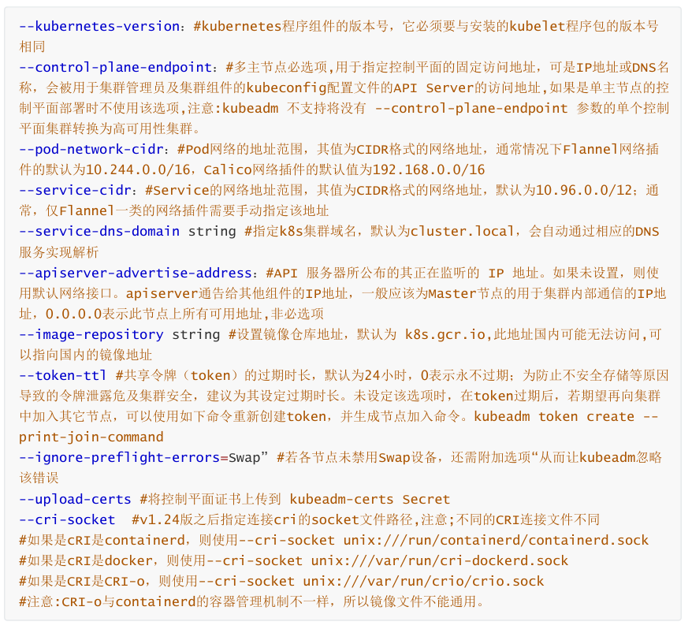

同上

但不需要加`--cri-socket`参数

### 其他节点添加

同上

### Containerd 客户端工具

## Kubeasz 利用 Ansible 部署二进制 Kubernetes 高可 用集群

所有组件都已二进制安装，以服务的方式运行

[easzlab/kubeasz: 使用Ansible脚本安装K8S集群，介绍组件交互原理，方便直接，不受国内网络环境影响](https://github.com/easzlab/kubeasz)

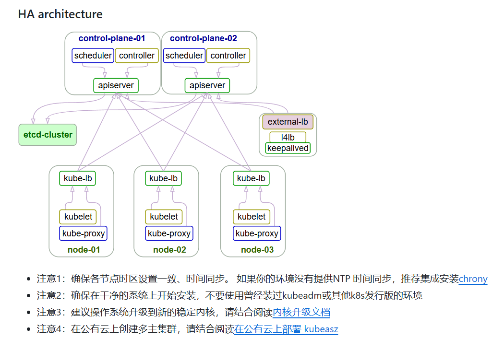

| 角色       | 数量 | 描述                                                    |
| ---------- | ---- | ------------------------------------------------------- |
| 部署节点   | 1    | 运行ansible/ezctl命令，一般复用第一个master节点         |
| etcd节点   | 3    | 注意etcd集群需要1,3,5,...奇数个节点，一般复用master节点 |
| master节点 | 2    | 高可用集群至少2个master节点                             |
| node节点   | n    | 运行应用负载的节点，可根据需要提升机器配置/增加节点数   |

### ALL in ONE 部署

[kubeasz/docs/setup/quickStart.md at master · easzlab/kubeasz](https://github.com/easzlab/kubeasz/blob/master/docs/setup/quickStart.md)

### 高可用分布式集群部署案例

#### 从部署主机到其它主机的基于ssh-key验证

```
devops
ssh-keygen
ssh-copy-id 10.0.0.101
...
ssh-copy-id 10.0.0.106
```

#### 下载工具脚本ezdown

```shell
wget https://github.com/easzlab/kubeasz/releases/download/3.6.5/ezdown

chmod +x ./ezdown
```

#### 下载kubeasz代码、二进制、默认容器镜像

```shell
#下载kubeasz代码、二进制、默认下载容器镜像到/etc/kubeasz目录并同时安装Docker，（更多关于ezdown的参数，运行./ezdown 查看）
./ezdown -D

ls /etc/kubeasz/

docker ps

docker images
```

#### 准备集群所需的配置环境信息

```shell
#容器化运行kubeasz，用于安装k8s集群工具
./ezdown -S

docker ps

#自动生成别名
tail -n1 .bashrc
alias dk='docker exec -it kubeasz'  # generated by kubeasz
source .bashrc

#创建集群的初始的配置信息,指定集群名称k8s-mycluster-01
dk ezctl new k8s-mycluster-01
# 或
docker exec -it kubeasz ezctl new k8s-mycluster-01

#生成的集群相关配置文件
tree /etc/kubeasz/clusters/

#按规划修改配置
vim /etc/kubeasz/clusters/k8s-mycluster-01/hosts
[etcd]
10.0.0.101
10.0.0.102
10.0.0.103

[kube_master]
10.0.0.101 k8s_nodename='master-01'
10.0.0.102 k8s_nodename='master-02'
10.0.0.103 k8s_nodename='master-03'

[kube_node]
10.0.0.104 k8s_nodename='worker-01'        
10.0.0.105 k8s_nodename='worker-02'
10.0.0.106 k8s_nodename='worker-03'

#根据需要修改Service网络配置，默认为10.68.0.0/16，修改此处
SERVICE_CIDR="10.96.0.0/12"   

#根据需要修改Pod网络配置,默认为172.20.0.0/16 ，修改此处
CLUSTER_CIDR="10.244.0.0/16"

#修改K8S_VER等,比如:k8s版本,证书有效期,内部Harbor,需要签发证书的IP,节点最大Pod数等(可选)
#默认不做修改
vim /etc/kubeasz/clusters/k8s-mycluster-01/config.yml

#查看ansible的playbook
ls /etc/kubeasz/playbooks/
```

#### 创建集群

```shell
dk ezctl help setup

#方法1:一键安装
dk ezctl setup k8s-mycluster-01  all

#方法2:分步安装，具体使用 dk ezctl help setup 查看分步安装帮助信息
dk ezctl setup k8s-mycluster-01 01
dk ezctl setup k8s-mycluster-01 02
...
dk ezctl setup k8s-mycluster-01 07

#hosts文件自动被修改
cat /etc/hosts

#生效配置
source  .bashrc
```

#### 验证集群

```shell
kubectl get nodes

kubectl get pod -A
```

# kubectl命令

kubectl 命令补全

```shell
kubectl completion bash > /etc/profile.d/kubectl_completion.sh
. /etc/profile.d/kubectl_completion.sh
```

查看k8s所有资源

```
kubectl api-resources
```

查看资源对象

```Shell
kubectl get TYPE/NAME ... [-o yaml/json/wide | -w]
kubectl get TYPE NAME ... [-o yaml/json/wide | -w]
# -w 是实时查看资源的状态。
# -o 是以多种格式查看资源的属性信息
# --raw 从api地址中获取相关资源信息
```

描述资源对象

```shell
kubectl describe TYPE NAME
kubectl describe TYPE/NAME
```

删除资源

```shell
kubectl delete 资源类型 资源1 资源2 ... 资源n

kubectl delete 资源类型/资源
```

