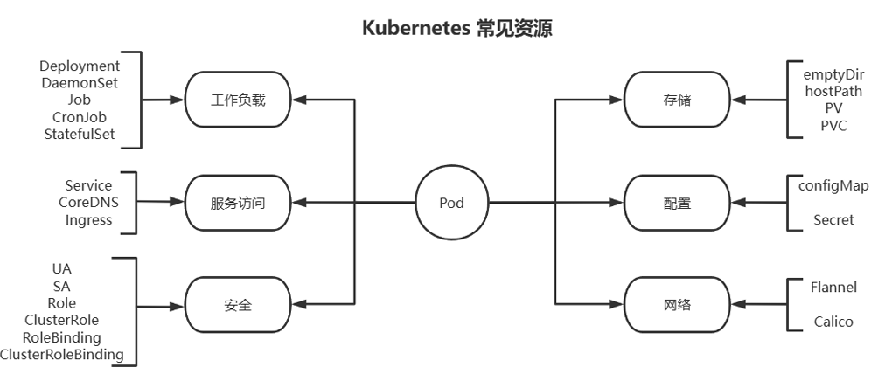
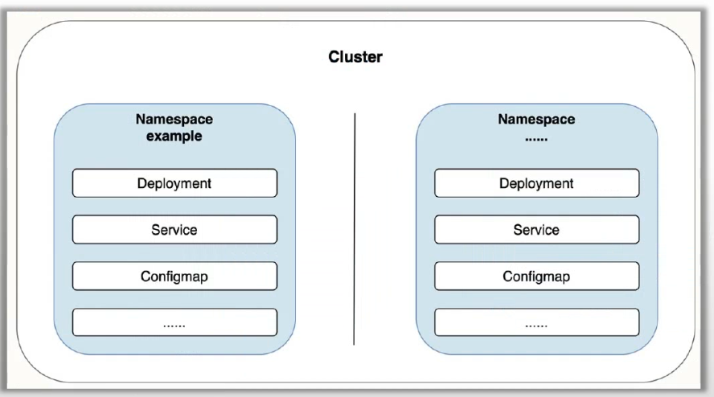

#  资源

Kubernetes 系统将一切事物都称为资源对象, 相当于面向对象的思想

资源有不同类型，资源对象是根据类型创建出的

**资源对象（Resource Object）** 就是用户根据某个资源类型实例化出来的“具体对象”。

Kubernetes 中的资源类型（如 Pod、Deployment）是定义，而资源对象是你基于这些定义实际创建出来的“某个东西”。

| 概念               | 类比             | 说明                         |
| ------------------ | ---------------- | ---------------------------- |
| 资源类型（kind）   | 类（Class）      | 抽象定义，可以创建多个       |
| 资源对象（Object） | 对象（Instance） | 实际存在于集群中的“某个东西” |



设计这些资源的核心目的就是：如何更好的运行和管理 Pod 资源，为容器化应用提供更灵活、更完善的 操作与管理组件。

## 常见资源类型分类

### **工作负载资源（Workloads）**

这些资源用于定义和管理在集群中运行的应用程序。

| 资源名称        | 说明                                 |
| --------------- | ------------------------------------ |
| **Pod**         | 最小可调度单元，封装一个或多个容器。 |
| **ReplicaSet**  | 保证指定数量的 Pod 实例持续运行。    |
| **Deployment**  | 管理 Pod 副本，支持滚动更新、回滚。  |
| **StatefulSet** | 管理有状态服务的 Pod，具有稳定标识。 |
| **DaemonSet**   | 在每个 Node 上运行一个 Pod。         |
| **Job**         | 运行一次性任务，任务成功即退出。     |
| **CronJob**     | 定时执行任务的控制器。               |

### **服务发现与网络资源（Networking）**

| 资源名称          | 说明                                                         |
| ----------------- | ------------------------------------------------------------ |
| **Service**       | 暴露 Pod 的网络服务，支持 ClusterIP、NodePort、LoadBalancer 等。 |
| **Ingress**       | 提供 HTTP/HTTPS 路由，常用于暴露 Web 应用。                  |
| **Endpoint**      | Service 与 Pod 之间的映射（自动生成）。                      |
| **NetworkPolicy** | 定义 Pod 网络访问控制规则。                                  |

### **配置与密文资源（Configuration）**

| 资源名称        | 说明                                                |
| --------------- | --------------------------------------------------- |
| **ConfigMap**   | 用于存储非机密配置数据（如配置文件、环境变量）。    |
| **Secret**      | 存储敏感数据，如密码、密钥、证书，Base64 编码。     |
| **DownwardAPI** | 把 Pod 的元数据注入到容器中（通过文件或环境变量）。 |

### **存储资源（Storage）**

| 资源名称                        | 说明                                   |
| ------------------------------- | -------------------------------------- |
| **PersistentVolume (PV)**       | 管理集群的物理存储（由管理员创建）。   |
| **PersistentVolumeClaim (PVC)** | 用户申请使用存储资源。                 |
| **StorageClass**                | 定义动态卷类型（例如不同类型的磁盘）。 |
| **Volume**                      | Pod 内部定义的临时存储卷。             |

### **命名空间与访问控制（Access & Namespace）**

| 资源名称                             | 说明                                       |
| ------------------------------------ | ------------------------------------------ |
| **Namespace**                        | 逻辑隔离资源，适用于多租户或多环境。       |
| **ServiceAccount**                   | Pod 的身份标识，和 RBAC 配合实现权限控制。 |
| **Role / ClusterRole**               | 权限角色，定义资源访问权限。               |
| **RoleBinding / ClusterRoleBinding** | 将角色绑定到用户或服务账号上。             |

### **集群级资源（Cluster）**

| 资源名称          | 说明                                         |
| ----------------- | -------------------------------------------- |
| **Node**          | 表示一个工作节点。                           |
| **Namespace**     | 用于资源逻辑分组。                           |
| **LimitRange**    | 对单个 Pod / 容器设置 CPU、内存限制范围。    |
| **ResourceQuota** | 限制 Namespace 中资源总量（如最大 Pod 数）。 |

## 查看资源对象的命令

### 查看资源类型

```shell
kubectl api-resources
NAME                                SHORTNAMES   APIVERSION                        NAMESPACED   KIND
bindings                                         v1                                true         Binding
componentstatuses                   cs           v1                                false        ComponentStatus
configmaps                          cm           v1                                true         ConfigMap
endpoints                           ep           v1                                true         Endpoints
events                              ev           v1                                true         Event
limitranges                         limits       v1                                true         LimitRange
namespaces                          ns           v1                                false        Namespace
nodes                               no           v1                                false        Node
persistentvolumeclaims              pvc          v1                                true         PersistentVolumeClaim
persistentvolumes                   pv           v1                                false        PersistentVolume
pods                                po           v1                                true         Pod
podtemplates                                     v1                                true         PodTemplate
replicationcontrollers              rc           v1                                true         ReplicationController
resourcequotas                      quota        v1                                true         ResourceQuota
secrets                                          v1                                true         Secret
serviceaccounts                     sa           v1                                true         ServiceAccount
services                            svc          v1                                true         Service
mutatingwebhookconfigurations                    admissionregistration.k8s.io/v1   false        MutatingWebhookConfiguration
validatingadmissionpolicies                      admissionregistration.k8s.io/v1   false        ValidatingAdmissionPolicy
validatingadmissionpolicybindings                admissionregistration.k8s.io/v1   false        ValidatingAdmissionPolicyBinding
validatingwebhookconfigurations                  admissionregistration.k8s.io/v1   false        ValidatingWebhookConfiguration
customresourcedefinitions           crd,crds     apiextensions.k8s.io/v1           false        CustomResourceDefinition
apiservices                                      apiregistration.k8s.io/v1         false        APIService
controllerrevisions                              apps/v1                           true         ControllerRevision
daemonsets                          ds           apps/v1                           true         DaemonSet
deployments                         deploy       apps/v1                           true         Deployment
replicasets                         rs           apps/v1                           true         ReplicaSet
statefulsets                        sts          apps/v1                           true         StatefulSet
selfsubjectreviews                               authentication.k8s.io/v1          false        SelfSubjectReview
tokenreviews                                     authentication.k8s.io/v1          false        TokenReview
localsubjectaccessreviews                        authorization.k8s.io/v1           true         LocalSubjectAccessReview
selfsubjectaccessreviews                         authorization.k8s.io/v1           false        SelfSubjectAccessReview
selfsubjectrulesreviews                          authorization.k8s.io/v1           false        SelfSubjectRulesReview
subjectaccessreviews                             authorization.k8s.io/v1           false        SubjectAccessReview
horizontalpodautoscalers            hpa          autoscaling/v2                    true         HorizontalPodAutoscaler
cronjobs                            cj           batch/v1                          true         CronJob
jobs                                             batch/v1                          true         Job
certificatesigningrequests          csr          certificates.k8s.io/v1            false        CertificateSigningRequest
leases                                           coordination.k8s.io/v1            true         Lease
endpointslices                                   discovery.k8s.io/v1               true         EndpointSlice
events                              ev           events.k8s.io/v1                  true         Event
flowschemas                                      flowcontrol.apiserver.k8s.io/v1   false        FlowSchema
prioritylevelconfigurations                      flowcontrol.apiserver.k8s.io/v1   false        PriorityLevelConfiguration
ingressclasses                                   networking.k8s.io/v1              false        IngressClass
ingresses                           ing          networking.k8s.io/v1              true         Ingress
networkpolicies                     netpol       networking.k8s.io/v1              true         NetworkPolicy
runtimeclasses                                   node.k8s.io/v1                    false        RuntimeClass
poddisruptionbudgets                pdb          policy/v1                         true         PodDisruptionBudget
clusterrolebindings                              rbac.authorization.k8s.io/v1      false        ClusterRoleBinding
clusterroles                                     rbac.authorization.k8s.io/v1      false        ClusterRole
rolebindings                                     rbac.authorization.k8s.io/v1      true         RoleBinding
roles                                            rbac.authorization.k8s.io/v1      true         Role
priorityclasses                     pc           scheduling.k8s.io/v1              false        PriorityClass
csidrivers                                       storage.k8s.io/v1                 false        CSIDriver
csinodes                                         storage.k8s.io/v1                 false        CSINode
csistoragecapacities                             storage.k8s.io/v1                 true         CSIStorageCapacity
storageclasses                      sc           storage.k8s.io/v1                 false        StorageClass
volumeattachments                                storage.k8s.io/v1                 false        VolumeAttachment
```

### 查看所有资源

```shell
kubectl get all -A
NAMESPACE      NAME                                            READY   STATUS             RESTARTS         AGE
kube-flannel   pod/kube-flannel-ds-2qknx                       1/1     Running            1 (44h ago)      44h
kube-flannel   pod/kube-flannel-ds-67v57                       1/1     Running            1 (44h ago)      44h
kube-flannel   pod/kube-flannel-ds-9zxt9                       1/1     Running            1 (44h ago)      44h
kube-flannel   pod/kube-flannel-ds-bv799                       1/1     Running            1 (44h ago)      44h
kube-flannel   pod/kube-flannel-ds-mkmr5                       1/1     Running            1 (44h ago)      44h
kube-flannel   pod/kube-flannel-ds-s52c7                       1/1     Running            1 (44h ago)      44h
kube-system    pod/coredns-6766b7b6bb-6xg5n                    0/1     CrashLoopBackOff   132 (117s ago)   46h
kube-system    pod/coredns-6766b7b6bb-92qfg                    0/1     CrashLoopBackOff   131 (2m7s ago)   46h
kube-system    pod/etcd-master1.l00n9.icu                      1/1     Running            1 (44h ago)      46h
kube-system    pod/etcd-master2.l00n9.icu                      1/1     Running            1 (44h ago)      45h
kube-system    pod/etcd-master3.l00n9.icu                      1/1     Running            1 (44h ago)      45h
kube-system    pod/kube-apiserver-master1.l00n9.icu            1/1     Running            1 (44h ago)      46h
kube-system    pod/kube-apiserver-master2.l00n9.icu            1/1     Running            1 (44h ago)      45h
kube-system    pod/kube-apiserver-master3.l00n9.icu            1/1     Running            1 (44h ago)      45h
kube-system    pod/kube-controller-manager-master1.l00n9.icu   1/1     Running            1 (44h ago)      46h
kube-system    pod/kube-controller-manager-master2.l00n9.icu   1/1     Running            1 (44h ago)      45h
kube-system    pod/kube-controller-manager-master3.l00n9.icu   1/1     Running            1 (44h ago)      45h
kube-system    pod/kube-proxy-m46wl                            1/1     Running            1 (44h ago)      45h
kube-system    pod/kube-proxy-xt6wk                            1/1     Running            1 (44h ago)      45h
kube-system    pod/kube-proxy-zc2gh                            1/1     Running            1 (44h ago)      45h
kube-system    pod/kube-proxy-zpfkn                            1/1     Running            1 (44h ago)      45h
kube-system    pod/kube-proxy-zv9dx                            1/1     Running            1 (44h ago)      45h
kube-system    pod/kube-proxy-zxl6s                            1/1     Running            1 (44h ago)      46h
kube-system    pod/kube-scheduler-master1.l00n9.icu            1/1     Running            1 (44h ago)      46h
kube-system    pod/kube-scheduler-master2.l00n9.icu            1/1     Running            1 (44h ago)      45h
kube-system    pod/kube-scheduler-master3.l00n9.icu            1/1     Running            1 (44h ago)      45h

NAMESPACE     NAME                 TYPE        CLUSTER-IP   EXTERNAL-IP   PORT(S)                  AGE
default       service/kubernetes   ClusterIP   10.96.0.1    <none>        443/TCP                  46h
kube-system   service/kube-dns     ClusterIP   10.96.0.10   <none>        53/UDP,53/TCP,9153/TCP   46h

NAMESPACE      NAME                             DESIRED   CURRENT   READY   UP-TO-DATE   AVAILABLE   NODE SELECTOR            AGE
kube-flannel   daemonset.apps/kube-flannel-ds   6         6         6       6            6           <none>                   44h
kube-system    daemonset.apps/kube-proxy        6         6         6       6            6           kubernetes.io/os=linux   46h

NAMESPACE     NAME                      READY   UP-TO-DATE   AVAILABLE   AGE
kube-system   deployment.apps/coredns   0/2     2            0           46h

NAMESPACE     NAME                                 DESIRED   CURRENT   READY   AGE
kube-system   replicaset.apps/coredns-6766b7b6bb   2         2         0       46h
```

### 查看CRD

用户自定义的API,称为CRD(Custom Resource Definition),可以通过安装一些组件生成

```shell
kubectl get crd
```

### 查看指定Group的资源

```shell
kubectl api-resources --api-group apps
NAME                  SHORTNAMES   APIVERSION   NAMESPACED   KIND
controllerrevisions                apps/v1      true         ControllerRevision
daemonsets            ds           apps/v1      true         DaemonSet
deployments           deploy       apps/v1      true         Deployment
replicasets           rs           apps/v1      true         ReplicaSet
statefulsets          sts          apps/v1      true         StatefulSet
```

## 资源清单（资源规范）

### YAML格式说明

*   大小写敏感 
*   使用缩进表示层级关系

YAML Maps键值对

```yaml
key: value

# 键的值也是键
key:
  key1：value
```

YAML Lists列表

```yaml
key:
  - value1
  - value2

```

### 资源配置清单介绍

资源配置清单的格式采用 Yaml 格式

第一级字段名一般包括

*   apiVersion
*   kind
*   metadata
*   spec（创建者所期望的目标状态）
*   status（创建出的运行时状态）

```shell
# 获取任何一个对象的资源清单
kubectl get TYPE NAME -o yaml

kubectl get namespace kube-system -o yaml

kubectl get namespace kube-system -o json
```

### apiVersion和kind

apiVersion

*   资源的组名/版本
    *   组名
    *   版本
        *   alpha（不稳定）
        *   betal（测试）
        *   v1（稳定）
        *   ..（其他版本）

```shell
kubectl api-versions
admissionregistration.k8s.io/v1
apiextensions.k8s.io/v1
apiregistration.k8s.io/v1
apps/v1
authentication.k8s.io/v1
authorization.k8s.io/v1
autoscaling/v1
autoscaling/v2
batch/v1
certificates.k8s.io/v1
coordination.k8s.io/v1
discovery.k8s.io/v1
events.k8s.io/v1
flowcontrol.apiserver.k8s.io/v1
networking.k8s.io/v1
node.k8s.io/v1
policy/v1
rbac.authorization.k8s.io/v1
scheduling.k8s.io/v1
storage.k8s.io/v1
v1  # 核心组（core）没有GROUP
```

kind

*   资源的类型
*   对资源的分类与定义

```shell
# 查看资源类型
kubectl api-resources
```

### metadata 嵌套字段

metadata 字段用于描述对象的元数据,即属性信息，其内嵌多个用于定义资源的元数据，如 name 和  labels 等。这些字段可以分为必选字段和可选字段

**必选字段：**

-   **name**: 设定当前对象的名称，名称空间间级的资源在其所属的名称空间的同一类型中必须唯一
-   **namespace**: 指定当前对象隶属的名称空间，默认值为 default，实现资源隔离
-   uid: 当前对象的唯一标识符，用于区别"已删除"和"重新创建"的同一个名称的对象,**系统可以自动生 成**

**可选字段：**

-   **labels**: 设定用于标识当前对象的标签，键值数据，格式：key1: value1 ,常用作**标签选择器的挑选条件**
-   **annotation**: 非标识型键值数据，格式：key1: value1,用来作为挑选条件，**用于 labels 的补充**，**不支持标签选择器的选择**
-   resourceVersion:当前对象的内部版本标识，用来让客户端确定对象的变动与否
-   generation: 标识当前对象目标状态的代别
-   creationTimestamp: 当前对象创建日期的时间戳
-   deletionTimestamp: 当前对象删除日期的时间戳

### spec 和 status 字段

定义资源配置清单时，spec 是**必须**的字段。用于描述对象的**目标状态**，也就是用户期**望对象所表现出来的特征**。

**spec 字段**

-   Specification 规格字段
-   此字段对于不同的对象类型来说各不相同，具体字段含义及所接受的数据类型需要参照 Kubernets API 手册中的说明进行获取。可通过命令 **kubectl explain KIND.spec** 获取具体帮助

```shell
kubectl explain KIND.spec

# 查看资源有哪些一级字段
kubectl explain ns

# 查看spec有哪些字段
kubectl explain ns.spec
KIND:       Namespace
VERSION:    v1

FIELD: spec <NamespaceSpec>


DESCRIPTION:
    Spec defines the behavior of the Namespace. More info:
    https://git.k8s.io/community/contributors/devel/sig-architecture/api-conventions.md#spec-and-status
    NamespaceSpec describes the attributes on a Namespace.
    
FIELDS:
  finalizers    <[]string>
    Finalizers is an opaque list of values that must be empty to permanently
    remove object from storage. More info:
    https://kubernetes.io/docs/tasks/administer-cluster/namespaces/
```

**status 字段**

-   此字段记录对象的**当前实际运行的状态**，由 **Kubernetes 系统负责更新**，**用户不能手动定义**。

-   Master 节点的 controller manager 通过相应的**控制器组件动态管理并确保对象的实际转态匹配用 户所期望的状态。**

    -   比如:Deployment 是一种描述集群中运行应用的资源对象，因此，创建 Deployment 类型对象时，需要为目标 Deployment 对象设定 spec，指定期望需要运行的 Pod 副 本数量、使用的标签选择器以及 Pod 模板等。

        在创建时，Kubernetes 相关组件读取待创建的 Deployment 对象的 spec以及系统上相应的活动对象的当前状态，必要时对活动的对象更新以确 保 status 字段吻合 spec 字段中期望的状态。

-   **注意：**数据类的资源对象无spec, Status 字段，比如：configmaps，secrets ， endpoints 等

## 资源清单生成

### 使用命令生成清单文件

```shell
kubectl create deployment myapp --image registry.cn-beijing.aliyuncs.com/wangxiaochun/myapp:v1.0 --replicas 3 --dry-run=client -o yaml

# --dry-run 测试不允许
# client
# server 参数更多
# none

# 输出至文件
kubectl create deployment myapp --image registry.cn-beijing.aliyuncs.com/wangxiaochun/myapp:v1.0 --replicas 3 --dry-run=client -o yaml > myapp.yaml
```

### 基于现有资源生成清单文件

```shell
kubectl get services myapp -o yaml

kubectl get services myapp -o yaml > myapp.yaml
```

## 资源对象管理方式

*   **指令式命令**

    *   具体动作（create，delete..）

    *   适合完成一次性的操作任务

        ```shell
        kubectl create deployment demoapp --image=ikubernetes/demoapp:v1.0 --port=80 --dry-run=client --replicas=3
        ```

*   **指令式对象配置**

    *   具体动作（create，delete..）+ 资源清单（.yaml）

    ```shell
    kubectl create -f xx.yaml
    ```

*   **声明式对象配置**

    *   声明动作（apply，patch等）+ 资源清单（.yaml）

        ```shell
        kubectl apply -f xx.yaml
        ```

**声明式对象配置有幂等性,生产推荐使用此方式**


# 名称空间

-   **K8s 的 Namespace** 是为了在一个集群中逻辑隔离（软隔离）资源（面向应用层）。
-   **Linux 的 Namespace** 是为了在内核层隔离系统资源（面向操作系统层）。



Kubernetes 的资源工作的有效范围分成两种级别:

*   **集群级别**: 针对整个Kubernetes集群内都有效
*   **名称空间级别**: 只针对指定名称空间内有效,而不属于任务名称空间

**名称空间的作用**

*   名称空间 Namespace 用于将集群分隔为多个隔离的逻辑分区以配置给不同的用户、租户、环境或者项 目使用。

-   名称空间限定了资源对象工作在指定的名称范围内的作用域

**名称空间的使用场景**

-   **环境管理**：需要在同一Kubernetes集群上隔离研发、预发和生产等一类的环境时，可以通过名称空间进行
-   **隔离**：多个项目团队的不同产品线需要部署于同一Kubernetes集群时，可以使用名称空间进行隔离
-   **资源控制**：
    -   名称空间可用作资源配额的承载单位，从而限制其内部所有应用可以使用的CPU/Memory/PV各自 的资源总和
    -   需要在产品线或团队等隔离目标上分配各自总体可用的系统资源时，可通过名称空间实现
-   **权限控制**：基于RBAC鉴权体系，能够在名称空间级别进行权限配置
-   **提高集群性能**：进行资源搜索时，名称空间有利于Kubernetes API缩小查找范围，从而对减少搜索延迟和提升性能 有一定的帮助

**名称空间分类**（**两类**）

-   **系统级名称空间**
    -   由Kubernetes集群默认创建，主要用来隔离系统级的资源对象 所有的系统级名称空间均不能进行删除操作（即使删除也会自动重建） **除default外，其它三个系统级名称空间**不应该用作业务应用的部署目标
    -   **default**：为任何名称空间级别的资源提供的默认的名称空间
    -   **kuhe-system**：Kubernetes集群自身组件及其它系统级组件使用的名称空间，Kubernetes自身的 关键组件均部署在该名称空间中
    -   **kube-public**：公众开放的名称空间，所有用户（包括Anonymous）都可以读取内部的资源,通常为空
    -   **kube-node-lease**：节点租约资源所用的名称空间
        -   分布式系统通常使用“租约(Leqse)”机制来锁定共享资源并协调集群成员之间的活动 Kubernetes上的租约概念由API群组coordination.k8s.io群组下的Lease资源所承载，以支撑系统 级别的功能需求，例如节点心跳( node heartbeats)和组件级的领导选举等 Kubernetes集群的每个管理组件在该名称空间下都有一个与同名的Iease资源对象
        -   `~# kubectl -n kube-node-lease get lease`
-   **自定义名称空间**
    -   由用户按需创建
    -   比如: 根据项目和场景, 分别创建对应不同的名称空间

## 相关命令

### 查看名称空间及资源对象

```shell
kubectl get ns
NAME              STATUS   AGE
default           Active   47h
kube-flannel      Active   46h
kube-node-lease   Active   47h
kube-public       Active   47h
kube-system       Active   47h

# 指定命名空间，输出资源规范
kubectl get ns default
kubectl get ns default -o yaml

# 查看指定命名空间的资源
kubectl get pods -n default
```

### 创建Namespace资源

指令式命令

```shell
kubectl create ns demo

kubectl get ns demo
```

指令式配置

```shell
vim namespace-demo.yaml
apiVersion: v1
kind: Namespace
metadata:
  name: demo
  labels:
    env: test
    
kubectl create -f namespace-demo.yaml

kubectl get ns --show-lables
kubectl get ns -l env=test
```

声明式配置创建

```shell
vim namespace-demo.yaml
apiVersion: v1
kind: Namespace
metadata:
  name: demo
  labels:
    env: test
    
kubectl apply-f namespace-demo.yaml

kubectl get ns --show-lables
kubectl get ns -l env=test
```

### 删除Namespace资源

**删除 Namespace 会级联删除此名称空间的所有资源**,非常危险

```shell
kubectl delete namespaces demo
```

| 命令格式                        | 功能                                   |
| ------------------------------- | -------------------------------------- |
| kubectl delete TYPE RESOURCE -n | 删除指定名称空间内的指定资源           |
| kubectl delete TYPE --all -n    | 删除指定名称空间内的指定类型的所有资源 |
| kubectl delete all -n           | 删除指定名称空间内的所有资源           |
| kubectl delete all --all        | 删除所有名称空间中的所有资源           |

