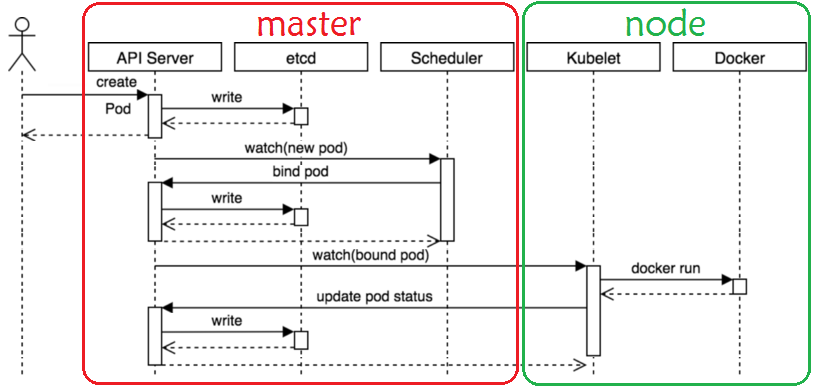

# Pod 资源

## 什么是 Pod

Pod 是 Kubernetes API 中最常见最核心资源类型

**Pod 是一个或多个容器的集合**，因而也可称为容器集，但却是Kubernetes调度、部署和运行应用的原子单元

-   同一Pod内的所有容器都将运行于由Scheduler选定的同一个worker节点上
-   在同一个pod内的容器共享的**存储资源**、**网络协议栈**及容器的**运行控制策略**等
-   每个Pod中的容器依赖于一个特殊名为**pause容器**事先创建出可被各应用容器共享的**基础环境**，包括 Network、IPC和UTS名称空间共享给Pod中各个容器，PID名称空间也可以共享，但需要用户显式定 义,**Mount和User是不共享的**,每个容器有独立的Mount,User的名称空间


od的组成形式有两种

-   **单容器Pod**：除Pause容器外,仅含有一个容器
-   **多容器Pod**：除Pause容器外，含有多个具有“超亲密”关系的容器，一般由主容器和辅助容器（比 如：**sidecar容器**）构成

**Pod资源分类**

-   自主式 Pod
    -   由用户直接定义并提交给API Server创建的Pods
-   由Workload Controller管控的 Pod
    -   比如: 由Deployment控制器管理的Pod
-   静态 Pod
    -   由kubelet加载配置信息后，自动在对应的节点上创建的Pod
    -   用于实现Master节点上的系统组件API Server 、Controller-Manager 、Scheduler 和Etcd功能的 Pod
    -   相关配置存放在控制节点的 **`/etc/kubernetes/manifests`** 目录下

**总结：**

-   Pod中最少有2个容器
-   Pod = **Pause容器** + 业务容器

### 静态pod

```shell
# 静态pod创建流程
/etc/kubernetes/manifests目录下yaml文件 ---> kubelet --> docker runc --> ETCD | ApiServer Pod ...

ls /etc/kubernetes/manifests/
etcd.yaml  kube-apiserver.yaml  kube-controller-manager.yaml  kube-scheduler.yaml

# 将资源清单文件放入/etc/kubernetes/manifests/中，会被kubelet自动拉起
```

### 自主式Pod

```shell
# 自定义pod创建流程
kuebctl --> apiserver --> kubelet --> docker runc --> pod容器
```

通过kubectl 命令行工具指定选项创建 Pod，适合**临时性**工作

```shell
kubectl run NAME --image=image [--port=port] [--replicas=replicas] 

kubectl run NAME --image=image [--env="key=value"] [--port=port] [--dry-run=server|client] [--overrides=inline-json] [--command] -- [COMMAND] [args...] [options]

#参数详解
--image=''       #指定容器要运行的镜像
--port=''        #设定容器暴露的端口
--dry-run=true   #以模拟的方式来进行执行命令
--env=[]         #执行的时候，向对象中传入一些变量
--labels=''      #设定pod对象的标签
--limits='cpu=200m,memory=512Mi' #设定容器启动后的资源配置
--replicas=n     #设定pod的副本数量,新版不再支持
--command=false     #设为true，将 -- 后面的字符串做为命令代替容器默认的启动命令，而非做为默认启动命令的参数
-it              #打开交互终端
--rm             #即出即删除容器
--restart=Never  #不会重启
```

示例

```shell
kubectl run myapp-pod --image=harbor.l00n9.icu/public/myapp:v1.0

# 创建Busybox的Pod,默认busybox没有前台进程,需要指定前台程序才能持继运行
kubectl run busybox --image harbor.l00n9.icu/public/busybox:unstable-uclibc -- sleep 3600
# 传参
kubectl run busybox --image busybox:1.30 --env="NAME=test" -- sleep 3600

# 进入容器
kubectl exec -it busybox -- sh
/ # echo $NAME
test
```

## pod资源清单范例

### yaml格式的Pod清单文件-极简版

```yaml
apiVersion: v1
kind: Pod
metadata:
  name: busybox
  namespace: m61-namespace
spec:
  containers:
  - image: harbor.l00n9.icu/public/busybox:unstable-uclibc
    name: busybox
```

### yaml格式的Pod清单文件实例-完整版

```shell
# yaml格式的Pod定义文件完整内容
apiVersion: v1
kind: Pod
metadata:
  name: string
  namespace: string
  labels:
    name: string
  annotations:
    name: string
spec:
  initContainers:
  - name: string
    image: string
    imagePullPolicy: Always  # Options: Always, Never, IfNotPresent
    command: 
      - string
    args: 
      - string
  containers:
  - name: string
    image: string
    imagePullPolicy: Always  # Options: Always, Never, IfNotPresent
    command: 
      - string
    args: 
      - string
    workingDir: string
    volumeMounts:
    - name: string
      mountPath: string
      readOnly: true  # Options: true, false
    ports:
    - name: string
      containerPort: 80  # Replace with the correct port
      hostPort: 80  # Replace with the correct port
      protocol: TCP  # Options: TCP, UDP, SCTP
    env:
    - name: string
      value: string
    resources:
      limits:
        cpu: "500m"  # Replace with actual limit
        memory: "128Mi"  # Replace with actual limit
      requests:
        cpu: "250m"  # Replace with actual request
        memory: "64Mi"  # Replace with actual request
    startupProbe:
      httpGet:
        path: /healthz
        port: 80  # Replace with actual port
    livenessProbe:
      exec:
        command: 
          - string
      httpGet:
        path: /healthz
        port: 80  # Replace with actual port
        host: localhost  # Replace with actual host
        scheme: HTTP  # Options: HTTP, HTTPS
        httpHeaders:
        - name: string
          value: string
      tcpSocket:
        port: 80  # Replace with actual port
      initialDelaySeconds: 10
      timeoutSeconds: 5
      periodSeconds: 10
      successThreshold: 1
      failureThreshold: 3
    securityContext:
      privileged: false  # Options: true, false
  restartPolicy: Always  # Options: Always, Never, OnFailure
  nodeSelector: 
    disktype: ssd  # Example node selector
  nodeName: string  # Replace with actual node name
  imagePullSecrets:
  - name: my-secret  # Replace with actual secret name
  hostNetwork: false  # Options: true, false
  volumes: 
  - name: empty-volume
    emptyDir: {}
  - name: host-path-volume
    hostPath:
      path: /data/volume  # Replace with actual path
  - name: secret-volume
    secret:
      secretName: string  # Replace with actual secret name
      items:     
      - key: string
        path: string
  - name: configmap-volume
    configMap:
      name: string  # Replace with actual ConfigMap name
      items:
      - key: string
        path: string
```

## pod管理命令

```yaml
vim pod-nginx.yaml

apiVersion: v1
kind: Pod
metadata:
  name: pod-nginx1
  namespace: default
spec:
  containers:
  - name: nginx-web01
    image: harbor.l00n9.icu/public/nginx:stable-perl  
```

### 创建 Pod 资源

```shell
kubectl apply -f pod-nginx.yaml
kubectl create -f pod-nginx.yaml

kubectl get pods -o wide

kubectl describe pod pod-nginx1
```

### 更新Pod资源

```shell
# 导出pod的资源清单
kubectl get pods pod-nginx1 -o yaml > pod-1-update.yaml

# 编辑镜像版本
vim pod-test1-update.yaml

# 更新
kubectl replace -f pod-test1-update.yaml
# replace不建议使用，没有幂等性，建议apply

```

### 查看 Pod 状态

```shell
kubectl get pod <pod_name> [(-o|--output=)json|yaml|jsonpath] [-n namespace]
kubectl describe pod <pod_name> [-n namespace]
```

```shell
kubectl get pods pod-nginx1 -o wide
NAME         READY   STATUS    RESTARTS   AGE    IP           NODE              NOMINATED NODE   READINESS GATES
pod-nginx1   1/1     Running   0          117s   10.244.2.6   node2.l00n9.icu   <none>           <none>

kubectl describe pod pod-nginx1
...
Events:
  Type    Reason     Age   From               Message
  ----    ------     ----  ----               -------
  Normal  Scheduled  39s   default-scheduler  Successfully assigned default/pod-nginx1 to node2.l00n9.icu
  Normal  Pulled     39s   kubelet            Container image "harbor.l00n9.icu/public/nginx:stable-perl" already present on machine
  Normal  Created    39s   kubelet            Created container: nginx-web01
  Normal  Started    39s   kubelet            Started container nginx-web01
```

### 查看Pod中指定容器应用的日志

```shell
kubectl logs [-f] (POD | TYPE/NAME) [-c CONTAINER] [options]

# 选项
-p 前一个已退出的容器的日志
--all-containers=true 所有容器
--tail=N 最后N个日志
```

```shell
kubectl logs pod-nginx1 
/docker-entrypoint.sh: /docker-entrypoint.d/ is not empty, will attempt to perform configuration
/docker-entrypoint.sh: Looking for shell scripts in /docker-entrypoint.d/
/docker-entrypoint.sh: Launching /docker-entrypoint.d/10-listen-on-ipv6-by-default.sh
10-listen-on-ipv6-by-default.sh: info: Getting the checksum of /etc/nginx/conf.d/default.conf
10-listen-on-ipv6-by-default.sh: info: Enabled listen on IPv6 in /etc/nginx/conf.d/default.conf
/docker-entrypoint.sh: Sourcing /docker-entrypoint.d/15-local-resolvers.envsh
/docker-entrypoint.sh: Launching /docker-entrypoint.d/20-envsubst-on-templates.sh
/docker-entrypoint.sh: Launching /docker-entrypoint.d/30-tune-worker-processes.sh
/docker-entrypoint.sh: Configuration complete; ready for start up
2025/03/24 03:03:07 [notice] 1#1: using the "epoll" event method
2025/03/24 03:03:07 [notice] 1#1: nginx/1.26.3
2025/03/24 03:03:07 [notice] 1#1: built by gcc 12.2.0 (Debian 12.2.0-14) 
2025/03/24 03:03:07 [notice] 1#1: OS: Linux 5.15.0-134-generic
2025/03/24 03:03:07 [notice] 1#1: getrlimit(RLIMIT_NOFILE): 1048576:1048576
2025/03/24 03:03:07 [notice] 1#1: start worker processes
2025/03/24 03:03:07 [notice] 1#1: start worker process 29
2025/03/24 03:03:07 [notice] 1#1: start worker process 30
```

### 进入Pod 执行命令

```shell
kubectl exec (POD | TYPE/NAME) [-c CONTAINER] [flags] -- COMMAND [args...] [options]
```

```shell
# -it 分配伪终端
kubectl exec -it pod-nginx1 -- sh

kubectl exec -it pod-nginx1 -- bash
```

### 删除 Pod

```shell
kubectl delete pod <pod_name> ... [--force --grace-period=0]
```

```shell
#优雅删除
kubectl delete pod pod-nginx1

#强制删除，宽限期为0s
kubectl delete pod pod-nginx1 --force --grace-period=0

# 根据资源清单删除
kubectl delete -f pod-nginx.yaml
```

## 创建定制的Pod

kubernets 支持多种定制 Pod 的实现方法

-   对于不同应用的Pod,重新定制对应的镜像（重打镜像，最拉）
-   启动容器时指定env环境变量
-   启动容器的指定command和args
-   将配置信息基于卷资源对象，再将其加载到容器，比如：configMap和secret等

### 利用环境变量`env`实现容器传参

mysql

```yaml
vim pod-mysql.yml
apiVersion: v1
kind: Pod
metadata:
  name: mydb
  namespace: default
spec:
  containers:
  - name: mysql
    image: harbor.l00n9.icu/public/mysql:8.0.41-debian
    env:
    - name: MYSQL_ROOT_PASSWORD
      value: "123456"
    - name: MYSQL_DATABASE
      value: wordpress
    - name: MYSQL_USER
      value: wpuser
    - name: MYSQL_PASSWORD
      value: "123456"
```

```shell
kubectl apply -f pod-mysql.yaml

kubectl get pods mydb -o wide
NAME   READY   STATUS    RESTARTS   AGE   IP           NODE              NOMINATED NODE   READINESS GATES
mydb   1/1     Running   0          29s   10.244.1.3   node1.l00n9.icu   <none>           <none>

kubectl describe pod mydb
Containers:
...
    Environment:
      MYSQL_ROOT_PASSWORD:  123456
      MYSQL_DATABASE:       wordpress
      MYSQL_USER:           wpuser
      MYSQL_PASSWORD:       123456
```

wordpress

```shell
vim pod-wordpress.yaml
apiVersion: v1
kind: Pod
metadata:
  name: wordpress
  namespace: default
spec:
  containers:
  - name: wordpress
    image: harbor.l00n9.icu/public/wordpress:php8.1-apache
    env:
    - name: WORDPRESS_DB_HOST
      value: 10.244.1.3
    - name: WORDPRESS_DB_NAME
      value: wordpress
    - name: WORDPRESS_DB_USER
      value: wpuser
    - name: WORDPRESS_DB_PASSWORD
      value: "123456"
```

```shell
kubectl apply -f pod-wordpress.yaml

kubectl get pods -o wide

kubectl describe pod wordpress
```

### 利用`command`和`args`字段传递容器的启动命令和参数

Pod配置中，spec.containers[].command字段能够在容器上指定替代镜像默认运行的应用程序，且可 同时使用spec.containers[].args字段进行参数传递，它们将覆盖镜像中的默认定义的参数。

-   若仅定义了command字段时，其值将覆盖镜像中定义的程序及参数。
-   若仅是定义了args字段，该字段值将作为参数传递给镜像中默认指定运行的应用程序
-   **注意: args中使用环境变量,需要使用格式: $(环境变量名)**

```yaml
vim pod-with-cmd-and-args.yaml 
apiVersion: v1
kind: Pod
metadata:
  name: pod-with-cmd-and-args
spec:
  containers:
  - name: pod-test
    image: harbor.l00n9.icu/public/pod-test:v0.1
    command: ['/bin/sh','-c']
    # args: ['python3 /usr/local/bin/demo.py -p 8080']
    args: ['python3 /usr/local/bin/demo.py -p $(port)']
    env:
    - name: port
      value: "8888"
```

```shell
kubectl apply -f pod-with-cmd-and-args.yaml

kubectl get pod -o wide

kubectl exec  pod-with-cmd-and-args  -- ps aux
```

## 容器的外部访问

### 使用宿主机网络实现容器的外部访问

默认容器使用私有的独立网段，无法从集群外直接访问，可以通过下面两种方式实现外部访问

-   让容器直接使用宿主机的网络地址，即容器使用host的网路模型
-   让容器通过宿主机的端口映射实现，即DNAT

**注意：都要避免端口冲突**

使用宿主机网络

```yaml
Vim pod-hostnetwork.yaml 
apiVersion: v1
kind: Pod
metadata:
  name: pod-hostnetwork-demo
spec:
  hostNetwork: true
  containers:
  - name: demo-env
    image: harbor.l00n9.icu/public/pod-test:v0.1
    env:
    - name: PORT
      value: "9999"
```

端口映射到宿主机端口

```yaml
cat pod-hostport.yaml 
apiVersion: v1
kind: Pod
metadata:
  name: pod-hostport-demo
spec:
  containers:
  - name: demo-env
    image: harbor.l00n9.icu/public/pod-test:v0.1
    env:
    - name: PORT
      value: "9999"
    ports:                           # 使用宿主机指定端口
    - name: http                     # 不支持大写字母
      containerPort: 9999            # 使用上面变量相同的端口
      hostPort: 8888
      
# 本质上就是通过宿主机的DNAT策略实现
# ss -tnulp是看不见的
iptables -vnL -t nat |grep DNAT
```

### 定义service资源

给容器做外部访问的代理

可实现负载均衡

用 NodePort 或 Ingress 暴露 WordPress

```yaml
vim pod-service.yaml
---
apiVersion: v1
kind: Pod
metadata:
  name: mydb
  namespace: default
  labels:
    app: mysql
spec:
  containers:
  - name: mysql
    image: harbor.l00n9.icu/public/mysql:8.0.41-debian
    env:
    - name: MYSQL_ROOT_PASSWORD
      value: "123456"
    - name: MYSQL_DATABASE
      value: wordpress
    - name: MYSQL_USER
      value: wpuser
    - name: MYSQL_PASSWORD
      value: "123456"
      
---
apiVersion: v1
kind: Service
metadata:
  labels:
    app: mysql
  name: mysql
spec:
  ports:
  - name: 3306-3306
    port: 3306
    protocol: TCP
    targetPort: 3306
  selector:
    app: mysql
  type: ClusterIP

---      
apiVersion: v1
kind: Pod
metadata:
  name: wordpress
  namespace: default
  labels:
    app: wp
spec:
  containers:
  - name: wordpress
    image: harbor.l00n9.icu/public/wordpress:php8.1-apache
    env:
    - name: WORDPRESS_DB_HOST
      value: mysql
    - name: WORDPRESS_DB_NAME
      value: wordpress
    - name: WORDPRESS_DB_USER
      value: wpuser
    - name: WORDPRESS_DB_PASSWORD
      value: "123456"
      
---
apiVersion: v1
kind: Service
metadata:
  labels:
    app: wp
  name: wp
spec:
  ports:
  - name: 80-80
    port: 80
    protocol: TCP
    targetPort: 80
  selector:
    app: wp
  type: NodePort
```

```shell
kubectl get pods,svc -o wide
NAME                        READY   STATUS    RESTARTS   AGE   IP            NODE              NOMINATED NODE   READINESS GATES
pod/mydb                    1/1     Running   0          10s   10.244.1.12   node1.l00n9.icu   <none>           <none>
pod/pod-with-cmd-and-args   1/1     Running   0          98s   10.244.1.11   node1.l00n9.icu   <none>           <none>
pod/wordpress               1/1     Running   0          10s   10.244.2.11   node2.l00n9.icu   <none>           <none>

NAME                 TYPE        CLUSTER-IP      EXTERNAL-IP   PORT(S)        AGE     SELECTOR
service/kubernetes   ClusterIP   10.96.0.1       <none>        443/TCP        3d21h   <none>
service/mysql        ClusterIP   10.108.129.64   <none>        3306/TCP       10s     app=mysql
service/wp           NodePort    10.100.78.44    <none>        80:32178/TCP   10s     app=wp
```

`curl 10.0.0.104:32178`

## 临时容器

有时有必要检查现有 Pod 的状态。例如，对于难以复现的故障进行排查。 在这些场景中，可以在现有 Pod 中运行临时容器来检查其状态并运行任意命令。

Kubernetes v1.16推出临时容器, Kubernetes v1.25稳定可用, 就是在原有的Pod 上，添加一个**临时的 Container，这个Container可以包含我们排查问题所有的工具**, 比如: ip、ss、ps、pstree、top、kill、 top、jstat、jmap等

*   **临时创建一个调试容器（Pod）**，
*    **在已存在 Pod 上挂载一个 debug 容器（类似 sidecar）**，
*    **进入容器排查问题**（比 `kubectl exec` 更灵活），

*   **用于网络、镜像、权限、存储等疑难问题排查**

###  附加调试容器到已存在的 Pod（非破坏式）

```shell
kubectl debug <pod-name> -c <container-name> --image=busybox --target=<container-name> --copy-to=debug-<pod-name>


kubectl debug wordpress -c wordpress --image=busybox --target=wordpress --copy-to=debug-wordpress
```

创建一个副本 `debug-wordpress`

复制了原容器的配置

用 `busybox` 替换主镜像（可用于排查镜像无法启动等问题）

可以加上 `--share-processes`、`--share-network` 来共享进程空间或网络

### 在原 Pod 上临时挂载调试容器（类似 sidecar）【K8s v1.18+】

```
kubectl debug <pod-name> -it --image=nicolaka/netshoot --share-processes -- bash
```

使用 `netshoot` 镜像（内置很多网络工具）

和目标 Pod 共用 PID、Network、IPC 空间

可以直接查看目标容器的网络状态、进程、配置等

# Pod 工作机制


## Pause容器

Pause容器 全称 infrastucture container（又叫infra）基础容器

-   **pause 容器** 是每个 Pod 中的一个“基础”或“辅助”容器，作为 **“Pod的基础环境”**。
-   pause 容器的核心目的是：
    1.  作为 Pod 中所有其他容器的“**根命名空间**”（包括网络、PID、IPC、用户命名空间等）。
    2.  提供一个**管理所有容器的父容器**。
    3.  充当**网络栈的宿主**，即将 Pod 的 IP 地址分配到 pause 容器。
    4.  **防止孤儿进程**：pause 容器负责回收 Pod 中子进程（即僵尸进程），防止孤儿进程残留。
    5.  **统一管理生命周期**：当 Pod 被销毁时，**所有与 pause 容器共享命名空间的容器**也会被销毁。

| **作用**          | **描述**                                                     |
| ----------------- | ------------------------------------------------------------ |
| **网络命名空间**  | Pod 中的网络栈是 pause 容器的网络栈，所有其他容器与它共享 IP 地址、端口和网络命名空间。 |
| **PID 命名空间**  | Pod 内的所有容器与 pause 容器共享一个 PID 命名空间，Pod 内的进程能“看到”彼此的进程列表。 |
| **IPC 命名空间**  | 容器之间的进程通信（如信号、信号量）是通过 IPC 实现的，Pod 中的 IPC 命名空间由 pause 容器提供。 |
| **Volume 卷管理** | 如果 Pod 中有挂载卷，卷的路径通常先挂载到 pause 容器的文件系统中，其他容器共享这个路径。 |
| **僵尸进程回收**  | 如果 Pod 内的某个容器内的子进程退出，这个僵尸进程不会直接被宿主机的 init 进程 (PID 1) 回收，而是由 pause 容器回收。 |
| **父进程作用**    | pause 容器的 PID 始终是 Pod 中的第一个进程 (PID=1)，所有其他进程（即业务容器的进程）都是 pause 容器的“子进程”。 |

-    当 kubelet 启动一个 Pod 时：
    -   **pause 容器首先启动**，这是 Pod 的第一个容器。
    -   启动 pause 容器的原因是：它会创建**PID 命名空间、网络命名空间、IPC 命名空间和 UTS 命名空间**。
    -   pause 容器的 PID 在 Pod 命名空间中是 **1**，即**PID=1**。
-    当其他业务容器启动时：
    -   业务容器不会从 pause 容器 fork() 出来，而是**containerd 或 dockerd** 启动的。
    -   业务容器和 pause 容器**共享 pause 容器的命名空间**（网络、IPC、PID、Volume 等），这就是“共享”命名空间的含义。
    -   **从 PID 视角看**，所有业务容器中的进程都属于 pause 容器的子进程。

**为什么需要 pause 容器？**

-   统一命名空间：
    -   Pod 中的多个业务容器共享**网络命名空间**，这使得它们共享一个 IP 地址（Pod IP）。
    -   通过 pause 容器的 PID 1，所有业务容器可以共享同一个 PID 命名空间。
-   负责回收子进程：
    -   **回收僵尸进程**：如果业务容器内部的进程 (PID) 终止，会成为僵尸进程，系统的 init 进程通常负责回收僵尸进程。
    -   在 Pod 中，**pause 容器就是 Pod 中的 "init 进程"**，负责回收业务容器中的僵尸进程。
-   网络栈的基础：
    -   通过 pause 容器的网络命名空间，Pod 中的每个业务容器共享一个 IP 地址和端口空间。

## pod通信机制

-   Pod内多容器通信：容器件通信（容器模型）借助于pause容器实现
-   单节点内多Pod通信：主机间容器通信（host模型），利用kube-proxy实现
-   多节点内多Pod通信：跨主机网络解决方案（overlay模型），利用网络插件flannel，calico等实现


## Pod 管理机制

Kubernetes 集群通过pod实现了大量业务应用容器的统一管理

而Kubernetes 也提供了大量的资源对象来对pod进行管理：

*   通过控制器比如deployment来确保 pod的运行和数量符合用户的期望状态
*   通过网络资源比如service来确保pod的应用服务可以被外部的服务来进行访问

Pod 相关的资源对象

*   工作负载型资源: Pod、Deployment、DaemonSet、Replica、StatefulSet、Job、Cronjob、 Operator 
*   服务发现和负载均衡资源: Service、Ingress 
*   配置和存储: configMap、Secret、PersistentVolume、PersistentVolumeChain、DownwardAPI 
*   资源隔离权限控制资源: namespace、nodes、clusterroles、Roles 
*   动态调整资源: HPA、VPA


## Pod 工作流程


## **Pod 创建流程**



1.   **kubectl 发起请求 --> API Server**
     *   kubectl 将请求打包为一个 **HTTP REST 请求**，并发送到 **Kubernetes API Server**。
     *   通过 `kubectl` 命令，API Server 接收到**POST请求**，其中包含了 **Pod的定义信息**（YAML/JSON 格式的PodManifest）。
2.   **API Server 处理请求 --> etcd**
     *   验证请求
         *   进行身份验证（Authentication）和权限验证（Authorization）。
     *   请求合法性校验
         *   通过 **Admission Controllers** 进行一系列的规则检查（比如资源配额、Pod调度限制等）。
     *   对象序列化和持久化
         *   检查请求的YAML/JSON定义是否符合 **Pod Schema**。
3.   **etcd 存储 Pod 定义**
     *   数据存储
     *   新的 Pod 定义被提交至 API Server 并写入 etcd 后，API Server 会通过 Watch 机制将事件推送给监听该资源的控制器，如 Scheduler 和 Controller-Manager。
4.   **Scheduler 调度 Pod --> API Server**
     *   Watch 机制
         *   Scheduler 通过 Watch API Server 监听所有 Pod 对象的变化
         *   当发现一个 `.spec.nodeName == null` 的 Pod（即尚未调度的 Pod），则触发调度流程并进行节点绑定操作
     *   **调度决策**
         *   Scheduler 会从所有**可用的Node中选择一个最优的Node**来运行这个Pod。
         *   Scheduler会考虑以下因素：
             *   **资源约束**：Node的CPU、内存是否足够。
             *   **亲和性/反亲和性**：Pod的亲和性和反亲和性规则。
             *   **污点和容忍度**：节点上是否有污点。
             *   **节点健康状态**：节点是否Ready。
     *   **写回调度结果**
         *   Scheduler 通知API Server 将调度的结果（`spec.nodeName: node01`）更新信息到所有 etcd
5.   **API Server 将度的结果写入 etcd**
6.   **Kubelet创建Pod --> API Server**
     *   Watch 机制
         *   Kubelet 通过 Watch API Server 监听所有 Pod 对象的变化
         *   发现自己需要在本节点上**拉取一个新的Pod**。
     *   **创建Pod沙箱（Pause容器）**
     *   **创建Pod中的业务容器**
     *   **容器状态同步回 API Server**
7.   最终由 API Server更 新信息到 etcd

创建流程自述

-   当使用 `kubectl apply -f pod.yaml` 时，kubectl 会将 YAML 文件中的**Kubernetes 资源对象**（Pod）转换为**JSON 格式的请求体**，并通过 **HTTP POST** 发送到 API Server
    -   **kubectl 作为客户端**，会将 YAML 文件转换为**RESTful API 请求**，API Server 充当**服务端**。
    -   使用的是 **HTTP/2**，并且需要身份认证和权限控制（RBAC）。
    -   API Server 会**先将 Pod 资源保存在内存中（Watch Cache）**，并异步写入 etcd。
-   API Server通过gRPC与etcd通信，将Pod的数据持久化到etcd，**此时Pod的状态是Pending**，因为此时Pod还未被调度到某个节点
-   Scheduler 通过 **watch 机制监听 API Server 中的 Pending Pods**。并通过预选过滤，优选打分，选择出最适合的节点，并将Pod通过POST请求binding到这个目标节点上
-   API Server 将 Pod 的状态从 `Pending` 变为 `Scheduled`。并使用**PUT 请求** 更新 Pod 的状态，并同步到 etcd。同时**API Server 通过 Watch 机制将 Pod 变更事件推送给 Kubelet**。
-   Kubelet 收到 API Server 发送的 Pod 数据后，Kubelet 使用**CRI（Container Runtime Interface）调用 containerd**。containerd 调用**runc**，创建 Pod 的 Linux 容器。Pod 进入**Running**状态。

## Pod 生命周期

### **启动 Pod 流程**

和一个个独立的应用容器一样，Pod 也被认为是相对临时性（而不是长期存在）的实体。


-   创建指令送到apiserver
-   通知Schedule调度此请求到合适的节点
-   **init容器**
    -   初始化容器（一次性容器，初始化结束，该容器就退出了），独立于主容器之外，即和主容器是隔离的
    -   Pod可以拥有任意数量的init容器，init顺序执行，最后一个执行完成后，才启动主容器
    -   init容器不支持探针检测功能
        -   它主要是为了主容器准备运行环境的功能，比如：给主容器准备配置文件，向主容器的存储写入数据，然后将存储卷挂载到主容器上，下载相关资源，监测主容器依赖服务等
-   **启动后钩子PostStart（Post Start Hook）**: 与主容器同时启动
-   状态监测
    -   **Startup probe：启动探针**：启动探针用来探测这个服务是否起来的，如果探针检查失败，会认为该容器不健康，因此会重新启动容器，如果健康，就会进入下一步
        -   启动探针只检测容器是否启动，容器启动后，后续不再检查
    -   **Liveiness probe（存活探针）**：判断当前Pod是否处于存活状态，是Readiness存活的前提，对应READY状态的m/n的n值
    -   **Readiness Probe（就绪探针**）：判断当前Pod的主应用容器是否可以正常对外提供服务，只有Liveiness为存活，Readiness
        -   Liveness probe和Readiness Probe持续容器终身，只要容器在启动，会不断地探测，如果容器出故障，可以进行一些操作
    -   三个探针就是用来检测容器健康性的
-   Service关联Pod
-   接收用户请求

### **关闭 Pod 流程**

```shell
当 Kubernetes 删除一个 Pod 时，Kubelet 向容器发送 SIGTERM 信号的同时，执行 preStop 钩子。这两个动作是同时触发的。宽限期（grace period）从这两个操作开始时计时，这意味着 preStop 必须在宽限期内完成，否则 Kubelet 会在宽限期结束时直接向容器发送 SIGKILL，不论 preStop 是否完成。

preStop 触发的具体时间点
触发点
preStop 在Kubelet 发送 SIGTERM 的同时触发。
这两个操作（发送 SIGTERM 和 执行 preStop 钩子）是并行的，不依赖彼此。

如果 preStop 未能在宽限期内完成，Kubelet 仍会在宽限期结束后发送 SIGKILL，这会立即终止容器
如果 preStop 本身的逻辑依赖于较长时间的任务（如数据迁移、持久化操作），你需要确保 preStop 钩子在宽限期内完成。
```


Kubernetes 中的 **Pod 关闭流程**（Pod Termination）是一个**多阶段的有序过程**，其目的是在**优雅关闭（Graceful Termination）**和**强制删除（Force Deletion）**之间取得平衡。这个流程涉及**负载均衡器（Service 代理）、preStop 钩子、API Server、Kubelet、etcd、containerd 和 runc** 等多个组件的协作。

整个流程可分为**5 个主要阶段**

**Pod 关闭流程的状态变化**

| **阶段**   | **状态**      | **描述**                                    |
| ---------- | ------------- | ------------------------------------------- |
| **阶段 1** | `Running`     | Pod 处于正常运行状态                        |
| **阶段 2** | `Terminating` | `kubectl delete` 触发了删除事件             |
| **阶段 3** | `Terminating` | 体面终止限期内，preStop 钩子和 SIGTERM 执行 |
| **阶段 4** | `Terminating` | Pod 从 Service 的 Endpoints 中被删除        |
| **阶段 5** | **已删除**    | 体面终止限期结束，Pod 彻底被清除            |

**强制删除（Force Deletion）流程**

**当指定 `--grace-period=0` 时，流程的关键变化如下：**

| **组件**              | **行为变化**         | **解释**                                   |
| --------------------- | -------------------- | ------------------------------------------ |
| **体面终止**          | **跳过**             | 不执行宽限期，直接发出**SIGKILL**          |
| **preStop 钩子**      | **跳过**             | 不会执行 preStop 脚本                      |
| **Service Endpoints** | **立即删除**         | Pod 会立刻被从 Endpoints 中删除            |
| **Pod 终止状态**      | 立即终止             | API Server 将 Pod 立即标记为 `Terminating` |
| **Kubelet 删除**      | **立即发出 SIGKILL** | Kubelet 直接调用 SIGKILL                   |
| **Pod 删除**          | **立即删除**         | Kubelet 直接调用 API Server 删除           |

#### 阶段 1：请求删除 Pod

1.   **发起删除请求**：

     -   通过 `kubectl delete pod <pod-name>`，kubectl 向 API Server 发起一个**DELETE 请求**。

     -   这时，API Server 会**立即**将 Pod 的**状态标记为 Terminating**。

     -   **优雅终止期（graceful termination period）设置**

         -   当执行 `kubectl delete` 时，可以通过 `--grace-period=<seconds>` 指定**体面终止限期**。

         -   如果未指定，默认为 30 秒。

2.   **通知 Controller 和 Service**

     *   API Server 通过**watch 机制**通知 **Controller Manager** 和 **Service 代理（例如 kube-proxy）**。
     *   **Service 代理（例如 kube-proxy）**会将 Pod 从 **Endpoints** 中删除，从而不再将流量路由到该 Pod

#### 阶段 2：通知 Kubelet

1.   **Watch 机制通知 Kubelet**：
     -   API Server 向 Node 上的 Kubelet 发送一个**Pod 变更事件**，标识该 Pod 处于 **Terminating** 状态。
2.   **Kubelet 处理 Pod 变更**：
     *   Kubelet 在收到变更事件后，**检查 Pod 的体面终止限期（graceful termination period）**。
     *   Kubelet 确保 Pod 在**宽限期内停止运行**。

#### 阶段 3：执行 preStop 钩子和终止容器


ubelet 会 **几乎同时**：

-   执行容器的 `preStop` 钩子（在容器内部执行）
-   向主容器进程发送 `SIGTERM`

-   两者都在 `terminationGracePeriodSeconds` 这个宽限期内完成
-   如果容器在这段时间内没退出，则会被强制 SIGKILL

#### 阶段 4：移除 Pod Endpoints（从负载均衡中删除）

**更新 Service Endpoints**：

-   prestop钩子和Kubelet向Pod发送SIGTERM以及通过**Endpoints Controller**和**kube-proxy**将 Pod 从 Service 的 Endpoints 中移除。这三个操作同步执行
-   在体面终止限期的**开始时**，API Server 就会通过**Endpoints Controller**和**kube-proxy**将 Pod 从 Service 的 Endpoints 中移除。
-   **原因**：即使 Pod 仍在运行，但为了防止发送到即将被终止的 Pod 的流量，提前将其从流量路径中删除。


#### 从 etcd 中删除 Pod

**Kubelet 向 API Server 发送删除请求**：

-   如果 Kubelet 发现 Pod 进程已完全终止（所有容器都已关闭），Kubelet 向 API Server 发送 **DELETE 请求**。

**API Server 通知 etcd 删除 Pod**：

-   API Server 通过 gRPC 调用 etcd 删除与 Pod 相关的

**从 etcd 中移除 Pod 对象**：

-   Pod 对象从 etcd 中被物理删除，所有与之相关的**watch 监听器（Kubelet, Controller, Scheduler）**都会立即收到事件。


### 设置终止宽限期

```yaml
spec:
 terminationGracePeriodSeconds: 3600  # Pod 级别设置，等价于--grace-period=3600
 containers:
  - name: test
    image: ...
```


### 两种钩子PostStart和PreStop

根据上面Pod的启动流程，当容器中的进程启动前或者容器中的进程终止之前都会有一些额外的动作执 行，这是由kubelet所设置的，在这里，我们称之为 **pod hook。**

对于Pod的流程启动，主要有两种钩子：

-   **postStart**：**容器创建完成后立即运行**，不保证一定会于容器中ENTRYPOINT之前运行,而Init Container可以实现
-   **preStop**：**容器终止操作之前立即运行**，在其完成前会阻塞删除容器的操作调用

#### Post Start Hook

```yaml
vim pod-poststart.yaml
apiVersion: v1
kind: Pod
metadata:
  name: pod-poststart
spec:
  containers:
    - name: busybox
      image: busybox:1.32.0
      lifecycle:
        postStart:
          exec:
            command: ["/bin/sh","-c","echo lifecycle poststart at $(date) > /tmp/poststart.log"]
      command: ['sh', '-c', 'echo The app is running at $(date) ! && sleep 3600']
```

#### Pre Stop Hook

实现pod对象移除之前，需要做一些清理工作，比如:释放资源，解锁等

```yaml
vim pod-prestop.yaml
apiVersion: v1
kind: Pod
metadata:
  name: pod-prestop
spec:
  volumes:
  - name: vol-prestop
    hostPath:
      path: /tmp
  containers:
  - name: prestop-pod-container
    image: busybox:1.32.0
    volumeMounts:
    - name: vol-prestop
      mountPath: /tmp
    command: ['sh', '-c', 'echo The app is running at $(date) ! && sleep 3600']
    lifecycle:
      postStart:
        exec:
          command: ['/bin/sh', '-c', 'echo lifecycle poststart at $(date) > /tmp/poststart.log']
      preStop:
        exec:
          command: ['/bin/sh', '-c', 'echo lifecycle prestop at $(date) > /tmp/prestop.log']
```

## Pod 状态

### Pod phase阶段（相位）


| 取值                | 描述                                                         |
| :------------------ | :----------------------------------------------------------- |
| `Pending`（悬决）   | Pod 已被 Kubernetes 系统接受，但有一个或者多个容器尚未创建亦未运行。此阶段包括等待 Pod 被调度的时间和通过网络下载镜像的时间。 |
| `Running`（运行中） | Pod 已经绑定到了某个节点，Pod 中所有的容器都已被创建。至少有一个容器仍在运行，或者正处于启动或重启状态。 |
| `Succeeded`（成功） | Pod 中的所有容器都已成功结束，并且不会再重启。               |
| `Failed`（失败）    | Pod 中的所有容器都已终止，并且至少有一个容器是因为失败终止。也就是说，容器以非 0 状态退出或者被系统终止，且未被设置为自动重启。 |
| `Unknown`（未知）   | 因为某些原因无法取得 Pod 的状态。这种情况通常是因为与 Pod 所在主机通信失败。 |

### Pod 的启动流程状态

| 流程状态        | 描述                              |
| --------------- | --------------------------------- |
| PodScheduled    | Pod被调度到某一个节点             |
| Ready           | 准备就绪，Pod可以处理请求         |
| Initialized     | Pod中所有初始init容器启动完毕     |
| Unschedulable   | 由于资源等限制，导致pod无法被调度 |
| ContainersReady | Pod中所有的容器都启动完毕了       |

### **Pod重启策略（面试题）**

**注意：同一个 Pod 内所有容器只能使用统一的重启策略**

| 重启策略  | 描述                                                         |
| --------- | ------------------------------------------------------------ |
| Always    | 无论退出码exit code是否为0，都要重启，即只要退出就重启，并且重启次数并没有限制，此为默认值 |
| OnFailure | 此为**默认值**, 容器终止运行退出码exit code不为0时才重启,重启次数并没有限制 |
| Never     | 无论何种退出码exit code,Pod都不重启。主要针对Job和CronJob    |

```yaml
spec:
  containers:
  - image: busybox:1.32.0
    name: myapp
  restartPolicy: OnFailure #默认Always策略，会不断重启
```

### **Pod 镜像拉取状态（面试题）**

| 拉取策略     | 描述                                                         |
| ------------ | ------------------------------------------------------------ |
| Always       | 总是拉取新镜像，注意：如果**镜像的Tag为latest**，拉取策略为always或 ifNotPresent 都会重新拉取镜像 |
| IfNotPresent | 此为**默认值**，如果本地不存在的话，再拉取新镜像，例外情况:如果镜像的Tag为 latest，仍会重新拉取镜像 |
| Never        | 只使用本地的镜像，从不获取新镜像                             |

```yaml
spec:
  containers:
  - image: busybox:1.32.0
    imagePullPolicy: IfNotPresent
    name: myapp
  restartPolicy: OnFailure #默认Always策略，会不断重启
```


# Pod 的健康状态监测

对于kubernetes内部的pod环境来说，常见的这些API接口有：


```shell
process health  #状态健康检测接口
readiness       #容器就绪状态的接口
liveness        #容器存活状态的接口
metrics         #监控指标接口
tracing         #全链路监控的埋点(探针)接口
logs            #容器日志接口
```

## Pod 的健康性监控：探针

Pod 通过**探针**要制实现Pod 健康性监控,当一旦检测出Pod故障时，会**重置Pod**或**将Pod从service后端 endpoint删除**，从而实现服务的高可用

三种探针


### Startup Probe

初始刚启动容器的时候，有个初始化时间（**InitialDelaySeconds for Startup Probe**该时间可以自己定义），然后在执行**Startup Probe**

*   这种可能使用的场景：java程序启动较慢，容器启动时间可能比较长，所以需要容器启动一段时间后，再使用**Startup Probe**进行探测，否则可能容器还未启动成功，Startup Probe就开始探测，会探测失败
*   而Startup Probe**探测失败**的结果是容器会**立即重启**
*   **Startup Probe只探测一次，探测成功后，后续不会再探测**

### Liveness Probe

有等待时间 initialDelaySeconds for Liveness Probe

如果Liveness Probe检测失败，会重启容器

如果Liveness Probe检测成功后，会有一个等待的时间，即PeriodSeconds，然后会继续探测，也就是说后续会周期性探测，每过PeriodSeconds时间，会探测一次

### Readiness Probe

有等待时间 initialDelaySeconds for Readiness Probe

如果Readiness Probe探测失败，不会重启容器，而是将容器从**调度列表**的**Endpoints**中移除

-   用户通常是通过service来访问后端的Pod，如果Readiness Probe检测失败，会将其从**Service**的列表中移除，但是Pod不会重启

如果Readiness Probe检测成功，也会有一个等待的事件，即PeriodSeconds，然后会继续探测

## 配置探针

probe有很多配置字段，可以使用这些字段精确地控制启动，存活和就绪检测的行为

-   `initialDelaySeconds`：容器启动后要等到多少秒后，才启动**启动**，**存活**，**就绪**探针，默认是0秒，最小值是0.
-   `periodSeconds`：执行探测的时间间隔（单位是秒）。默认是10秒，最小值是1。
-   `timeoutSeconds`：探测等待多少秒超时。默认值是1秒，最小值是1
-   `successThreshold`：探针在失败后，被视为成功的最小连续成功数。默认值是1.存活和启动探测的这个值必须是1，最小值是1
-   `failureThreshold`：当探测失败时，Kubernetes的重试次数。对存活探针而言。放弃就意味着重新启动容器
    -   对就绪探针而言，放弃意味着POd会被打上未就绪的标签。默认是3，最小值是1


### 探测的三种方式

Pod探针的实现方式 有很多，常见的有如下三种：

| 监测的实现方式 | 解析                                                         |
| -------------- | ------------------------------------------------------------ |
| **Exec**       | 直接执行指定的命令，**根据**命令结果的**状态码$?判断是否成功**，成功则返回表示探测成功 |
| **TCPSocket**  | 根据相应TCP套接字连接建立状态判断,如果**端口能正常打开**，即成功 |
| **HTTPGet**    | 根据指定Http/Https服务URL的响应码结果判断，当**2xx, 3xx的响应码表示成功** |
| gRPC           | 使用 gRPC 执行一个远程过程调用。 目标应该实现 gRPC健康检查。 如果**响应的状态是 "SERVING"**，则认为诊断成功。 gRPC 探针是一个 Alpha 特性，只有在你启用 了 "GRPCContainerProbe" 特性门控时才能使用 |

```yaml
spec:
  containers:
  - name: string
    image: string
    livenessProbe:
      exec <Object>                    # 命令式探针，与下面三选一
      # httpGet <Object>                 # http GET类型的探针
      # tcpSocket <Object>               # tcp Socket类型的探针
      initialDelaySeconds <integer>    # 发起初次探测请求前的延迟时长，默认为0，生产根据服务起哦多功能时长来设置，比如60s
      periodSeconds <integer>          # 每次探针请求间隔，即探测的周期，默认10s，如果Pod众多，可适当设长，比如60s
      timeoutSeconds <integer>         # 探测的超时时长，默认是1s
      successThreshold <integer>       # 连续成功几次才表示状态正常，默认值是1次，注意：liveness和startup只能是1
      failureThreshold <integer>       # 连续失败几次才表示状态异常，默认值是3次，即从成功变为失败的检查次数
```

### startup probe

```yaml
vim pod-startup-exec.yaml
apiVersion: v1
kind: Pod
metadata:
  name: pod-startup-exec
  namespace: default
  labels:
    app: pod-startup-exec
spec:
  containers:
  - name: pod-startup-exec-container
    image: harbor.l00n9.icu/public/pod-test:v0.1
    imagePullPolicy: IfNotPresent
    startupProbe:
      exec:
        command: ['/bin/sh', '-c', '[ "$(curl -s 127.0.0.1/livez)" == "OK" ]']
      initialDelaySeconds: 60
      timeoutSeconds: 1
      periodSeconds: 5
      successThreshold: 1
      failureThreshold: 1
      
# 这个pod里的容器里的程序是故意第一次启动会有一个延迟，超过1s, 因为timeoutSeconds: 1，
# 因此会检测失败，unhealthy，导致重启后续会循环重启
# 解决方案：将超时时间改为10
```


### liveness probe

**exec**

```yaml
vim pod-liveness-exec-cmd.yaml
apiVersion: v1
kind: Pod
metadata:
  name: pod-liveness-exec-cmd
  namespace: default
spec:
  containers:
  - name: pod-liveness-exec-cmd-container
    image: busybox:1.32.0
    imagePullPolicy: IfNotPresent
    command: ["/bin/sh", "-c", "touch /tmp/healthy; sleep 3; rm -f /tmp/healthy; sleep 3600"]
    livenessProbe:
      exec:
        command: ["test", "-e", "/tmp/healthy"]
      initialDelaySeconds: 1
      periodSeconds: 3
```

**tcpsocket**

```yaml
cat pod-liveness-tcpsocket.yaml
apiVersion: v1
kind: Pod
metadata:
  name: pod-liveness-tcpsocket
  namespace: default
spec:
  containers:
  - name: pod-liveness-tcpsocket-container
    image: harbor.l00n9.icu/public/pod-test:v0.1
    imagePullPolicy: IfNotPresent
    ports:
    - name: http           # 给指定端口定义别名
      containerPort: 80
    securityContext:       # 添加特权，否则添加iptables规则会无权限
      capabilities:
        add:
        - NET_ADMIN
    livenessProbe:
      tcpSocket:
        port: http        # 引用上面端口的别名
      periodSeconds: 5
      initialDelaySeconds: 5
      
# 模拟探测失败，添加防火墙规则，禁止探测
kubectl exec pod-liveness-tcpsocket -- iptables -A INPUT -p tcp --dport 80 -j REJECT

# 注意：livenessProbe探测失败，会重启容器，而重启容器并不是重新创建pod，
# 因此内核相关功能无法重置，也就导致即便重启，防火墙规则仍然在，会导致探测失败，后续不断重启
# 很多系统级状态是 在 Pod 层面甚至 Node 层面共享的
```

**httpGet**

```yaml
vim pod-liveness-http.yaml
apiVersion: v1
kind: Pod
metadata:
  name: pod-liveness-http
spec:
  containers:
  - name: pod-liveness-http-container
    image: busybox:1.32.0
    ports:
    - name: http
      containerPort: 80
    livenessProbe:
      httpGet:
        port: http
        path: /index.html
      initialDelaySeconds: 1
      periodSeconds: 3
```


### readiness probe

**tcpsocket**，失败会从endpoint中移出

```yaml
vim pod-readiness-tcpsocket.yaml

apiVersion: v1
kind: Pod
metadata:
  name: pod-readiness-tcpsocket
  labels: 
    app: pod-readiness-tcpsocket
spec:
  containers:
  - name: pod-readiness-tcpsocket-container
    image: harbor.l00n9.icu/public/nginx:stable-perl
    readinessProbe:
      tcpSocket:
        port: 80  # 改为8080 使其探测失败
      initialDelaySeconds: 5
      periodSeconds: 10
      
---
apiVersion: v1
kind: Service
metadata:
  name: pod-readiness-tcpsocket-svc
spec:
  ports:
  - name: http
    port: 80
    protocol: TCP
    targetPort: 80
  selector:
    app: pod-readiness-tcpsocket     # 指定上面Pod相同的标签
    
    
kubectl get ep
kubectl describe svc pod-readiness-tcpsocket-svc
```

**httpGet**

```yaml
vim pod-readiness-http.yaml
apiVersion: v1
kind: Pod
metadata:
  name: pod-readiness-http
  labels: 
    app: pod-readiness-http
spec:
  containers:
  - name: pod-readiness-http-container
    image: harbor.l00n9.icu/public/nginx:stable-perl
    ports:
    - name: http
      containerPort: 80
    readinessProbe:
      httpGet:
        port: http  # 改为8080，探测失败
        path: /index.html
      initialDelaySeconds: 1
      periodSeconds: 3
      
---
apiVersion: v1
kind: Service
metadata:
  name: pod-readiness-http-svc
spec:
  ports:
  - name: http
    port: 80
    protocol: TCP
    targetPort: 80
  selector:
    app: pod-readiness-http     # 指定上面Pod相同的标签
```

# Pod资源限制

kubernetes 可以支持在**容器级**及**namespace级**分别实现资源限制

Kubernetes 已经对Pod做了相应的资源配额设置，这些资源主要体现在：CPU和内存、存储，因为存储 在k8s中有专门的资源对象（PV,PVC）来进行管控，所以当前的pod资源限制，主要指的计算资源，即**CPU和内存。**

为了方便与k8s的其他单独的资源对象区分开来，一般将**CPU和内存**其称为**计算资源**。

如果运行的Pod使用的资源超过宿主机的最大可用资源,会导致**OOM**和**Pod驱逐**到其它宿主机

## 可限制的资源单位

常见在容器级别的CPU和内存的限制

-   **CPU**
    -   特点：是一种可压缩资源，cpu资源是支持抢占的
    -   单位：CPU的资源单位是CPU(Core)的数量,是一个绝对
    -   大小：在Kubernetes中通常以千分之一的CPU(Core)为最小单位，用毫 m 表示,即**一个CPU核心表示为1000m**
    -   经验：**一个资源占用不多的容器占用的CPU**通常在100~300m，即**0.1-0.3个CPU**
    -   注意：mi 代表是1024进制的
-   **内存**
    -   特点：是不可压缩资源，当pod资源扩展的时候，如果node上资源不够，那么就会发生资源抢占， 或者OOM问题
    -   单位：内存的资源以字节数为单位，是一个绝对值
    -   大小：内存配额对于绝大多数容器来说很重要，在Kubernetes中通常以Mi,Gi为单位来分配。通常 分配置1G,2G,最多16G或32G
    -   注意：如果内存分配不足,可能会出现OOM现象（Java程序常见）
-   **注意**
    -   CPU属于可压缩（compressible）型资源，即资源额度可按需收缩
    -   内存（当前）则是不可压缩型资源，对其执行收缩操作可能会导致某种程度的问题，例如进程崩溃 等。
-   **Extended Resources 扩展资源限制（常见：GPU资源）**
    -   所有不属于kubernetes.io域的资源,为扩展资源,如:"**nvidia.com/gpu**"
    -   kubernetes 也支持针到扩展资源限制

## 配额限制参数

Kubernetes中，对于每种资源的配额限定都需要两个参数：**Requests和Limits**


-   **资源需求Requests**
    -   业务运行时资源预留的最小使用量，即所需资源的**最低下限**，**该参数的值必须满足，若不满足，业务无法运行**。
    -   容器运行时可能用不到这些额度的资源，但用到时必须确保有相应数量的资源可用
    -   资源需求的定义会影响调度器的决策,只会将Pod调度至满足所有容器总的资源需求的节点
    -   当资源不足时，**实际使用的资源超出 Requests 的部分，可能会被回收**
    -   **不能超过对应的limits值**
    -   **不能超过物理节点可用分配的资源值**
-   **资源限制 Limits**
    -   运行时资源允许使用最大可用量，即所需资源的最高上限，该参数的值不能被突破，超出该额度的资源使用请求通常会被拒绝
    -   **该限制需要大于等于requests的值**，但系统在其某项资源紧张时，会从容器那里回收其使用的超出 其requests值的那部分
    -   针对内存而言,为防止上面回收情况的发生,一般**建议将内存的 Requests 和 Limits 设为相同**
    -   资源限制**Limit**的定义**不影响调度器的决策**
    -   不能低于对应的limits值
    -   可以超过物理节点可用分配的资源值
    -   **提示:为保证性能,生产推荐Requests和Limits设置为相同的值**

## k8s资源查看

要实现资源限制,需要先**安装metrics-server**

```yaml
wget https://github.com/kubernetes-sigs/metrics-server/releases/latest/download/components.yaml
vim components.yaml
    spec:
      containers:
      - args:
        - --cert-dir=/tmp
        - --secure-port=10250
        - --kubelet-preferred-address-types=InternalIP,ExternalIP,Hostname
        - --kubelet-use-node-status-port
        - --metric-resolution=15s
        - --kubelet-insecure-tls # 添加
        image: harbor.l00n9.icu/metrics-server/metrics-server:v0.7.2 # 国内源
        #image: registry.cn-hangzhou.aliyuncs.com/google_containers/metrics-server:v0.7.2
        imagePullPolicy: IfNotPresent
        livenessProbe:
          failureThreshold: 3
          httpGet:
            path: /livez
            port: https
            scheme: HTTPS
          periodSeconds: 10
        name: metrics-server
```

使用

```shell
kubectl top node
NAME                CPU(cores)   CPU(%)   MEMORY(bytes)   MEMORY(%)   
master1.l00n9.icu   66m          3%       1152Mi          63%         
master2.l00n9.icu   76m          3%       1090Mi          59%         
master3.l00n9.icu   73m          3%       856Mi           46%         
node1.l00n9.icu     25m          1%       757Mi           20%         
node2.l00n9.icu     22m          1%       521Mi           13%         
node3.l00n9.icu     21m          1%       507Mi           13% 

kubectl top pod

```

## 资源限制实现

requests不可以超过物理节点可用的资源,而limits可以超过，pod将会pending，无法调度取任何的node

```yaml
vim pod-stress.yaml
apiVersion: v1
kind: Pod
metadata:
  name: pod-stress
spec:
  containers:
  - name: pod-stress
    image: harbor.l00n9.icu/public/stress-ng
    imagePullPolicy: IfNotPresent
    # command: ["/usr/bin/stress-ng","-m 4","-c 2","--metrics-brief"]
    # -m 3 表示内存性能压力测试3个进程,每个进程默认占256M内存
    command: ["/usr/bin/stress-ng", "-c 2", "--metrics-brief"]
    resources:
      requests:
        memory: 128Mi
        cpu: 200m
      limits:
        memory: 256Mi
        cpu: 500m
        
kubectl top pod
NAME         CPU(cores)   MEMORY(bytes)   
pod-stress   501m         6Mi  
```

## 基于Namespace级别的资源限制

在 **Kubernetes 中基于 Namespace 级别的资源限制**，我们通常使用 **ResourceQuota** 和 **LimitRange** 来实现对命名空间中资源的使用限制。

**资源限制的实现方式**

| **方式**          | **对象**       | **限制类型**                   | **典型限制内容**                             |
| ----------------- | -------------- | ------------------------------ | -------------------------------------------- |
| **ResourceQuota** | **Namespace**  | **命名空间级别的资源总量限制** | 限制 Namespace 中 Pod、CPU、内存、存储的总量 |
| **LimitRange**    | **Pod 和容器** | **单个 Pod/容器的资源限制**    | 限制每个 Pod/容器的 CPU 和内存的最小和最大值 |

**资源限制的工作机制**

**1️⃣ ResourceQuota (限制 Namespace 资源总量)**

-   **作用范围**： 限制整个 Namespace 中的资源总量，包括 Pod 数量、CPU、内存和存储。

-   常见的限制项目

    ：

    -   Pod 总数 (`pods`)
    -   容器的总 CPU 请求 (`requests.cpu`) 和总限制 (`limits.cpu`)
    -   容器的总内存请求 (`requests.memory`) 和总限制 (`limits.memory`)
    -   PersistentVolumeClaim (PVC) 的总存储使用量 (`requests.storage`)

-   **典型场景**： 限制一个项目团队在其 Namespace 中最多只能使用 10 个 Pod，CPU 总量不超过 10 核，内存总量不超过 32GiB。

**2️⃣ LimitRange (限制单个 Pod 和容器的资源)**

-   **作用范围**： 限制 **每个 Pod 或每个容器** 的 CPU 和内存的最大、最小值。

-   常见的限制项目

    ：

    -   容器的最小 CPU 请求 (`min.cpu`) 和最大限制 (`max.cpu`)
    -   容器的最小内存请求 (`min.memory`) 和最大限制 (`max.memory`)

-   **典型场景**： 每个 Pod 中的容器都必须请求最少 100m 的 CPU，但最多不能超过 2 核 CPU，最少 200Mi 的内存，最多不能超过 2GiB 的内存。

### **ResourceQuota**

限制 **整个命名空间中的 Pod 数量、CPU 和内存使用量**。

```yaml
# cat resource-quota.yaml
apiVersion: v1
kind: ResourceQuota
metadata:
  name: namespace-quota
  namespace: my-namespace
spec:
  hard:
    pods: "10"                    # 限制命名空间中最多有 10 个 Pod
    requests.cpu: "10"            # 所有 Pod 的 CPU 请求总和不能超过 10 核
    requests.memory: "32Gi"       # 所有 Pod 的内存请求总和不能超过 32Gi
    limits.cpu: "20"              # 所有 Pod 中 CPU 限制的总和不能超过 20 核
    limits.memory: "64Gi"         # 所有 Pod 中内存限制的总和不能超过 64Gi
    persistentvolumeclaims: "5"   # 限制 Namespace 中的 PVC 数量为 5 个
    requests.storage: "100Gi"     # 限制所有 PVC 请求的存储总量为 100Gi
```

### **LimitRange**

为 **单个 Pod 和容器** 限制其 CPU 和内存的最小值和最大值。

```
cat limit-range.yaml
apiVersion: v1
kind: LimitRange
metadata:
  name: container-limit-range
  namespace: my-namespace
spec:
  limits:
  - type: Pod                # 作用范围为POd
    max:                     # max：指定 Pod 总的 CPU 和内存上限，CPU 不能超过 2 核，内存不能超过 4Gi。
      cpu: "2"               # 每个 Pod 的最大 CPU 限制为 2 核
      memory: "4Gi"          # 每个 Pod 的最大内存限制为 4 GiB
    min:                     # min：指定 Pod 的最小资源请求，CPU 不低于 250m，内存不低于 128Mi。
      cpu: "250m"            # 每个 Pod 的最小 CPU 请求为 250m
      memory: "128Mi"        # 每个 Pod 的最小内存请求为 128Mi
  - type: Container          # type: Container：作用范围为 Pod 内的每个容器
    default:
      cpu: "500m"            # 每个容器的默认 CPU 请求为 500m
      memory: "512Mi"        # 每个容器的默认内存请求为 512Mi
    defaultRequest:
      cpu: "250m"            # 如果未指定请求，默认 CPU 请求为 250m
      memory: "256Mi"        # 如果未指定请求，默认内存请求为 256Mi
    max:
      cpu: "1"               # 每个容器的最大 CPU 限制为 1 核
      memory: "2Gi"          # 每个容器的最大内存限制为 2GiB
    min:
      cpu: "100m"            # 每个容器的最小 CPU 请求为 100m
      memory: "128Mi"        # 每个容器的最小内存请求为 128Mi

```

## Pod服务质量QoS

QoS（服务质量等级）是作用在Pod上的一个配置

当Kubernetes创建一个Pod时，它就会给这个Pod分配一个QoS等级

QoS三个等级（图例）


-   低优先级BestEffort：没有任何一个容器设置了requests或limits的属性。（最低优先级）
-   中优先级Burstable：Pod至少有一个容器设置了cpu或内存的requests和limits，且不相同
-   高优先级Guaranteed：Pod内的每个容器同时设置了CPU和内存的**requests和limits 而且所有值 必须相等**

**当主机出现OOM时,先删除服务质量为BestEffort的Pod，然后在删除Burstable，Quaranteed最后被删除**

# Pod安全

容器一般是基于6个命名空间实现资源的隔离，而一个 Pod 就是一个容器集合，包含多个容器

这个命名空间是按照下面方式来使用的：

-   内部的所有容器共享底层 pause容器的 UTS，Network 两个名称空间资源
-   可选共享命名空间：IPC，PID
-   MNT和USER 两个命名空间默认没有共享,从而实现应用的隔离。

## 容器安全上下文context

pod在其生命周期中，涉及到多种场景(多容器的关联关系)，将这种相关的作用关系称为容器上下文，其 中有一些涉及到权限、限制等安全相关的内容，称其为安全上下文。

安全上下文是一组用于决定容器是如何创建和运行的约束条件，它们代表着创建和运行容器时使用的运行时参数。

它根据约束的作用范围主要包括三个级别：

-   Pod级别：针对pod范围内的所有容器
-   容器级别：仅针对pod范围内的指定容器
-   PSP级别：PodSecurityPolicy，全局级别的Pod安全策略，涉及到准入控制相关知识

Pod和容器的安全上下文设置主要包括以下几个方面

-   容器进程运行身份及资源访问权限
-   Linux Capabilities
-   自主访问控制DAC
-   seccomp：securecomputing mode，实现限制程序使用某些系统调用
-   AppArmor：Application Armor 与SELinux类似，可以限制程序的功能，比如程序可以读、写或运 行哪些文件，是否可以打开端口等
-   SELinux
-   Privilege Mode
-   Privilege Escalation 特权提升

```yaml
#Pod级安全上下文
~]#kubectl explain pod.spec.securityContext
#容器级安全上下文
~]#kubectl explain pod.spec.containers.securityContext
apiVersion: v1
kind: Pod
metadata: {…}
spec:
 securityContext:                        # Pod级别的安全上下文，对内部所有容器均有效
   runAsUser <integer>                   # 以指定的用户身份运行容器进程，默认由镜像中的USER指定
   runAsGroup <integer>                  # 以指定的用户组运行容器进程，默认使用的组随容器运行时
   supplementalGroups <[]integer>        # 为容器中1号进程的用户添加的附加组；
   fsGroup <integer>                     # 为容器中的1号进程附加的一个专用组，其功能类似于sgid
   runAsNonRoot <boolean>                # 是否以非root身份运行
   seLinuxOptions <Object>               # SELinux的相关配置
   sysctls <[]Object>                    # 应用到当前Pod上的名称或网络空间级别的sysctl参数设置列表
   windowsOptions <Object>               # Windows容器专用的设置
 containers:
  - name: …
   image: …
   securityContext:                      # 容器级别的安全上下文，仅生效于当前容器
     runAsUser <integer>                 # 以指定的用户身份运行容器进程
     runAsGroup <integer>                # 以指定的用户组运行容器进程
     runAsNonRoot <boolean>              # 是否以非root身份运行
     allowPrivilegeEscalation <boolean>  # 是否允许特权升级
     readOnlyRootFilesystem <boolean>    # 是否设置rootfs只读
     capabilities <Object>               # 于当前容器上添加（add）或删除（drop）的操作内核某些资源的能力
       add <[]string>                    # 添加由列表格式定义的各内核能力
       drop <[]string>                   # 移除由列表格式定义的各内核能力
     privileged <boolean>                # 是否运行为特权容器
     procMount <string>                  # 设置容器的procMount类型，默认为DefaultProcMount；
     readOnlyRootFilesystem <boolean>    # 是否将根文件系统设置为只读模式
     seLinuxOptions <Object>             # SELinux的相关配置
     windowsOptions <Object>             # windows容器专用的设置   
     
#注意：上面的属性仅是最常用的属性，而不是所有的属性
```

## 资源策略

### 用户级别

默认Pod的容器进程是以root身份运行，可以通过下面属性指定其它用户

但此root用户只具有对容器内的相关资源比如文件系统等有管理权限，对于宿主机的内核不具有管理权 限，即是个**“伪"root用户**

相关的属性:

-   runAsUser
-   runAsGroup

```yaml
# cat pod-securitycontext-runasuser.yaml
apiVersion: v1
kind: Pod
metadata:
  name: pod-securitycontext-runasuser
  namespace: default
spec:
  containers:
  - name: pod-test
    image: harbor.l00n9.icu/public/pod-test:v0.1
    imagePullPolicy: IfNotPresent
    env:
    - name: PORT
      value: "8080"
    securityContext:
      runasuser: 1001     # 指定运行身份
      runAsGroup: 1001
```

### 资源能力

在 Linux 中，**root 用户（UID 0）** 默认拥有所有权限，但在容器化环境（如 Kubernetes）中，为了**安全性**，容器默认会剥夺部分 `root` 用户的特权，确保容器无法对宿主机造成威胁。

```shell
CAP_CHOWN                  #改变文件的所有者和所属组   
CAP_MKNOD                  #mknod()，创建设备文件  
CAP_NET_ADMIN              #网络管理权限
CAP_SYS_TIME               #更改系统的时钟
CAP_SYS_MODULE             #装载卸载内核模块
CAP_NET_BIND_SERVER：      #允许普通用户绑定1024以内的特权端口
CAP_SYS_ADMIN              #大部分的管理权限,基本相当于root权
```

通过添加add指令添加特权

```yaml
# cat pod-securitycontext-capabilities.yaml
apiVersion: v1
kind: Pod
metadata:
  name: pod-securitycontext-capabilities
  namespace: default
spec:
  containers:
  - name: pod-test
    image: harbor.l00n9.icu/public/pod-test:v0.1
    imagePullPolicy: IfNotPresent
    command: ["/bin/sh", "-c"]
    args: ["/sbin/iptables -t nat -A PREROUTING -p tcp --dport 8080 -j REDIRECT --to-port 80 && /usr/bin/python3 /usr/local/bin/demo.py"]
    # 添加下面三行
    securityContext:
      capailities:
        add: ['NET_ADMIN']
        
# 注意：add后面的权限能力使用单引号(''),也可以使用双引号("")
```

使用 drop 指令删除特权

```yaml
# cat pod-securitycontext-capabilities.yaml
apiVersion: v1
kind: Pod
metadata:
  name: pod-securitycontext-capabilities
  namespace: default
spec:
  containers:
  - name: pod-test
    image: harbor.l00n9.icu/public/pod-test:v0.1
    imagePullPolicy: IfNotPresent
    command: ["/bin/sh", "-c"]
    args: ["/sbin/iptables -t nat -A PREROUTING -p tcp --dport 8080 -j REDIRECT --to-port 80 && /usr/bin/python3 /usr/local/bin/demo.py"]
    securityContext:
      capabilities:
        add: ['NET_ADMIN']
        drop: ['CHOWN'] # 添加此行
        
# 应用配置
kubectl apply -f pod-securitycontext-capabilities.yaml

# 验证结果
#kubectl exec pod-securitycontext-capabilities   -- chown 1001:1001 /etc/hosts

#kubectl exec pod-securitycontext-capabilities   -- ls -l /etc/hosts
-rw-r--r--    1 root     root           228 Mar 17 07:22 /etc/hosts
#结果显示：文件权限不能随意的更改了
```

### 添加特权模式：Privileged 模式

在某些场景下，如果需要容器具备**完全的 root 权限**，可以将容器运行在**特权模式**下

```yaml
apiVersion: v1
kind: Pod
metadata:
  name: privileged-pod
spec:
  containers:
  - name: test-container
    image: nginx
    securityContext:
      privileged: true  # 运行在特权模式
```

**注意**：

-   `privileged: true` 会授予容器 **所有 Linux 能力**，包括 `SYS_ADMIN`、`NET_ADMIN` 等。
-   特权模式可能会引发**安全风险**，应谨慎使用。

### 内核参数

Kubernetes 通过 **`sysctl`** 来管理和修改内核参数。由于 `sysctl` 修改的是操作系统内核的全局配置，作用范围是整个 **Linux 命名空间**，因此：

-   **Pod 内的所有容器共享相同的内核命名空间**。
-   **无法针对单个容器** 修改独立的内核参数，因为同一 Pod 内的容器使用相同的 **Linux 内核命名空间**。

**为什么只能在 Pod 级别修改？**

**原因：命名空间的共享**

在 Kubernetes 中，Pod 是由一组容器组成的，它们共享以下资源：

-   **内核命名空间（Kernel Namespace）**：sysctl 参数属于全局或命名空间级别。
-   **网络命名空间（Net Namespace）**：Pod 级别的网络栈。
-   **PID 命名空间**：Pod 内的所有进程共享 PID 空间。

**影响**

-   如果修改了一个 Pod 的内核参数，那么 Pod 内的所有容器都会受到影响。
-   Kubernetes 没有为单个容器提供独立的内核命名空间，因此无法针对单个容器进行内核参数的修改。

**如何在 Pod 级别修改内核参数？**

Kubernetes 提供了 **`sysctl` 支持** 来设置 Pod 级别的内核参数，可以通过 `securityContext` 中的 **`sysctls` 字段** 进行配置。

```yaml
apiVersion: v1
kind: Pod
metadata:
  name: sysctl-example
spec:
  securityContext:
    sysctls:                # Pod 级别的 sysctl 配置
    - name: net.core.somaxconn
      value: "1024"
    - name: net.ipv4.tcp_syncookies
      value: "1"
  containers:
  - name: nginx
    image: nginx
```

Kubernetes 中的 sysctl 参数分为 **安全（safe）** 和 **不安全（unsafe）** 两类：

1.  **安全参数**（Safe Sysctls）：

    -   这些参数作用范围限制在 Pod 的网络或 IPC 命名空间内。
    -   示例参数：
        -   `net.ipv4.tcp_syncookies`
        -   `net.ipv4.ip_unprivileged_port_start`
        -   `net.core.somaxconn`
        -   `net.ipv4.ping_group_range`

2.  **不安全参数**（Unsafe Sysctls）：

    -   这些参数可能**影响整个节点**，可能会引发安全风险。

    -   需要在 kubelet 启动时添加参数启用：

        ```shell
        kubelet --allowed-unsafe-sysctls='kernel.*,net.*'
        ```

# Pod设计模式

基于容器的分布式系统中常用三类设计模式

-   **单容器模式**：单一容器形式运行的应用,此模式应用最为广泛,相当于一个人
-   **单节点多容器模式**：由强耦合的多个容器协同共生,容器之间关系密切,通常需要工作在同一个 worker主机上,相当于一个多成员的家庭,**Pod就是此模式的代表**
-   **多节点多容器模式**：基于特定部署单元（ Pod）实现分布式算法,通常容器间需要跨网络通信,相当 于多个家庭此模式依赖于应用自身的实现, 例如: MySQL主从复制集群分布在不同节点的Pod

**注意:此处的节点指一个pod,而非worker节点主机**

## 单节点多容器模式的常见实现

辅助容器跟据和主容器的关系,可以由下面几种模式

-   **Init Container 模式**
    -   Init Container模式只会出现在容器初始化阶段
    -   Init容器负责以不同于主容器的生命周期来完成那些必要的初始化任务，包括在文件系统上设置必 要的特殊权限、数据库模式设置或为主应用程序提供初始数据等，但这些初始化逻辑无法包含在应 用程序的镜像文件中，或者出于安全原因，应用程序镜像没有执行初始化活动的权限等等
    -   一个Pod中可**以同时定义多个Init容器**
    -   Init容器需要串行运行，且在**所有Init容器均正常终止后，才能运行主容器**
    -   注意: 此模式用`kubectl get pods` 显示一个Pod只有一个容器
-   **Sidecar 模式**
    -   Sidecar模式即边车(摩托车的挎斗)模式
    -   Pod中的应用由主应用程序（通常是基于HTTP协议的应用程序）以及一个Sidecar的辅助容器组成 Sidecar做为辅助容器用于为主容器提供辅助服务以增强主容器的功能，是主应用程序是必不可少 的一部分，但却未必非得运行为应用的一部分,比如：服务网格的Envoy代理, filebeat 日志收
    -   Sidecar容器可以对客户端和主容器之间的所有流量进行干预和监控
    -   常见应用场景: 为主容器提供代理服务
-   **Ambassador 模式**
    -   Ambassador模式即大使模式,功能类似一国的大使
    -   Pod中的应用由**主应用程序和一个Ambassador容器组成**
    -   Ambassador辅助容器代表主容器发送网络请求至特定的外部环境中，因此可以将其视作主容器应 用的“大使”
-   **Adapter 模式**
    -   Adapter模式即适配器模式
    -   Pod中的应用由主应用程序和一个Adapter容器组成，主要为从外部应用向主应用容器访问提供支 持，和Ambassador 模式方向相反
    -   Adapter容器为主应用程序提供一致的接口，实现模块重用，支持主容器应用程序的标准化和规范 化输出以便于从外部服务进行访问
    -   Adapter容器帮助主容器通信过程中的信息格式修正,将客户端的数据格式转换成主容器能够识别的 数据格式
    -   常见应用场景: 外部prometheus服务通过Adapter 模式的Exporter容器抓取nginx容器的日志,中间 Exporter需要转换两者之间的格式

## init模式

```yaml
# cat pod-init-container.yaml

apiVersion: v1
kind: Pod
metadata:
  name: pod-init-container
  namespace: default
spec:
  initContainers:
  - name: iptables-init
    image: harbor.l00n9.icu/public/admin-box:v0.1
    imagePullPolicy: IfNotPresent
    command: ['/bin/bash', '-c']
    args: ['iptables -t nat -A -PREROUTING -p tcp --dport 8000 -j REDIRECT --to-port:80']
    securityContext:
      capabilities:
        add:
        - NET_ADMIN
  containers:
  - name: demo
    image: harbor.l00n9.icu/public/pod-test:v0.1
    ports:
    - name: http
      containerPort: 80
```

## sidecar模式

```shell
# cat pod-sidecar-test.yaml
apiServer: v1
kind: Pod
metadata:
  name: sidecar-test
spec:
  containers:
  - name: proxy
    image: harbor.l00n9.icu/public/envoy-alpine:v1.14.1
    command: ['sh', '-c', 'sleep 5 && envoy -c /etc/envoy/envoy.yaml']
    lifecycle:
      postStart:
        exec:
          command: ["/bin/sh", "-c", "wget -O /etc/envoy/envoy.yaml http://www.wangxiaochun.com:8888/kubernetes/yaml/envoy.yaml"]
  - name: pod-test
    image: harbor.l00n9.icu/public/pod-test:v0.1
    env:
    - name: HOST
      value: "127.0.0.1"
    - name: PORT
      value: "8000"
```

