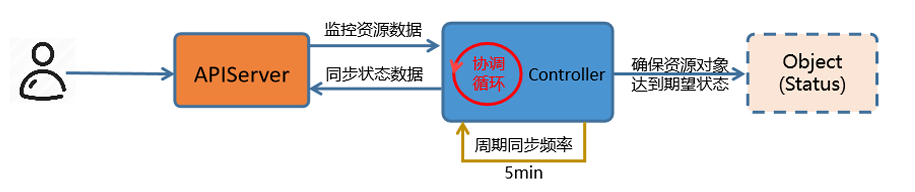

# 控制器原理

在工作中为了完成大量的业务目标，首先会根据业务应用内部的关联关系，**把业务拆分成多个子任务**， 然后**对这些子任务进行顺序组合**，当子任务按照方案执行完毕后，就完成了业务目标。

任务编排实现就是对多个子任务的执行顺序进行确定的过程。

对于Kubernetes 来说:

-   对于**紧密相关**的多个子任务，把它们放到**同一个pod内部**
-   对于**非紧密关联**的多个任务，分别放到**不同的pod中**
-   然后借助于**endpoint+service**的方式实现彼此之间的相互调用
-   为了让这些纷乱繁杂的任务能够互相发现，通过集群的 **CoreDNS**组件实现服务注册发现功能。

对于Kubernetes场景中的应用任务，主要存在部署、扩容、缩容、更新、回滚等常见编排操作。

虽然基于pod的方式实现了应用任务的部署功能操作，但是对于自主式的pod来说，它并不能实现其他 的更多编排任务。

因此在Kubernetes集群的核心功能之上，有一群非常重要的组件专用于对pod实现所谓的任务编排功能，这些组件统统将其称为**控制器Controller**。

## Kubernetes的控制器类型

-   Kubernetes内置控制器：
    -   Kubernetes默认就提供的实现基础型、核心型的控制器
    -   Controller Manager中内置提供了许多的控制器，例如Service Controller、DeploymentController等
    -   以kube-controller-manager组件的程序方式运行实现
-   第三方控制器
    -   实现高级控制器，通常需要借助于基础型控制器完成其功能
    -   例如Ingress插件ingress-nginx的Controller，网络插件Project Calico的Controller等
    -   通常以Pod形式托管运行于Kubernetes之上，而且这些Pod再由内置的控制器所控制

**控制器种类**

-   节点控制器(Node Controller): 负责在节点出现故障时进行通知和响应
-   任务控制器(Job controller): 监测代表一次性任务的 Job 对象，然后创建 Pods 来运行这些任务直至完成
-   端点控制器(Endpoints Controller): 填充端点(Endpoints)对象(即加入 Service 与 Pod)
-   服务帐户和令牌控制器(Service Account & Token Controllers): 为新的命名空间创建默认帐户和 API 访问令牌

## Controller的控制回路机制

-   Controller根据Spec，控制Systems生成当前实际Status
-   Controller借助于Sensor持续监视System的Spec和Status，在每一次控制回路中都会对二者进行 比较
-   确保System的Status不断逼近或完全等同Spec



-   用户向 APIserver中插入一个应用资源对象的请求
-   这个请求包含的数据形态中定义了该资源对象的 "期望"状态
-   数据经由 APIserver 保存到 ETCD 中
-   kube-controller-manager 中的各种控制器会监视 Apiserver上与自己相关的资源对象的变动 比如 Pod Controller只负责Pod资源的控制，Service Controller只负责Service资源的控制等。
-   一旦API Server中的资源对象发生变动，对应的Controller执行相关的配置代码，到对应的node节 点上运行
-   该资源对象会在当前节点上，按照用户的"期望"进行运行
-   这些实体对象的运行状态称为 "实际状态"
-   即控制器的作用就是确保 "期望状态" 与 "实际状态" 相一致
-   Controller将这些实际的资源对象状态，通过APIServer存储到ETCD的同一个数据条目的status的 字段中
-   资源对象在运行过程中，Controller 会循环的方式向 APIServer 监控 spec 和 status 的值是否一致
-   如果两个状态不一致，那么就指挥node节点的资源进行修改，保证两个状态一致
-   状态一致后，通过APIServer同步更新当前资源对象在ETCD上的数据

## **工作负载资源**

工作负载是在 Kubernetes 上运行的应用程序。

为了减轻用户的使用负担，通常不需要用户直接管理每个 Pod 。 而是**使用负载资源来替用户管理 一组 Pod**。 这些负载资源通过对应的配置控制器来确保正确类型的、处于运行状态的 Pod 个数是正确 的，与用户所指定的状态相一致。

以编排Pod化运行的应用为核心的控制器，通常被统称为工作负载型控制器，用于管理与之同名的工作负载型资源类型的资源对象

**Kubernetes 提供若干种内置的工作负载资源：**

-   **无状态应用编排**: Deployment 和 ReplicaSet （替换原来的资源 ReplicationController）。 Deployment 很适合用来管理你的集群上的无状态应用， Deployment 中的所有 Pod 都是相互等价的，并且在需要的时候被替换。
-   **有状态应用编排**:StatefulSet 让你能够运行一个或者多个以某种方式跟踪应用状态的 Pod。 例如， 如果你的负载会将数据作持久存储，你可以运行一个 StatefulSet ，将每个 Pod 与某个 PersistentVolume 对应起来。你在 StatefulSet 中各个 Pod 内运行的代码可以将数据复制到 同一 StatefulSet 中的其它 Pod 中以提高整体的服务可靠性。
-   **系统级应用**:DaemonSet 定义提供节点本地支撑设施的 Pod 。这些 Pod 可能对于你的集群的运维 是 非常重要的，例如作为网络链接的辅助工具或者作为网络 插件 的一部分等等。每次你向集群中 添加一个新节点时，如果该节点与某 DaemonSet 的规约匹配，则控制平面会为该 DaemonSet 调度一个 Pod 到该新节点上运行。
-   **作业类应用:**Job 和 CronJob。 定义一些一直运行到结束并停止的任务。 Job 用来执行一次性任 务，而 CronJob 用来执行的根据时间规划反复运行的任务

| 控制器                | 解析                                                         |
| --------------------- | ------------------------------------------------------------ |
| ReplicationController | 最早期的Pod控制器，目前已被废弃                              |
| RelicaSet             | 副本集，负责管理一个应用(Pod)的多个副本状态                  |
| Deployment            | 它不直接管理Pod，而是借助于ReplicaSet来管理Pod；最常用的无状态应用控制器 |
| DaemonSet             | 守护进程集，用于确保在每个节点仅运行某个应用的一个Pod副本。用于完成系统级任务 |
| Job                   | 有终止期限的一次性作业式任务，而非一直处于运行状态的服务进程 |
| CronJob               | 有终止期限的周期性作业式任务                                 |
| StatefulSet           | 功能类似于Deployment，但StatefulSet专用于编排有状态应用      |

## 控制器和Pod

-   控制器主要是通过管理pod来实现任务的编排效果
-   控制器是通过**标签或者标签选择器**找到pod
-   控制器对象仅负责确保API Server上有相应数量的符合标签选择器的Pod对象的定义
-   Pod 对象的Status如何与Spec保持一致，则要由相应节点上的kubelet负责保证

节点控制器和Worker节点

-   节点控制器**每间隔5秒检查一次** Worker 节点的状态
-   如果节点控制器没有收到来自Worker 节点的心跳，则将该Worker 节点被标记为**不可达**
-   如果该Worker节点被标记为不可达后,节点控制器再**等待40秒后**仍无法得到此节点的心跳,将该节点 标记为**无法访问**
-   如果该Worker 节点被标记为无法访问后,再**等待5分钟后,还没有心跳, 节点控制器会删除当前 Worker节点上面的所有pod,并在其它可用的Worker节点重建这些 pod**

# **标签和标签选择器**

Kubernetes通过标签来管理对应或者相关联的各种资源对象，**Label**是kubernetes中的核心概念之一。

Label 不是一个独立的API 资源类型,但Label对象可以关联到各种资源对象上

通过对Label的管理从而达到对相同Label的资源进行分组管理、分配、调度、配置、部署等。

标签Label 是可以附加在任何资源对象上的键值型元数据,即**Label本质上是一个key/value键值对**，其中 key与value由用户自己指定

key键标识由键前缀和键名组成,格式为 **[key_prefix/]key_name**

**`kubectl label`** 命令可管理对象的标签

创建：Label通常在资源对象定义时确定，也可以在对象创建后动态添加或者删除

一个资源对象可以定义多个Label，同一个Label 也可以关联多个资源对象上去

**常用标签使用场景：**

-   版本标签："release" : "stable"，"release" : "canary"，"release" : "beta"
-   环境标签："environment" : "dev"，"environment" : "qa"，"environment" : "prod"
-   应用标签："app" : "ui"，"app" : "as"，"app" : "pc"，"app" : "sc"
-   架构层级标签："tier" : "frontend"，"tier" : "backend", "tier" : "cache"
-   分区标签："partition" : "customerA"，"partition" : "customerB"
-   品控级别标签："track" : "daily"，"track" : "weekly"

## 管理标签

关于label的创建操作主要有两种：

-   命令行方法
-   yaml文件方法

### 命令行方法

```shell
# 添加标签
kubectl label 资源类型 资源名称 label_name=label_value [label_name=label_value] ...

# 修改标签
kubectl label 资源类型 资源名称 label_name=label_value [label_name=label_value] ... --overwrite[=true]

# 删除标签
kubectl label 资源类型 资源名称 label_name- [label_name-] ...

# 参数说明
# 同时增加多个标签，只需要在后面多写几个就可以了，使用空格隔开
# 默认情况下，已存在的标签是不能修改的，使用 --overwrite=true 表示强制覆盖
label_name=label_value样式写成 label_name- 即表示删除label

#查看指定标签的资源
kubectl get pods -l label_name[=label_value]

# 参数：
-l #指定标签条件，获取指定资源对象，=表示匹配，!= 表示不匹配, 如果后面的选择标签有多个的话，使用逗号隔开

# 如果针对标签的值进行范围过滤的话，可以使用如下格式：
-l 'label_name in (value1, value2, value3, ...)'      #包括其中一个label
-l 'label_name notin (value1, value2, value3, ...)'   #不包括其中任何一个label
kube
#是否存在label的判断
-l 'label_name'    #存在label
-l '!label_name'   #不存在label,注意使用单引号.不支持双引号】

```

```shell
# 添加标签
kubectl label pod pod-startup-exec type=test

# 查看标签
kubectl get pod --show-labels

# 修改标签
kubectl label pod pod-startup-exec type=proc --overwrite

# 删除标签
kubectl label pod pod-startup-exec type-

#查看指定标签的资源
kubectl get pods -l type=test
```

### yaml方法

```yaml
metadata:
  labels:
    key1: value1
    key2: value2
    ......
    
# 注意：labels复数
```

```shell
# cat pod-label-nginx.yaml
apiVersion: v1
kind: Pod
metadata:
  name: pod-label-nginx
  labels:
    app: nginx
    version: v1.20.0
spec:
  containers:
  - name: pod-label-nginx-container
    image: xxx/nginx:1.20.0
```

## 标签选择器

Label附加到Kubernetes集群中的各种资源对象上，目的是对这些资源对象可以进行**后续的分组管理** 而分组管理的核心就是：**标签选择器Label Selector**。

可以通过Label Selector查询和筛选某些特定Label的资源对象，进而可以对他们进行相应的操作管理

**标签选择器的主要应用场景：**

监控具体的Pod、负载均衡调度、定向调度，常用于 Pod、Node等资源对象

**Label Selector**跟Label一样，不能单独定义，必须附加在一些资源对象的定义文件上。一般附加在RS， Deployment 和Service等资源定义文件中。

Label Selector使用时候有两种常见的标签选择算符表达式：**等值**和**集合**

### 等值和不等值

```shell
# 等值
name = nginx                                   # 匹配所有具有标签name = nginx的资源对象
name == nginx                                  # 同上
name                                           # 表示匹配存在name标签的资源对象

# 不等值
!name                                          # 表示匹配不存在name标签的资源对象
name != nginx                                  # 匹配所有没有name标签或者标签name的值不等于nginx的资源对象
```

```yaml
# 示例：pod调度到指定标签的Node节点上
apiVersion: v1
kind: Pod
metadata:
  name: cuda-test
spec:
  containers:
  - name: cuda-test
    image: registry.k8s.io/cuda-vector-add:v0.1
    resources:
      limits:
        nvidia.com/gpu: 1
  nodeSelector:
    acclerator: nvidia-tesla-p100
```

```yaml
# 将所有的有app: myapp标签的pod管理在service下
apiVersion: v1
kind: Service
metadata:
  name: service-loadbalancer-lbaas
spec:
  type: LoadBalancer
  externalTrafficPolicy: Local
  selector:
    app: myapp
  ports:
  - name: http
    protocol: TCP
    port: 80
    targetPort: 80
```

### 集合，matchLabels，matchExpressions

```yaml
# 示例
env in (dev, test)                # 匹配所有具有标签 env = dev 或者 env = test的资源对象
name notin (frontend, backent)    # 匹配所有不具有标签name=frontend或者name=backend或者没有name标签的资源对象
```

**匹配标签：matchLabels**

```yaml
# 匹配标签
matchLabels:
  name: nginx
  app: myapp
  
# 当 matchLabels 中有多个标签时，它们之间的关系是逻辑与（AND）关系

#如下所示：
matchLabels:
 app: frontend
 environment: production
#那么只有那些标签中同时包含 app=frontend 和 environment=production 的资源才会被选中。
```

**匹配表达式 matchExpressions**

```yaml
#匹配表达式：
   matchExpressions:
      - {key: name, operator: NotIn, values: [frontend]}
#当 matchExpressions 中包含多个标签表达式时，它们之间的关系是逻辑与（AND）关系。

#常见的operator操作属性值有：
   In、NotIn、Exists、NotExists等
   Exists和NotExist时，values必须为空，即 { key: environment, opetator: Exists,values:}
#注意：这些表达式一般应用在RS、RC、Deployment等其它管理对象中。

#示例
matchExpressions:
  - key: environment
    operator: In
    values:
      - production
      - staging
  - key: app
    operator: NotIn
    values:
      - test
#那么只有那些标签满足以下两个条件的资源才会被选中：
- 标签中 environment 的值是 production 或 staging
- 标签中 app 的值不是 test
```

示例

```yaml
# 基于等值，多个为与关系
selector:
  component: reids
  
# 基于集合
selector:
  matchLabels:
    component: redis
  matchExpressions:
    - key: tier            # 等价 - { key: tier, operator: In, values: [cache] }
      operator: In
      values: [cache]
    - key: environment     # 等价 - { key: environment, operator: NotIn, values: [dev] }
      operator: NotIn
      values: [dev]
```

# Replica Set

Replica Set 其实是定义了一个期望的场景，RS有以下特点：

负责编排无状态应用的基础控制器是ReplicaSet，定义编排一个无状态应用相应的资源类型主要的**三个关键属**性如下

-   **replicas**：Pod期待的副本数量
-   **selector**：筛选目标Pod的标签选择器,支持matchExpressions和matchLabels
-   **template**：如果Pod数量不满足预期值，自动创建Pod时候用到的模板(template)，清单文件格式 和自主式Pod一样

意义：自动监控Pod运行的副本数目符合预期，保证Pod高可用的核心组件，常用于Pod的生命周期管理

## 工作机制

-   当通过"资源定义文件"定义好了一个RS资源对象，把它提交到Kubernetes集群
-   Master节点上的Controller Manager组件就得到通知
-   Controller Manager 根据 ReplicaSet Control Loop 管理 ReplicaSet Object
-   由该对象向API Server请求管理Pod对象(标签选择器选定的）
-   如果没有pod：以**Pod模板**向API Server请求创建Pod对象，由Scheduler调度并绑定至某节点，由相应节点kubelet负责运行
-   定期巡检系统中当前存活的Pod，并确保Pod实例数量刚到满足RC的期望值。
-   如果Pod数量大于RS定义的期望值，那么就杀死一些Pod
-   如果Pod数量小于RS定义的期望值，那么就创建一些Pod
-   所以通过RS资源对象，Kubernetes实现了业务应用集群的高可用性，大大减少了人工干预，提高了管理 的自动化。
-   如果后续想要扩充Pod副本的数量，可以直接修改replicas的值即可
-   当其中一个Node的Pod意外终止，根据RS的定义，Pod的期望值是2，所以会随机找一个Node结点重新 再创建一个新的Pod，来保证整个集群中始终存在两个Pod运行

注意：

-   删除RS并不会影响通过该RS资源对象创建好的Pod。
-   如果要删除所有的Pod那么可以设置RS的replicas的值为0，然后更新该RS。
-   另外kubectl提供了stop和delete命令来一次性删除RS和RS控制的Pod。
-   Pod提供的如果无状态服务，不会影响到客户的访问效果。

RS可以实现应用的部署，扩缩容和卸载，但一般很少单独使用，它**主要是被Deployment这个更高层的资源对象所使用**，从而形成了一整套Pod的创建、删除、更新的编排机制。

## Replica Set 资源清单文件示例

```yaml
apiVersion: apps/v1
kind: ReplicaSet
metadata:
  name: ...                                   # ReplicaSet名称，生成的Pod名称以此处的ReplicaSet名称为前缀+随机字符
  namespace: ...
spec:
  minReadySeconds <integer>                   # Pod就绪后多少秒内，Pod任一容器无crash方可视为“就绪”
  replicas <integer>                          # 期望的Pod副本数，默认为1
  selector:                                   # 标签选择器，必须匹配template字段中Pod模版中的标签
    matchExpressions <[]Object>
    matchLabels <map[string]String>
  template:                                   # pod模版对象
    metadata:                                 # pod对象元数据
      labels:                                 # 由模版创建出的Pod对象所拥有的标签，必须要能够匹配前面定义的标签选择器
    spec:                                     # pod规范，格式同自主式Pod
```

```yaml
vim controller-replicaset.yaml
apiVersion: apps/v1
kind: ReplicaSet
metadata:
  name: controller-replicaset-test
spec:
  minReadySeconds: 0
  replicas: 3
  selector:
    matchLabels:
      app: rs-test
      release: stable
      version: v1.0
  template:
    metadata:
      labels:
        app: rs-test
        release: stable
        version: v1.0
    spec:
      containers:
      - name: rs-test
        image: harbor.l00n9.icu/public/pod-test:v0.1
        
kubectl get rs
kubectl get replicasets.apps
```

## 扩容和缩容

```shell
# 方法1：修改清单文件
vim controller-replicaset.yaml 
  replicas: 4                                    # 修改这里，将其改为4
kubectl apply -f  controller-replicaset.yaml 

# 命令式，使用命令将其缩减为3个
kubectl scale [--resource-version=version] [--current-replicas=count] --replicas=COUNT (-f FILENAME | TYPE NAME)
kubectl scale --replicas=3 rs controller-replicaset-test
kubectl scale --replicas=5 -f controller-replicaset.yaml 
```

## 更新Pod镜像版本

直接修改资源清单上的image版本在apply，无效

现有的pod不会改变版本，但新创建的pod会是新的版本

### 滚动发布

#### svc

```yaml
vim svc-controller-replicaset.yaml
apiVersion: v1
kind: Service
metadata:
  name: svc-replicaset
spec:
  type: ClusterIP
  selector:
    app: rs-test
  ports:
  - name: http
    port: 80
    protocol: TCP
    targetPort: 80
```

#### v0.1

```yaml
vim controller-replicaset-1.yaml
apiVersion: apps/v1
kind: ReplicaSet
metadata:
  name: replicaset-test
spec:
  minReadySeconds: 0
  replicas: 3
  selector:
    matchLabels:
      app: rs-test
      release: stable
      version: v0.1
  template:
    metadata:
      labels:
        app: rs-test
        release: stable
        version: v0.1
    spec:
      containers:
      - name: rs-test
        image: harbor.l00n9.icu/public/pod-test:v0.1
```

#### v0.2

```yaml
cat controller-replicaset-2.yaml
apiVersion: apps/v2
kind: ReplicaSet
metadata:
  name: replicaset-test-2
spec:
  minReadySeconds: 0
  replicas: 0                   # 注意此处为0
  selector:
    matchLabels:
      app: rs-test
      release: stable
      version: v0.2
  template:
    metadata:
      labels:
        app: rs-test
        release: stable
        version: v0.2
    spec:
      containers:
      - name: rs-test
        image: harbor.l00n9.icu/public/pod-test:v0.2
```

#### 发布

```shell
kubectl apply -f svc-controller-replicaset.yaml
kubectl apply -f controller-replicaset-1.yaml
kubectl apply -f controller-replicaset-2.yaml
```

```shell
# 旧版的RS缩容，对新版本的RS扩容
kubectl scale --replicas=2 rs/replicaset-test; kubectl scale --replicas=1 rs/replicaset-test-2
replicaset.apps/replicaset-test scaled

kubectl scale --replicas=1 rs/replicaset-test; kubectl scale --replicas=2 rs/replicaset-test-2
replicaset.apps/replicaset-test scaled

kubectl scale --replicas=0 rs/replicaset-test; kubectl scale --replicas=3 rs/replicaset-test-2
replicaset.apps/replicaset-test scaled
```

### 蓝绿发布

两个版本同时存在

```yaml
vim controller-replicaset-blue-green.yaml
apiVersion: v1
kind: Service
metadata:
  name: svc-replicaset-blue-green
spec:
  type: ClusterIP
  selector:
    app: rs-test
    ctr: rs-${DEPLOY}
    version: ${VERSION}
  ports:
  - name: http
    port: 80
    protocol: TCP
    targetPort: 80
---
apiVersion: apps/v1
kind: ReplicaSet
metadata:
  name: rs-${DEPLOY}
spec:
  minReadySeconds: 3
  replicas: 2
  selector:
    matchLabels:
      app: rs-test
      ctr: rs-${DEPLOY}
      version: ${VERSION}
  template:
    metadata:
      labels:
        app: rs-test
        ctr: rs-${DEPLOY}
        version: ${VERSION}
    spec:
      containers:
      - name: pod-test
        image: harbor.l00n9.icu/public/pod-test:${VERSION}
```

#### 旧版

```shell
DEPLOY=blue VERSION=v0.1 envsubst < controller-replicaset-blue-green.yaml | kubectl apply -f -
```

#### 切换新版

```shell
DEPLOY=green VERSION=v0.2 envsubst < controller-replicaset-blue-green.yaml |kubectl apply -f -
```

#### 回退

```shell
DEPLOY=blue VERSION=v0.1 envsubst < controller-replicaset-blue-green.yaml | kubectl apply -f -
```

# Deployment

Deployment资源对象一般用于部署**无状态服务**,比如 java应用，Web等，这也是最常用的控制器

可以管理多个副本的Pod, 实现无缝迁移、自动扩容缩容、自动灾难恢复、一键回滚等功能

**Deployment相对于RC或RS的一个最大的升级是:支持滚动发布策略,其它功能几乎一样**

Deployment资源对象在内部使用Replica Set来实现Pod的自动化编排

## Deployment工作流程

-   创建Deployment资源对象，自动生成对应的Replicas Set并完成Pod的自动管理，而无需人为显示创建 Replicas Set
-   检查Deployment对象状态，检查Pod自动管理效果
-   扩展Deployment资源对象，以应对应用业务的高可用

**Deployment 本质上是依赖并调用 Replica Set 的完成来基本的编排功能，并额外提供了滚动更新，回滚的功能**

-   先由Deployment 创建 Replica Set 资源对象并进行编排
-   再由Replica Set 创建并对 Pod 的编排
-   Deployment是建立在ReplicaSet控制器上层的更高级的控制器
-   Deployment 位于ReplicaSet更上面一层，基于ReplieaSet，提供了滚动更新、回滚等更为强大的 应用编排功能
-   Deployment是 Replica Set 的编排工具，Deployment编排ReplicaSet，ReplicaSet编排Pod
-   Replica Set的名称由Deployment名称-Template的Hash值生成
-   **Deployment 并不直接管理 Pod**，必须间接的利用 Replica Set 来完成对Pod的编排
-   通常应该直接通过定义Deployment资源来编排Pod应用，而ReplicaSet无须显式配置

## Deployment  资源清单文件示例

```yaml
apiVersion: apps/v1                 # API群组及版本
kind: Deployment                    # 资源类型特有标识
metadata: 
  name: <string>                    # 资源名称，在作用域中要唯一，生成Pod名称：Deployment + Pod模版Hash + 随机字符串
  namespace: <string>               # 名称空间：Deployment隶属名称空间级别
spec:
  minReadySeconds: <integer>
  replicas: <integer>
  selector: <object>
    matchLabels:
      app: <string>
  template: <object>
  revisionHistoryLimit: <integer>    # 滚动更新历史记录数量，默认为10，如果为0表示不保留历史数据
  strategy: <object>                 # 滚动更新策略
    type: <string>                   # 滚动更新类型，可用值有Recreate（删除所有旧POd再创建新Pod）和RollingUpdate
    rollingUpdate: <Object>          # 滚动更新类型，专用于RollingUpdate类型，逐步更新，先创建新Pod再逐步删除旧Pod
      maxSurge: <string>             # 更新期间可比期望的POd数量能够多出的最大数量或比例
      maxUnavaiLabel: <String>       # 更新期间可比期望的Pod数量能够缺少的最大数量或比例
  progressDeadlineSeconds: <integer> # 滚动更新故障超时时长，默认为600秒
  paused: <boolean>                  # 是否暂停部署过程
```

```shell
kubectl create deployment deployment-pod-test --image=harbor.l00n9.icu/public/pod-test:v0.1 --replicas=3 --dry-run=client -o yaml
```

创建deployment会自动创建相应的RS和POD

RS的名称=deployment名称+template_hash值

Pod的名称=deployment名称+replcaset_id+pod_id

```yaml
# cat controller-deployment-test.yaml
apiVersion: apps/v1
kind: Deployment
metadata:
  name: deployment-test
spec:
  replicas: 3
  selector: 
    matchLabels:
      app: rs-test
  template:
    metadata:
      labels:
        app: rs-test
    spec:
      containers:
      - name: pod-test
        image: harbor.l00n9.icu/public/pod-test:v0.1 
        
kubectl get deploy
kubectl get rs
kubectl get pod

# 改变版本重新apply可以实现版本的更新
# 因为会出现俩rs
kubectl get rs
NAME                         DESIRED   CURRENT   READY   AGE 
deployment-test-6d9c99784c   0         0         0       43s # v0.1
deployment-test-c47b94796    3         3         3       7s  # v0.2
```

## 扩容缩容

```shell
# 基于资源对象调整
kubectl scale  [--current-replicas=<当前副本数>] --replicas=<新副本数> deployment/deploy_name
# --current-replicas=<当前副本数> 不满足的话就不会扩缩容

# 基于资源文件调整
kubectl scale --replicas=<新副本数> -f deploy_name.yaml
```

