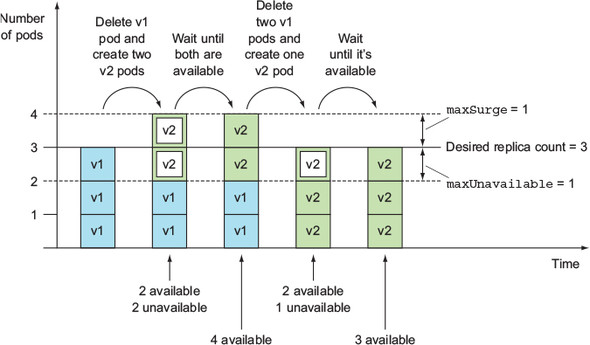
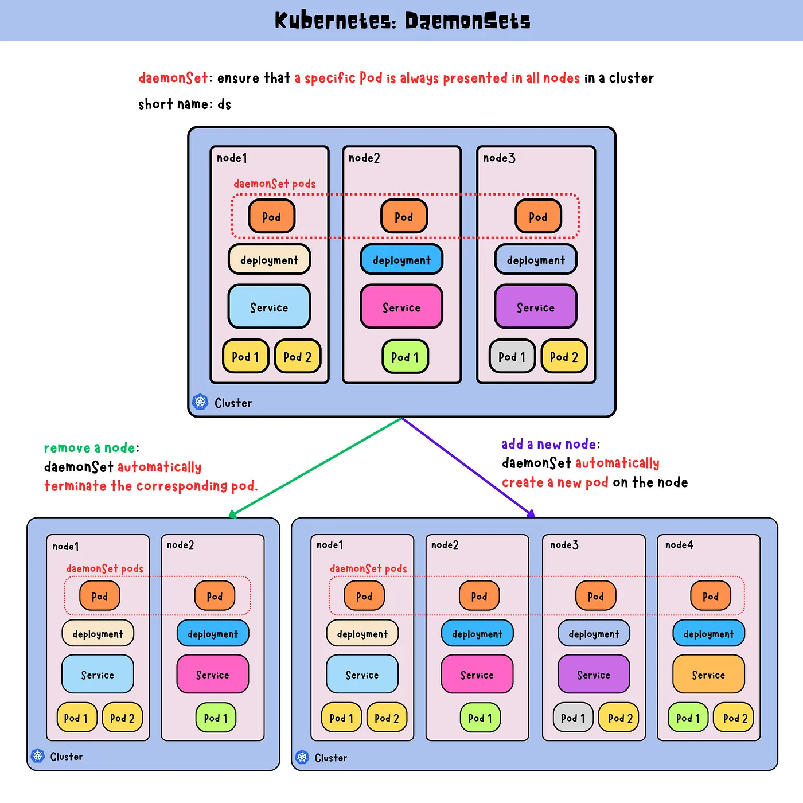
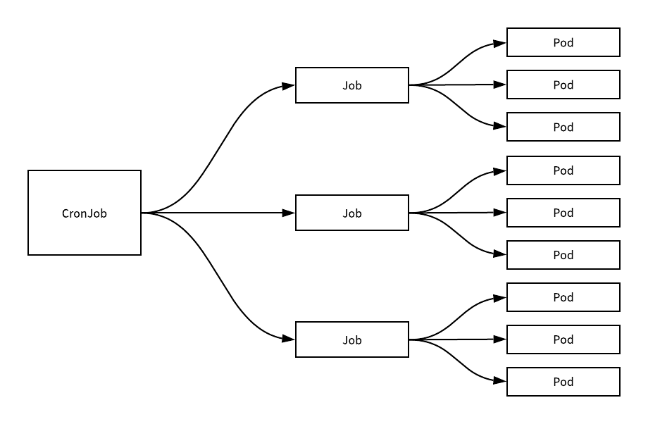

# 控制器原理

在工作中为了完成大量的业务目标，首先会根据业务应用内部的关联关系，**把业务拆分成多个子任务**， 然后**对这些子任务进行顺序组合**，当子任务按照方案执行完毕后，就完成了业务目标。

任务编排实现就是对多个子任务的执行顺序进行确定的过程。

对于Kubernetes 来说:

-   对于**紧密相关**的多个子任务，把它们放到**同一个pod内部**
-   对于**非紧密关联**的多个任务，分别放到**不同的pod中**
-   然后借助于**endpoint+service**的方式实现彼此之间的相互调用
-   为了让这些纷乱繁杂的任务能够互相发现，通过集群的 **CoreDNS**组件实现服务注册发现功能。

对于Kubernetes场景中的应用任务，主要存在部署、扩容、缩容、更新、回滚等常见编排操作。

虽然基于pod的方式实现了应用任务的部署功能操作，但是对于自主式的pod来说，它并不能实现其他 的更多编排任务。

因此在Kubernetes集群的核心功能之上，有一群非常重要的组件专用于对pod实现所谓的任务编排功能，这些组件统统将其称为**控制器Controller**。

## Kubernetes的控制器类型

-   Kubernetes内置控制器：
    -   Kubernetes默认就提供的实现基础型、核心型的控制器
    -   Controller Manager中内置提供了许多的控制器，例如Service Controller、DeploymentController等
    -   以kube-controller-manager组件的程序方式运行实现
-   第三方控制器
    -   实现高级控制器，通常需要借助于基础型控制器完成其功能
    -   例如Ingress插件ingress-nginx的Controller，网络插件Project Calico的Controller等
    -   通常以Pod形式托管运行于Kubernetes之上，而且这些Pod再由内置的控制器所控制

**控制器种类**

-   节点控制器(Node Controller): 负责在节点出现故障时进行通知和响应
-   任务控制器(Job controller): 监测代表一次性任务的 Job 对象，然后创建 Pods 来运行这些任务直至完成
-   端点控制器(Endpoints Controller): 填充端点(Endpoints)对象(即加入 Service 与 Pod)
-   服务帐户和令牌控制器(Service Account & Token Controllers): 为新的命名空间创建默认帐户和 API 访问令牌

## Controller的控制回路机制

-   Controller根据Spec，控制Systems生成当前实际Status
-   Controller借助于Sensor持续监视System的Spec和Status，在每一次控制回路中都会对二者进行 比较
-   确保System的Status不断逼近或完全等同Spec


-   用户向 APIserver中插入一个应用资源对象的请求
-   这个请求包含的数据形态中定义了该资源对象的 "期望"状态
-   数据经由 APIserver 保存到 ETCD 中
-   kube-controller-manager 中的各种控制器会监视 Apiserver上与自己相关的资源对象的变动 比如 Pod Controller只负责Pod资源的控制，Service Controller只负责Service资源的控制等。
-   一旦API Server中的资源对象发生变动，对应的Controller执行相关的配置代码，到对应的node节 点上运行
-   该资源对象会在当前节点上，按照用户的"期望"进行运行
-   这些实体对象的运行状态称为 "实际状态"
-   即控制器的作用就是确保 "期望状态" 与 "实际状态" 相一致
-   Controller将这些实际的资源对象状态，通过APIServer存储到ETCD的同一个数据条目的status的 字段中
-   资源对象在运行过程中，Controller 会循环的方式向 APIServer 监控 spec 和 status 的值是否一致
-   如果两个状态不一致，那么就指挥node节点的资源进行修改，保证两个状态一致
-   状态一致后，通过APIServer同步更新当前资源对象在ETCD上的数据

## **工作负载资源**

工作负载是在 Kubernetes 上运行的应用程序。

为了减轻用户的使用负担，通常不需要用户直接管理每个 Pod 。 而是**使用负载资源来替用户管理 一组 Pod**。 这些负载资源通过对应的配置控制器来确保正确类型的、处于运行状态的 Pod 个数是正确 的，与用户所指定的状态相一致。

以编排Pod化运行的应用为核心的控制器，通常被统称为工作负载型控制器，用于管理与之同名的工作负载型资源类型的资源对象

**Kubernetes 提供若干种内置的工作负载资源：**

-   **无状态应用编排**: Deployment 和 ReplicaSet （替换原来的资源 ReplicationController）。 Deployment 很适合用来管理你的集群上的无状态应用， Deployment 中的所有 Pod 都是相互等价的，并且在需要的时候被替换。
-   **有状态应用编排**:StatefulSet 让你能够运行一个或者多个以某种方式跟踪应用状态的 Pod。 例如， 如果你的负载会将数据作持久存储，你可以运行一个 StatefulSet ，将每个 Pod 与某个 PersistentVolume 对应起来。你在 StatefulSet 中各个 Pod 内运行的代码可以将数据复制到 同一 StatefulSet 中的其它 Pod 中以提高整体的服务可靠性。
-   **系统级应用**:DaemonSet 定义提供节点本地支撑设施的 Pod 。这些 Pod 可能对于你的集群的运维 是 非常重要的，例如作为网络链接的辅助工具或者作为网络 插件 的一部分等等。每次你向集群中 添加一个新节点时，如果该节点与某 DaemonSet 的规约匹配，则控制平面会为该 DaemonSet 调度一个 Pod 到该新节点上运行。
-   **作业类应用:**Job 和 CronJob。 定义一些一直运行到结束并停止的任务。 Job 用来执行一次性任 务，而 CronJob 用来执行的根据时间规划反复运行的任务

| 控制器                | 解析                                                         |
| --------------------- | ------------------------------------------------------------ |
| ReplicationController | 最早期的Pod控制器，目前已被废弃                              |
| RelicaSet             | 副本集，负责管理一个应用(Pod)的多个副本状态                  |
| Deployment            | 它不直接管理Pod，而是借助于ReplicaSet来管理Pod；最常用的无状态应用控制器 |
| DaemonSet             | 守护进程集，用于确保在每个节点仅运行某个应用的一个Pod副本。用于完成系统级任务 |
| Job                   | 有终止期限的一次性作业式任务，而非一直处于运行状态的服务进程 |
| CronJob               | 有终止期限的周期性作业式任务                                 |
| StatefulSet           | 功能类似于Deployment，但StatefulSet专用于编排有状态应用      |

## 控制器和Pod

-   控制器主要是通过管理pod来实现任务的编排效果
-   控制器是通过**标签或者标签选择器**找到pod
-   控制器对象仅负责确保API Server上有相应数量的符合标签选择器的Pod对象的定义
-   Pod 对象的Status如何与Spec保持一致，则要由相应节点上的kubelet负责保证

节点控制器和Worker节点

-   节点控制器**每间隔5秒检查一次** Worker 节点的状态
-   如果节点控制器没有收到来自Worker 节点的心跳，则将该Worker 节点被标记为**不可达**
-   如果该Worker节点被标记为不可达后,节点控制器再**等待40秒后**仍无法得到此节点的心跳,将该节点 标记为**无法访问**
-   如果该Worker 节点被标记为无法访问后,再**等待5分钟后,还没有心跳, 节点控制器会删除当前 Worker节点上面的所有pod,并在其它可用的Worker节点重建这些 pod**

# **标签和标签选择器**

Kubernetes通过标签来管理对应或者相关联的各种资源对象，**Label**是kubernetes中的核心概念之一。

Label 不是一个独立的API 资源类型,但Label对象可以关联到各种资源对象上

通过对Label的管理从而达到对相同Label的资源进行分组管理、分配、调度、配置、部署等。

标签Label 是可以附加在任何资源对象上的键值型元数据,即**Label本质上是一个key/value键值对**，其中 key与value由用户自己指定

key键标识由键前缀和键名组成,格式为 **[key_prefix/]key_name**

**`kubectl label`** 命令可管理对象的标签

创建：Label通常在资源对象定义时确定，也可以在对象创建后动态添加或者删除

一个资源对象可以定义多个Label，同一个Label 也可以关联多个资源对象上去

**常用标签使用场景：**

-   版本标签："release" : "stable"，"release" : "canary"，"release" : "beta"
-   环境标签："environment" : "dev"，"environment" : "qa"，"environment" : "prod"
-   应用标签："app" : "ui"，"app" : "as"，"app" : "pc"，"app" : "sc"
-   架构层级标签："tier" : "frontend"，"tier" : "backend", "tier" : "cache"
-   分区标签："partition" : "customerA"，"partition" : "customerB"
-   品控级别标签："track" : "daily"，"track" : "weekly"

## 管理标签

关于label的创建操作主要有两种：

-   命令行方法
-   yaml文件方法

### 命令行方法

```shell
# 添加标签
kubectl label 资源类型 资源名称 label_name=label_value [label_name=label_value] ...

# 修改标签
kubectl label 资源类型 资源名称 label_name=label_value [label_name=label_value] ... --overwrite[=true]

# 删除标签
kubectl label 资源类型 资源名称 label_name- [label_name-] ...

# 参数说明
# 同时增加多个标签，只需要在后面多写几个就可以了，使用空格隔开
# 默认情况下，已存在的标签是不能修改的，使用 --overwrite=true 表示强制覆盖
label_name=label_value样式写成 label_name- 即表示删除label

#查看指定标签的资源
kubectl get pods -l label_name[=label_value]

# 参数：
-l #指定标签条件，获取指定资源对象，=表示匹配，!= 表示不匹配, 如果后面的选择标签有多个的话，使用逗号隔开

# 如果针对标签的值进行范围过滤的话，可以使用如下格式：
-l 'label_name in (value1, value2, value3, ...)'      #包括其中一个label
-l 'label_name notin (value1, value2, value3, ...)'   #不包括其中任何一个label
kube
#是否存在label的判断
-l 'label_name'    #存在label
-l '!label_name'   #不存在label,注意使用单引号.不支持双引号】

```

```shell
# 添加标签
kubectl label pod pod-startup-exec type=test

# 查看标签
kubectl get pod --show-labels

# 修改标签
kubectl label pod pod-startup-exec type=proc --overwrite

# 删除标签
kubectl label pod pod-startup-exec type-

#查看指定标签的资源
kubectl get pods -l type=test
```

### yaml方法

```yaml
metadata:
  labels:
    key1: value1
    key2: value2
    ......
    
# 注意：labels复数
```

```shell
# cat pod-label-nginx.yaml
apiVersion: v1
kind: Pod
metadata:
  name: pod-label-nginx
  labels:
    app: nginx
    version: v1.20.0
spec:
  containers:
  - name: pod-label-nginx-container
    image: xxx/nginx:1.20.0
```

## 标签选择器

Label附加到Kubernetes集群中的各种资源对象上，目的是对这些资源对象可以进行**后续的分组管理** 而分组管理的核心就是：**标签选择器Label Selector**。

可以通过Label Selector查询和筛选某些特定Label的资源对象，进而可以对他们进行相应的操作管理

**标签选择器的主要应用场景：**

监控具体的Pod、负载均衡调度、定向调度，常用于 Pod、Node等资源对象

**Label Selector**跟Label一样，不能单独定义，必须附加在一些资源对象的定义文件上。一般附加在RS， Deployment 和Service等资源定义文件中。

Label Selector使用时候有两种常见的标签选择算符表达式：**等值**和**集合**

### 等值和不等值

```shell
# 等值
name = nginx                                   # 匹配所有具有标签name = nginx的资源对象
name == nginx                                  # 同上
name                                           # 表示匹配存在name标签的资源对象

# 不等值
!name                                          # 表示匹配不存在name标签的资源对象
name != nginx                                  # 匹配所有没有name标签或者标签name的值不等于nginx的资源对象
```

```yaml
# 示例：pod调度到指定标签的Node节点上
apiVersion: v1
kind: Pod
metadata:
  name: cuda-test
spec:
  containers:
  - name: cuda-test
    image: registry.k8s.io/cuda-vector-add:v0.1
    resources:
      limits:
        nvidia.com/gpu: 1
  nodeSelector:
    acclerator: nvidia-tesla-p100
```

```yaml
# 将所有的有app: myapp标签的pod管理在service下
apiVersion: v1
kind: Service
metadata:
  name: service-loadbalancer-lbaas
spec:
  type: LoadBalancer
  externalTrafficPolicy: Local
  selector:
    app: myapp
  ports:
  - name: http
    protocol: TCP
    port: 80
    targetPort: 80
```

### 集合，matchLabels，matchExpressions

```yaml
# 示例
env in (dev, test)                # 匹配所有具有标签 env = dev 或者 env = test的资源对象
name notin (frontend, backent)    # 匹配所有不具有标签name=frontend或者name=backend或者没有name标签的资源对象
```

**匹配标签：matchLabels**

```yaml
# 匹配标签
matchLabels:
  name: nginx
  app: myapp
  
# 当 matchLabels 中有多个标签时，它们之间的关系是逻辑与（AND）关系

#如下所示：
matchLabels:
 app: frontend
 environment: production
#那么只有那些标签中同时包含 app=frontend 和 environment=production 的资源才会被选中。
```

**匹配表达式 matchExpressions**

```yaml
#匹配表达式：
   matchExpressions:
      - {key: name, operator: NotIn, values: [frontend]}
#当 matchExpressions 中包含多个标签表达式时，它们之间的关系是逻辑与（AND）关系。

#常见的operator操作属性值有：
   In、NotIn、Exists、NotExists等
   Exists和NotExist时，values必须为空，即 { key: environment, opetator: Exists,values:}
#注意：这些表达式一般应用在RS、RC、Deployment等其它管理对象中。

#示例
matchExpressions:
  - key: environment
    operator: In
    values:
      - production
      - staging
  - key: app
    operator: NotIn
    values:
      - test
#那么只有那些标签满足以下两个条件的资源才会被选中：
- 标签中 environment 的值是 production 或 staging
- 标签中 app 的值不是 test
```

示例

```yaml
# 基于等值，多个为与关系
selector:
  component: reids
  
# 基于集合
selector:
  matchLabels:
    component: redis
  matchExpressions:
    - key: tier            # 等价 - { key: tier, operator: In, values: [cache] }
      operator: In
      values: [cache]
    - key: environment     # 等价 - { key: environment, operator: NotIn, values: [dev] }
      operator: NotIn
      values: [dev]
```

# Replica Set

Replica Set 其实是定义了一个期望的场景，RS有以下特点：

负责编排无状态应用的基础控制器是ReplicaSet，定义编排一个无状态应用相应的资源类型主要的**三个关键属**性如下

-   **replicas**：Pod期待的副本数量
-   **selector**：筛选目标Pod的标签选择器,支持matchExpressions和matchLabels
-   **template**：如果Pod数量不满足预期值，自动创建Pod时候用到的模板(template)，清单文件格式 和自主式Pod一样

意义：自动监控Pod运行的副本数目符合预期，保证Pod高可用的核心组件，常用于Pod的生命周期管理

## 工作机制

-   当通过"资源定义文件"定义好了一个RS资源对象，把它提交到Kubernetes集群
-   Master节点上的Controller Manager组件就得到通知
-   Controller Manager 根据 ReplicaSet Control Loop 管理 ReplicaSet Object
-   由该对象向API Server请求管理Pod对象(标签选择器选定的）
-   如果没有pod：以**Pod模板**向API Server请求创建Pod对象，由Scheduler调度并绑定至某节点，由相应节点kubelet负责运行
-   定期巡检系统中当前存活的Pod，并确保Pod实例数量刚到满足RC的期望值。
-   如果Pod数量大于RS定义的期望值，那么就杀死一些Pod
-   如果Pod数量小于RS定义的期望值，那么就创建一些Pod
-   所以通过RS资源对象，Kubernetes实现了业务应用集群的高可用性，大大减少了人工干预，提高了管理 的自动化。
-   如果后续想要扩充Pod副本的数量，可以直接修改replicas的值即可
-   当其中一个Node的Pod意外终止，根据RS的定义，Pod的期望值是2，所以会随机找一个Node结点重新 再创建一个新的Pod，来保证整个集群中始终存在两个Pod运行

注意：

-   删除RS并不会影响通过该RS资源对象创建好的Pod。
-   如果要删除所有的Pod那么可以设置RS的replicas的值为0，然后更新该RS。
-   另外kubectl提供了stop和delete命令来一次性删除RS和RS控制的Pod。
-   Pod提供的如果无状态服务，不会影响到客户的访问效果。

RS可以实现应用的部署，扩缩容和卸载，但一般很少单独使用，它**主要是被Deployment这个更高层的资源对象所使用**，从而形成了一整套Pod的创建、删除、更新的编排机制。

## Replica Set 资源清单文件示例

```yaml
apiVersion: apps/v1
kind: ReplicaSet
metadata:
  name: ...                                   # ReplicaSet名称，生成的Pod名称以此处的ReplicaSet名称为前缀+随机字符
  namespace: ...
spec:
  minReadySeconds <integer>                   # Pod就绪后多少秒内，Pod任一容器无crash方可视为“就绪”
  replicas <integer>                          # 期望的Pod副本数，默认为1
  selector:                                   # 标签选择器，必须匹配template字段中Pod模版中的标签
    matchExpressions <[]Object>
    matchLabels <map[string]String>
  template:                                   # pod模版对象
    metadata:                                 # pod对象元数据
      labels:                                 # 由模版创建出的Pod对象所拥有的标签，必须要能够匹配前面定义的标签选择器
    spec:                                     # pod规范，格式同自主式Pod
```

```yaml
vim controller-replicaset.yaml
apiVersion: apps/v1
kind: ReplicaSet
metadata:
  name: controller-replicaset-test
spec:
  minReadySeconds: 0
  replicas: 3
  selector:
    matchLabels:
      app: rs-test
      release: stable
      version: v1.0
  template:
    metadata:
      labels:
        app: rs-test
        release: stable
        version: v1.0
    spec:
      containers:
      - name: rs-test
        image: harbor.l00n9.icu/public/pod-test:v0.1
        
kubectl get rs
kubectl get replicasets.apps
```

## 扩容和缩容

```shell
# 方法1：修改清单文件
vim controller-replicaset.yaml 
  replicas: 4                                    # 修改这里，将其改为4
kubectl apply -f  controller-replicaset.yaml 

# 命令式，使用命令将其缩减为3个
kubectl scale [--resource-version=version] [--current-replicas=count] --replicas=COUNT (-f FILENAME | TYPE NAME)
kubectl scale --replicas=3 rs controller-replicaset-test
kubectl scale --replicas=5 -f controller-replicaset.yaml 
```

## 更新Pod镜像版本

直接修改资源清单上的image版本在apply，无效

现有的pod不会改变版本，但新创建的pod会是新的版本

### 滚动发布

#### svc

```yaml
vim svc-controller-replicaset.yaml
apiVersion: v1
kind: Service
metadata:
  name: svc-replicaset
spec:
  type: ClusterIP
  selector:
    app: rs-test
  ports:
  - name: http
    port: 80
    protocol: TCP
    targetPort: 80
```

#### v0.1

```yaml
vim controller-replicaset-1.yaml
apiVersion: apps/v1
kind: ReplicaSet
metadata:
  name: replicaset-test
spec:
  minReadySeconds: 0
  replicas: 3
  selector:
    matchLabels:
      app: rs-test
      release: stable
      version: v0.1
  template:
    metadata:
      labels:
        app: rs-test
        release: stable
        version: v0.1
    spec:
      containers:
      - name: rs-test
        image: harbor.l00n9.icu/public/pod-test:v0.1
```

#### v0.2

```yaml
cat controller-replicaset-2.yaml
apiVersion: apps/v2
kind: ReplicaSet
metadata:
  name: replicaset-test-2
spec:
  minReadySeconds: 0
  replicas: 0                   # 注意此处为0
  selector:
    matchLabels:
      app: rs-test
      release: stable
      version: v0.2
  template:
    metadata:
      labels:
        app: rs-test
        release: stable
        version: v0.2
    spec:
      containers:
      - name: rs-test
        image: harbor.l00n9.icu/public/pod-test:v0.2
```

#### 发布

```shell
kubectl apply -f svc-controller-replicaset.yaml
kubectl apply -f controller-replicaset-1.yaml
kubectl apply -f controller-replicaset-2.yaml
```

```shell
# 旧版的RS缩容，对新版本的RS扩容
kubectl scale --replicas=2 rs/replicaset-test; kubectl scale --replicas=1 rs/replicaset-test-2
replicaset.apps/replicaset-test scaled

kubectl scale --replicas=1 rs/replicaset-test; kubectl scale --replicas=2 rs/replicaset-test-2
replicaset.apps/replicaset-test scaled

kubectl scale --replicas=0 rs/replicaset-test; kubectl scale --replicas=3 rs/replicaset-test-2
replicaset.apps/replicaset-test scaled
```

### 蓝绿发布

两个版本同时存在

```yaml
vim controller-replicaset-blue-green.yaml
apiVersion: v1
kind: Service
metadata:
  name: svc-replicaset-blue-green
spec:
  type: ClusterIP
  selector:
    app: rs-test
    ctr: rs-${DEPLOY}
    version: ${VERSION}
  ports:
  - name: http
    port: 80
    protocol: TCP
    targetPort: 80
---
apiVersion: apps/v1
kind: ReplicaSet
metadata:
  name: rs-${DEPLOY}
spec:
  minReadySeconds: 3
  replicas: 2
  selector:
    matchLabels:
      app: rs-test
      ctr: rs-${DEPLOY}
      version: ${VERSION}
  template:
    metadata:
      labels:
        app: rs-test
        ctr: rs-${DEPLOY}
        version: ${VERSION}
    spec:
      containers:
      - name: pod-test
        image: harbor.l00n9.icu/public/pod-test:${VERSION}
```

#### 旧版

```shell
DEPLOY=blue VERSION=v0.1 envsubst < controller-replicaset-blue-green.yaml | kubectl apply -f -
```

#### 切换新版

```shell
DEPLOY=green VERSION=v0.2 envsubst < controller-replicaset-blue-green.yaml |kubectl apply -f -
```

#### 回退

```shell
DEPLOY=blue VERSION=v0.1 envsubst < controller-replicaset-blue-green.yaml | kubectl apply -f -
```

# Deployment

Deployment资源对象一般用于部署**无状态服务**,比如 java应用，Web等，这也是最常用的控制器

可以管理多个副本的Pod, 实现无缝迁移、自动扩容缩容、自动灾难恢复、一键回滚等功能

**Deployment相对于RC或RS的一个最大的升级是:支持滚动发布策略,其它功能几乎一样**

Deployment资源对象在内部使用Replica Set来实现Pod的自动化编排

## Deployment工作流程

-   创建Deployment资源对象，自动生成对应的Replicas Set并完成Pod的自动管理，而无需人为显示创建 Replicas Set
-   检查Deployment对象状态，检查Pod自动管理效果
-   扩展Deployment资源对象，以应对应用业务的高可用

**Deployment 本质上是依赖并调用 Replica Set 的完成来基本的编排功能，并额外提供了滚动更新，回滚的功能**

-   先由Deployment 创建 Replica Set 资源对象并进行编排
-   再由Replica Set 创建并对 Pod 的编排
-   Deployment是建立在ReplicaSet控制器上层的更高级的控制器
-   Deployment 位于ReplicaSet更上面一层，基于ReplieaSet，提供了滚动更新、回滚等更为强大的 应用编排功能
-   Deployment是 Replica Set 的编排工具，Deployment编排ReplicaSet，ReplicaSet编排Pod
-   Replica Set的名称由Deployment名称-Template的Hash值生成
-   **Deployment 并不直接管理 Pod**，必须间接的利用 Replica Set 来完成对Pod的编排
-   通常应该直接通过定义Deployment资源来编排Pod应用，而ReplicaSet无须显式配置

## Deployment  资源清单文件示例

```yaml
apiVersion: apps/v1                 # API群组及版本
kind: Deployment                    # 资源类型特有标识
metadata: 
  name: <string>                    # 资源名称，在作用域中要唯一，生成Pod名称：Deployment + Pod模版Hash + 随机字符串
  namespace: <string>               # 名称空间：Deployment隶属名称空间级别
spec:
  minReadySeconds: <integer>
  replicas: <integer>
  selector: <object>
    matchLabels:
      app: <string>
  template: <object>
  revisionHistoryLimit: <integer>    # 滚动更新历史记录数量，默认为10，如果为0表示不保留历史数据
  strategy: <object>                 # 滚动更新策略
    type: <string>                   # 滚动更新类型，可用值有Recreate（删除所有旧POd再创建新Pod）和RollingUpdate
    rollingUpdate: <Object>          # 滚动更新类型，专用于RollingUpdate类型，逐步更新，先创建新Pod再逐步删除旧Pod
      maxSurge: <string>             # 更新期间可比期望的POd数量能够多出的最大数量或比例
      maxUnavaiLabel: <String>       # 更新期间可比期望的Pod数量能够缺少的最大数量或比例
  progressDeadlineSeconds: <integer> # 滚动更新故障超时时长，默认为600秒
  paused: <boolean>                  # 是否暂停部署过程
```

```shell
kubectl create deployment deployment-pod-test --image=harbor.l00n9.icu/public/pod-test:v0.1 --replicas=3 --dry-run=client -o yaml
```

创建deployment会自动创建相应的RS和POD

RS的名称=deployment名称+template_hash值

Pod的名称=deployment名称+replcaset_id+pod_id

```yaml
# cat controller-deployment-test.yaml
apiVersion: apps/v1
kind: Deployment
metadata:
  name: deployment-test
spec:
  replicas: 3
  selector: 
    matchLabels:
      app: rs-test
  template:
    metadata:
      labels:
        app: rs-test
    spec:
      containers:
      - name: pod-test
        image: harbor.l00n9.icu/public/pod-test:v0.1 
        
kubectl get deploy
kubectl get rs
kubectl get pod

# 改变版本重新apply可以实现版本的更新
# 因为会出现俩rs
kubectl get rs
NAME                         DESIRED   CURRENT   READY   AGE 
deployment-test-6d9c99784c   0         0         0       43s # v0.1
deployment-test-c47b94796    3         3         3       7s  # v0.2
```

## 扩容缩容

```shell
# 基于资源对象调整
kubectl scale  [--current-replicas=<当前副本数>] --replicas=<新副本数> deployment/deploy_name
# --current-replicas=<当前副本数> 不满足的话就不会扩缩容

# 基于资源文件调整
kubectl scale --replicas=<新副本数> -f deploy_name.yaml
```

## Deployment动态更新回滚

### 命令式更新和回滚

```shell
# 更新命令1
kubectl set SUBCOMMAND [options] 资源类型 资源名称
SUBCOMMAND：子命令，常用的子命令就是image
# 参数详解
--record=true       # 更改时，会将信息增加到历史记录中
# 1.32.0 后 将被遗弃

#更新命令2：（用的很少）
kubectl patch (-f FILENAME | TYPE NAME) -p PATCH [options]
#参数详解：
--patch='' #设定对象属性内容

#回滚命令：
kubectl rollout SUBCOMMAND [options] 资源类型 资源名称

SUBCOMMAND 子命令：
history         #显示 rollout 历史,默认只保留最近的10个版本
pause           #标记resource为中止状态，配合resume可实现灰度发布，pause目前仅支持deployment,可配合kubectl set实现批量更新
restart         #重启一个 resource
resume          #继续一个停止的 resource
status          #显示 rollout 的状态
undo            #撤销上一次的 rollout
--revision=n    #查看指定版本的详细信息
--to-revision=0 #rollback至指定版本,默认为0,表示前一个版本
```

案例

```shell
kubectl create deployment nginx --image xxx/nginx:1.18.0

kubectl set image deployment nginx nginx='xxx/nginx:1.20.0' --record=true

# 查看历史kubectl rollout history
kubectl rollout history deployment nginx

# 撤销/回退上次的更改：注意：只能回退一次
kubectl rollout undo deployment nginx

# 回退到指定版本
kubectl rollout undo --to-revision=2 deployment nginx
```

### 命令式批量更新(改动)

默认只更改一次就会触发重新生成新Pod可能会影响业务的稳定,可以将多次批量更新合并为只触发一次 重新创建Pod,从而保证业务的稳定

```shell
# 暂停更新
kubectl rollout pause deployment pod-test

# 第一次更改
kubectl set image deployment pod-test pod-test=registry.cn-beijing.aliyuncs.com/wangxiaochun/pod-test:v0.2 --record

# 第二次更改
kubectl set resources deployment nginx --limits=cpu=200m,memory=128Mi --requests=cpu=100m,memory=64Mi


# 恢复批量更新
kubectl rollout resume deployment nginx
```

### 基于声明清单文件实现升级和降级

```yaml
vim controller-deployment-test.yaml
apiVersion: apps/v1
kind: Deployment
metadata:
  name: deployment-test
spec:
  replicas: 3
  selector:
    matchLabels:
      app: rs-test
  template:
    metadata:
      labels:
        app: rs-test
    spec:
      containers:
      - name: pod-test
        image: harbor.l00n9.icu/public/pod-test:v0.2 # 直接改版本
```

## Deployment滚动更新策略

Deployment 控制器支持两种更新策略

*   **重建式更新 recreate**
    -   当使用Recreate策略时，Deployment会直接**删除全部的旧的Pod**，然后创建新的Pod。
    -   这意味着在部署新版本时，整个应用会**停止服务一段时间**，直到所有旧的Pod都被删除并且新的 Pod被创建并运行起来。
    -   这可能会导致一段时间内的服务中断，因为旧版本的Pod被直接替换掉了。
    -   **此方式可以防止端口冲突**
*   **滚动式更新 rolling updates**
    -   此为默认策略
    -   RollingUpdate策略允许在部署新版本时逐步更新Pod。
    -   它会先创建新版本的Pod，然后逐步替换旧版本的Pod，直到所有Pod都已经更新为新版本。
    -   这种方式可以确保应用**一直处于可用状态**，因为在整个更新过程中，至少有一部分Pod一直在运行。
    -   **逐批次更新Pod的方式，支持按百分比或具体的数量定义批次规模**
    -   触发条件:
        -   **podTemplate的hash码**变动，即仅podTemplate的配置变动才会导致hash码改变
        -   replicas和selector的变更不会导致podTemplate的hash变动

**存在的问题**:必须以Pod为最小单位来调整规模比例，而无法实现流量路由比例的控制，

比如: 共3个Pod 实现20%流量比例要实现流量路由比例的控制，就需要使用更高级的工具比如: Ingress 才能实现

**属性解析**

```shell
kubectl explain deployment.spec.strategy

type <string> #主要有两种类型："Recreate"、"RollingUpdate-默认"
Recreate            #重建,先删除旧Pod,再创建新Pod,比如可以防止端口冲突

kubectl explain deployment.spec.strategy.rollingUpdate
rollingUpdate       <Object>
 maxSurge   <string>#更新时允许超过期望值的最大Pod数量或百分比,默认为25%,如果为0,表示先减,再加，此时maxUnavaible不能为0
 maxUnavailabel <string> #更新时允许最大多少个或百分比的Pod不可用,默认为25%,如果为0,表示先加后减，此时maxSurge不能为0
#如果maxSurge为正整数, maxUnavailabel为0,表示先添加新版本的Pod,再删除旧版本的Pod，即先加再减
#如果maxSurge为0, maxUnavaiLabel为正整数,表示先删除旧版本的Pod,再添加新版本的Pod，即先减再加
#如果maxSurge为100%，maxUnavaiLabel为100%，实现蓝绿发布，注意：资源要足够
```

| 属性            | 解析                                                         |
| --------------- | ------------------------------------------------------------ |
| minReadySeconds | Kubernetes 会在 Pod 进入 Ready 状态后，再等待这个设置的秒数，才将其计入 `availableReplicas` |
| maxSurge        | 升级过程中Pod最多可比预期值多出的Pod数量，其值可以是0或正整数,或 者相对预期值的百分比 默认是25% 例如：maxSurage=1，replicas=5,则表示Kubernetes会先启动1一个新的 Pod后才删掉一个旧的POD，整个升级过程中最多会有5+1个Pod。 |
| maxUnavailabel  | 升级过程中最多有多少个Pod处于无法提供服务的状态 默认是25% **当maxSurge为0时，该值也不能为0** 例如：maxUnavaible=1，则表示Kubernetes整个升级过程中最多会有1个 POD处于无法服务的状态。 |




### 滚动更新

```yaml
vim controller-deployment-rollupdate.yaml
apiVersion: apps/v1
kind: Deployment
metadata:
  name: deployment-rolling-update
spec:
  replicas: 3
  selector:
    matchLabels:
      app: pod-test
  template:
    metadata:
      labels:
        app: pod-test
    spec:
      containers:
      - name: pod-rolling-update
        image: harbor.l00n9.icu/public/pod-test:v0.1
    minReadySeconds: 5
    strategy:
      type: RollingUpdate
      rollingUpdate:
        maxSurge: 1
        maxUnavailable: 1

# 属性解析
minReadySeconds: 5 
maxSurge: 1 #定义了在更新期间允许超过期望数量的 Pod 实例,此处表示允许超过期望数量的一个额外的 Pod 实例。
maxUnavaiLabel: 1 #定义了在更新期间允许不可用的最大 Pod 数量。此处表示在更新期间允许最多一个 Pod 不可用。
```


### 金丝雀发布

```yaml
vim controller-deployment-rollupdate-canary.yaml
apiVersion: apps/v1
kind: Deployment
metadata:
  name: deployment-rolling-update-canary
spec:
  replicas: 3
  selector:
    matchLabels:
      app: pod-test
  template:
    metadata:
      labels:
        app: pod-test
    spec:
      containers:
      - name: pod-rolling-update-canary
        image: harbor.l00n9.icu/public/pod-test:v0.1
  strategy:
    type: RollingUpdate
    rollingUpdate:
      maxSurge: 1         # 先加后减
      maxUnavailable: 0
      
---
apiVersion: v1
kind: Service
metadata:
  labels:
    app: pod-test
  name: pod-test
spec:
  ports:
  - name: "80"
    port: 80
    protocol: TCP
    targetPort: 80
  selector:
    app: pod-test
  type: ClusterIP
```

升级版本

```yaml
vim controller-deployment-rollupdate-canary.yaml
    spec:
      containers:
      - name: pod-rolling-update-canary
        image: harbor.l00n9.icu/public/pod-test:v0.2  # 版本改动
```

金丝雀发布

```shell
kubectl apply -f controller-deployment-rollupdate-canary.yaml && kubectl rollout pause deployment deployment-rolling-update-canary

kubectl get pod
NAME                                                READY   STATUS    RESTARTS   AGE
deployment-rolling-update-canary-784c9f454b-65c6j   1/1     Running   0          19s  # v0.2
deployment-rolling-update-canary-8494b68b65-brsk7   1/1     Running   0          4m19s
deployment-rolling-update-canary-8494b68b65-mfvmn   1/1     Running   0          4m19s
deployment-rolling-update-canary-8494b68b65-v92mb   1/1     Running   0          4m19s
```

确信没问题之后，继续完成一部分更新

```shell
kubectl rollout resume deployment deployment-rolling-update-canary && kubectl rollout pause deployment deployment-rolling-update-canary

kubectl get pod
NAME                                                READY   STATUS    RESTARTS   AGE
deployment-rolling-update-canary-784c9f454b-65c6j   1/1     Running   0          2m18s # v0.2
deployment-rolling-update-canary-784c9f454b-dcxgf   1/1     Running   0          34s   # v0.2
deployment-rolling-update-canary-8494b68b65-brsk7   1/1     Running   0          6m18s
deployment-rolling-update-canary-8494b68b65-mfvmn   1/1     Running   0          6m18s
```

全部更新

```shell
kubectl rollout resume deployment deployment-rolling-update-canary
```


### 蓝绿发布

```yaml
vim controller-deployment-rollupdate-bluegreen.yaml
apiVersion: apps/v1
kind: Deployment
metadata:
  name: deployment-rolling-update-bluegreen
spec:
  replicas: 3
  selector:
    matchLabels:
      app: pod-test
  template:
    metadata:
      labels:
        app: pod-test
    spec:
      containers:
      - name: pod-rolling-update-bluegreen
        image: harbor.l00n9.icu/public/pod-test:v0.1
  strategy:
    type: RollingUpdate
    rollingUpdate:
      maxSurge: 100%
      maxUnavailable: 100%
---
apiVersion: v1
kind: Service
metadata:
  labels:
    app: pod-test
  name: pod-test
spec:
  ports:
  - name: "80"
    port: 80
    protocol: TCP
    targetPort: 80
  selector:
    app: pod-test
  type: ClusterIP
```

更新

```shell
vim controller-deployment-rollupdate-bluegreen.yaml
    spec:
      containers:
      - name: pod-rolling-update-bluegreen
        image: harbor.l00n9.icu/public/pod-test:v0.2
        
kubectl apply -f controller-deployment-rollupdate-bluegreen.yaml 
```

回退

```shell
kubectl rollout undo deployment deployment-rolling-update-bluegreen 
```

# DaemonSet

有些情况下，**需要在所有节点都运行一个Pod**，因为Node数量会变化，所以指定Pod的副本数就不合适 了

DaemonSet能够让所有（或者特定）的节点"精确的"运行同一个pod

当节点加入到kubernetes集群中，Pod会被DaemonSet 控制器调度到该节点上运行

当节点从Kubrenetes集群中被移除，被DaemonSet调度的pod也会被移除

如果删除DaemonSet，所有跟这个DaemonSet相关的pods都会被删除

在某种程度上，DaemonSet承担了RS的部分功能，它也能保证相关pods持续运行

**DaemonSet 的一些典型用法**

-   在每个节点上运行集群守护进程
-   在每个节点上运行日志收集守护进程
-   在每个节点上运行监控守护进程

**常用于后台支撑服务**

-   Kubernetes集群的系统级应用: kube-proxy,flannel,calico
-   集群存储守护进程，如：ceph，glusterd
-   日志收集服务，如：fluentd，logstash
-   监控服务，如：Prometheus，collectd
-   暴露服务: 如: Ingress nginx



## DaemonSet属性解析

```shell
apiVersion: apps/v1
kind: DaemonSet
metadata:
  name: <string>
  namespace: <string>
spec:
  minReadySeconds: <integer>
  selector: <object>
  template: <object>
  revisionHistoryLimit: <integer>
  updateStrategy: <object>          # 滚动更新策略
    type: <string>                  # 滚动更新类型，OnDelete(删除时更新，手动触发)和RollingUpdate(默认值，滚动更新)
    rollingUpdate: <object>
      maxSurge
      maxUnavailable: <string>
```

示例

```yaml
#https://kubernetes.io/zh-cn/docs/concepts/workloads/controllers/daemonset/
apiVersion: apps/v1
kind: DaemonSet
metadata:
  name: fluentd-elasticsearch
  namespace: kube-system
  labels:
    k8s-app: fluentd-logging
spec:
  selector:
    matchLabels:
      name: fluentd-elasticsearch
  template:
    metadata:
      labels:
        name: fluentd-elasticsearch
    spec:
      tolerations:
      # 这些容忍度设置是为了让该守护进程集在控制平面节点上运行
      # 如果你不希望自己的控制平面节点运行Pod，可以删除它们
      - key: node-role.kubernetes.io/control-plane
        operator: Exists
        effect: NoSchedule
      - key: node-role.kubernetes.io/master
        operator: Exists
        effect: NoSchedule
      containers:
      - name: fluentd-elasticsearch
        image: quay.io/fluentd_elasticsearch/fluentd:v2.5.2
        resources:
          limits:
            memory: 200Mi
          requests:
            cpu: 100m
            memory: 200Mi
        volumeMounts:
        - name: varlog
          mountPath: /var/log
      terminationGracePeriodSeconds: 30
      volumes:
      - name: varlog
        hostPath:
          path: /var/log
```

## DaemonSet案例

```yaml
vim controller-daemonset-test.yaml
apiVersion: apps/v1
kind: DaemonSet
metadata:
  name: controller-daemonset-test
spec:
  selector:
    matchLabels:
      app: pod-test
  template:
    metadata:
      labels:
        app: pod-test
    spec:
      # hostNetwork: true #使用宿主机的网络和端口,可以通过宿主机直接访问Pod,性能好,但要防止端口冲突
      # hostPID: true #直接使用宿主机的PID
      containers:
      - name: pod-test
        image: harbor.l00n9.icu/public/pod-test:v0.1

kubectl get ds
NAME                        DESIRED   CURRENT   READY   UP-TO-DATE   AVAILABLE   NODE SELECTOR   AGE
controller-daemonset-test   3         3         3       3            3           <none>          23s

kubectl get pod -o wide
NAME                              READY   STATUS    RESTARTS   AGE   IP            NODE              NOMINATED NODE   READINESS GATES
controller-daemonset-test-98z82   1/1     Running   0          17s   10.244.1.34   node1.l00n9.icu   <none>           <none>
controller-daemonset-test-9jmbj   1/1     Running   0          17s   10.244.2.44   node2.l00n9.icu   <none>           <none>
controller-daemonset-test-k87d2   1/1     Running   0          17s   10.244.3.23   node3.l00n9.icu   <none>           <none>
```

daemonset对象也支持滚动更新

```shell
kubectl set image daemonsets controller-daemonset-test pod-test='wangxiaochun/pod-test:v0.2' --record=true kubectl rollout status daemonset controller-daemonset-test

# 注意：daemonset对象不支持pause动作
```

## 在所有节点上部署监控软件node-exporter采集指标数据

```yaml
# cat controller-daemonset-prometheus-node-exporter.yaml
apiVersion: apps/v1
kind: DaemonSet
metadata:
  name: daemonset-demo
  namespace: default
  labels:
    app: prometheus
    component: node-exporter
spec:
  selector:
    matchLabels:
      app: prometheus
      component: node-exporter
  template:
    metadata:
      name: prometheus-node-exporter
      labels:
        app: prometheus
        component: node-exporter
    spec:
      #tolerations:
      #- key: node-role.kubernetes.io/control-plane
      #  operator: Exists
      #  effect: NoSchedule
      #- key: node-role.kubernetes.io/master
      #  operator: Exists
      #  effect: NoSchedule
      containers:
      - image: harbor.l00n9.icu/prom/node-exporter:v1.2.2
        name: prometheus-node-exporter
        ports:
        - name: prom-node-exp
          containerPort: 9100
          #hostPort: 9100
        livenessProbe:
          tcpSocket:
            port: prom-node-exp
          initialDelaySeconds: 3
        readinessProbe:
          httpGet:
            path: '/metrics'
            port: prom-node-exp
            scheme: HTTP
          initialDelaySeconds: 5
      hostNetwork: true
      hostPID: true
```

## 指定标签的每个主机上运行一个Pod

```yaml
cat controller-daemonset-label-test.yaml 
apiVersion: apps/v1
kind: DaemonSet
metadata:
  name: controller-daemonset-label-test
spec:
  selector:
    matchLabels:
      app: pod-test
  template:
    metadata:
      labels:
        app: pod-test
    spec:
      nodeSelector:      # 使用节点标签选择器
        ds: "true"       #指定条件
      containers:
      - name: pod-test
        image: registry.cn-beijing.aliyuncs.com/wangxiaochun/pod-test:v0.1
```

# Job

## Job工作机制

在日常的工作中，经常会遇到临时执行一个任务，但是这个任务必须在某个时间点执行才可以

前面的Deployment和DaemonSet主要负责编排始终**持续运行的守护进程类的应用**，并不适合此场景

针对于这种场景，一般使用job的方式来完成任务。

**Job负责编排运行有结束时间的“一次性”任务**

-   控制器要确保Pod内的进程“正常（成功完成任务)”退出
-   **非正常退出的Pod可以根据需要重启，并在重试指定的次数后终止**
-   Job 可以是单次任务，也可以是在多个Pod分别各自运行一次，实现运行多次（次数通常固定)
-   Job 支持同时创建及并行运行多个Pod以加快任务处理速度，Job控制器支持用户自定义其并行度

**关于job的执行主要有两种并行度的类型：**

-   **串行 job**：即所有的job任务都在上一个job执行完毕后，再开始执行
-   **并行 job**：如果存在多个 job，可以设定并行执行的 job 数量。

Job资源同样需要标签选择器和Pod模板，但它不需要指定replicas，且需要给定**completions**，即需要完成的作业次数，默认为1次

-   Job资源会为其Pod对象自动添加“job-name=JOB_NAME”和“controller-uid=UID”标签，并使用标 签选择器完成对controller-uid标签的关联，因此，selector并非必选字段
-   Pod的命名格式：$(job-name)-$(index)-$(random-string)，其中的$(index)字段取值与 completions和completionMode有关

**注意**：

-   Job 资源是标准的API资源类型
-   Job 资源所在群组为“batch/v1”
-   Job 资源中，Pod的RestartPolicy的取值只能为**Never**或**OnFailure**

## job属性解析

```yaml
apiVersion: batch/v1                   # API群组及版本
kind: Job
metadata:
  name: <string>             
  namespace: <string>                  # 名称空间：Job资源隶属名称空间级别
spec:
  selector: <object>                   # 标签选择器，必须匹配template字段中Pod模版中的标签
  suspend: <boolean>                   # 是否挂起当前Job的执行，挂起作业会重置StartTime字段的值
  template: <object>                   # Pod模版对象
  completions: <integer>               # 期望的成功完成的作业次数，成功运行结束的Pod数量，默认1次
  completionMode: <string>             # 追踪Pod完成模式，支持有序的Indexed和无序的NonIndexed（默认）两种
  ttlSecondsAfterFinished: <integer>   # Completed终止状态作业的生存时长，超时将被删除
  parallelism: <integer>               # 作业的最大并行度，默认为1
  backoffLimit: <integer>              # 将作业标记为Failed之前的重试次数，默认为6
  activeDeadlineSeconds: <integer>     # 作业启动后可处于活动状态的时长
```

**并行配置示例**

```yaml
#串行运行共5次任务
spec
  parallelism: 1
  completion: 5
 
#并行2个队列，总共运行6次任务
spec
  parallelism: 2
  completion: 6
```

## Job案例

### 单个任务

```yaml
cat controller-job-single.yaml
apiVersion: batch/v1
kind: Job
metadata:
  name: job-single
spec:
  template:
    metadata:
      name: job-single
    spec:
      restartPolicy: Never
      containers:
      - name: job-single
        image: busybox:1.30.0
        command: ["/bin/sh", "-c", "for i in `seq 10 -1 1`; do echo $i; sleep 2; done"]
        
kubectl logs job-single-t58q9 -f --timestamps=true
2024-12-23T03:08:42.128553849Z 10
2024-12-23T03:08:44.131895308Z 9
2024-12-23T03:08:46.132162071Z 8
2024-12-23T03:08:48.132344330Z 7
2024-12-23T03:08:50.132757393Z 6
2024-12-23T03:08:52.133286967Z 5
2024-12-23T03:08:54.133431930Z 4
2024-12-23T03:08:56.134113681Z 3
2024-12-23T03:08:58.134510385Z 2
2024-12-23T03:09:00.134875367Z 1

kubectl get job

kubectl get pod
NAME                                                   READY   STATUS      RESTARTS       AGE
job-single-t58q9                                       0/1     Completed   0              13m
```

### 多个串行任务

```yaml
# cat controller-job-multi-serial.yaml
apiVersion: batch/v1
kind: Job
metadata:
  name: job-multi-serial
spec:
  completions: 5
  parallelism: 1              # parallelism为1表示串行
  completionMode: Indexed
  template:
    spec:
      containers:
      - name: job-multi-serial
        image: busybox:1.30.0
        command: ["/bin/sh", "-c", "echo serial job; sleep 3"]
      restartPolicy: OnFailure
```

### 并行任务

```yaml
# cat controller-job-multi-parallel.yaml 
apiVersion: batch/v1
kind: Job
metadata:
  name: job-multi-parallel
spec:
  completions: 6
  parallelism: 2   # completions/parallelism 如果不能整除,最后一次为剩余的任务数
  ttlSecondsAfterFinished: 3600
  backoffLimit: 3
  activeDeadlineSeconds: 1200
  completionMode: Indexed
  template:
    spec:
      containers:
      - name: job-multi-parallel
        image: busybox:1.30.0
        command: ["/bin/sh", "-c", "echo parallel job; sleep 3"]
      restartPolicy: OnFailure
```

# CronJob



## CronJob工作机制

对于**周期性的定时任务**，kubernetes提供了 Cronjob控制器实现任务的编排

CronJob 建立在Job的功能之上，是更高层级的控制器

它以Job控制器完成单批次的任务编排，而后为这种Job作业提供需要运行的周期定义

CronJob其实就是在Job的基础上加上了时间调度，可以在给定的时间点启动一个Pod 来运行任务，也可 以周期性地在给定时间点启动Pod运行任务。

CronJob 被调用的时间是来自于controller-manager的时间,需要确保controller-manager准确

另外CronJob执行时,需要拉取镜像也需要一定的时间,所以可能会导致真正执行的时间不准确 对于没有指定时区的 CronJob，kube-controller-manager 基于本地时区解释排期表（Schedule）

**删除CronJob，同时会级联删除相关的Job和Pod**

一个CronJob对象其实就对应中crontab文件中的一行，它根据配置的时间格式周期性地运行一个Job， 格式和crontab也是相同的

## Cron 时间表语法

注意：在CronJob中，通配符“?”和“*”的意义相同，它们都表示任何可用的有效值

```shell
# ┌───────────── 分钟 (0 - 59)
# │ ┌───────────── 小时 (0 - 23)
# │ │ ┌───────────── 月的某天 (1 - 31)
# │ │ │ ┌───────────── 月份 (1 - 12)
# │ │ │ │ ┌───────────── 周的某天 (0 - 6)（周日到周一；在某些系统上，7 也是星期日）
# │ │ │ │ │                         或者是 sun，mon，tue，web，thu，fri，sat
# │ │ │ │ │
# │ │ │ │ │
# * * * * *
```

| 输入                   | 描述                         | 相当于    |
| ---------------------- | ---------------------------- | --------- |
| @yearly (or @annually) | 每年 1 月 1 日的午夜运行一次 | 0 0 1 1 * |
| @monthly               | 每月第一天的午夜运行一次     | 0 0 1 * * |
| @weekly                | 每周的周日午夜运行一次       | 0 0 * * 0 |
| @daily (or @midnight)  | 每天午夜运行一次             | 0 0 * * * |
| @hourly                | 每小时的开始一次             | 0 * * * * |

## CronJob属性解析

```yaml
apiVersion: batch/v1
kind: CronJob
metadata:
  name: <string>
  namespace: <string>
spec:
  jobTemplate: <object>
    metadata: <object>
    spec: <object>
  schedule: <string>                   # 调度时间设定，必选字段，格式和Linux的cronjob相同
  concurrencyPolicy: <string>          # 多个Cronjob是否运行并发策略，官方示例可用值有Allow,Forbid和Replace
                                       # Allow 允许上一个CronJob没有完成，开始新的一个CronJob开始执行
                                       # Forbid 禁止在上一个CronJob还没完成，就开始新的任务
                                       # Replace 当上一个CronJob没有完成时，杀掉旧任务，用新的任务代替
  failedJobsHistoryLimit: <integer>    # 失败作业的历史记录数，默认为1，建议设置此值稍大一些，方便查看原因
  successfulDeadlineSeconds: <integer> # 成功作业的历史记录数，默认为3
  startingDeadlineSeconds: <integer>   # 因错过时间点而未执行的作业的可超期时长，仍可继续执行
  suspend: <boolean>                   # 是否挂起后续的作业，不影响当前的作业，默认为false
```

**官方示例**

```yaml
apiVersion: batch/v1
kind: CronJob
metadata:
  name: hello
spec:
  schedule: "* * * * *"
  jobTemplate:
    spec:
      template:
        spec:
          containers:
          - name: hello
            image: busybox:1.28
            imagePullPolicy: IfNotPresent
            command:
            - /bin/sh
            - -c
            - date; echo Hello from the kubernetes cluster
          restartPolicy: OnFailure
```

## CronJob案例

### 单周期任务

```yaml
# cat controller-cronjob-simple.yaml
apiVersion: batch/v1
kind: CronJob
metadata:
  name: cronjob
spec:
  schedule: "*/2 * * * *"   # 每2分钟执行1次
  jobTemplate:
    spec:
      #parallelism: 2       # 两路并行
      #completions: 2
      template:
        spec:
          restartPolicy: OnFailure
          containers:
          - name: cronjob
            image: busybox:1.30.0
            command: ["/bin/sh", "-c", "echo Cron Job"]
            
kubectl get cronjobs.batch 
kubectl get job
```

