# Service

## 服务访问

Kubernetes 集群提供了这样的一个资源对象 Service，它定义了一组 Pod 的逻辑集合和一个用于访问它们 的入口策略

Service 可以 **基于标签的方式** 自动找到对应的 pod 应用，而无需关心 pod 的 ip 地址变化与否，从而实现了 类似负载均衡的效果

Service 本质上就是一个 **四层的反向代理**，集群内和外的客户端可以通过如下流程最终实现访问 Pod 应用

```shell
集群内部Client --> service网络 --> Pod网络 --> 容器应用
集群外部Client --> 集群内节点网络 --> service网络 --> Pod网络 --> 容器应用

Kubernetes网络
Pod网络     ----  cni
Service网络 ----  kubeproxy
node网络    ----  宿主机网络
```

Service 资源，由 master 端的 Controller 组件中的 Service Controller 来进行统一管理。

service 是 Kubernetes 里最核心的 API 资源对象之一，它是由 coredns 或者 kube-dns 组件提供的功能。

Service 是基于名称空间的资源

Kubernetes 的 Service 定义了一个服务的访问入口地址，前端的应用 Pod 通过 Service 访问其背后一组有 Pod 副本组成的集群实例，Service 通过 **Label Selector** 访问指定的后端 Pod，RC（deployment）保证 pod 处于预期状态。

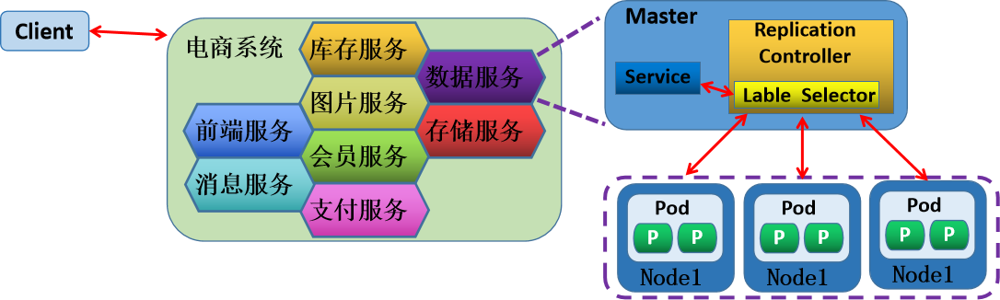

每个 Pod 都有一个专用的 IP 地址，加上 Pod 内部容器的 Port 端口，就组成了一个访问 Pod 专用的 EndPoint(Pod IP+Container Port)，从而实现了用户外部资源访问 Pod 内部应用的效果。

这个 EndPoint 资源在 master 端的 Controller 组件中，由 EndPoint Controller 来进行统一管理。

给 Service 分配一个全局唯一的虚拟 ip 地址--**cluster IP**，它不存在任何网络 设备上，Service 通过内部的 **标签选择器**，指定相应该 Service 的 Pod 资源，当请求发给 cluster IP，后端 的 Pod 资源收到请求后，就会响应请求。

每个 Service 都有一个全局唯一通信地址，整个系统的内部服务间调用就变成了最基础的 TCP/IP 网络通信问题。如果我们的集群内部的服务想要和外部的网络进行通信，可以有多种方法，比 如：

-   NodePort 类型，通过在所有节点上增加一个对外的端口，用于接入集群外部请求
-   ingress 类型，通过集群附加服务功能，将外部的域名流量转交到集群内部。

## Service 核心功能

-   服务发现: 利用标签选择器，在同一个 namespace 中筛选符合的条件的 Pod, 从面实现发现一组提供 了相同服务的 Pod
-   负载均衡: Service 作为流量入口和负载均衡器，其入口为 ClusterIP, 这组筛选出的 Pod 的 IP 地址，将 作为该 Service 的后端服务器
-   名称解析: 利用 Cluster DNS，为该组 Pod 所代表的服务提供一个名称, 在 DNS 中 对于每个 Service， 自动生成一个 A、PTR 和 SRV 记录

```shell
kubectl get svc -A
NAMESPACE     NAME             TYPE        CLUSTER-IP      EXTERNAL-IP   PORT(S)                  AGE
default       kubernetes       ClusterIP   10.96.0.1       <none>        443/TCP                  6d17h
kube-system   kube-dns         ClusterIP   10.96.0.10      <none>        53/UDP,53/TCP,9153/TCP   6d17h
kube-system   metrics-server   ClusterIP   10.103.184.67   <none>        443/TCP                  45h
# 使用 10.96.0.1 来访问 api-server
# 使用 10.96.0.10 来访问 dns，进行域名解析
# 因为在 k8s 中，core-dns 和 api-server 都是以容器方式存在，本身地址不固定，因此需要借助 service 进行访问
```

## Endpoints

当创建 Service 资源的时候，最重要的就是为 Service 指定能够提供服务的标签选择器

Service Controller 就会根据标签选择器会自动创建一个同名的 **Endpoint** 资源对象，Kubernetes 新版中还增加了 **endpointslices** 资源

-   Endpoint Controller 使用 Endpoint 的标签选择器(继承自 Service 标签选择器)，筛选符合条件(包括 符合标签选择器条件和处于 Ready 状态)的 pod 资源
-   Endpoint Controller 将符合要求的 pod 资源绑定到 Endpoint 上，并告知给 Service 资源谁可以正常提供服务
-   Service 会自动获取一个固定的 **cluster IP** 向外提供由 Endpoint 提供的服务资源
-   Service 其实就是为动态的一组 pod 资源对象提供一个固定的访问入口。即 Service 实现了后端 Pod 应用服务的发现功能

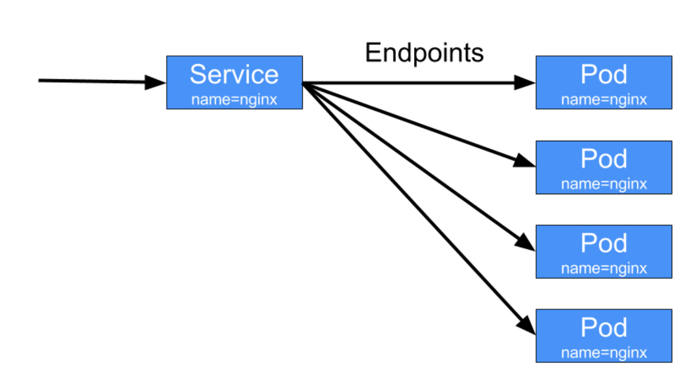

-   每创建一个 Service , 自动创建一个和之同名的 API 资源类型 Endpoints
-   Endpoints 负责维护由相关 Service 标签选择器匹配的 Pod 对象
-   Endpoints 对象上保存 Service 匹配到的所有 Pod 的 IP 和 Port 信息, 称之为端点
-   ETCD 是 K/V 数据库, 而一个 **Endpoints 对象对应一个 Key**, 所有 **后端 Pod 端点信息为其 Value**
-   当一个 Endpoints 对象对应后端每个 Pod 的每次变动，都需更新整个 Endpoints 对象，并将新的 Endpoints 对象重新保存至 API Server 和 ETCD
-   此外还需要将该对象同步至每个节点的 kube-proxy
-   **在 ETCD 中的对象默认最大为 1.5MB, 一个 Endpoints 对象至多可以存储 5000 个左右的端点信息, 这意 味着平均每端点占 300KB**

### EndpointSlice

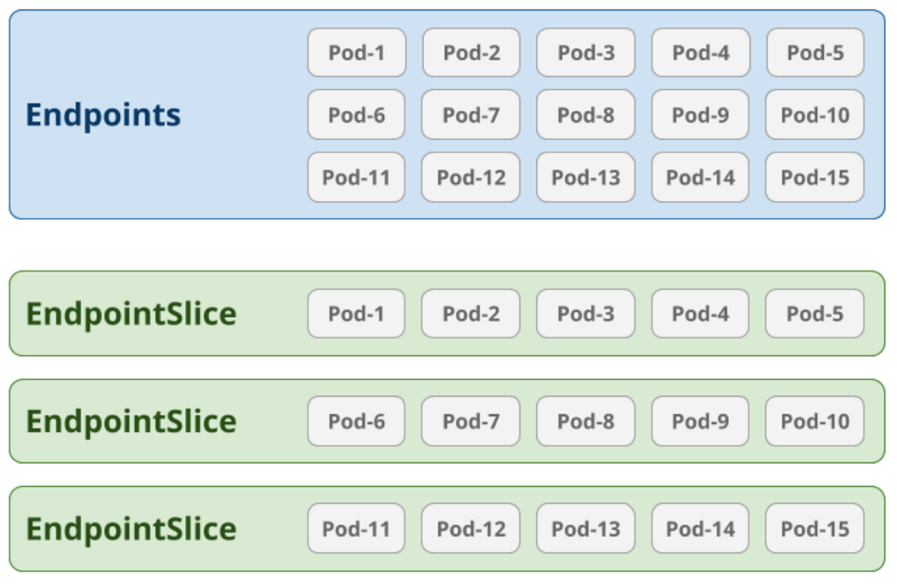

-   基于 Endpoints 机制，即便只有一个 Pod 的 IP 等信息发生变动，就需要向集群中的每个节点上的 kube-proxy 发送整个 endpoints 对象
-   比如: 一个由 2000 个节点组成的集群中，更新一个有 5000 个 Pod IP 占用 1.5MB 空间的 Endpoints 对 象，就需要发送 3GB 的数据
    -   若以滚动更新机制，一次只升级更新一个 Pod 的信息，这将导致更新这个 Endpoints 对象需要发送 15T 的数据
-   EndpointSlice 资源通过将 Endpoints 切分为多片来解决上述问题
-   自 Kubernetes v1.16 引入 EndpointSlice
-   每个端点信息的变动，仅需要更新和发送一个 **EndpontSlice 对象**, 而非整个 Endpoints 对象
-   每个 EndpointSlice 默认存储 100 个端点信息，不会超过 etcd 对单个对象的存储限制
-   可在 kube-controller-manager 程序上使用 **--max-endpoints-per-slice** 选项进行配置
-   EndpointSlice 并未取代 Endpoints，二者同时存在

```shell
kubectl get endpointslices -A
NAMESPACE     NAME                   ADDRESSTYPE   PORTS        ENDPOINTS                          AGE
default       kubernetes             IPv4          6443         10.0.0.101,10.0.0.102,10.0.0.103   6d17h
kube-system   kube-dns-bkfxp         IPv4          9153,53,53   10.244.4.12,10.244.4.13            6d17h
kube-system   metrics-server-xz55h   IPv4          10250        10.244.1.35                        45h

NAMESPACE     NAME             ENDPOINTS                                                  AGE
default       kubernetes       10.0.0.101:6443,10.0.0.102:6443,10.0.0.103:6443            6d17h
kube-system   kube-dns         10.244.4.12:53,10.244.4.13:53,10.244.4.12:53 + 3 more...   6d17h
kube-system   metrics-server   10.244.1.35:10250                                          45h
```

### 手动创建 endpoints

可以手动创建 endpoints，并将集群外资源加入 endpoints 的队列中，实现集群内的 pod 访问集群外资源的效果

手动创建一个 Endpoints 资源对象，直接把外部端点的 IP 地址，放入可用地址列表

```yaml
apiVersion: v1
kind: Endpoints

metadata:
  name: service-redis #和下面的service必须同名
  namespace: default
  subsets:
  - addresses:
    - ip: 10.0.0.101 #外部服务的FQDN或IP
    #- ip: 10.0.0.102 #可以有多个外部主机
    ports:
    - name: redis
      port: 6379
      protocol: TCP
      
---
apiVersion: v1
kind: Service
metadata:
  name: service-redis #和上面的endpoints必须同名
  namespace: default
spec: #注意：没有selector
  type: ClusterIP
  #clusterIP: "None" #可以指定为无头服务
  ports:
  - name: redis
    port: 6379
    protocol: TCP
    targetPort: 6379
```

## Service 访问过程

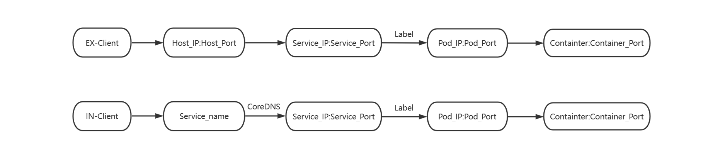

## Service 工作模型

### 代理模型

Service 对象最终体现为工作节点上的一些 **iptables 或 ipvs 规则**，这些规则是由 kube-proxy 进行实时生成和维护

**针对某一特定服务，如何将集群中的每个节点都变成其均衡器：**

-   在每个节点上运行一个 kube-proxy，由 kube-proxy 注册监视 API Server 的 Service 资源的创建、修 改和删除
-   将 Service 的定义，转为本地负载均衡功能的落地实现

**kube-proxy 将请求代理至相应端点的实现方式有四种：**

-   userspace（在 kubernetes v1.2 以后淘汰）
-   **iptables**： iptables 工具，默认模式
-   **ipvs**
-   nftables: 从 kubernetes-v1.29.0 之后版本支持, nft 工具
-   kernelspace: 仅 Windows 使用

这些方法的目的是：kube-proxy 如何确保 service 能在每个节点实现并正常工作

注意: 一个集群只能选择使用一种 Mode，即集群中所有节点要使用相同的方式

#### Userspace

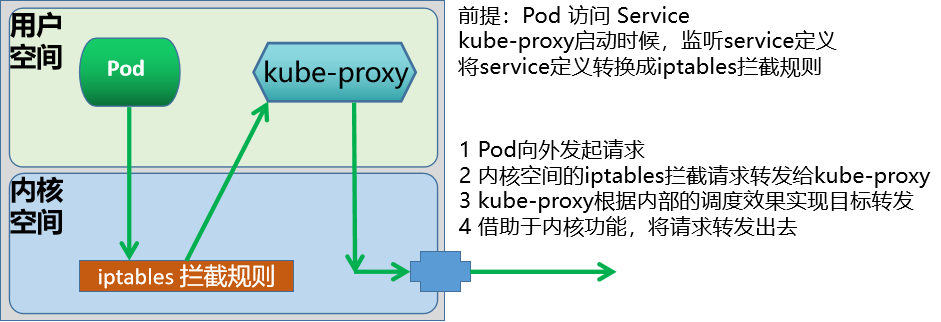

userspace 模式早由 Kube-proxy 自已来负责将 service 策略转换成 iptables 规则
这些 iptables 规则仅做请求的拦截，而不对请求进行调度处理。

*   Pod 向外的请求流量先到达内核空间后，经过 Iptables 的规则后，再由套接字送往用户空间的 kube-proxy
*   之后由 kube-proxy 将流量送回内核空间，并调度至后端 Pod。因为涉及到来回转发，效率低下


#### Iptables

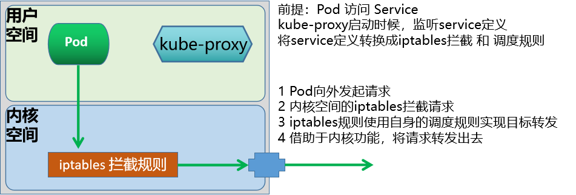

Kube-proxy 自动为 Service 创建 iptables 规则
将由 iptables 规则直接捕获 Pod 向外发往 ClusterIP 和 Port 的请求流量，并重定向至当前 Service 的后端
对每个 Endpoints 对象，Service 资源会为其创建 iptables 规则并关联至挑选的后端 Pod 资源
优点：性能比 userspace 更加高效和可靠

缺点：

*   不会在后端 Pod 无响应时自动重定向，而 userspace 可以
*   一个 service 一般对应生成 20 条左右 iptables 规则
*   中等规模的 Kubernetes 集群(几百个 service)能够承受，但是大规模的 Kubernetes 集群(几千个 service)可达几万条规则，性能较差
*   集群节点数少于 50 个, 服务数量少于 2000 个, 可以使用此模式, 否则使用 IPVS 模式性能更好
*   iptables 默认基于 random 算法调度
*   kube-proxy 在 iptables 模式下的复杂度程度为 **O(n)，即规模越大，性能越差**

#### IPVS

ipvs会在每个节点上创建一个名为kube-ipvs0的虚拟接口，并将集群所有Service对象的ClusterIP和ExternalIP都配置在该接口； 所以每增加一个ClusterIP 或者ExternalIP，就相当于为 kube-ipvs0 关联 了一个地址罢了。

kube-proxy为每个service生成一个虚拟服务器( IPVS Virtual Server)的定义。

**基本流程：**

-   当前节点接收到外部流量后，如果该数据包是交给当前节点上的clusterIP，则会直接将数据包交给 kube-ipvs0，而这个接口是内核虚拟出来的，而kube-proxy定义的VS直接关联到kube-ipvs0上。
-   如果是本地节点pod发送的请求，基本上属于本地通信，效率是非常高的。
-   默认情况下，这里的ipvs使用的是nat转发模型，而且支持更多的后端调度算法。仅仅在涉及到源地址转 换的场景中，会涉及到极少量的iptables规则(应该不会超过20条)
-   对于Kubernetes来说，默认情况下，支持的规则是 iptables，可以通过多种方式对代理模式进行更改， 因为这些规则都是**基于kube-proxy**来定制的，所以，如果要更改代理模式的话，就需要调整kube-proxy 的属性。

**注意：Kubernetes-v1.29版本后，不再使用iptables，而使用nftables framework，工具使用nft list ruleset 查看**

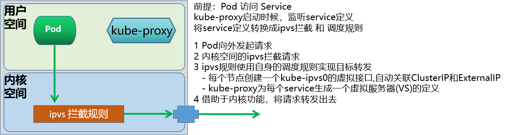

kubernetes v1.8 引入 ipvs 代理模块
kubernetes v1.9 ipvs 代理模块成为 beta 版本
kubernetes v1.11 ipvs 代理模式 GA，成为默认设置
请求流量的调度功能由 ipvs 实现，余下的其他功能仍由 iptables 完成
ipvs 流量转发速度快，规则同步性能好
IPVS 默认基于 rr 算法调度，同时也支持众多调度算法，如 rr/lc/dh/sh/sed/nq 等

优点：

*   每条 ipvs 规则包含了两个功能：转发功能和调度功能
*   kube-proxy 在 IPVS 模式下是使用 hash 表作为底层数据结构，**复杂度程度为 O(1)**，所以 **当服务很多时，性能更优**
*   据测试，当后端服务达到 5000 以上且不使用保持连接 keepalive 时的往返响应时间，和 iptables 模式性能相对已经有较大优势，当达到服务达到 10000 时，甚至可以达到 iptables 模式的性能两倍，
*   此外 iptables 模式的 CPU 也会消耗更多

对于 kubeadm 方式安装 Kubernetes 集群来说，它会首先检测当前主机上是否已经包含了 ipvs 模块，如果加载了，就直接用 ipvs 中 NAT 模式，如果没有加载 ipvs 模块的话，会自动使用 iptables 模式。

二进制 Kubernetes 的安装方式修改模式：

```shell
echo 'KUBE_PROXY_MODE=ipvs' >> /etc/sysconfig/kubelet

vim /var/lib/kube-proxy/kube-proxy-config.yaml
```

kubeadm 方式将默认的 iptables 模式修改为 IPVS 模式

**更改kube-proxy为IPVS模式方法说明**

```shell
#方法1： 在集群创建的时候，修改kubeadm-init.yml 添加如下配置，此方法是生产中推荐
kubeadm config print init-defaults > kubeadm-init.yaml

# 在文件最后面添加一下几行
---
apiVersion: kubeproxy.config.Kubernetes.io/v1alpha1
kind: KubeProxyConfiguration
featureGates:
  SupportIPVSProxyMode: true
mode: ipvs

# 在初始阶段可能修改的参数
apiVersion: kubeadm.k8s.io/v1beta3
kind: InitConfiguration
localAPIEndpoint:
  advertiseAddress: 192.168.0.100
  bindPort: 6443
nodeRegistration:
  criSocket: unix:///run/cri-dockerd.sock                  # 配置cri-dockerd插槽
  name: master1
  taints:
  - effect: NoSchedule
    key: node-role.kubernetes.io/control-plane

---
apiVersion: kubeadm.k8s.io/v1beta3
kind: ClusterConfiguration
kubernetesVersion: "v1.30.2"
controlPlaneEndpoint: "master1.mystical.org:6443"            # 修改控制平面域名
networking:
  podSubnet: "10.244.0.0/16"                                 # 修改集群网路配置，pod网络
  serviceSubnet: "10.96.0.0/12"                              # service网络
imageRepository: registry.aliyuncs.com/google_containers     # 修改镜像仓库（如使用国内镜像）
apiServer:
  extraArgs:
    authorization-mode: Node,RBAC


# 更改好配置文件后，执行命令初始化
kubeadm init --config=kubeadm-init.yaml --token-ttl --upload-certs

# 验证集群状态
mkdir -p $HOME/.kube
sudo cp -i /etc/kubernetes/admin.conf $HOME/.kube/config
sudo chown $(id -u):$(id -g) $HOME/.kube/config

# 看集群是否正常运行
kubectl get nodes
kubectl get pods -n kube-system
```

**临时修改一下configmap中proxy的基本属性，此方式在测试环境中推荐使用**

```shell
curl 127.0.0.1:10249/proxyMode
iptables

kubectl edit configmap kube-proxy -n kube-system
mode: "ipvs" #修改此行, 默认为 ""

# 重启pod
kubectl rollout restart daemonset -n kube-system kube-proxy 

# 重启方式2：删除原pod，使damonset自动重新创建
kubectl delete pod -n kube-system -l k8s-app=kube-proxy

curl 127.0.0.1:10249/proxyMode
ipvs

#每个节点都生成 kube-ipvs0 的虚拟网卡

#查看 ipvs 规则
apt install ipvsadm
ipvsadm -Ln
```

## Service 和 kube-proxy 关联关系

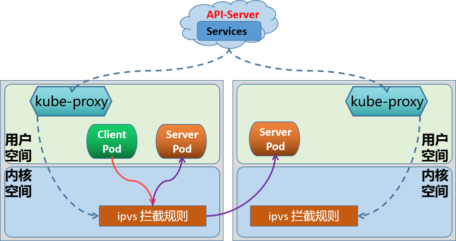

-   Service 作为一个独立的 API 资源对象，它会在 API Service 服务中定义出来的
-   在创建任何存在标签选择器的 Service 时，都会被自动创建一个同名的 Endpoints 资源，Endpoints 对象会使用 Label Selector 自动发现后端端点，并各端点的 IP 配置为可用地址列表的元素
-   Service Controller 触发每个节点上的 kube-proxy，由 kube-proxy 实时的转换为本地节点上面的 ipvs/iptables 规则。
-   默认情况下，内核中的 ipvs 或 iptables 规则，仅仅是负责本地节点用户空间 pod 客户端发出请求时 的拦截或者转发规则
-   如果 Pod 客户端向 Service 发出请求, 客户端向内核发出请求，根据 ipvs 或 iptables 规则，匹配目标 service
-   如果 service 匹配，会返回当前 service 随对应的后端 endpoint 有哪些
-   iptables 或 ipvs 会根据情况挑选一个合适的 endpoint 地址
    -   如果 endpoint 是本机上的，则会转发给本机的 endpoint
    -   如果 endpoint 是其他主机上的，则转发给其他主机上的 endpoint

## Service 类型

对于 Kubernetes 可以实现内部服务的自由通信, 也可以将平台内部的服务发布到外部环境

Service 主要有四种类型，实现不同的网络通信功能

-   ClusterIP
-   NodePort
-   LoadBalancer
-   ExternalName

| 类型         | 解析                                                         |
| ------------ | ------------------------------------------------------------ |
| ClusterIP    | 此为 Service 的默认类型 为 **集群内部的客户端访问**, 包括节点和 Pod 等，**外部网络无法访问** In client --> clusterIP: ServicePort (Service) --> PodIP: PodPort |
| NodePort     | 本质上 **在 ClusterIP 模式基础上, 再多加了一层端口映射的封装**, 相当于增强版的 ClusterIP 通过 NodeIP: NodePort 对外部网络提供服务，默认 **随机端口范围 30000~32767**, 可指定为固定端口 NodePort 是一个随机的端口，以防止端口冲突, 在 **所有安装 kube-proxy 的节点 上都会打开此相同的端口** 可通过访问 ClusterIP 实现集群内部访问, 也可以通过 NodeIP: NortPort 的方式实 现从集群外部至内部的访问 Ex Client --> NodeIP: NodePort (Service) --> PodIP: PodPort |
| LoadBalancer | 基于 NodePort 基础之上 **，使用集群外部的运营商负载均衡器方式实现对外提供** 服务, 增强版的 NodePort 基于云运营商 IaaS 云创建一个 Kubernetes 云，云平台也支持 LBaaS(Load Balance as a Service)产品服务 Master 借助 cloud-manager 向 LBaaS 的 API 请求动态创建软件 LB, 即支持和 Kubernetes API Server 进行交互 如果没有云服务, 将无法获取 EXTERNAL-IP, 显示 Pending 状态, 则降级为 NodePort 类型 Ex Client --> LB_IP: LB_PORT --> NodeIP: NodePort(Service)--> PodIP: PodPort |
| ExternalName | 当 Kubernetes 集群需要访问集群外部服务时，需要通过 externalName **将外部主机引入到集群内部** 外部主机名以 DNS 方式解析为一个 CNAME 记录给 Kubernetes 集群的其他主机来使用 **这种 Service 既没有 ClusterIP，也没有 NodePort.而且依赖于内部的 CoreDNS 功能** In client --> Cluster ServiceName --> CName --> External Service Name |

## External lP

如果有外部 IP 能够路由到一个或多个集群节点上，则 Kubernetes 可以通过 external IPs 将 Service 公开出去。

当网络流量进入集群时，如果 externalIPs 作为目的 IP 地址和端口都与该 Service 匹配， Kubernetes 所配置的规则和路由会确保流量被路由到该 Service 的端点之一。

Service 可通过使用节点上配置的辅助 IP 地址接入集群外部客户端流量

流量入口仅能是配置有该 IP 地址的节点，其它节点无效，因而此时在节点间无负载均衡的效果

external IP 所在的节点故障后，该流量入口失效，除非将该 IP 地址转移配置到其它节点

定义 Service 时，你可以为任何服务类型 externalIPs。

由于 externalIPs 是绑定在某一个节点上, 而此节点存在单点问题, 可以通过 Keepalived 等方式实现高可用


**高可用对外解决方案**

```
ExternalIP + VRRP Keepalived -----> Service -----> Pod
```

当前的 Kubernetes 集群，假如只有某个节点上绑定了一个对外的公网 ip，其他主机则没有，那么我们可以通过指定的此主机上的公网 ip 使用标准端口来接入外部流量。可以借助于 externalIPs 属性来为当前的 service 指定公网 ip 地址即可

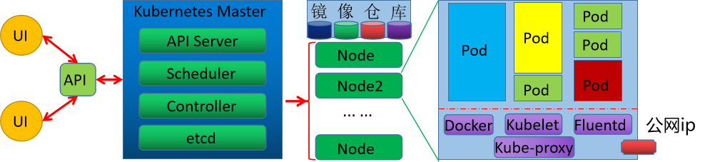

ExternalIP 实现

```yaml
apiVersion: v1
kind: Service
metadata:
  name: my-service
spec:
  selector:
    app.kubernetes.io/name: MyApp
  ports:
    - name: http
      protocol: TCP
      port: 80
      targetPort: 80
  externalIPs:
    - 10.0.0.88   
---
apiVersion: apps/v1
kind: Deployment
metadata:
  name: deployment-test
spec:
  replicas: 3
  selector:
    matchLabels:
      app: rs-test
  template:
    metadata:
      labels:
        app: rs-test
        app.kubernetes.io/name: MyApp
    spec:
      containers:
      - name: pod-test
        image: xx/pod-test:v0.1
        
    
kubectl get svc
NAME         TYPE        CLUSTER-IP       EXTERNAL-IP   PORT(S)   AGE
my-service   ClusterIP   10.108.156.228   10.0.0.88     80/TCP    60s

# 在其中一个节点上添加ip
ip a a 10.0.0.88 dev eth0:1

curl 10.0.0.88
```

# Service 管理

对于 Service 的创建有两种方法：

-   命令行方法
-   YAML 文件方法

```shell
创建命令 1：（单独创建一个 service 服务）
kubectl create service [flags] NAME [--tcp=port:targetPort] [--dry-run]

# flags 参数详解：
clusterip   Create a ClusterIP service.将集群专用服务接口
nodeport     创建一个 NodePort service.将集群内部服务以端口形式对外提供
loadbalancer 创建一个 LoadBalancer service.主要针对公有云服务
externalname Create an ExternalName service.将集群外部服务引入集群内部

# 创建命令 2：（针对一个已存在的 deployment、pod、ReplicaSet 等创建一个 service）
kubectl expose (-f FILENAME | TYPE NAME) [--port=port] [--protocol=TCP|UDP|SCTP] [--target-port=number-or-name] [--name=name] [--external-ip=external-ip-of-service] [--type=type] [options]

# 参数详解
--port=''            #设定 service 对外的端口信息
--target-port=''     #设定容器的端口, 默认和 service 的端口相同    
--type=''            #设定类型，支持四种：ClusterIP(默认), NodePort, LoadBalancer, ExternalName    
--cluster-ip=''      #设定对外的 ClusterIP 地址
--name=''            #创建 service 对外的 svc 名称

# 创建命令 3：（创建自主式 Pod 时动创建 Service）
kubectl run <Pod_name> --image 镜像 --expose --port <容器端口>

# 查看命令
kubectl get svc

# 删除 service
kubectl delete svc <svc_name> [ -n <namespace>[] [--all]
```

清单文件

```yaml
apiVersion: v1
kind: Service
metadata:
  name: ...
  namespace: ...
  labels:
    key1: value1
    key2: value2
spec:
  type: <string>                    # service类型，默认为ClusterIP
  selector: <map[string]string>     # 指定用于过滤出service所代理的后端pod的标签，指支持等值类型的标签选择器
  ports:                            # Service的端口对象列表
  - name: <string>                  # 端口名称，需要保证唯一性
    protocol: <string>              # 协议，目前仅支持TCP、UDP和SCTP，默认为TCP
    port: <integer>                 # Service端口号
    targetPort: <string>            # 后端Pod的端口号或名称，名称需由Pod中的规范定义
    nodePort: <integer>             # 节点端口号，仅使用NodePort和LoadBalancerl类型，范围：30000-32768，
                                    # 建议系统分配
  - name: <string>
    ...
  clusterIP: <string>               # 指定Service的集群IP，建议不指定而由系统分配
  internalTrafficPolicy: <string>   # 内部流量策略处理方式，Local表示由当前节点处理，Cluster表示向集群范围调度，
                                    # 默认Cluster
  externalTrafficPolicy: <string>   # 外部流量策略处理方式，默认为Cluster，当为Local时，表示由当前节点处理，性能好，
                                    # 但无负载均衡功能，且可以看到客户端真实IP，Cluster表示向集群范围调度，和Local相反，基于性能原因，生产更建议Local，
                                    # 此方式只支持type是NodePort和LoadBalancer类型或者ExternalIps
  loadBalancerIP: <string>          # 外部负载均衡器使用的IP地址，仅适用于LoadBalancer，此字段未来可能删除
  externalName: <string>            # 外部服务名称，该名称将作为Service的DNS CNAME值
  externalIPs: <[]string>           # 群集中的节点将接受此服务的流量的IP地址列表。这些IP不由Kubernetes管理。
                                    															# 用户负责确保流量到达具有此 IP 的节点。
                                    															# 常见的是不属于 Kubernetes 系统的外部负载均衡器，
                                    															# 注意：此IP和Type类型无关
```

**Deployment.Name 和 Service.Name 相同时会自动匹配的原理**

-   **Service 并不会直接匹配 Deployment 的 name**，它匹配的是 **Pod 的 labels**。
-   **`kubectl create deployment` 默认会给 Pod 加上 `app: <name>` 作为 label**。
-   **`kubectl create service` 也默认使用 `app: <name>` 作为 `selector`，从而实现“自动匹配”**。
-   **如果你 `kubectl create service` 时加 `--selector` 指定不同的 label，就不会匹配成功**。


# ClusterIP Service

## 单端口

```yaml
apiVersion: v1
kind: Service
metadata: 
  name: service-clusterip-test
spec:
  #type: ClusterIP            # 默认即为ClusterIP，此行可省略
  #clusterIP: 192.168.64.100  #可以手动指定IP，但一般都是系统自动指定而无需添加此行
  selector:
    app: myweb                # 引用上面deployment的名称，同时也是Pod的Lable中的app值
  ports:
  - name: http
    protocol: TCP
    port: 80
    targetPort: 80            # 可指定clusterIP的端口，不指定则使用一样的端口
---
apiVersion: apps/v1
kind: Deployment
metadata:
  name: myweb
spec:
  replicas: 3
  selector: 
    matchLabels:
      app: myweb
  template:
    metadata:
      labels:
        app: myweb
    spec:
      containers:
      - name: pod-test
        image: harbor.l00n9.icu/public/pod-test:v0.1 
```

```shell
kubectl get svc
NAME                     TYPE        CLUSTER-IP     EXTERNAL-IP   PORT(S)   AGE
kubernetes               ClusterIP   10.96.0.1      <none>        443/TCP   6d20h
service-clusterip-test   ClusterIP   10.108.24.52   <none>        80/TCP    11s

kubectl get ep
NAME                     ENDPOINTS                                         AGE
kubernetes               10.0.0.101:6443,10.0.0.102:6443,10.0.0.103:6443   6d20h
service-clusterip-test   10.244.1.36:80,10.244.2.47:80,10.244.3.24:80      18s

curl 10.108.24.52
kubernetes pod-test v0.1!! ClientIP: 10.244.0.0, ServerName: myweb-696f489449-bgpvj, ServerIP: 10.244.2.47!
```

## 多端口实现

```yaml
apiVersion: v1
kind: Service
metadata: 
  name: service-clusterip-test
spec:
  #type: ClusterIP            # 默认即为ClusterIP，此行可省略
  #clusterIP: 192.168.64.100  #可以手动指定IP，但一般都是系统自动指定而无需添加此行
  selector:
    app: myweb                # 引用上面deployment的名称，同时也是Pod的Lable中的app值
  ports:
  - name: http
    protocol: TCP
    port: 80
    targetPort: 80
  - name: https
    protocol: TCP
    port: 443
#关键点：只能有一个ports属性，多了会覆盖,每一个子port必须有一个name属性,由于service是基于标签的方式来管理pod的，所以必须有标签选择器 

---
apiVersion: apps/v1
kind: Deployment
metadata:
  name: myweb
spec:
  replicas: 3
  selector: 
    matchLabels:
      app: myweb
  template:
    metadata:
      labels:
        app: myweb
    spec:
      containers:
      - name: pod-test
        image: harbor.l00n9.icu/public/pod-test:v0.1 
```

# NodePort Service

NodePort 会在所有节点主机上，向外暴露一个指定或者随机的端口，供集群外部的应用能够访问

注意：nodePort 属性范围为 30000-32767，且 type 类型只支持 NodePort 或 LoadBalancer

**注意: 此方式有安全风险，端口为非标端口, 而且性能一般, 生产一般较少使用**

**生产中建议使用 Ingress 方式向外暴露集群内的服务**

## **externaltrafficpolicy 的两种策略**

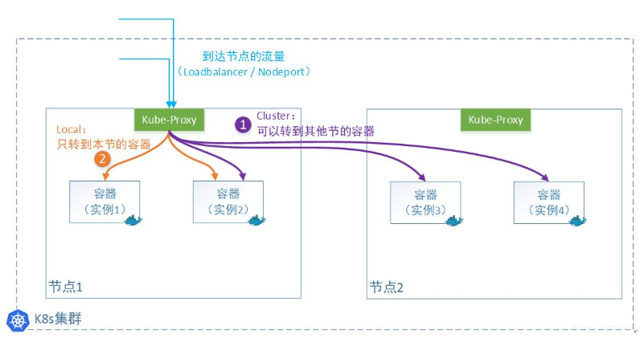

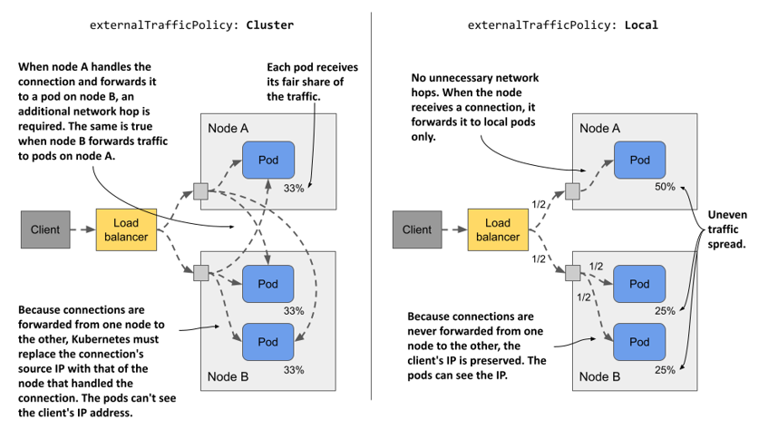

### Cluster 模式

-   此为默认模式
-   集群外的请求报文从某节点的 NodePort 进入，该节点的 Service 可以将请求流量调度到其他节点上的 Pod，无需关心 Pod 在哪个节点上
-   **Kube-proxy 转发外部请求时会替换掉报文的源 IP 和目标 IP**, 相当于 **FULLNAT**
-   返回时需要从原路返回, 可能会产生跨节点的跃点转发流量
-   此模式 **负载均衡效果好**，因为无论容器实例怎么分布在多个节点上，它都会转发过去。
-   但是 **由于多了一次转发，性能会损失**
-   **如果是 NodePort 类型, Pod 无法获取外部客户端真实客户端 IP**

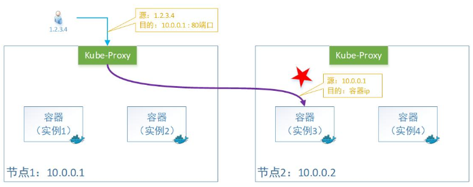

### Local 模式

-   集群外的请求报文从某节点的 NodePort 进入, 该节点的 Service 只会将请求流量调度到当前节点上 的 Pod
-   **外部请求流量只发给本机的 Pod**, Kube-proxy 转发时 **只会替换掉报文的目标 IP**, 即只实现 **DNAT**
-   即：容器收到的报文，看到源 IP 地址还是用户的原有 IP
-   此模式的负载均衡效果不是很好，因为一旦容器实例分布在多个节点上，它只转发给本机，不产生 跨节点的跃点转发流量。
-   但是少了一次转发，**性能会相对好**
-   由于本机不会跨节点转发报文，所以要 **想对所有节点上的容器实现负载均衡，就需要借助外部的 Loadbalancer 来实现**
-   **因此使用 Local 模式, 一般会使用 LoadBalancer Service 类型结合 Loadbalancer 实现**

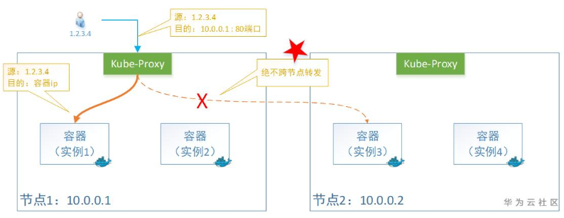

## nodePort 实现

```yaml
apiVersion: v1
kind: Service
metadata:
  name: service-nodeport
spec:
  type: NodePort
  #externalTrafficPolicy: Local # 默认值为Cluster,如果是Local只能被当前运行Pod的节点处理流量，并且可以获取客户端真实IP
  selector:
    app: myweb
  ports:
  - name: http
    protocol: TCP
    port: 80
    targetPort: 80
    nodePort: 30066   # 指定固定端口(30000-32767)，使用NodePort类型且不指定nodeport，会自动分配随机端口向外暴露
    
---
apiVersion: apps/v1
kind: Deployment
metadata:
  name: myweb
spec:
  replicas: 3
  selector: 
    matchLabels:
      app: myweb
  template:
    metadata:
      labels:
        app: myweb
    spec:
      containers:
      - name: pod-test
        image: harbor.l00n9.icu/public/pod-test:v0.1 
```

# LoadBalancer Service

只有 Kubernetes 集群是部署在一个 LBaaS 平台上且指供有一个集群外部的 LB 才适合使用 LoadBalancer
一般的公有云都提供了此功能, 但可能会有费用产生

如果在一个非公用云的普通的 Kubernetes 集群上，创建了一个 LoadBalancer 类型的 Service，一般情况默认环境中是没有 LBaaS 的，所以会导致由于找不到指定的服务，状态会一直处于 **Pending 状态**

如果在私有云环境中使用 LoadBalancer Service，可以使用云原生的开源项目实现负载均衡器，比如 **OpenELB, MetalLB** 实现

Loadbalancer 可以获取用户访问的 Service 对应的 Pod 在哪个节点上, 因此支持 externaltrafficpolicy 为 Local 模式的流量转发

## OpenELB 实现 LBaaS 服务

### 理论

OpenELB 项目最初由国内青云的 KubeSphere 社区发起，目前已作为 CNCF 沙箱项目加入 CNCF 基金 会，由 OpenELB 开源社区维护与支持。

官网:

```shell
https://openelb.io/
https://github.com/openelb/openelb
```

OpenELB 也拥有两种主要工作模式：**Layer2** 模式和 **BGP** 模式。OpenELB 的 BGP 模式目前暂不支持 IPv6。

因为 OpenELB 是针对裸金属服务器设计的，因此如果是在云环境中部署，需要注意是否满足条件。

核心功能

-   BGP 模式和二层网络模式下的负载均衡
-   ECMP 路由和负载均衡
-   IP 地址池管理
-   基于 CRD 来管理 BGP 配置

**注意: 此应用可能不支持 Openstack 等云环境**

### 部署和使用 OpenELB

```yaml
wget https://raw.githubusercontent.com/openelb/openelb/master/deploy/openelb.yaml

kubectl apply -f openelb.yaml 

# 查看创建的CRD自定义资源类型
kubectl get crd

# 确认openelb-manager Pod已经处于Running状态，且容器已经Ready
kubectl get pods -n openelb-system 

#创建了一个Eip资源对象，它提供了一个地址池给LoadBalancer Service使用
vim service-loadbalancer-eip-pool.yaml
apiVersion: network.kubesphere.io/v1alpha2
kind: Eip
metadata:
  name: eip-pool
  annotations:
    eip.openelb.kubesphere.io/is-default-eip: "true" 
    #指定当前EIP作为向LoadBalancer Server分片地>址时使用的默认的eip对象
spec:
  address: 10.0.0.10-10.0.0.50 #指定排除主机节点之外的地址范围，可以使用单个IP或者带有掩码长度的>网络地址
  protocol: layer2 #指定OpenELB模式，支持bgp,layer2和vip三种，默认bgp
  interface: eth0 #OpenELB侦听ARP或NDP请求时使用的网络接口名称，仅layer2模式下有效
  disable: false
  
kubectl apply -f service-loadbalancer-eip-pool.yaml 

# 查看结果
kubectl get eip
NAME       CIDR                  USAGE   TOTAL
eip-pool   10.0.0.10-10.0.0.50           41
```

```yaml
vim service-loadbalancer-lbaas.yaml
apiVersion: v1
kind: Service
metadata:
  name: service-loadbalancer-lbaas
spec:
  type: LoadBalancer
  externalTrafficPolicy: Local
  selector:
    app: myapp
  ports:
  - name: http
    protocol: TCP
    port: 80
    targetPort: 80
```

## metalLB 实现 LBaaS 服务

### 理论

```shell
https://github.com/metallb/metallb
https://metallb.universe.tf/
```

MetalLB 是由 Google 开源提供

MetalLB 功能实现依赖于两种机制

-   Address Allocation 地址分配：基于用户配置的地址池，为用户创建的 LoadBalancer 分配 IP 地址, 并配置在节点上
-   External Announcement 对外公告：让集群外部的网络了解新分配的 P 地址，MetalLB 使用 ARP、 NDP 或 BGP 实现

MetallB 可配置为在二层模式或 BGP 模式下运行

-   二层模式(ARP/NDP)
    -   LoadBalancer IP 地址配置在某一个节点上，并使用 ARP(IPv4)或 NDP(IPv6)对外公告
    -   拥有 LoadBalancer IP 地址的节点将成为 Service 流量的惟一入口，并在节点故障时自动进行故障转 移
    -   **并未真正实现负载均衡，存在性能瓶颈，且故障转移存在秒级的延迟**
-   BGP 模式
    -   集群中的所有节点与本地网络中的 BGP Router 建立 BGP 对等会话，通告 LoadBalancer IP，从而告知 Router 如何进行流量路由
    -   **可以实现跨多个节点的真正意义上的负载均衡**

**注意: 此应用可能不支持 Openstack 等云环境**

###  实现

```shell
wget https://raw.githubusercontent.com/metallb/metallb/v0.14.9/config/manifests/metallb-native.yaml

kubectl apply -f metallb-native.yaml

kubectl get crd
NAME                           CREATED AT
bfdprofiles.metallb.io         2025-03-27T07:49:09Z
bgpadvertisements.metallb.io   2025-03-27T07:49:09Z
bgppeers.metallb.io            2025-03-27T07:49:09Z
communities.metallb.io         2025-03-27T07:49:09Z
ipaddresspools.metallb.io      2025-03-27T07:49:09Z
l2advertisements.metallb.io    2025-03-27T07:49:09Z
servicel2statuses.metallb.io   2025-03-27T07:49:09Z
```

IP地址池

``` yaml
vim service-metallb-IPAddressPool.yaml
apiVersion: metallb.io/v1beta1
kind: IPAddressPool
metadata:
  name: localip-pool
  namespace: metallb-system
spec:
  addresses:
  - 10.0.0.10-10.0.0.50
  autoAssign: true
  avoidBuggyIPs: true
  
kubectl apply -f service-metallb-IPAddressPool.yaml
```

二层公告机制

``` yaml
vim service-metallb-L2Advertisement.yaml
apiVersion: metallb.io/v1beta1
kind: L2Advertisement
metadata:
  name: localip-pool-l2a
  namespace: metallb-system
spec:
  ipAddressPools:
  - localip-pool
  interfaces:
  - eth0 # 用于发送免费 ARP 公告
  
kubectl apply -f service-metallb-L2Advertisement.yaml
```

``` yaml
vim service-loadbalancer-lbaas.yaml
apiVersion: v1
kind: Service
metadata:
  name: service-loadbalancer-lbaas
spec:
  type: LoadBalancer
  externalTrafficPolicy: Local
  selector:
    app: myweb
  ports:
  - name: http
    protocol: TCP
    port: 80
    targetPort: 80
    
---
apiVersion: apps/v1
kind: Deployment
metadata:
  name: myweb
spec:
  replicas: 3
  selector: 
    matchLabels:
      app: myweb
  template:
    metadata:
      labels:
        app: myweb
    spec:
      containers:
      - name: pod-test
        image: harbor.l00n9.icu/public/pod-test:v0.1 
        
kubectl get svc
NAME                         TYPE           CLUSTER-IP       EXTERNAL-IP   PORT(S)        AGE
service-loadbalancer-lbaas   LoadBalancer   10.104.156.222   10.0.0.10     80:31377/TCP   9s
```

## 实际生产环境

-   通常使用公有云提供的LBaaS，而不是这种开源的负载均衡器
-   更多的是使用ingress进行对外暴露

# ExternalName Service

Service 不仅可以实现Kubernetes集群内Pod应用之间的相互访问以及从集群外部访问集群中的Pod

还可以支持做为外部服务的代理实现集群中Pod访问集群外的服务

``` shell
Pod --> Service_name --> External Name --> 外部 DNS --> 外部服务 IP
```

**Service代理Kubernetes外部应用的使用场景**

-   在生产环境中Pod 希望使用某个固定的名称而非IP地址进行访问集群外部的服务
-   使用Service指向另一个Namespace中或其它Kubernetes集群中的服务
-   某个项目正在迁移至Kubernetes集群，但是一部分服务仍然在集群外部，此时可以使用service代理至k8s集群外部的服务

**使用ExternalName Service实现代理外部服务**

``` yaml
vim service-externalname-web.yaml
apiVersion: v1
kind: Service
metadata:
  name: svc-externalname-web
  namespace: default
spec:
  type: ExternalName
  externalName: www.l00n9.icu
  ports:
  - protocol: TCP
    port: 443
    targetPort: 443
    nodePort: 0
  
# service 没有 Cluster-IP, 即为无头服务 Headless Service
kubectl get svc
NAME                         TYPE           CLUSTER-IP       EXTERNAL-IP     PORT(S)        AGE
svc-externalname-web         ExternalName   <none>           www.l00n9.icu   443/TCP        6s
```

**创建一个测试pod，解析域名**

``` shell
kubectl run pod-$RANDOM --image = registry.cn-beijing.aliyuncs.com/wangxiaochun/admin-box: v0.1 -it --rm --command -- /bin/bash
root@pod-21909 /# host svc-externalname-web
svc-externalname-web.default.svc.cluster.local is an alias for www.l00n9.icu.
www.l00n9.icu has address 104.21.80.1
www.l00n9.icu has address 104.21.64.1
www.l00n9.icu has address 104.21.96.1
www.l00n9.icu has address 104.21.48.1
www.l00n9.icu has address 104.21.32.1
www.l00n9.icu has address 104.21.16.1
www.l00n9.icu has address 104.21.112.1
www.l00n9.icu has IPv6 address 2606:4700:3030::6815:7001
www.l00n9.icu has IPv6 address 2606:4700:3030::6815:3001
www.l00n9.icu has IPv6 address 2606:4700:3030::6815:6001
www.l00n9.icu has IPv6 address 2606:4700:3030::6815:1001
www.l00n9.icu has IPv6 address 2606:4700:3030::6815:4001
www.l00n9.icu has IPv6 address 2606:4700:3030::6815:5001
www.l00n9.icu has IPv6 address 2606:4700:3030::6815:2001

root@pod-28618 /# curl svc-externalname-web -H 'host: www.l00n9.icu' -L
```

此时默认行为是向 `http://svc-externalname-web/` 发起请求，**即便它最终跳转到了 `www.l00n9.icu`，请求头的 Host 依旧是 `svc-externalname-web`**，导致服务端识别不了这个 Host，拒绝访问。

FQDN为 `service的名字.命名空间.svc.cluster.local.`

# 会话粘滞

kubernetes的Service默认是按照轮询机制进行转发至后端的多个pod

如果用户请求有一定的会话要求，即希望同一个客户每次总是能访问同一个pod的时候，可以使用 service的**affinity机制**来实现

它能将同一个客户端的请求始终转发至同一个后端Pod对象，它是由**kube-proxy的ipvs机制**来实现的。

默认情况下，service所提供的会话粘性效果默认在**10800s(3小时)**后会重新调度,而且仅能基于客户端IP 进行识别，调度粒度较粗

## 属性解析

``` shell
# 属性信息
service.spec.sessionAffinity  # 定义粘性会话的类型，可为 None 和 ClientIP, 默认值为 None 即不开启会话沾滞
service.spec.sessionAffinityConfig.clinetIP.timeoutSeconds # 配置会话保持时长，默认 10800s，范围 1-86400

# 配置格式
  sessionAffinity: ClientIP
  sessionAffinityConfig:
    clientIP:
      timeoutSeconds: 10800
```

## 实现

``` yaml
vim service-session.yaml
apiVersion: v1
kind: Service
metadata:
  name: service-session
spec:
  type: LoadBalancer
  ports:
  - port: 80
  selector:
    app: myweb
  sessionAffinity: ClientIP
  sessionAffinityConfig:
    clientIP:
      timeoutSeconds: 5 # 默认值为 10800，即 3 小时
      
---
apiVersion: apps/v1
kind: Deployment
metadata:
  name: myweb
spec:
  replicas: 3
  selector: 
    matchLabels:
      app: myweb
  template:
    metadata:
      labels:
        app: myweb
    spec:
      containers:
      - name: pod-test
        image: harbor.l00n9.icu/public/pod-test:v0.1 
```

# 综合案例：Wordpress

```yaml
vim wordpress-mysql.yaml
apiVersion: v1
kind: Namespace
metadata:
  name: demo
---
apiVersion: v1
kind: Service
metadata:
  name: wordpress
  namespace: demo
spec:
  type: LoadBalancer
  externalTrafficPolicy: Local
  selector:
    app: wordpress
  ports:
  - name: http
    protocol: TCP
    port: 80
    targetPort: 80
---
apiVersion: apps/v1
kind: Deployment
metadata:
  name: wordpress
  namespace: demo
spec:
  replicas: 1
  selector:
    matchLabels:
      app: wordpress
  template:
    metadata:
      labels:
        app: wordpress
    spec:
      containers:
      - image: registry.cn-beijing.aliyuncs.com/wangxiaochun/wordpress:php8.2-apache
        name: wordpress
        env:
        - name: WORDPRESS_DB_HOST
          value: mysql.demo.svc.cluster.local. 
        - name: WORDPRESS_DB_USER
          value: wordpress
        - name: WORDPRESS_DB_PASSWORD
          value: "123456"
        - name: WORDPRESS_DB_NAME
          value: wordpress
---
apiVersion: v1
kind: Service
metadata:
  name: mysql
  namespace: demo
spec:
  ports:
  - port: 3306
    protocol: TCP
    targetPort: 3306
  selector:
    app: mysql

---
apiVersion: apps/v1
kind: Deployment
metadata:
  name: mysql
  namespace: demo
spec:
  replicas: 1
  selector:
    matchLabels:
      app: mysql
  template:
    metadata:
      labels:
        app: mysql
    spec:
      containers:
      - image: registry.cn-beijing.aliyuncs.com/wangxiaochun/mysql:8.0.29-oracle
        name: mysql
        env:
        - name: MYSQL_ROOT_PASSWORD
          value: "123456"
        - name: MYSQL_DATABASE
          value: "wordpress"
        - name: MYSQL_USER
          value: wordpress
        - name: MYSQL_PASSWORD
          value: "123456"
```

