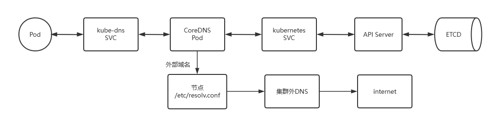
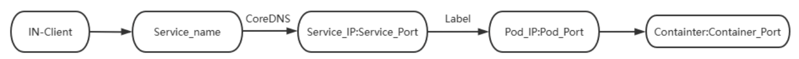

# Kubernetes域名解析

## 服务发现机制

在传统的系统部署中，服务运行在一个固定的已知的 IP 和端口上，如果一个服务需要调用另外一个服 务，可以通过地址直接调用

在Kubernetes 集群中，基于clusterip地址来访问每service是很不方便的

虽然通过配置DNS可以实现名称解析来访问，但是在Kubernetes集群中，服务实例的启动和销毁是很频 繁的，服务地址在动态的变化，所以传统的方式配置DNS解析记录就很不友好了。

将请求发送到动态变化的服务实例上，可以通过以下两个步骤来实现：

-   **服务注册** — 创建服务实例后，主动将当前服务实例的信息，存储到一个集中式的服务管理中心。
-   **服务发现** — 当A服务需要找未知的B服务时，先去服务管理中心查找B服务地址，然后根据该地址找到B服务

**Kubernetes主要有两种服务发现机制：**

-   环境变量
-   DNS解析

## 环境变量

对于环境变量来说，它主要有两种实现方式

### Kubernetes Service环境变量

-   Kubernetes为每个Service资源生成包括以下形式的环境变量在内一系列环境变量
-   在同一名称空间中后续创建的Pod对象都会自动拥有这些变量
-   注意：此方式不支持Service的动态变化，即在创建Pod对象以后，Service的变化不会生成相关的 环境变量，生产此方式不太常见
-   Service相关环境变量形式如下

```shell
{SVCNAME}_SERVICE_HOST {SVCNAME}_PORT

# 比如：default名称空间创建名为test的Service，default名称空间下的每个Pod内部会被自动注入 和service相关的变量
TEST_SERVICE_HOST=ClusterIP
TEST_PORT=tcp://ClusterIP:80
```

**注意：如果先创建Pod，然后关联到Service是不生效的**

**一定要先创建Service，在创建Service下的pod资源类型或者deploy等，才会看到环境变量**

在容器内部，可以直接使用变量名来进行服务的访问

### Docker Link形式的环境变量

Docker使用--link选项实现容器连接时所设置的环境变量形式

在创建Pod对象时，kubernetes也会把与此形式兼容的一系列环境变量注入到Pod对象中。

由于Kubernetes v1.24版本禁用dockershim，所以后续的Kubernetes环境中，可能不再支持这种方式。

## CoreDNS


专用于kubernetes集群中的服务注册和发现的解决方案就是KubeDNS。

kubeDNS自从Kubernetes诞生以来，其方案的具体实现方案前后经历了三代，分别是 SkyDNS、 KubeDNS、CoreDNS。

Kubernetes-v1.3之前使用SkyDNS, 之后到Kubernetes-v1.13之前使用KubeDNS,当前默认使用 **CoreDNS**

CoreDNS 是一个DNS服务器。Go实现，由于其灵活性，它可以在多种环境中使用。

CoreDNS 是一个云原生计算基金会毕业的项目。CoreDNS通过 Kubernetes 插件与 Kubernetes 集 成，或者通过etcd插件与etcd 集成,实现服务发现

https://coredns.io/
https://github.com/coredns/coredns

### CoreDNS解析流程

CoreDNS 通过访问名为 kubernetes 的 Service,找到 API Server 进而连接到 ETCD, 从而实现 Kubernetess集群中Service,Endpoint,Pod 等资源的查找



*   Pod **查询自身的/etc/resolv.conf** 指向的DNS服务器地址,此地址为kube-dns service的地址, 即将解析请求转发给名为 kube-dns的 service

```shell
kubectl get svc kube-dns -n kube-system 
NAME       TYPE        CLUSTER-IP   EXTERNAL-IP   PORT(S)                  AGE
kube-dns   ClusterIP   10.96.0.10   <none>        53/UDP,53/TCP,9153/TCP   6d23h

kubectl exec myweb-696f489449-5nddp -it -- sh
[root@myweb-696f489449-5nddp /]# cat /etc/resolv.conf
nameserver 10.96.0.10 # COREDNS的svc的CLUSTER-IP地址
```

*   kube-dns service会将请求转发到后端CoreDNS Pod,为了DNS的高可用,通常有两个CoreDNS Pod, 并位于kube-system名称空间

```shell
kubectl get ep kube-dns -n kube-system 
NAME       ENDPOINTS                                                  AGE
kube-dns   10.244.4.12:53,10.244.4.13:53,10.244.4.12:53 + 3 more...   6d23h
```

*   Coredns Pod 根据Corefile的配置会连接到在default名称空间的名为kubernetes的service,而 kubernetes service对应的Endpoints为所有kube-apiserver:6443的地址

```
kubectl get svc kubernetes 
NAME         TYPE        CLUSTER-IP   EXTERNAL-IP   PORT(S)   AGE
kubernetes   ClusterIP   10.96.0.1    <none>        443/TCP   6d23h

kubectl get ep kubernetes 
NAME         ENDPOINTS                                         AGE
kubernetes   10.0.0.101:6443,10.0.0.102:6443,10.0.0.103:6443   6d23h
```

-   kubernetes service 监视service IP的变动，维护DNS解析记录,并将变化发送至ETCD实现DNS记录 的存储
-   CoreDNS 从 etcd 或 API Server 获取最新记录，提供域名解析
-   如果查询的是外部域名，**CoreDNS无法解析，就转发给指定的域名服务器**，**一般是节点 上/etc/resolv.conf中的服务器解析**

```shell
# 要使其生效，需要在更改coredns所在节点上的dns后，更新corednsPod
kubectl rollout restart deployment -n kube-system coredns 
```


### Service IP 变动 → DNS 更新的完整流程

1.   **用户创建或修改 Service**：

```shell
kubectl apply -f service.yaml
```

2.   **API Server 处理请求**，将 Service 对象写入 etcd。

3.   **CoreDNS** 通过调用 Kubernetes API 或 `watch` 机制监听 `Service` / `Endpoints` 资源变化。

4.   一旦 Service 的 `ClusterIP` 或 `Endpoints` 变化，CoreDNS 自动更新它的内存域名映射表。

5.   当集群内部某个 Pod 进行 DNS 查询（如 `svc.namespace.svc.cluster.local`），CoreDNS 根据最新状态响应 IP 地址。

Kubernetes 通过 API Server 将 Service 的 IP 变化写入 etcd，同时 CoreDNS 监听这些变化，并自动更新集群内部 DNS 记录，从而保障 DNS 解析始终指向最新的 Service IP 或其对应的后端 Pod 地址。

### CoreDNS域名解析

Cluster DNS（CoreDNS）是Kubernetes集群的必备附件，负责为Kubernetes提供名称解析和服务发现

每个Service资源对象，在**CoreDNS上都会自动生成如下格式的名称，结合该名称会生成对应的一些不同 类型的DNS资源记录**



```shell
<service>.<ns>.svc.<zone>

<service>： #当前Service对象的名称
<ns>：      #当前Service对象所属的名称空间
<zone>：    #当前Kubernetes集群使用的域名后缀，默认为“cluster.local”pass

# kubeadm安装方式时查看默认Zone名称
kubeadm config print init-defaults |grep dns
dns: {}
  dnsDomain: cluster.local
```

**CoreDNS会持续监视API Server上的Service资源对象的变动，并实时反映到相关的DNS资源记录中**

Pod中各容器内部默认会在其 /etc/resolv.conf中，将nameserver指向CoreDNS相关的Service的 ClusterIP，默认为service网段的第10个IP，比如：10.96.0.10，其后面的Endpoint是coredns对应的 Pod的IP，此配置由kubelet创建Pod时根据指定的配置自动注入

```shell
kubectl exec myweb-5d78b4dcbd-6rgv4 -- cat /etc/resolv.conf
nameserver 10.96.0.10
search default.svc.cluster.local svc.cluster.local cluster.local
options ndots:5

# 上述search参数中指定的DNS各搜索域，是以次序指定的几个域名后缀，它们各自的如下所示。
# <ns>.svc.<zone>：附带有特定名称空间的域名，例如default.svc.cluster.local
# svc.<zone>：附带了Kubernetes标识Service专用子域svc的域名，例如svc.cluster.local；
# <zone>：集群本地域名，例如cluster.local。
# ndots:5，表示如果手工查询时候给的域名包含的点“.”不超过5个，那么进行DNS查找时将使用非完全限定名称，
# 即用search指定的域名补全
# 即 <手工输入域名> 或者 <手工输入域名>.<search 部分给定的域名后缀>
# 如果你查询的域名包含点数大于等于5，那么DNS查询，默认会使用绝对域名进行查询。即 <手工输入域名>
```

### Service 资源对应的DNS资源记录

基于DNS的服务发现，对于每个Service对象，都会具有以下3个类型的DNS资源记录**A/AAAA**，**PTR**和 **SRV**

-   根据ClusterIP的地址类型，为IPv4生成固定格式的 A记录，为IPv6生成AAAA记录

```shell
<service>.<ns>.svc.<zone>. <ttl> IN A <cluster-ip>
<service>.<ns>.svc.<zone>. <ttl> IN AAAA <cluster-ip>

#注意：cluster.local 是默认zone名称，在初始化Kubernetes集群中，自己通过dnsDomain属性定制的。
```

-   对于每个给定的A记录或AAAA记录都要生成PTR记录，格式如下所示

```shell
<d>.<c>.<b>.<a>.in-addr.arpa. <ttl> IN PTR <service>.<ns>.svc.<zone>.

h4.h3.h2.h1.g4.g3.g2.g1.f4.f3.f2.f1.e4.e3.e2.e1.d4.d3.d2.d1.c4.c3.c2.c1.b4.b3.b2.b1.a4.a3.a2.a1.ip6.arpa <ttl> IN PTR <service>.<ns>.svc.<zone>.
```

-   为每个定义了名称的端口生成一个SRV记录，未命名的端口号则不具有该记录

```shell
_<port_name>._<proto>.<service>.<ns>.svc.<zone>. <ttl> IN SRV <weight> <priority> <port-number> <service>.<ns>.svc.<zone>.
```


```shell
# A记录：
service-test.default.svc.cluster.local. 30 IN A 10.97.72.1；

# PTR记录：
1.72.97.10.in-addr.arpa. 30 IN PTR service-test.default.svc.cluster.local.

# SRV记录：
_http._tcp.service-test.default.svc.cluster.local. 30 IN SRV 0 100 80 service-test.default.svc.cluster.local.
```

### Pod的DNS解析策略和配置

Kubernetes支持在单个Pod资源规范上自定义DNS解析策略和配置，并组合生效

-   pod.spec.dnsPolicy：解析策略
    -   **Default**：从运行在的节点/etc/resolv.conf继承DNS名称解析相关的配置
    -   **ClusterFirst**：**此为默认值**，优先使用集群内DNS服务上解析集群域内的名称，其他域名的解析则 交由从节点/etc/resolv.conf继承的名称服务器 即使用Default策略
    -   **ClusterFirstWithHostNet**：专用于在设置了hostNetwork（使用宿主机的网络）的Pod对象上并不会使用节点网络的DNS，仍然使用的ClusterFirst策略
    -   **None**：用于忽略Kubernetes集群的默认设定，而仅使用由dnsConfig自定义的配置
-   pod.spec.dnsConfig：名称解析机制
    -   **nameservers <[]string>**：DNS名称服务器列表，附加于由dnsPolicy生成的DNS名称服务器之后
    -   **searches <[]string>**：DNS名称解析时的搜索域，附加由于dnsPolicy生成的搜索域之后
    -   **options <[]Object>**：DNS解析选项列表，同dnsPolicy生成的解析选项合并成最终生效的定义

dnsPolicy 的 None 的解析策略

```yaml
# cat service-pod-with-dnspolicy.yaml
apiVersion: v1
kind: Pod
metadata:
  name: service-pod-with-dnspolicy
  namespace: default
spec:
  containers:
  - name: demo
    image: wangxiaochun/pod-test:v0.1
    imagePullPolicy: IfNotPresent
  dnsPolicy: None
  dnsConfig:
    nameservers:
    - 10.96.0.10
    - 180.76.76.76
    - 233.6.6.6
    searches:
    - svc.cluster.local
    - cluster.local
    - wang.org
    options:
    - name: ndots
      value: "5"  #意味着如果域名中只有5个或更少的点，则系统会尝试在其末尾添加搜索域。
```

### CoreDNS配置

CoreDNS的配置都存储在名为**coredns的ConfigMap**对象中，该对象位于**kube-system**名称空间中

服务器配置段(Server Blocks)，用于定义负责解析的权威区域，配置段放置于其后的花括号{}中

服务器配置段也可以指定要监听的端口号,端口号之前需要使用一个冒号，默认为53

```yaml
# coredns的配置是存放在 configmap中
[root@master1 ~]#kubectl get cm -n kube-system
NAME                                                   DATA   AGE
coredns                                                1      5d20h

#查看配置内容
apiVersion: v1
data:
  Corefile: |
    .:53 {                               # 包括跟区域的所有区域对应的监听端口进行解析
        errors                           # 将错误信息进行输出
        health {                         # LivenessProbe检测，http://localhost:8080/health实现
           lameduck 5s
        }
        ready                            # readinessProbe检测，http://localhost:8181/ready coredns就绪返回200
        kubernetes cluster.local in-addr.arpa ip6.arpa {  # 基于Kubernetes的service名称进行查询返回查询结果
           pods insecure
           fallthrough in-addr.arpa ip6.arpa    # 如果in-addr.arpa ip6.arpa区域解析失败，交由后续的插件进行解析
           ttl 30
        }
        prometheus :9153                # 配置访问端口给Prometheus实现监控
        forward . /etc/resolv.conf {    # forward 转发配置，如果集群内部无法解析，交由宿主机的文件解析，也可为IP地址
           max_concurrent 1000          # 最大连接数，提高此值可以提高并发性
        }
        cache 30                        # 启用缓存，单位s
        loop                            # 检测发现环路时重建corendns对应的Pod显示CrashLoopBackOff状态而停止查询，比如CoreDNS直接将请求发给上游服务器，后者再将请求转发回CoreDNS
        reload                          # 检测Corefile是否变化，修改configmap会默认2M后自动加载
        loadbalance                     # 基于随机算法实现DNS查询记录负载均衡
    }

...
        # 对于企业内的dns解决方案，可以通过forward来实现，格式如下
        forward <域名> <转发至外部DNS的地址> {  # 转发配置，如果集群内部无法解析，交由宿主机文件或外部DNS的IP解析
            max_concurrent 最大连接配置
            except 排除域名
        }
        # 示例：转发域名解析至集群外的DNS服务器,"."点表示所有域名
        forward . 10.0.0.10 10.0.0.20 {
            prefer_udp                   # 优先使用UDP
        }
        #注意：如果仅仅对某个域名进行转发的话，只需要将 <域名> 部分设置为指定的域名即可。
        #生产中不推荐直接将 "." 的转发地址使用公网的dns地址，推荐在当前主机的/etc/resolv.conf中配置外网，实现间接效果
        
        # 添加特定主机的正向解析记录，类似于/etc/hosts文件功能
        hosts {
            192.168.10.100 www.example.com
            10.0.0.101 gitlab.example.org nfs.example.org
            10.0.0.102 jenkins.wang.org
            10.0.0.100 harbor.wang.org
            fallthrough
        }
```

```shell
# 插件的定义和执行是按照配置文件的顺序进行解析的，并且 CoreDNS 会对第一个匹配的 forward 插件进行处理。一旦匹配成功，就不会继续处理后续的 forward 插件。

# 如果匹配后无法解析该域名，CoreDNS 将返回 NXDOMAIN 或 SERVFAIL。
# 如果希望前面无法解析的情况下，继续尝试后续的配置，可以在配置中添加fallthrough

# 示例：
forward wang.org 10.0.0.200 {
    fallthrough
}
```

不使用默认的转发策略，使用自定义的转发策略

```shell
# 修改配置文件
kubectl edit cm coredns -n kube-system 

# 修改之后重启CoreDNS
kubectl rollout restart -n kube-system deployment coredns 
```

# Headless Service

无头服务场景下，Kubernetes会将**一个集群内部的所有Pod成员提供唯一的DNS域名来作为每个成员的 网络标识，集群内部成员之间使用域名通信**，这个时候，就特别依赖service的selector属性配置了。

**广义上Headless Service，它们又可以为分两种情形**

-   有标签选择器，或者没有标签选择器,但有着与Service对象同名的Endpoint资源
    -   Service的DNS名称直接解析为后端各就绪状态的Pod的IP地址
    -   调度功能也将由DNS完成
    -   各Pod IP相关PTR记录将解析至Pod名称，假设Pod IP为a.b.c.d，则其Pod名称为a-b-c-d...SVC.
    -   这种类型也就是狭义上的Headless Service
    -   主要应用于有状态服务的**statefulSet**资源对象
-   无标签选择器且也没有与Service对象同名的Endpoint资源
    -   用于集群外部 ExternalName 类型的Service
    -   Service的DNS名称将会生成一条CNAME记录，对应值由Service对象上的spec.externalName字段指定

**注意: headless service是一个四层调度，因为iptatbles/ipvs都是四层的**

**主要的应用场景**

-   ServiceName --> (label Selector，Pod) --> 所有Pod的IP地址，此方式又称为狭义的Headless Service，主要应用在 **StatefulSet**
-   ServiceName --> CName （**ExternalName**） --> ExternalService IP，此方式称为狭义的 External Service

**无头服务管理的域名是如下的格式：**

```shell
$(service_name).$(Kubernetes_namespace).svc.cluster.local
```

**DNS 解析记录**

```shell
#A记录
<a>-<b>-<c>-<d>.<service>.<ns>.svc.<zone> A PodIP

#PodIP的PTR反解析记录  
<d>.<c>.<b>.<a>.in-addr.arpa IN PTR <用横线分隔的PodIP>.<service>.<ns>.svc.<zone>

#关键点：
正向解析:svc_name的解析结果从常规Service的ClusterIP，转为解析成各个Pod的IP地址
反向解析:从常规的clusterip解析为service name，转为从podip到hostname, <a>-<b>-<c>-<d>.
<service>.<ns>.svc.<zone>
<hostname>指的是a-b-c-d格式，而非Pod自己的主机名；
```

**案例**

```yaml
vim service-headless.yaml
apiVersion: v1
kind: Service
metadata:
  name: service-headless
spec:
  selector:
    app: myweb
  clusterIP: "None"  # ← 这是重点！没有 clusterIP 就是 Headless
```

```shell
kubectl get svc
NAME                         TYPE           CLUSTER-IP       EXTERNAL-IP     PORT(S)        AGE
service-headless             ClusterIP      None             <none>          <none>         24s

kubectl get ep
NAME                         ENDPOINTS                                         AGE
service-headless             10.244.1.38,10.244.2.50,10.244.3.30               113s

# 直接解析出service下的pod IP而不是clusterIP
# DNS 查询结果是所有后端 Pod 的 IP 列表（A 记录）；
kubectl exec myweb-696f489449-5nddp -- host service-headless
service-headless.default.svc.cluster.local has address 10.244.3.30
service-headless.default.svc.cluster.local has address 10.244.2.50
service-headless.default.svc.cluster.local has address 10.244.1.38
```

在 Kubernetes 中，`Headless Service` + `StatefulSet` 是构建 **有状态服务（如数据库、缓存集群、消息队列）** 的核心搭配。

StatefulSet 的特点：

| 特性         | 说明                                    |
| ------------ | --------------------------------------- |
| Pod 名称固定 | 如 `mysql-0`, `mysql-1`, `mysql-2`      |
| 网络标识稳定 | Pod 的 DNS 名字不会变                   |
| 存储绑定稳定 | 每个 Pod 有自己的 PersistentVolumeClaim |
| 启动顺序控制 | Pod 会按序启动和删除                    |

在 StatefulSet 中定义如下：

```yaml
apiVersion: apps/v1
kind: StatefulSet
metadata:
  name: mysql
spec:
  serviceName: "mysql"   # ← 这个字段绑定的是 headless service
  replicas: 3
  selector:
    matchLabels:
      app: mysql
  template:
    metadata:
      labels:
        app: mysql
    spec:
      containers:
        - name: mysql
          image: mysql
```

配合 Headless Service（`clusterIP: None`）时，Kubernetes 会为每个 Pod 创建如下 DNS 记录：

```shell
mysql-0.mysql.default.svc.cluster.local
mysql-1.mysql.default.svc.cluster.local
mysql-2.mysql.default.svc.cluster.local
```

这在如下场景非常关键：

| 场景            | 说明                               |
| --------------- | ---------------------------------- |
| 数据库集群      | 主从/分片/副本节点通信需用固定地址 |
| Kafka、RabbitMQ | Broker ID 与 IP 必须一一对应       |
| Zookeeper       | 集群成员必须写死 IP/DNS            |
| Redis Sentinel  | 监控各个节点变化，需要稳定通信路径 |