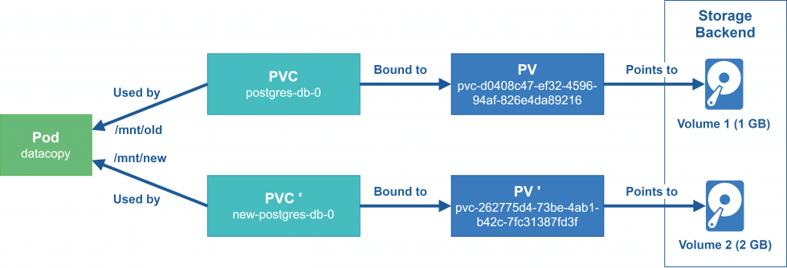

# 数据存储

## 存储机制

Container 中的文件在磁盘上是临时存放的，这给 Container 中运行的较重要的应用程序带来一些问题。

-   当容器崩溃时。 kubelet 可能会重新创建容器，可能会导致容器漂移至新的宿主机，容器会以干净的状态重建。导致数据丢失
-   在同一 Pod 中运行多个容器需要共享数据

Kubernetes 卷（Volume） 这一抽象概念能够解决这两个问题

Kubernetes 集群中的容器数据存储

## Kubernetes支持的存储类型

[存储 | Kubernetes](https://kubernetes.io/zh-cn/docs/concepts/storage/)

Kubernetes支持丰富的存储类型，可以分为**树内**和**树外**两种

### 树内 In-Tree 存储卷插件

| 类型         | 举例                                                         |
| ------------ | ------------------------------------------------------------ |
| 临时存储卷   | emptyDir                                                     |
| 本地数据卷   | hostPath、local                                              |
| 文件系统     | NFS、CephFS、GlusterFS、fastdfs、Cinder、gitRepo(DEPRECATED) |
| 块设备       | iSCSI、FC、rdb(块设备)、vSphereVolume                        |
| 存储平台     | Quobyte、PortworxVolume、StorageOS、ScaleIO                  |
| 云存储数据卷 | Aliyun OSS、Amazon S3、AWS Elastic Block Store、Google gcePersistentDisk等 |
| 特殊存储卷   | ConfigMap、Secret、DownwardAPI、Projectd、flocker            |

### 树外 Out-of_Tree 存储卷插件

经由**容器存储接口CSI**或**FlexVolume接口（已淘汰）**扩展出的外部的存储系统称为Out-of-Trec类的存储插件

CSI 有多种实现,比如：

Rancher 是为使用容器的公司打造的容器管理平台。Rancher 简化了使用 Kubernetes 的流程，开发者可以随处运行 Kubernetes，满足IT 需求规范，赋能 DevOps 团队。这个团队研发的Longhorn就是要给非常好的存储平台。

Longhorn是一个轻量级且功能强大的云原生Kubernetes分布式存储平台，可以在任意基础设施上运行。Longhorn与Rancher结合使用，将帮助用户在Kubernetes环境中轻松、快速和可靠地部署高可用性持久化块存储。

**CSI 主要包含两个部分：CSI Controller Server 与 CSI Node Server，分别对应Controller Server Pod和Node Server Pod**


*   Controller Server
    *   也称为CSI Controller
    *   在集群中只需要部署一个 Controller Server，以 deployment 或者 StatefulSet 的形式运行
    *   **CSI Controller Server**：负责卷的生命周期管理（如创建、删除、绑定、快照等），通常运行在 Kubernetes 控制平面或指定的控制节点上，即 **Controller Server Pod**；
    *   主要负责与存储服务API通信完成后端存储的管理操作，比如 provision 和 attach 工作。
*   Node Server
    *   也称为CSI Node 或 Node Plugin
    *   保证每一个节点会有一个 Pod 部署出来，负责在节点级别完成存储卷管理，和 CSI Controller 一起 完成 volume 的 mount 操作。
    *   Node Server Pod 是个 DaemonSet，它会在每个节点上进行注册。
    *   负责将卷挂载到本地节点，支持读写操作，通常部署在每个工作节点上，即 **Node Server Pod**。
    *   Kubelet 会直接通过 Socket 的方式直接和 CSI Node Server 进行通信、调用 Attach/Detach/Mount/Unmount 等。


**CSI 插件包括以下两部分**

-   **CSI-Plugin**:实现数据卷的挂载、卸载功能。
-   **CSI-Provisioner**: 制备器（Provisioner）实现数据卷的自动创建管理能力，即驱动程序，比如: 支 持云盘、NAS等存储卷创建能力

## Kubernetes 存储架构

存储的组件主要有：attach/detach controller、pv controller、volume manager、volume plugins、 scheduler


-   AD控制器：负责存储设备的Attach/Detach操作
    -   Attach：将设备附加到目标**节点**
    -   Detach：将设备从目标**节点**上卸载
-   **Volume Manager**：存储卷管理器，负责卷的 **挂载/卸载**（Mount/Unmount）到 Pod 的容器路径，以及设备的格式化操作等
-   **PV Controller** ：负责PV/PVC的绑定、生命周期管理，以及存储卷的Provision/Delete操作
-   volume plugins：包含k8s原生的和各厂商的的存储插件，扩展各种存储类型的卷管理能力
    -   原生的包括：emptydir、hostpath、csi等
    -   各厂商的包括：aws-ebs、azure等
-   scheduler：实现Pod的调度，涉及到volume的调度。比如ebs、csi关于单node最大可attach磁盘 数量的predicate策略，scheduler的调度至哪个指定目标节点也会受到存储插件的影响

## Pod的存储卷 volume

存储卷本质上表现为 **Pod中所有容器共享访问的目录**

而此目录的创建方式、使用的存储介质以及目录的初始内容是由Pod规范中声明的存储卷类型来源决定

**kubelet内置支持多种存储卷插件**，**存储卷是由各种存储插件(存储驱动)来提供存储服务**

存储卷插件(存储驱动)决定了支持的后端存储介质或存储服务，例如hostPath插件使用宿主机文件系 统，而nfs插件则对接指定的NFS存储服务等

Pod在规范中需要指定其包含的卷以及这些卷在容器中的挂载路径

**存储卷需要定义在指定的Pod之上**

有些卷本身的生命周期与Pod相同，但其后端的存储及相关数据的生命周期通常要取决于存储介质

存储卷可以分为：**临时卷和持久卷**

-   **临时卷类型**的生命周期与 Pod 相同， 当 Pod 不再存在时，Kubernetes 也会销毁临时卷
-   持久卷可以比 Pod 的存活期长。当 Pod 不再存在时，Kubernetes 不会销毁持久卷。
-   但对于给定 Pod 中任何类型的卷，在容器重启期间数据都不会丢失。

```shell
kubectl explain pod.spec.volumes
```

单节点存储


多节点存储


# Pod中卷的使用

-   一个Pod可以添加任意个卷
-   同一个Pod内每个容器可以在不同位置按需挂载Pod上的任意个卷，或者不挂载任何卷
-   同一个Pod上的某个卷，也可以同时被该Pod内的多个容器同时挂载，以共享数据
-   如果支持，多个Pod也可以通过卷接口访问同一个后端存储单元


**存储卷的配置由两部分组成**

-   通过.spec.volumes字段定义在Pod之上的存储卷列表，它经由特定的存储卷插件并结合特定的存储供给方的访问接口进行**定义**
-   嵌套定义在容器的volumeMounts字段上的存储卷挂载列表，它只能**挂载**当前Pod对象中定义的存储卷

**Pod 内部容器使用存储卷有两步：**

-   在Pod上定义存储卷，并关联至目标存储服务上**volumes**
    -   **定义卷**
-   在需要用到存储卷的容器上，挂载其所属的Pod中pause的存储卷**volumesMount**
    -   **引用卷**

**容器引擎对共享式存储设备的支持类型：**

-   **单路读写** - 多个容器内可以通过同一个中间容器对同一个存储设备进行读写操作
-   **多路并行读写** - 多个容器内可以同时对同一个存储设备进行读写操作
-   **多路只读** - 多个容器内可以同时对同一个存储设备进行只读操作

## Pod的卷资源对象属性

```yaml
apiVersion: v1
kind: Pod
metadata:
  name: <string>
  namespace: <string>
spec:
  volumes:                       # 定义卷
  - name: <string>               # 存储卷名称标识，仅可使用DNS标签格式的字符，在当前Pod必须唯一
    VOL_TYPE: <Object>           # 存储卷插件及具体的目标存储供给方的相关配置
  containers:
  - name: ...
    image: ...
    volumeMounts:                # 挂载卷
    - name: <string>             # 要挂载的存储卷的名称，必须匹配存储卷列表中某项的定义
      mountPath: <string>        # 容器文件系统上的挂载点路径
      readOnly: <boolean>        # 是否挂载为只读模式，默认为"否"，即可读可写
      subPath: <string>          # 挂载存储卷上的一个子目录至指定挂载点
      subPathExpr: <string>      # 挂载有指定的模式匹配到的存储卷的文件或目录至挂载点
```

## emptyDir

**只在同一pod内多容器间共享数据，pod删除数据随之删除**

一个emptyDir volume在pod被调度到某个Node时候自动创建的，无需指定宿主机上对应的目录。 适用于在一个**Pod中不同容器间的临时数据的共享**

**emptyDir 数据存放在宿主机的路径如下**

```shell
/var/lib/kubelet/pods/<pod_id>/volumes/kubernetes.io~empty-dir/<volume_name>/<FILE>

#注意：此目录随着Pod删除，也会随之删除，不能实现持久化
```

**emptyDir 特点如下：**

-   此为**默认存储类型**
-   此方式只能临时存放数据，不能实现数据持久化
-   跟随Pod初始化而来，开始是空数据卷
-   Pod 被删除，emptyDir对应的宿主机目录也被删除，当然目录内的数据随之永久消除
-   emptyDir 数据卷介质种类跟当前主机的磁盘一样。
-   emptyDir 主机可以为同一个Pod内多个容器共享
-   emptyDir 容器数据的临时存储目录主要用于数据缓存和**同一个Pod内的多个容器共享使用**

### emptyDir属性解析

```shell
kubectl explain pod.spec.volumes.emptyDir
    medium       # 指定媒介类型，主要有default和memory两种
                 # 默认情况下，emptyDir卷支持节点上的任何介质，SSD、磁盘或网络存储，具体取决于自身所在Node的环境
                 # 将字段设置为Memory，让K8S使用tmpfs，虽然tmpfs快，但是Pod重启时，数据会被清除，并且设置的大小会被计入  # Container的内存限制当中
    sizeLimit    # 当前存储卷的空闲限制，默认值为nil表示不限制
    
kubectl explain pod.spec.containers.volumeMounts
    mountPath    # 挂载到容器中的路径,此目录会自动生成
    name         # 指定挂载的volumes名称
    readOnly     # 是否只读挂载
    subPath      # 是否挂载子目录的路径,默认不挂载子目录
```

### 配置示例

```yaml
# volume配置格式
volumes:
- name: volume_name
  emptyDir: {}
  
# volume使用格式
containers:
- volumeMounts:
  - name: volume_name
    mountPath: /path/to/container/  # 容器内路径


# 示例1
apiVersion: v1
kind: Pod
metadata:
  name: test-pod
spec:
  containers:
  - image: registry.k8s.io/test-webserver
    name: test-container
    volumeMounts:
    - mountPath: /cache
      name: cache-volume
  volumes:
  - name: cache-volume
    emptyDir: {} # 都为默认
    
# 示例2：
apiVersion: v1
kind: Pod
metadata:
  name: test-pd
spec:
  containers:
  - image: registry.k8s.io/test-webserver
    name: test-container
    volumeMounts:
    - mountPath: /cache
      name: cache-volume
  volumes:
  - name: cache-volume
    emptyDir:
      medium: Memory
      sizeLimit: 500Mi
```

### 在一个Pod中定义多个容器通过emptyDir共享数据

busybox容器写入index.html内容，nginx容器显示index.html

```yaml
vim storage-emptydir.yaml
apiVersion: v1
kind: Pod
metadata:
  name: storage-emptydir
spec:
  volumes:
  - name: nginx-data
    emptyDir: {}
  containers:
  - name: storage-emptydir-nginx
    image: harbor.l00n9.icu/public/nginx:stable-perl
    volumeMounts:
    - name: nginx-data
      mountPath: /usr/share/nginx/html/
  - name: storage-emptydir-busybox
    image: harbor.l00n9.icu/public/busybox:unstable-uclibc
    volumeMounts:
    - name: nginx-data
      mountPath: /data/
    command:
    - "/bin/sh"
    - "-c"
    - "while true; do date > /data/index.html; sleep 1; done"
    
root@master1:~/k8s/storage# curl 10.244.2.55
Sat Mar 29 03:34:41 UTC 2025
root@master1:~/k8s/storage# curl 10.244.2.55
Sat Mar 29 03:34:42 UTC 2025
root@master1:~/k8s/storage# curl 10.244.2.55
Sat Mar 29 03:34:43 UTC 2025
root@master1:~/k8s/storage# curl 10.244.2.55
Sat Mar 29 03:34:44 UTC 2025
```

## hostPath

**只在同一node节点上多pod共享数据，数据保存在宿主机上**

hostPath 可以将**宿主机上的目录**挂载到 Pod 中作为数据的存储目录

**hostPath 一般用在如下场景：**

-   容器应用程序中某些文件需要永久保存
-   Pod删除，hostPath数据对应在宿主机文件不受影响,即hostPath的生命周期和Pod不同,而和节点相同
-   **宿主机和容器的目录都会自动创建**
-   某些容器应用需要用到容器的自身的内部数据，可将宿主机的/var/lib/[docker|containerd]挂载到 Pod中

**hostPath 使用注意事项：**

-   不同宿主机的目录和文件内容不一定完全相同，所以Pod迁移前后的访问效果不一样
-   不适合Deployment这种分布式的资源，更适合于DaemonSet
-   宿主机的目录不属于独立的资源对象的资源，所以**对资源设置的资源配额限制对hostPath目录无效**

### 配置属性

```yaml
# 配置属性
kubectl explain pod.spec.volumes.hostPath
path                         # 指定哪个宿主机的目录或文件被共享给Pod使用
type                         # 指定路径的类型，一共有7种，默认的类型是没有指定
     空字符串                 # 默认配置，在关联hostPath存储卷之前不进行任何检查，如果宿主机没有对应的目录，会自动创建
     DirectoryCreate         # 宿主机上不存在，创建此0755权限的空目录，属主属组均为kubelet
     Directory               # 必须存在，挂载已存在目录
     FileOrCreate            # 宿主机上不存在挂载文件，就创建0644权限的空文件，属主属组均为kubelet
     File                    # 必须存在文件
     Socket                  # 事先必须存在Socket文件路径
     CharDevice              # 事先必须存在的字符设备文件路径
     BlockDevice             # 事先必须存在的块设备文件路径
     
     
# 配置格式：
  volumes:
  - name: volume_name
    hostPath:
      path: /path/to/host
      
# 示例：
apiVersion: v1
kind: Pod
metadata:
  name: test-pod
  spec:
    containers:
    - image: registry.k8s.io/test-webserver
      name: test-container
      volumeMounts:
      - mountPath: /test-pod
        name: test-volume
    volumes:
    - name: test-volume
      hostPath:
        path: /data           # 宿主机上目录位置
        type: Directory       # 此字段为可选
```

###  Redis 数据的持久化

如果第二次分配到不同的node节点，数据无法持久化

```yaml
apiVersion: v1
kind: Pod
metadata:
  name: redis
spec:
  # nodeName: node1.l00n9.icu #指定运行在指定worker主机上
  containers:
  - name: redis
    image: harbor.l00n9.icu/public/redis:8.0-alpine
    imagePullPolicy: IfNotPresent
    volumeMounts:
    - name: redisdata
      mountPath: /data
  volumes:
  - name: redisdata
    hostPath:
      type: DirectoryOrCreate
      path: /data/redis
```

## NFS存储

### NFS 安装

#### pod

```yaml
vim storage-nfs-server.yaml
---
apiVersion: v1
kind: Service
metadata:
  name: nfs-server
  labels:
    app: nfs-server
spec:
  type: ClusterIP
  selector: 
    app: nfs-server
  ports:
    - name: tcp-2049            # 未显示指定tartPort，默认和port一致
      port: 2049
      protocol: TCP
    - name: udp-111
      port: 111
      protocol: UDP
---
apiVersion: apps/v1
kind: Deployment
metadata:
  name: nfs-server
spec:
  replicas: 1
  selector:
    matchLabels:
      app: nfs-server
  template:
    metadata:
      name: nfs-server
      labels:
        app: nfs-server
    spec:
      nodeSelector:
        "kubernetes.io/os": linux
        "server": nfs                 # 需要在一个node节点上打上server=nfs标签
      containers:
      - name: nfs-server
        image: harbor.l00n9.icu/public/nfs-server-alpine:12
        env:
        - name: SHARED_DIRECTORY
          value: "/exports"
        volumeMounts:
        - mountPath: /exports
          name: nfs-vol
        securityContext:
          privileged: true
        ports:                       # 声明性说明，无直接功能，除非Service配置了targetPort匹配这些端口
        - name: tcp-2049
          containerPort: 2049
          protocol: TCP
        - name: udp-111
          containerPort: 111
          protocol: UDP
      volumes:
      - name: nfs-vol
        hostPath:
          path: /nfs-vol
          type: DirectoryOrCreate
```

#### 服务

服务端

```yaml
#NFS服务器软件安装服务端包,10.0.0.109
apt install nfs-kernel-server

#配置共享目录
mkdir /nfs-data
echo '/nfs-data *(rw,all_squash,anonuid=0,anongid=0)' >> /etc/exports
# 或
echo '/nfs-data *(rw,no_root_squash)' >> /etc/exports

# 加载配置
exportfs -r
# 查看配置
exportfs -v
```

客户端

```yaml
# 在每个节点上安装客户端包，包括master
apt install nfs-common

# DNS配置解析地址或使用hosts解析
vim /etc/hosts
10.0.0.109 harbor.l00n9.icu  harbor  nfs.l00n9.icu nfs 

# 测试
showmount -e nfs.l00n9.icu
Export list for nfs.l00n9.icu:
/nfs-data *
```

### 网络共享存储 NFS

和传统的方式一样, 通过 NFS 网络文件系统可以实现Kubernetes数据的网络存储共享

使用NFS提供的共享目录存储数据时，需要在系统中部署一个NFS环境，通过volume的配置，实现pod 内的容器间共享NFS目录。

```yaml
cat storage-nfs-1.yaml
apiVersion: v1
kind: Namespace
metadata:
  name: storage

---
apiVersion: apps/v1
kind: Deployment
metadata:
  name: nginx-nfs
  namespace: storage
  labels:
    app: nginx-nfs
spec:
  replicas: 3
  selector:
    matchLabels:
      app: nginx-nfs
  template:
    metadata:
      labels:
        app: nginx-nfs
    spec:
      volumes:
      - name: html
        nfs:
          server: nfs.l00n9.icu
          path: /nfs-data/nginx
      containers:
      - image: harbor.l00n9.icu/public/nginx:stable-perl
        name: nginx
        volumeMounts:
        - name: html
          mountPath: /usr/share/nginx/html
          
# 注意：nfs中的域名解析，使用的式Node上的DNS，而不是COREDNS，所以需要在Node节点上将DNS指向私有DNS

# nfs服务器上
echo v0.1 > /nfs-data/nginx/index.html
# 访问测试

echo v0.2 > /nfs-data/nginx/index.html
# 访问测试
```

# **PV和PVC**

## Pod、PV、PVC 关系

**前提：**

-   存储管理员配置各种类型的PV对象
-   Pod、PVC 必须在同一个命名空间

**用户需要存储资源的时候：**

-   用户根据资源需求创建PVC，由PVC自动匹配(权限、容量)合适的PV对象
-   PVC 允许用户按需指定期望的存储特性，并以之为条件，按特定的条件顺序进行PV的过滤
    -   VolumeMode → LabelSelector → StorageClassName → AccessMode → Size
-   在Pod内部通过 PVC 将 PV 绑定到当前的空间，进行使用
-   如果用户不再使用存储资源，解绑 PVC 和 Pod 即可



## PV Persistent Volume 定义

k8s对存储的资源类型

工作中的存储资源一般都是独立于Pod的，将之称为资源对象Persistent Volume(PV)，是由管理员设置的存储，它是kubernetes集群的一部分，PV 是 Volume 之类的卷插件，**但具有独立于使用 PV 的 Pod 的生命周期**

**Persistent Volume 跟 Volume类似，区别就是：**

-   PV 是集群级别的资源，负责将存储空间引入到集群中，通常由管理员定义
-   PV 就是Kubernetes集群中的网络存储，不属于Namespace、Node、Pod等资源，但可以被它们访问
-   **PV 属于Kubernetes 整个集群,即可以被所有集群的Pod访问**
-   **PV是独立的网络存储资源对象，有自己的生命周期**
-   PV 支持很多种volume类型,PV对象可以有很多常见的类型：本地磁盘、NFS、分布式文件系统...

**PV持久卷的类型**

PV持久卷是用插件的形式来实现的。Kubernetes目前支持一下插件：

-   **cephfs** - CephFS volume
-   **csi** - 容器存储接口（CSI）
-   **fc** - Fibre Channel（FC）存储
-   **hostPath** - HostPath卷（仅供单节点测试使用，不适用于多节点集群；请尝试使用lcoal作为替代）
-   **iscsi** = iSCSI（SCSI over IP）存储
-   **local** - 节点上挂载的本地存储设备
-   **nfs** - 网络文件系统（NFS）存储
-   **rbd** - Rados块设备（RBD）卷

## PVC Persistent Volume Claim定义

pvc是对pv的申请

Persistent Volume Claim(PVC) 是一个网络存储服务的**请求**。

**PVC 属于名称空间级别的资源**，只能被同一个名称空间的Pod引用

由用户定义，用于在空闲的PV中申请使用符合过滤条件的PV之一，与选定的PV是“一对一”的关系

用户在Pod上**通过pvc插件**请求绑定使用定义好的PVC资源

Pod能够申请特定的CPU和MEM资源，但是Pod只能通过PVC到PV上请求一块独立大小的网络存储空 间，而PVC 可以动态的根据用户请求去申请PV资源，不仅仅涉及到存储空间，还有对应资源的访问模 式，对于真正使用存储的用户不需要关心底层的存储实现细节，只需要直接使用 PVC 即可。


## PV和PVC的生命周期


-   用户创建了一个包含 PVC 的 Pod，该 PVC 要求使用动态存储卷
-   Scheduler 根据 Pod 配置、节点状态、PV 配置等信息，把 Pod 调度到一个合适的 Worker 节点上
-   PV 控制器 watch 到该 Pod 使用的 PVC 处于 Pending 状态，于是调用 Volume Plugin(in-tree)创 建存储卷，并创建 PV 对象(out-of-tree 由 External Provisioner 来处理)
-   AD 控制器发现 Pod 和 PVC 处于待挂接状态，于是调用 Volume Plugin 挂接存储设备到目标 Worker 节点上
-   在 Worker 节点上，Kubelet 中的 Volume Manager 等待存储设备挂接完成，并通过 Volume Plugin 将设备挂载到全局目录：**/var/lib/kubelet/pods/[pod_uid]/volumes/kubernetes.io~iscsi/[PVname] (以iscsi为例)**
-   Kubelet 通过 Docker 启动 Pod 的 Containers，用 bind mount 方式将已挂载到本地全局目录的卷 映射到容器中


## PV和PVC管理

**PV的Provison 置备（创建）方法**

-   **静态**：集群管理员预先手动创建一些 PV。它们带有可供群集用户使用的实际存储的细节
-   **动态**：集群尝试根据用户请求动态地自动完成创建卷。此配置基于 StorageClasses：PVC 必须请 求存储类，并且管理员必须预先创建并配置该 **StorageClasses**才能进行动态创建。声明该类为空字 符串 ""， 可以有效地禁用其动态配置。


### PV

#### 属性

```yaml
# PV作为存储资源，主要包括存储能力，访问模式，存储类型，回收策略等关键信息，注意：PV的名称不支持大写
kubectl explain pv.spec
    capacity                            # 定义pv使用多少资源，仅限于空间的设定
    accessModes                         # 访问模式,支持单路读写，多路读写，多路只读，单Pod读写，可同时支持多种模式
    volumeMode                          # 文件系统或块设备,默认文件系统
    mountOptions                        # 挂载选项,比如:["ro", "soft"]    
    persistentVolumeReclaimPolicy       # 资源回收策略，主要三种Retain、Delete、Recycle 
    storageClassName                    # 存储类的名称,如果配置必须和PVC的storageClassName相同才能绑定
    
#注意:PersistentVolume 对象的名称必须是合法的 DNS 子域名

# 示例
apiVersion: v1
kind: PersistentVolume
metadata:
  name: pv0003
  labels:
    release: "stable"    # 便签可以支持匹配过滤PVC
spec:
  capacity:
    storage: 5Gi
  volumeMode: Filesystem
  accessModes:
    - ReadWriteOnce
  persistentVolumeReclaimPolicy: Recycle
  storageClassName: slow  # 必须和PVC相同
  mountOptions:
    - hard
    - nfsvers=4.1
  nfs:
    path: /tmp
    server: 172.17.0.2  
```

#### PV状态

PV 有生命周期,自然也有自己特定的状态

注意：这个过程是单向过程，不能逆向

| 状态       | 解析                                                  |
| ---------- | ----------------------------------------------------- |
| Availabled | 空闲状态，表示PV没有被其他PVC对象使用                 |
| Bound      | 绑定状态，表示PV已经被其他PVC对象使用                 |
| Released   | 未回收状态，表示PVC已经被删除了，但是资源还没有被回收 |
| Faild      | 资源回收失败                                          |


#### AccessMode 访问模式

AccessModes 是用来对 PV 进行访问模式的设置，用于描述用户应用对存储资源的访问权限，访问权限包括

| 类型                   | 解析                                                         |
| ---------------------- | ------------------------------------------------------------ |
| ReadWriteOnce（RWO）   | 单节点读写,卷可以被一个节点以读写方式挂载。 ReadWriteOnce 访问模式仍然可以在同一节点上运行的多个 Pod 访问该卷即不支持并行(非并发)写入 |
| ReadOnlyMany（ROX）    | 多节点只读                                                   |
| ReadWriteMany（RWX）   | 多节点读写                                                   |
| ReadWriteOncePod(RWOP) | 卷可以被单个 Pod 以读写方式挂载。 如果你想确保整个集群中只 有一个 Pod 可以读取或写入该 PVC， 请使用 ReadWriteOncePod 访问模式。单Pod读写,v1.22版以后才支 持,v1.29版stable可用 |

注意：

-   不同的后端存储支持不同的访问模式，所以要根据后端存储类型来设置访问模式。
-   一些 PV 可能支持多种访问模式，但是在挂载的时候只能使用一种访问模式，多种访问模式是不会 生效的

#### PV资源回收策略

PV 三种资源回收策略

当 Pod 结束 volume 后可以回收资源对象删除PVC，而绑定关系就不存在了，当绑定关系不存在后这个 PV需要怎么处理，而PersistentVolume 的回收策略告诉集群在存储卷声明释放后应如何处理该PV卷。 目前，volume 的处理策略有保留、回收或删除。

当PVC被删除后, Kubernetes 会自动生成一个recycler-for-的Pod实现回收工作,但Retain策 略除外

回收完成后,PV的状态变为Availabled,如果其它处于Pending状态的PVC和此PV条件匹配,则可以再次此 PV进行绑定

| 类型    | 解析                                                         |
| ------- | ------------------------------------------------------------ |
| Retain  | 保留PV和存储空间数据，后续数据的删除需要人工干预，**一般推荐使用此项**，对于**手动创建的PV此为默认值** |
| Delete  | 相关的存储实例PV和数据都一起删除。需要支持删除功能的存储才能实现，**动态存储 一般会默认采用此方式** |
| Recycle | **当前此项已废弃**，保留PV，但清空存储空间的数据，仅支持NFS和hostPath |

### PVC

#### 属性

```yaml
#PVC属性信息,与所有空间都能使用的PV不一样，PVC是属于名称空间级别的资源对象，即只有特定的资源才能使用
kubectl explain pvc.spec
    accessModes            # 访问模式  
    resources              # 资源限制
    volumeMode             # 后端存储卷的模式,文件系统或块,默认为文件系统
    volumeName             # 指定绑定的卷(pv)的名称

kubectl explain pod.spec.volumes.persistentVolumeClaim
    claimName              # 定义pvc的名称,PersistentVolumeClaim 对象的名称必须是合法的 DNS 子域名
    readOnly               # 设定pvc是否只读
    storageClassName       # 存储类的名称,如果配置必须和PV的storageClassName相同才能绑定
    selector                # 标签选择器实现选择绑定PV
    
# storageClassName类
#PVC可以通过为storageClassName属性设置StorageClass的名称来请求特定的存储类。只有所请求的类的PV的StorageClass值与PVC设置相同，才能绑定

# selector选择算符
#PVC可以设置标签选择算符,来进一步过滤卷集合。只有标签与选择算符相匹配的卷能够绑定到PVC上。选择算符包含两个字段：

#matchLabels - 卷必须包含带有此值的标签
#matchExpressions - 通过设定键（key）、值列表和操作符（operator） 来构造的需求。合法的操作符
#有 In、NotIn、Exists 和 DoesNotExist。
#来自 matchLabels 和 matchExpressions 的所有需求都按逻辑与的方式组合在一起。 这些需求都必须被满足才被视为匹配。

# 示例：
apiVersion: v1
kind: PersistentVolumeClaim
metadata:
  name: myclaim
spec:
  accessModes:
  - ReadWriteOnce
  volumeMode: Filesystem
  resources:
    requests:
      storage: 8Gi
  storageClassName: slow  # 必须和PV相同
  selector：
    matchLabels:
      release: "stable"
    matchExpressions:
    - {key: environment, operator: In, values: [dev]}
```

## PV和PVC的使用流程

实现方法

-   准备存储
-   基于存储创建PV
-   根据需求创建PVC: PVC会根据capacity和accessModes及其它条件自动找到相匹配的PV进行绑定, 一个PVC对应一个PV
-   创建Pod
    -   在Pod中的 volumes 指定调用上面创建的 PVC 名称
    -   在Pod中的容器中的volumeMounts指定PVC挂载容器内的目录路径

## 案例

### MySQL数据持久化

hostPath

```yaml
cat storage-mysql-pv-pvc.yaml
apiVersion: v1
kind: PersistentVolume
metadata:
  name: mysql-pv-volume
  labels:
    type: local
spec:
  storageClassName: manual
  capacity:
    storage: 20Gi
  accessModes:
  - ReadWriteOnce
  hostPath:
    path: "/mnt/data"

---
apiVersion: v1
kind: PersistentVolumeClaim
metadata:
  name: mysql-pv-claim
spec:
  storageClassName: manual
  accessModes:
  - ReadWriteOnce
  resources:
    requests:
      storage: 20Gi

---
apiVersion: v1
kind: Service
metadata:
  name: mysql
spec:
  ports:
  - port: 3306
  selector:
    app: mysql
  clusterIP: None
---
apiVersion: apps/v1
kind: Deployment
metadata:
  name: mysql
spec:
  selector:
    matchLabels:
      app: mysql
  strategy:
    type: Recreate
  template:
    metadata:
      labels:
        app: mysql
    spec:
      containers:
      - image: mysql:8.0.29-oracle
        name: mysql
        env:
        - name: MYSQL_ROOT_PASSWORD
          value: "123456"
        ports:
        - containerPort: 3306
          name: mysql
        volumeMounts:
        - name: mysql-persistent-storage
          mountPath: /var/lib/mysql
      volumes:
      - name: mysql-persistent-storage
        persistentVolumeClaim:
          claimName: mysql-pv-claim
```

### 以NFS类型创建一个3G大小的存储资源对象PV

```yaml
cat storage-pv.yaml 
apiVersion: v1
kind: PersistentVolume
metadata:
  name: pv-test
spec:
  capacity:
    storage: 3Gi
  accessModes:
    - ReadWriteOnce
    - ReadWriteMany
    - ReadOnlyMany
  nfs:
    path: /nfs-data
    server: nfs.l009.icu # 需要名称解析
    
---
apiVersion: v1
kind: PersistentVolumeClaim
metadata:
  name: pvc-test
spec:
  accessModes:
    - ReadWriteOnce
  resources:
    requests:
      storage: 1Gi
#注意：请求的资源大小必须在 pv资源的范围内

---
apiVersion: v1
kind: Pod
metadata:
  name: Pod-nginx
spec:
  volumes:
  - name: volume-nginx
    persistentVolumeClaim:
      claimName: pvc-test
  containers:
  - name: pvc-nginx-container
    image: nginx:1.20.0
    volumeMounts:
    - name: volume-nginx
      mountPath: "/usr/share/nginx/html"
```


### subPath

在同一个目录下，不同的pod有自己的一个目录。这个目录是在pod中的subPath定义的

上面范例中的nginx首页存放在/nfs-data的一级目录中，但是生产中，一个NFS共享资源通常是给多个应 用来使用的，比如需要定制每个app的分配单独的子目录存放首页资源，但是如果我们采用PV实现定制 的方式，就需要多个PV,此方式有些太繁琐了

**可以通过subPath实现针对不同的应用对应子目录的挂载**

volumeMounts.subPath 属性可用于指定所引用的卷内的子路径，而不是其根路径。

下面例子展示了如何配置某包含 LAMP 堆栈（Linux Apache MySQL PHP）的 Pod 使用同一共享卷。 **此示例中的 subPath 配置不建议在生产环境中使用**。 PHP 应用的代码和相关数据映射到卷的 html 文 件夹，MySQL 数据库存储在卷的 mysql 文件夹中：

```yaml
cat storage-nginx-pvc-subdir.yaml 
apiVersion: v1
kind: Pod
metadata:
  name: pod-nginx-1
spec:
  volume:
  - name: nginx-volume
    persistentVolumeClaim:
      claimName: pvc-test
  containers:
  - name: nginx-pv
    image: nginx:1.20.0
    volumeMounts:
    - name: nginx-volume
      mountPath: "/usr/share/nginx/html"
      subPath: web1
---
apiVersion: v1
kind: Pod
metadata:
  name: pod-nginx-2
spec:
  volumes:
  - name: nginx-volume
    persistentVolumeClaim:
      claimName: pvc-test
  containers:
  - name: nginx-flask
    image: nginx:1.20.0
    volumeMounts:
    - name: nginx-volume
      mountPath: "/usr/share/nginx/html"
      subPath: web2
```

## 强制删除

生产中，对于存储资源的释放，最好按照流程来，即先清空应用，然后在清空pvc，但是生产中，经常遇 到应用资源意外终止或者其他情况，导致我们的pvc资源没有使用，而且也没有清空

有多种方式解决，最常用的一种方式就是，在所有的应用pod中增加一个prestop的钩子函数，从而让我们的应用资源合理的清空

**而对于特殊的异常情况，我们还有另外一种策略，即强制清空,但是一般不推荐使用。**

```shell
#对于这种无论何种方法都无法删除的时候，我们可以通过修改配置属性的方式，从记录中删除该信息
[root@master1 ~]#kubectl patch pv pv-nfs-1 -p '{"metadata":{"finalizers":null}}'
persistentvolume/pv-nfs-1 patched
```

# StorageClass

对于 PV 和 PVC 的使用整个过程是比较繁琐的，不仅需要自己定义PV和PVC还需要将其与Pod进行关 联，而且对于PV和PVC的适配我们也要做好前提规划，而生产环境中，这种繁琐的事情是有悖于我们使 用kubernetes的原则的，而且这种方式在很大程度上并不能满足我们的需求，而且不同的应用程序对于 存储性能的要求可能也不尽相同，比如读写速度、并发性能等，比如我们有一个应用需要对存储的并发 度要求比较高，而另外一个应用对读写速度又要求比较高，特别是对于 StatefulSet 类型的应用简单的来 使用静态的 PV 就很不合适了，这种情况下就需要用到**动态 PV**。

Kubernetes 引入了一个**新的资源对象：StorageClass**，通过 StorageClass 的定义，管理员可以将存储资源定义为某种类型的资源，比如存储质量、快速存储、慢速存储等，为了满足不同用户的多种多样的 需求，用户根据 StorageClass 的描述就可以非常直观的知道各种存储资源的具体特性了，这样就可以根据应用的特性去申请合适的存储资源了。

所以,StorageClass提供了一种资源使用的描述方式，使得管理员能够描述提供的存储的服务质量和等级，进而做出不同级别的存储服务和后端策略。

StorageClass 用于定义不同的存储配置和属性，以供 PersistentVolume（PV）的动态创建和管理。它 为开发人员和管理员提供了一种在不同的存储提供商之间抽象出存储配置的方式。

**在 Kubernetes 中，StorageClass 是集群级别的资源，而不是名称空间级别。**

PVC和PV可以属于某个SC，也可以不属于任何SC,PVC只能够在同一个storageClass中过滤PV

**能建立绑定关系的PVC和PV一定满足如下条件：**

-   二者隶属于同个SC
-   二者都不属于任何SC

**StorageClass这个API对象可以自动创建PV的机制,即:Dynamic Provisioning**

**StorageClass对象会定义下面两部分内容:**

-   PV的属性.比如,存储类型,Volume的大小等
-   创建这种PV需要用到的存储插件

要使用 StorageClass，就得**安装对应的自动配置程序**，比如存储后端使用的是 nfs，那么就需要使用到 一个 nfs-client 的自动配置程序，也称为 Provisioner，这个程序使用已经配置好的 nfs 服务器，来自动 创建持久卷 PV。

## 属性

每个 StorageClass 都包含 **provisioner** 、 **parameters** 和 **reclaimPolicy** 字段， 这些字段会在 StorageClass 需要动态制备 PersistentVolume 时会使用到。

StorageClass 对象的命名很重要，用户使用这个命名来请求生成一个特定的类。 当创建 StorageClass 对象时，管理员设置 StorageClass 对象的命名和其他参数。

```yaml
apiVersion: storage.k8s.io/v1
kind: StorageClass
metadata:
  name: standard
provisioner: kubernetes.io/aws-ebs
parameters:
  type: gp2
reclaimPolicy: Retain
# 允许 PVC 进行在线扩容，即在不删除 PVC 的情况下，调整存储大小
# 适用于支持在线扩容的存储提供程序，如 AWS EBS、GCE Persistent Disk、Ceph RBD 等。
# 仅适用于 支持动态存储扩容的存储提供商。
# 某些存储（如本地存储）不支持扩展，即使设置 allowVolumeExpansion: true 也无效。
# 扩容后，Pod 可能需要重新挂载 PVC 才能生效。
allowVolumeExpansion: true
mountOptions:
- discard   # discard 选项用于 TRIM 操作，适用于支持 SSD 硬盘 的存储系统。
            # 当 Kubernetes 释放块存储上的空间时，discard 允许操作系统通知存储设备，释放已删除的数据块，从而提高存储效率和               性能。
            # ✅ 适用于 SSD 存储（如 AWS EBS gp3、GCE PD SSD、Ceph RBD）
            # ❌ 不适用于机械硬盘（HDD），HDD 不支持 TRIM。
volumeBindingMode: Immediate | WaitForFirstConsumer（延迟绑定，只有Pod准备好才绑定）
# 如果使用 SSD 存储，建议 discard 选项。
# 如果需要保证存储性能，使用 guaranteedReadWriteLatency: "true"。
```

### **绑定模式 (`volumeBindingMode`)**

#### **volumeBindingMode: Immediate**

-   **PV 和 PVC 会立即绑定**，无论 Pod 是否已创建。
-   **PVC 绑定后，PV 可能会被调度到与 Pod 运行的节点不匹配的存储上**。
-   适用于 **共享存储（Networked Storage），如 NFS、Ceph、EBS（非本地存储）**，因为这些存储不依赖特定节点。

**使用场景**

✅ **网络存储 (NFS, Ceph, AWS EBS, GCE Persistent Disk)**

-   这些存储可以跨多个节点访问，因此 PVC 立即绑定后，不会影响 Pod 的调度。

❌ **本地存储 (HostPath, Local SSD, Node-specific Storage)**

-   由于 PVC 可能绑定到不合适的 PV，导致 Pod 无法正确调度。

#### **volumeBindingMode: WaitForFirstConsumer**

-   **PVC 不会立即绑定 PV，直到 Pod 被调度到某个节点。**
-   **存储调度会在 Pod 绑定节点后进行**，确保存储和计算节点匹配。
-   适用于 **本地存储（Local Storage, SSD, Node-specific Storage, EBS GP3/IO2等）**。

**使用场景**

✅ **本地存储 (Local SSD, Local Persistent Volumes)**

-   只有在 Pod 确定运行在哪个节点后，PVC 才绑定到该节点的 PV，防止存储和计算不匹配的问题。

✅ **Kubernetes 资源调度优化**

-   允许 Kubernetes **在调度 Pod 时综合考虑存储位置**，减少数据传输延迟。

❌ **共享存储 (NFS, Ceph, AWS EBS)**

-   这些存储没有节点限制，不需要延迟绑定

**`Immediate` vs `WaitForFirstConsumer` 对比总结**

| 绑定模式               | 绑定时间                             | 适用存储类型                          | 适用场景                                         | 主要问题                                |
| ---------------------- | ------------------------------------ | ------------------------------------- | ------------------------------------------------ | --------------------------------------- |
| `Immediate`            | PVC 立即绑定 PV                      | 共享存储 (NFS, Ceph, AWS EBS, GCE PD) | **云存储、网络存储**，PVC 可以提前绑定           | **本地存储可能导致 PVC 绑定到错误节点** |
| `WaitForFirstConsumer` | **Pod 运行在哪个节点，PVC 才会绑定** | 本地存储 (Local SSD, NVMe, EBS GP3)   | **本地存储或高性能 SSD**，确保存储与计算节点一致 | **Pod 需要先调度，PVC 才能绑定**        |

## Local Volume

### Local PV 使用场景

Local Persistent Volume 并不适用于所有应用。它的适用范围非常固定，比如：高优先级的系统应用， 需要在多个不同节点上存储数据，而且对 I/O 要求较高。Kubernetes 直接使用宿主机的本地磁盘目录 ，来持久化存储容器的数据。它的**读写性能相比于大多数远程存储来说，要好得多，尤其是 SSD 盘**。

典型的应用包括：分布式数据存储比如 MongoDB，分布式文件系统比如 GlusterFS、Ceph 等，以及需 要在本地磁盘上进行大量数据缓存的分布式应用，其次使用 Local Persistent Volume 的应用必须具备 数据备份和恢复的能力，允许你把这些数据定时备份在其他位置。

**Local PV 的实现**

LocalPV 的实现可以理解为我们前面使用的 hostpath 加上 nodeAffinity ，比如：在宿主机 NodeA 上 提前创建好目录 ，然后在定义 Pod 时添加 nodeAffinity=NodeA ，指定 Pod 在我们提前创建好目录的 主机上运行。但是**我们绝不应该把一个宿主机上的目录当作 PV 使用**，因为本地目录的磁盘随时都可能 被应用写满，甚至造成整个宿主机宕机。而且，不同的本地目录之间也缺乏哪怕最基础的 I/O 隔离机 制。所以，**一个 Local Persistent Volume 对应的存储介质，一定是一块额外挂载在宿主机的磁盘或者 块设备**（“额外” 的意思是，它不应该是宿主机根目录所使用的主硬盘）。这个原则，我们可以称为 “**一个 PV 一块盘**”。

### Local PV 和常规 PV 的区别

对于常规的 PV，Kubernetes 都是先调度 Pod 到某个节点上，然后再持久化 这台机器上的 Volume 目 录。而 Local PV，则需要运维人员提前准备好节点的磁盘。它们在不同节点上的挂载情况可以完全不 同，甚至有的节点可以没这种磁盘。所以调度器就必须能够知道所有节点与 Local Persistent Volume 对应的磁盘的关联关系，然后根据这个信息来调度 Pod。也就是在调度的时候考虑 Volume 分布。

在 Kubernetes 中，HostPath 和 Local Volume 都可以用于将主机上的文件系统挂载到容器内部。虽然 它们有一些相似之处，但是它们之间也有一些重要的区别。

HostPath卷类型会直接挂载主机的文件系统到Pod中，这个文件系统可以是一个文件或者是一个目录。 当Pod被调度到一个节点上时，该节点上的文件系统就会被挂载到Pod中。这使得可以很容易地在容器 内部访问主机上的文件，例如主机上的日志或配置文件。但是，使用 **HostPath 卷类型可能会存在安全 风险**，因为容器可以访问主机上的所有文件和目录，包括其他容器的文件。

相比之下，Local Volume 卷类型只能将节点上的一个目录挂载到容器内部。当Pod被调度到一个节点上 时，Kubernetes 会为该节点创建一个唯一的目录，并将该目录挂载到 Pod 中。因为每个 Pod 只能访问 其本地的 Local Volume 目录，所以这种卷类型更加安全。但是，**如果节点故障或被删除，Local Volume 中的数据将会丢失**。因此，使用 Local Volume 卷类型需要谨慎，需要**确保有备份机制或持久化 存储。**

**local Volume 默认不支持动态配置，只能用作静态创建的持久卷国。但可以采有第三方方案实现动态配置**

local 类型的PV是一种更高级的本地存储抽象，它可以**允许通过StorageClass来进行管理**。

与 hostPath 卷相比， local 卷能够以持久和可移植的方式使用，而无需手动将 Pod 调度到节点。

同样使用节点上的本地存储，但相比于 hostPath ， l**ocal Volume可以声明为动态供应，并且可以利 用节点标签（nodeAffinity）实现存储亲和性，确保Pod调度到包含所需数据的节点上**。而hostPath卷 在Pod重建后可能会调度至新的节点，而导致旧的数据无法使用

然而， local 卷仍然取决于底层节点的可用性，并不适合所有应用程序。 如果节点变得不健康，那么 local 卷也将变得不可被 Pod 访问。使用它的 Pod 将不能运行。 使用 local 卷的应用程序必须能够 容忍这种可用性的降低，以及因底层磁盘的耐用性特征而带来的潜在的数据丢失风险

### 创建Local PV

```yaml
apiVersion: storage.k8s.io/v1
kind: StorageClass
metadata:
  name: local-storage
provisioner: kubernetes.io/no-provisioner #表示该存储类不使用任何 provisioner，即不支持动态分配持久卷。这意味着管理员需要手动创建并管理持久卷。
volumeBindingMode: WaitForFirstConsumer #延迟绑定，只有Pod准备好才绑定PV至PVC，否则PVC处于Pending状态

---
apiVersion: v1
kind: PersistentVolume
metadata:
  name: example-pv
spec:
  capacity:
    storage: 100Gi
  volumeMode: Filesystem
  accessModes:
  - ReadWriteOnce
  persistentVolumeReclaimPolicy: Delete
  sotrageClassName: local-storage
  local:
    path: /mnt/disks/ssd1
  nodeAffinity:
    required:
      nodeSelectorTerms:
      - matchExpressions:
        - key: kubernetes.io/hostname
          operator: In
          values:
          - example-node
```

### 基于StorageClass实现Local卷

```yaml
#事先准备目标节点准备目录，对于本地存储Kubernetes 本身并不会自动创建路径，这是因为Kubernetes 不能控制节点上的本地存储，因此无法自动创建路径。
mkdir -p /data/www

cat storage-sc-local-pv-pvc-pod.yaml
---
apiVersion: storage.k8s.io/v1
kind: StorageClass
metadata:
  name: local-storage
provisioner: kubernetes.io/no-provisioner
volumeBindingMode: WaitForFirstConsumer #延迟绑定，只有Pod启动后再绑定PV到Pod所在节点，否则PVC处于Pending状态

---
apiVersion: v1
kind: PersistentVolume
metadata:
  name: pv-sc-local
spec:
  capacity:
    storage: 100Gi
  volumeMode: Filesystem
  accessModes:
  - ReadWriteOnce
  persistentVolumeReclaimPolicy: Delete
  storageClassName: local-storage
  local:
    path: /data/www/
  nodeAffinity:
    required:
      nodeSelectorTerms:
      - matchExpressions:
        - key: kubernetes.io/hostname
          operator: In
          values:
          - node2.l00n9.icu
          
---
apiVersion: v1
kind: PersistentVolumeClaim
metadata:
  name: pvc-sc-local
spec:
  storageClassName: local-storage
  accessModes: ["ReadWriteOnce"]
  resources:
    requests:
      storage: 100Mi

---
apiVersion: v1
kind: Pod
metadata:
  name: pod-sc-local-demo
spec:
  containers:
  - name: pod-sc-local-demo
    image: harbor.l00n9.icu/public/nginx:stable-perl
    volumeMounts:
    - name: pvc-sc-local
      mountPath: "/usr/share/nginx/html"
  restartPolicy: "Never"
  volumes:
  - name: pvc-sc-local
    persistentVolumeClaim:
      claimName: pvc-sc-local
```

## NFS StorageClass （自动制备pv） 

NFS 的自动配置程序 Provisioner 可以通过不同的项目实现,比如：

-   **csi-driver-nfs**

    ```
    https://github.com/kubernetes-csi/csi-driver-nfs
    ```

    

-   **nfs-client-provisioner**

    -   nfs-client-provisioner 是一个自动配置卷程序，它使用现有的和已配置的 NFS 服务器来支持通过 PVC动态配置 PV
    -   nfs-client-provisioner **目前已经不提供更新**，nfs-client-provisioner 的 Github 仓库当前已经迁移 到 NFS-Subdir-External-Provisioner的仓库

    ```wiki
    https://github.com/kubernetes-retired/external-storage/tree/master/nfs-client
    https://github.com/kubernetes-sigs/sig-storage-lib-external-provisioner
    ```

    

-   **NFS-Subdir-External-Provisioner（官方推荐）**

    -   此组件是由Kubernetes SIGs 社区开发,也是Kubernetes官方推荐实现
    -   是对 nfs-client-provisioner 组件的扩展

    ```wiki
    https://kubernetes.io/docs/concepts/storage/storage-classes/#nfs
    ```

    -   NFS-Subdir-External-Provisioner 是一个自动配置卷程序，可以在 NFS 服务器上通过PVC动态创 建和配置 Kubernetes 持久卷
    -   PV命名规则如下

    ```shell
    自动创建的 PV 以${namespace}-${pvcName}-${pvName} 命名格式创建在 NFS 服务器上的共享数据目录中
    当这个 PV 被回收后会以 archieved-${namespace}-${pvcName}-${pvName} 命名格式存在NFS 服务器中
    ```

-   **NFS Ganesha server and external provisioner**

    ```wiki
    https://github.com/kubernetes-sigs/nfs-ganesha-server-and-external-provisioner
    ```

    -   nfs-ganesha-server-and-external-provisioner 是 Kubernetes 1.14+ 的树外动态配置程序。 您可以使用它快速轻松地部署几乎可以在任何地方使用的共享存储。

### 基于 nfs-subdir-external-provisione 创建 NFS 共享存储的 storageclass

https://github.com/kubernetes-sigs/nfs-subdir-external-provisioner
https://github.com/kubernetes-sigs/nfs-subdir-external-provisioner/tree/master/deploy
https://github.com/kubernetes-sigs/nfs-subdir-external-provisioner?tab=readme-ov-file#manuall

创建NFS共享存储的storageclass步骤如下

-   创建 NFS 共享
-   创建 **Service Account** 并授予管控NFS provisioner在k8s集群中运行的权限
-   部署 NFS-Subdir-External-Provisioner 对应的 **Deployment**
-   创建 StorageClass 负责建立PVC并调用NFS provisioner进行预定的工作,并让PV与PVC建立联系
-   创建 PVC 时自动调用SC创建PV

#### **创建NFS服务**

```shell
[root@master1 ~] # apt update && apt -y install nfs-server
[root@master1 ~] # systemctl status nfs-server.service 
● nfs-server.service - NFS server and services
     Loaded: loaded (/lib/systemd/system/nfs-server.service; enabled; vendor 
preset: enabled)
     Active: active (exited) since Thu 2021-09-29 09:28:41 CST; 5min ago
   Main PID: 64029 (code=exited, status=0/SUCCESS)
     Tasks: 0 (limit: 2236)
     Memory: 0B
     CGroup: /system.slice/nfs-server.service
9月 29 09:28:40 master1.wang.org systemd[1]: Starting NFS server and services...
9月 29 09:28:41 master1.wang.org systemd[1]: Finished NFS server and services.


[root@master1 ~]#mkdir -pv /data/sc-nfs 
[root@master1 ~]#chown 777 /data/sc-nfs
[root@master1 ~]#vim /etc/exports
#授权worker节点的网段可以挂载
#/data/sc-nfs *(rw,no_root_squash,all_squash,anonuid=0,anongid=0) 
/data/sc-nfs *(rw,no_root_squash)

[root@master1 ~]#exportfs -r
[root@master1 ~]#exportfs -v
/data/sc-nfs <world>
(sync,wdelay,hide,no_subtree_check,anonuid=0,anongid=0,sec=sys,rw,secure,no_root_squash,all_squash)

#并在所有worker节点安装NFS客户端 
[root@nodeX ~]#apt update && apt -y install nfs-common 或者 nfs-client同上
```

#### **创建ServiceAccount并授权**

```yaml
cat rbac.yaml 
# 创建独立的名称空间
apiVersion: v1
kind: Namespace
metadata:
  name: nfs-provisioner-demo
---
apiVersion: v1
kind: ServiceAccount
metadata:
  name: nfs-client-provisioner
  # replace with namespace where provisioner is deployed 根据业务需要修改此处名称空间
  namespace: nfs-provisioner-demo
  
---
apiVersion: rbac.authorization.k8s.io/v1
kind: ClusterRole
metadata:
  name: nfs-client-provisioner-runner
rules:
  - apiGroups: [""]
    resources: ["nodes"]
    verbs: ["get", "list", "watch"]
  - apiGroups: [""]
    resources: ["persistentvolumes"]
    verbs: ["get", "list", "watch", "create", "delete"]
  - apiGroups: [""]
    resources: ["persistentvolumeclaims"]
    verbs: ["get", "list", "watch", "update"]
  - apiGroups: ["storage.k8s.io"]
    resources: ["storageclasses"]
    verbs: ["get", "list", "watch"]
  - apiGroups: [""]
    resources: ["events"]
    verbs: ["create", "update", "patch"]
  - apiGroups: [""]
    resources: ["services", "endpoints"]
    verbs: ["get", "list", "watch", "create", "update", "delete"]
    
---
apiVersion: rbac.authorization.k8s.io/v1
kind: ClusterRoleBinding
metadata:
  name: run-nfs-client-provisioner
subjects:
  - kind: ServiceAccount
    name: nfs-client-provisioner
    # replace with namespace where provisioner is deployed
    namespace: nfs-provisioner-demo
roleRef:
  kind: ClusterRole
  name: nfs-client-provisioner-runner
  apiGroup: rbac.authorization.k8s.io
  
---
apiVersion: rbac.authorization.k8s.io/v1
kind: Role
metadata:
  name: leader-locking-nfs-client-provisioner
  # replace with namespace where provisioner is deployed
  namespace: nfs-provisioner-demo
rules:
  - apiGroups: [""]
    resources: ["endpoints"]
    verbs: ["get", "list", "watch", "create", "update", "patch"]
    
---
kind: RoleBinding
apiVersion: rbac.authorization.k8s.io/v1
metadata:
  name: leader-locking-nfs-client-provisioner
  # replace with namespace where provisioner is deployed
  namespace: nfs-provisioner-demo
subjects:
  - kind: ServiceAccount
    name: nfs-client-provisioner
    # replace with namespace where provisioner is deployed
    namespace: nfs-provisioner-demo
roleRef:
  kind: Role
  name: leader-locking-nfs-client-provisioner
  apiGroup: rbac.authorization.k8s.io
```

#### **部署 NFS-Subdir-External-Provisioner 对应的 Deployment**

```yaml
vim nfs-client-provisioner.yaml
apiVersion: apps/v1
kind: Deployment
metadata:
  name: nfs-client-provisioner
  labels:
    app: nfs-client-provisioner
  namespace: nfs-provisioner-demo
spec:
  replicas: 1
  strategy:
    type: Recreate
  selector:
    matchLabels:
      app: nfs-client-provisioner
  template:
    metadata:
      labels:
        app: nfs-client-provisioner
    spec:
      serviceAccountName: nfs-client-provisioner
      containers:
      - name: nfs-client-provisioner     
        image: k8s.gcr.io/sig-storage/nfs-subdir-external-provisioner:v4.0.2 #此镜像国内可能无法访问
        imagePullPolicy: IfNotPresent
        volumeMounts:
        - name: nfs-client-root
          mountPath: /persistentvolumes
        env:
        - name: PROVISIONER_NAME
          value: k8s-sigs.io/nfs-subdir-external-provisioner # 名称确保与nfs-StorageClass.yaml文件中的provisioner名称保持一致
        - name: NFS_SERVER
          value: nfs.l00n9.icu # 修改
        - name: NFS_PATH
          value: /nfs-data/sc-nfs # 修改
      volumes:
      - name: nfs-client-root
        nfs:
          server: nfs.l00n9.icu # 修改
          path: /nfs-data/sc-nfs # 修改
```

#### **创建NFS资源的storageClass**

```yaml
apiVersion: storage.k8s.io/v1
kind: StorageClass
metadata:
  name: sc-nfs
  annotations:
    storageclass.kubernetes.io/is-default-class: "false" # 是否设置为默认的storageClass
provisioner: k8s-sigs.io/nfs-subdir-external-provisioner # or choose another name, must match deployment's env PROVISIONER_NAME
parameters:
  archiveOnDelete: "true" # 设置为false时删除PVC不会保留数据，"true"则保留数据，基于安全原因建议设为"true"
```

#### **创建PVC**

```yaml
vim pvc.yaml
apiVersion: v1
kind: PersistentVolumeClaim
metadata:
  name: pvc-nfs-sc
spec:
  storageClassName: sc-nfs # 需要和前面创建的storageClass名称相同
  accessModes: ["ReadWriteMany", "ReadOnlyMany"]
  resources:
    requests:
      storage: 100Mi
```

#### **创建Pod**

```yaml
cat pod-test.yaml 
apiVersion: v1
kind: Pod
metadata:
  name: pod-nfs-sc-test
spec:
  containers:
  - name: pod-nfs-sc-test
    image: registry.cn-beijing.aliyuncs.com/wangxiaochun/nginx:1.20.0
    volumeMounts:
    - name: nfs-pvc
      mountPath: "/usr/share/nginx/html/"
  restartPolicy: "Never"
  volumes:
  - name: nfs-pvc
    persistentVolumeClaim:
      claimName: pvc-nfs-sc
```

### 通过 Helm 部署 nfs-subdir-external-provisioner

#### 准备 NFS 服务器

同上

#### 

### 基于 csi-driver-nfs 项目实现

#### 准备 NFS 服务器

同上

####  Install NFS CSI driver on a kubernetes cluster

##### 方法1 local install

```shell
git clone https://github.com/kubernetes-csi/csi-driver-nfs.git
cd csi-driver-nfs

./deploy/install-driver.sh v4.6.0 local
# 或
kubectl apply -f csi-driver-nfs/deploy/v4.6.0/
```

##### 方法2 remote install

```shell
curl -skSL https://raw.githubusercontent.com/kubernetes-csi/csi-driver-nfs/v4.6.0/deploy/install-driver.sh | bash -s v4.6.0 --

kubectl api-resources |grep storage.k8s.io
kubectl get all -n kube-system |grep csi
kubectl get crd
```

#### 创建 Storage Class

```yaml
cat storageclass-csi-nfs.yaml
---
apiVersion: storage.k8s.io/v1
kind: StorageClass
metadata:
  name: sc-nfs
  annotations:
    storageclass.kubernetes.io/is-default-class: "true"
provisioner: nfs.csi.k8s.io
parameters:
  server: nfs.wang.org #指定NFS服务器地址,如果是域名,需要宿主机节点能解析此域名
  share: /data/sc-nfs
reclaimPolicy: Delete
volumeBindingMode: Immediate
#mountOptions:
# - hard
# - nfsvers=4.1

kubectl get sc
```

#### PVC

```yaml
cat storage-pvc-nfs-csi-dynamic.yaml
---
apiVersion: v1
kind: PersistentVolumeClaim
metadata:
  name: pvc-nfs-dynamic
spec:
  accessModes:
  - ReadWriteMany
  resources:
    requests:
      storage: 10Gi
  storageClassName: sc-nfs #指向前面创建的SC
```

#### PV（静态pv，需要的话）

```yaml
---
apiVersion: v1
kind: PersistentVolume
metadata:
  annotations:
    pv.kubernetes.io/provisioned-by: nfs.csi.k8s.io
  name: pv-nfs
spec:
  capacity:
    storage: 10Gi
  accessModes:
    - ReadWriteMany
  persistentVolumeReclaimPolicy: Retain
  storageClassName: nfs-csi
  mountOptions:
    - nfsvers=4.1
  csi:
    driver: nfs.csi.k8s.io
    # volumeHandle format: {nfs-server-address}#{sub-dir-name}#{share-name}
    # make sure this value is unique for every share in the cluster
    volumeHandle: nfs-server.default.svc.cluster.local/share##
    volumeAttributes:
      server: nfs-server.default.svc.cluster.local
      share: /
      
---
kind: PersistentVolumeClaim
apiVersion: v1
metadata:
  name: pvc-nfs-static
  namespace: default
spec:
  accessModes:
    - ReadWriteMany
  resources:
    requests:
      storage: 10Gi
  volumeName: pv-nfs
  storageClassName: nfs-csi
```

#### deployment

```yaml
---
apiVersion: v1
kind: PersistentVolumeClaim
metadata:
  name: pvc-deployment-nfs
  namespace: default
spec:
  accessModes:
    - ReadWriteMany  # In this example, multiple Pods consume the same PVC.
  resources:
    requests:
      storage: 10Gi
  storageClassName: nfs-csi
---
apiVersion: apps/v1
kind: Deployment
metadata:
  name: deployment-nfs
  namespace: default
spec:
  replicas: 1
  selector:
    matchLabels:
      name: deployment-nfs
  template:
    metadata:
      name: deployment-nfs
      labels:
        name: deployment-nfs
    spec:
      nodeSelector:
        "kubernetes.io/os": linux
      containers:
        - name: deployment-nfs
          image: mcr.microsoft.com/oss/nginx/nginx:1.19.5
          command:
            - "/bin/bash"
            - "-c"
            - set -euo pipefail; while true; do echo $(hostname) $(date) >> /mnt/nfs/outfile; sleep 1; done
          volumeMounts:
            - name: nfs
              mountPath: "/mnt/nfs"
              readOnly: false
      volumes:
        - name: nfs
          persistentVolumeClaim:
            claimName: pvc-deployment-nfs
```

#### clean up NFS CSI driver

##### 对应方法1

```shell
git clone https://github.com/kubernetes-csi/csi-driver-nfs.git
cd csi-driver-nfs
git checkout v4.9.0
./deploy/uninstall-driver.sh v4.9.0 local
```

##### 对应方法2

```shell
curl -skSL https://raw.githubusercontent.com/kubernetes-csi/csi-driver-nfs/v4.9.0/deploy/uninstall-driver.sh | bash -s v4.9.0 --
```

## 改变默认存储类

当一个 PVC 没有指定 storageClassName 时，会使用默认的 StorageClass。
集群中只能有一个默认的 StorageClass。如果不小心设置了多个默认的 StorageClass， 在动态制备PVC 时将使用其中最新的默认设置的 StorageClass。

```shell
kubectl get storageclass
NAME                  PROVISIONER             AGE
standard (default)    kubernetes.io/gce-pd    1d
gold                  kubernetes.io/gce-pd    1d
```

标记默认 StorageClass 为非默认

```shell
kubectl patch storageclass standard -p '{"metadata": {"annotations":{"storageclass.kubernetes.io/is-default-class":"false"}}}'
```

标记一个 StorageClass 为默认的

```shell
# 直接编辑清单文件
kubectl edit storageclasses.storage.k8s.io <your-class-name>
metadata:
  annotations:
    ......
    storageclass.kubernetes.io/is-default-class: "true" #修改为true

#方法2
kubectl patch storageclass <your-class-name> -p '{"metadata":{"annotations":{"storageclass.kubernetes.io/is-default-class":"true"}}}'
```

# CNS 的存储方案 OpenEBS

## CNS Container Native Storage


容器原生存储 CNS (Container Attached Storage，早期称为Container Attached Storage CAS) 则是将存储系统自身部署为Kubermetes集群上的一种较新的存储解决方案

*   存储系统自身(包括存储控制器)在Kubernetes上以容器化微服务的方式运行
*   使得工作负载更易于移植，且更容易根据应用程序的需求改动使用的存储
*   通常基于工作负载或者按集群部署，因此消除了共享存储的跨工作负载甚至是跨集群的爆炸半径
*   存储在CAS中的数据可以直接从集群内的容器访问，从而能显著减少读/写时间

基于CNS的存储解决方案，通常包含两类组件

*   控制平面
    *   负责配置卷以及其他同存储相关任务
    *   由存储控制器、存储策略以及如何配置数据平面的指令组成
*   数据平面
    *   接收并执行来自控制平面的有关如何保存和访问容器信息的指令
    *   实现池化存储的存储引擎是数据平面的主要组件
    *   存储引擎本质上负责输入/输出卷路径

## OpenEBS

[OpenEBS - Kubernetes Storage Simplified.](https://openebs.io/)

OpenEBS是CNS存储机制的著名实现之一，由CNCF孵化

OpenEBS 将 Kubernetes 工作线程节点可用的任何存储转换为本地或复制的 Kubernetes 持久卷。

OpenEBS 可帮助应用程序和平台团队轻松部署需要快速、高度持久、可靠且可扩展的容器原生存储的Kubernetes 有状态工作负载。

OpenEBS 也是基于 NVMe 的存储部署的首选。

OpenEBS 最初由 MayaData 构建并捐赠给云原生计算基金会，现在是 CNCF 沙盒项目。

**OpenEBS 是做什么的**

OpenEBS 管理每个 Kubernetes 节点上的可用存储，并使用该存储为有状态工作负载提供本地或复制的持久卷。


对于本地卷：

*   OpenEBS 可以在 Hostpaths 上创建持久卷或使用子目录，或者使用本地附加的存储或稀疏文件，或者在现有的 LVM 或 ZFS 上。
*   本地卷直接挂载到 Stateful Pod 中，不会增加数据路径中 OpenEBS 的任何开销，从而减少延迟。
*   OpenEBS 为本地卷提供了额外的工具，用于监控、备份/恢复、灾难恢复、由 LVM 或 ZFS 堆栈支持的快照、基于容量的计划等。

对于复制卷：

*   OpenEBS 复制存储为每个持久卷创建一个可通过 TCP 访问的 NVMe 目标。
*   有状态 Pod 将数据写入 NVMe-TCP 目标，该目标将数据同步复制到集群中的多个节点。
*   OpenEBS 引擎本身部署为 pod，并由 Kubernetes 编排。
*   当运行有状态 Pod 的节点发生故障时，该 Pod 将被重新调度到集群中的另一个节点，OpenEBS 使用其他节点上的可用数据副本提供对数据的访问。
*   OpenEBS Replicated Storage 的设计目标是以持久性和性能为目标。它可以有效地管理计算（大页面和内核）和存储（NVMe 驱动器），以提供快速块存储。

## OpenEBS 安装和使用

-   在各节点上部署 **iSCSI client**
-   在Kubernetes集群上部署OpenEBS
-   选择要使用的数据引擎
-   为选择的数据引擎准备StorageClass

### helm安装

[OpenEBS Installation | OpenEBS Docs](https://openebs.io/docs/quickstart-guide/installation#installation-via-helm)

Installation via Helm

安装helm

```shell
curl -fsSL -o get_helm.sh https://raw.githubusercontent.com/helm/helm/main/scripts/get-helm-3
chmod 700 get_helm.sh
./get_helm.sh
```

安装

```shell
helm repo add openebs https://openebs.github.io/openebs
helm repo update

helm install openebs --namespace openebs openebs/openebs --create-namespace

helm ls -n openebs
kubectl get pods -n openebs
kubectl get all -n openebs 
kubectl get sc
```

node节点上要有nvme_tcp内核模块

```shell
sudo modprobe nvme_tcp

# 持久化
echo "nvme_tcp" | sudo tee -a /etc/modules-load.d/nvme_tcp.conf
```

### yaml清单安装

```shell
wget https://openebs.github.io/charts/openebs-operator.yaml

kubectl apply -f openebs-operator.yaml 

# 注意openebs-hostpath只支持单路读写，即ReadWriteOnce，不支持多路读写
# 支持多路读写的解决方案
wget https://openebs.github.io/charts/nfs-operator.yaml

kubectl apply -f nfs-operator.yaml

kubectl get sc openebs-rwx 
NAME          PROVISIONER         RECLAIMPOLICY   VOLUMEBINDINGMODE   ALLOWVOLUMEEXPANSION   AGE
openebs-rwx   openebs.io/nfsrwx   Delete          Immediate           false                  50s
```

### 使用

#### local-hostpath单路读写

```yaml
vim openebs.yaml

---
kind: PersistentVolumeClaim
apiVersion: v1
metadata:
  name: openebs-local-hostpath-pvc
spec:
  storageClassName: openebs-hostpath
  accessModes:
  - ReadWriteOnce
  resources:
    requests:
      storage: 1G

---
apiVersion: v1
kind: Pod
metadata:
  name: redis-with-openebs-local-hostpath
spec:
  containers:
  - name: redis
    image: harbor.l00n9.icu/public/redis:8.0-alpine
    ports:
    - containerPort: 6379
      name: redis
    volumeMounts:
    - mountPath: /data
      name: local-storage
  volumes:
  - name: local-storage
    persistentVolumeClaim:
      claimName: openebs-local-hostpath-pvc
```

数据目录

```shell
# pod所在节点的/var/openebs/local
ls /var/openebs/local/pvc-17d547a4-4450-4d6c-9fd7-2e4e23b7423a/dump.rdb 
/var/openebs/local/pvc-17d547a4-4450-4d6c-9fd7-2e4e23b7423a/dump.rdb
```

#### nfs 多路读写

```yaml
vim openebs-nfs-rwm.yaml 

---
apiVersion: v1
kind: PersistentVolumeClaim
metadata:
  name: nfs-pvc
spec:
  accessModes:
    - ReadWriteMany
  storageClassName: "openebs-rwx"
  resources:
    requests:
      storage: 1Gi
      
---
apiVersion: v1
kind: Pod
metadata:
  name: redis-with-openebs-nfs-rwm
spec:
  containers:
  - name: redis
    image: harbor.l00n9.icu/public/redis:8.0-alpine
    ports:
    - containerPort: 6379
      name: redis
    volumeMounts:
    - mountPath: /data
      name: nfs-rwm
  volumes:
  - name: nfs-rwm
    persistentVolumeClaim:
      claimName: nfs-pvc
```

```shell
ls /var/openebs/local/
```

### 持久化

OpenEBS 是有持久化的能力，但默认并不会帮你保留数据卷本身的生命周期，除非你主动设置！

✅ 方法 1：在 StorageClass 中设置保留策略

编辑 `StorageClass`，把 `persistentVolumeReclaimPolicy` 改成 `Retain`。

```shell
kubectl edit sc openebs-rwx
```

添加或修改以下字段：

```yaml
reclaimPolicy: Retain
```

这样：

-   删除 PVC 后，PV 不会自动删除
-   数据目录保留在 node 上
-   你可以手动再绑定到新的 PVC 上进行恢复

✅ 方法 2：先不删 PVC，只删 Pod

你只删 Pod 是没问题的，PVC 和后端数据依然存在。
 等你再用同名 PVC 创建新 Pod，数据还会挂载回来。
