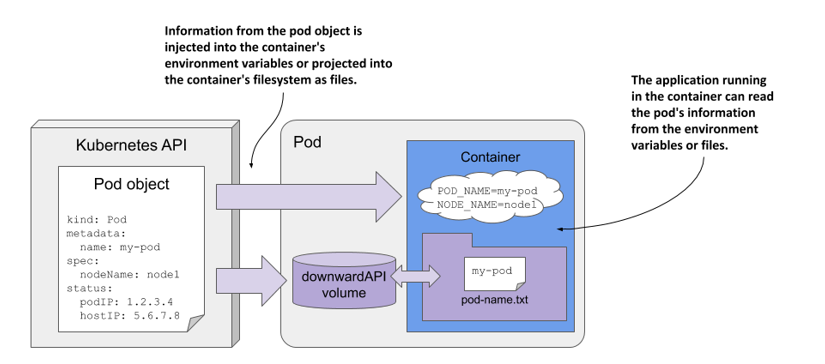

# 配置介绍

在容器化大行其道的当前，在为容器化应用提供配置信息方法一般有下面方法

*   制作镜像时，提前将定义好的配置文件拷贝进镜像之中
*   制作镜像时，内置环境变量，在启动容器时通过环境变量向容器传递配置数据，容器启动后将无法传递新的变量
*   启动容器时，基于存储卷向容器传递配置文件,但需要提前准备外部的存储
*   启动容器时，传递自定义的启动的命令，选项，参数

kubernetes提供了对 Pod 容器应用可以实现集中式的配置管理功能的相关资源：

-   ConfigMap
-   Secret
-   downwardAPI
-   Projected

通过这些组件来实现向pod中的容器应用中注入配置信息的机制，从而避免了开发者参与

注意：**对于运行中容器的配置改变，还需要通过应用程序重载相关配置才能生效**

## 配置组件简介

**configMap**

Configmap是Kubernetes集群中非常重要的一种配置管理资源对象。

借助于ConfigMap API可以向pod中的容器中注入配置信息。

ConfigMap不仅可以保存环境变量或命令行参数等属性，也可以用来保存整个配置文件或者JSON格式的 文件。

各种配置属性和数据以 k/v或嵌套k/v 样式 存在到Configmap中

注意：所有的配置信息都是**以明文的方式**来进行保存，实现资源配置的快速获取或者更新。

**Secret**

Kubernetes集群中，有一些配置属性信息是非常敏感的，所以这些信息在传递的过程中，是不希望其他人能够看到的

Kubernetes提供了一种加密场景中的配置管理资源对象Secret。

它在进行数据传输之前，会对数据进行编码，在数据获取的时候，会对数据进行解码。从而保证整个数 据传输过程的安全。

**注意：这些数据通常采用Base64机制保存，所以安全性一般**

**DownwardAPI**

downwardAPI 为运行在pod中的应用容器提供了一种反向引用。让容器中的应用程序了解所处pod或 Node的一些基础外部属性信息。

从严格意义上来说，downwardAPI不是存储卷，它自身就存在

相较于configmap、secret等资源对象需要创建后才能使用，而downwardAPI引用的是Pod自身的运行环境信息，这些信息在Pod启动的时候就存在

**Projected**

一个 projected Volumes 投射卷可以将若干现有的卷源映射到同一个目录之上。

# ConfigMap

Kubernetes提供了对pod中容器应用的集中配置管理组件：ConfigMap。

通过ConfigMap来实现向pod中的容器中注入配置信息的机制。

可以把configmap理解为Linux系统中的/etc目录，专门用来存储配置文件的目录

Kubernetes借助于ConfigMap对象实现了将配置信息从容器镜像中解耦，从而增强了工作负载的可移樟 性、使其配置更易于更改和管理并避免了将配置数据硬编码到Pod配置清单中

**ConfigMap不仅仅可以保存单个属性，也可以用来保存整个配置文件。**

从Kubernetes v1.19版本开始，ConfigMap和Secret支持使用**immutable字段**创建不可变实例，实现不 可变基础设施效果

## 基本属性

```shell
# kubectl explain cm
    binaryData              # 二进制数据
    data                    # 文本数据，支持变量和文件
    immutable <boolean>     # 设为true，不能被修改只能删除，默认为nil可以随时被修改
    
#注意：基于data的方式传递信息的话，会在pod的容器内部生成一个单独的数据文件    
```

数据配置的格式

```yaml
#单行配置数据格式
属性名称key: 属性值value   #单行配置内容，一般保存变量，参数等
文件名：单行内容            #配置文件如果只有一行，也使用此方式，key为文件名，value为文件内容


#多行文件数据格式     
文件名称1: |     #注意：| 是"多行键值"的标识符
 文件内容行1    #内容大小不能超过1M
 文件内容行2
 ......
文件名称2: |     #注意：| 是"多行键值"的标识符
 文件内容行1    #内容大小不能超过1M
 文件内容行2
 ......
```

configmap资源类型的创建，与Kubernetes的其他很多资源对象的创建方式一样，主要涉及到两种方式：

-   **命令行工具**：配置中有大量简单的键值对时建议使用
-   **资源定义文件**：配置为大量文本内容时建议使用，此方式需要事先准备在资源清单元文件中加入配置文件内容

通常为了避免配置更新后没有生效的问题，可以在更新 ConfigMap 之后，手动重创建相关的 Pod 或者 Deployment

-   运维方式：可以通过重启或重建的方式
    -   使用 kubectl rollout restart 命令来重启 Deployment
    -   使用 kubectl delete pod 命令来删除 Pod，从而触发 Pod 的重启

## ConfigMap创建

### 命令行

```shell
# 创建命令格式
kubectl create configmap NAME [--from-file=[key=]source] [--from-literal=key1=value1] [--dry-run=server|client|none] [-n <namespace>] [options]

# 参数详解：
--from-literal=key1=value1          #以设置键值对的方式实现变量配置数据
--from-env-file=/PATH/TO/FILE       #以环境变量专用文件的方式实现配置数据
--from-file=[key=]/PATH/TO/FILE     #以配置文件的方式创建配置文件数据，如不指定key，FILE名称为key名
--from-file=/PATH/TO/DIR            #以配置文件所在目录的方式创建配置文件数据

--dry-run=client -o yaml            #测试运行并显示cm内容


#查看configmap
kubectl create configmap <cm_name> -n <namespace> [-o yaml] --dry-run=client
kubectl get configmap <cm_name> -n <namespace>
kubectl describe configmap <cm_name> -n <namespace>


#删除configmap
kubectl delete configmap <cm_name> [-n <namespace>]
```

范例

**基于key/value形式的变量**

```shell
kubectl create configmap cm-test1 --from-literal=key1='value1' --from-literal=key2='value2' --dry-run=client -o yaml
apiVersion: v1
data:
  key1: value1
  key2: value2
kind: ConfigMap
metadata:
  creationTimestamp: null
  name: cm-test1
  
kubectl get cm
```

**基于环境变量文件**

```shell
# 注意：env文件中所有的配置项以“属性名=属性值”格式定制
cat env
key1=value1
key2=value2

kubectl create configmap cm-test2 --from-env-file=./env 

kubectl get cm cm-test2 -o yaml
apiVersion: v1
data:
  key1: value1
  key2: value2
kind: ConfigMap
metadata:
  creationTimestamp: "2025-04-01T02:51:27Z"
  name: cm-test2
  namespace: default
  resourceVersion: "794350"
  uid: 8f98984d-144b-4343-b0a3-e1433b437c55
  
kubectl delete cm cm-test2
```

**基于配置文件的文件**

```shell
tree conf.d/
conf.d/
├── app1.conf
├── app2.conf
└── app3.conf

kubectl create configmap cm-test3 --from-file=./conf.d/app1.conf --from-file=./conf.d/app2.conf --dry-run=client -o yaml
apiVersion: v1
data:
  app1.conf: | # 代表多行文本
    [app1]
    config1
  app2.conf: |
    [app2]
    config2
kind: ConfigMap
metadata:
  creationTimestamp: null
  name: cm-test3
  
#结果显示：多个文件之间，属性名是文件名，属性值是文件内容
```

**基于目录**

```shell
kubectl create cm cm-test4 --from-file=./conf.d/ --dry-run=client -o yaml
apiVersion: v1
data:
  app1.conf: | # 代表多行文本
    [app1]
    config1
  app2.conf: |
    [app2]
    config2
  app3.conf: |
    [app3]
    config3
kind: ConfigMap
metadata:
  creationTimestamp: null
  name: cm-test4
  
#结果显示：多个文件之间，属性名是文件名，属性值是文件内容
```

### **资源清单文件**

```yaml
vim storage-configmap-test.yaml
apiVersion: v1
kind: ConfigMap
metadata:
  name: config-test
data:
  author: xx
  file.conf: | # 可缩进
    [class]
      linux
      go
      java
```

**只读的configmap**

```yaml
vim storage-configmap-immutable-test.yaml
apiVersion: v1
kind: ConfigMap
metadata:
  name: cm-immutable-test
data:
  author: xx
  file.conf: |
    [class]
    linux
    go
    java
immutable: true  # 只读
```

## 更新configmap

```shell
kubectl create cm cm-nginx-conf --from-file=nginx.conf

# 1 
kubectl edit cm cm-nginx-conf

# 2
kubectl get cm cm-nginx-conf -o yaml > cm-config-conf.yaml
vim cm-config-conf.yaml
kubectl apply -f cm-config-conf.yaml

# 3
vim nginx.conf
kubectl create cm cm-nginx-conf --from-file=nginx.conf --dry-run=client -oyaml |kubectl apply -f -
```

## ConfigMap使用

**使用ConfigMap主要有两种方式：**

-   通过环境变量的方式直接传递pod
-   使用volume的方式挂载入到pod内的文件中

**注意：**

-   ConfigMap必须在Pod之前创建
-   与ConfigMap在同一个namespace内的pod才能使用ConfigMap**，即ConfigMap不能跨命名空间调用。**
-   ConfigMap通常存放的数据不要超过1M
-   CM 可以支持实时更新，在原来的pod里面直接看到效果

### 通过环境变量的方式直接传递 Pod

引用ConfigMap对象上特定的key，以**valueFrom**赋值给Pod上指定的环境变量

也可以在Pod上使用**envFrom**一次性导入ConfigMap对象上的所有的key-value,key(可以统一附加特定前 缀）即为环境变量,value自动成为相应的变量值

环境变量是容器启动时注入的，容器启动后变量的值不会随CM更改而发生变化,即一次性加载 configmap,除非删除容器重建


#### **env 对指定的变量一个一个赋值**

```yaml
kubectl explain pod.spec.containers.env
    name          # 手工定制环境变量时，设置环境变量的名称，必选字段
    value         # 手工定制环境变量时，直接设置环境变量的属性值，不通过CM获取配置，可选字段
    valueFrom     # #手工定制环境变量时，设置环境变量的属性来源，可以支持从CM,Secret,downwordAPI获取

kubectl explain pod.spec.containers.env.valueFrom.configMapKeyRef
    name          # 引用指定的configmap
    key           # 引用指定的configmap中的具体哪个key
    optional      # 如果设置为false，标识该项是必选项，如果设置为true标识这个key是可选的。默认false

#此方式实现过程
1）容器中自定义环境变量名
2）根据CM的名称和Key名，找到对应的value
3) 再将value赋值给容器的环境变量
```

```yaml
vim configmap-simple-env.yaml
apiVersion: v1
kind: ConfigMap
metadata:
  name: cm-nginx-config
data:
  port: "10086"  # 注意：只支持字符串，需要用引号引起来
  user: "www"
  time: "3600"
---
apiVersion: v1
kind: Pod
metadata:
  name: configmap-env-test
spec:
  containers:
  - name: configmap-env-test
    image: harbor.l00n9.icu/public/nginx:stable-perl
    command: ["/bin/sh", "-c", "sleep ${SPECIAL_TIME}"]
    env:
    - name: NGINX_HOST
      value: "10.0.0.10"  #直接变量赋值
    - name: NGINX_PORT
      valueFrom:
        configMapKeyRef:
          name: cm-nginx-config
          key: port
          optional: true  #true时,如果configmap中的key即使不存在,也不会导致容器无法初始
    - name: NGINX_USER
      valueFrom:
        configMapKeyRef:
          name: cm-nginx-config
          key: user
          optional: false  # false时，如果configmap中的key不存在，会导致容器无法初始化
    - name: SPECIAL_TIME   # 为command提供环境变量
      valueFrom:
        configMapKeyRef:
          name: cm-command-arg
          key: time      
    
# 不能动态更新
kubectl exec configmap-env-test -- env
PATH=/usr/local/sbin:/usr/local/bin:/usr/sbin:/usr/bin:/sbin:/bin
HOSTNAME=configmap-env-test
NGINX_HOST=10.0.0.10 # configmap
NGINX_PORT=10086     # configmap
NGINX_USER=www       # configmap
SPECIAL_TIME=3600    # configmap
KUBERNETES_PORT_443_TCP_PORT=443
KUBERNETES_PORT_443_TCP_ADDR=10.96.0.1
KUBERNETES_SERVICE_HOST=10.96.0.1
KUBERNETES_SERVICE_PORT=443
KUBERNETES_SERVICE_PORT_HTTPS=443
KUBERNETES_PORT=tcp://10.96.0.1:443
KUBERNETES_PORT_443_TCP=tcp://10.96.0.1:443
KUBERNETES_PORT_443_TCP_PROTO=tcp
NGINX_VERSION=1.26.3
NJS_VERSION=0.8.9
NJS_RELEASE=1~bookworm
PKG_RELEASE=1~bookworm
DYNPKG_RELEASE=2~bookworm
HOME=/root
```

#### **envFrom 使用CM的所有变量实现对变量的批量赋值，此方式生产更为推荐**

```yaml
kubectl explain pod.spec.containers.envFrom
    configMapRef     # ConfigMap对象中的所有Key
    secretKeyRef     # Secret对象中的所有Key
    prefix           # #为ConfigMap中的每个属性都添加前缀标识

#此方实现过程
1）容器中自定义环境变量名，并且和CM的key同名
2）找到指定的CM中所有Key名，将值批量直接赋值给容器中相同名称的变量
```

```yaml
vim configmap-simple-envfrom.yaml
apiVersion: v1
kind: ConfigMap
metadata:
  name: cm-nginx
data:
  NGINX_PORT: "10086"
  NGINX_USER: "www"
---
apiVersion: v1
kind: Pod
metadata:
  name: configmap-envfrom-test
spec:
  containers:
  - name: configmap-envfrom-test
    image: harbor.l00n9.icu/public/nginx:stable-perl
    envFrom:
    - configMapRef:
        name: cm-nginx  # 所有变量从cm中读取
        
kubectl exec configmap-envfrom-test -- env
PATH=/usr/local/sbin:/usr/local/bin:/usr/sbin:/usr/bin:/sbin:/bin
HOSTNAME=configmap-envfrom-test
NGINX_PORT=10086  # configmap
NGINX_USER=www    # configmap 
KUBERNETES_PORT_443_TCP_PORT=443
KUBERNETES_PORT_443_TCP_ADDR=10.96.0.1
KUBERNETES_SERVICE_HOST=10.96.0.1
KUBERNETES_SERVICE_PORT=443
KUBERNETES_SERVICE_PORT_HTTPS=443
KUBERNETES_PORT=tcp://10.96.0.1:443
KUBERNETES_PORT_443_TCP=tcp://10.96.0.1:443
KUBERNETES_PORT_443_TCP_PROTO=tcp
NGINX_VERSION=1.26.3
NJS_VERSION=0.8.9
NJS_RELEASE=1~bookworm
PKG_RELEASE=1~bookworm
DYNPKG_RELEASE=2~bookworm
HOME=/root
```

### 使用volume的方式挂载入到pod内的文件中

#### ConfigMap作为volume挂载到pod

```yaml
vim configmap-simple-volume.yaml
apiVersion: v1
kind: ConfigMap
metadata:
  name: cm-volume
data:
  author: xxn
  file.conf: |
    [app]
    config1
    config2

---
apiVersion: v1
kind: Pod
metadata:
  name: pod-volume-test
spec:
  volumes:
  - name: volume-config  # 指定卷名
    configMap:
      name: cm-volume    # 指定卷来自cm
  containers:
  - name: nginx
    image: harbor.l00n9.icu/public/nginx:stable-perl
    volumeMounts:
    - name: volume-config # 调用前面定义的卷名
      mountPath: /cmap/   # 指定Pod中的挂载点目录
```

```shell
kubectl exec pod-volume-test -- ls /cmap/
author
file.conf

kubectl exec pod-volume-test -- cat /cmap/file.conf
[app]
config1
config2

# edit后，会在随机时间后，动态更新到pod中
kubectl edit cm cm-volume

# 更新后..data会指向新的文件
# 这些文件虽然看起来是挂载在目录下，实际上，它是经过两层的软链接才能找到真正的挂载的文件，容器内挂载目录的生成的文件
kubectl exec pod-volume-test -- ls -a -l /cmap/
total 12
drwxrwxrwx 3 root root 4096 Apr  1 06:27 .
drwxr-xr-x 1 root root 4096 Apr  1 06:27 .. 
drwxr-xr-x 2 root root 4096 Apr  1 06:27 ..2025_04_01_06_27_39.1148715403 # 隐藏文件
lrwxrwxrwx 1 root root   32 Apr  1 06:27 ..data -> ..2025_04_01_06_27_39.1148715403 # 隐藏文件
lrwxrwxrwx 1 root root   13 Apr  1 06:27 author -> ..data/author
lrwxrwxrwx 1 root root   16 Apr  1 06:27 file.conf -> ..data/file.conf
# 通过这种双层软连接的方式，只要容器支持重载技术，那么只需要更改配置文件就可以实现容器应用的变动
# 只需改动..data的软连接，就可以更新所有软连接
```

#### **volume 挂载全部内容**

```shell
vim nginx.conf.d/default.conf
server {
    listen 8080;
    server_name localhost;
    location / {
        root /usr/share/nginx/html;
        index index.html index.htm;
    }
    error_page 500 502 503 504 /50x.html;
    location /50x.html {
        root /usr/share/nginx/html;
    }
}

kubectl create configmap cm-nginx-conf-files --from-file=nginx.conf.d/
```

```yaml
vim configmap-nginx-file.yaml
apiVersion: v1
kind: ConfigMap
metadata:
  name: cm-nginx-index
data:
  index.html: "Nginx Configmap Page!" # 单行内容生成configmap
---
apiVersion: v1
kind: Pod
metadata:
  name: pod-nginx-conf-configmap
spec:
  volumes:
  - name: nginx-conf
    configMap:
      name: cm-nginx-conf-files
      optional: false
  - name: nginx-index
    configMap:
      name: cm-nginx-index
      optional: false
  containers:
  - image: harbor.l00n9.icu/public/nginx:stable-perl
    name: nginx
    volumeMounts:
    - name: nginx-conf
      mountPath: /etc/nginx/conf.d/
      readOnly: true
    - name: nginx-index
      mountPath: /usr/share/nginx/html/
      readOnly: true
      
curl 10.244.1.88:8080
Nginx Configmap Page!
```

#### **volume 挂载 CM 中部分文件**

挂目录

```shell
ls nginx.conf.d
default.conf  myserver.conf  myserver-gzip.cfg  myserver-status.cfg

cat > nginx.conf.d/myserver.conf
server {
    listen 8888;
    server_name www.l00n9.icg;
    include /etc/nginx/conf.d/myserver-*.cfg;
    location / {
        root /usr/share/nginx/html;
    }
}

cat > nginx.conf.d/myserver-gzip.cfg 
gzip on;
gzip_comp_level 5;
gzip_proxied     expired no-cache no-store private auth;
gzip_types text/plain text/css application/xml text/javascript;

cat > nginx.conf.d/myserver-status.cfg 
location /nginx-status {
   stub_status on;
   access_log off;
}

kubectl create cm cm-nginx-conf-files --from-file=nginx.conf.d/
```

```yaml
vim configmap-nginx-files.yaml 
apiVersion: v1
kind: ConfigMap
metadata:
  name: cm-nginx-index
data:
  index.html: "Nginx Sub Configmap Page\n"
---
apiVersion: v1
kind: Pod
metadata:
  name: pod-cm-nginx-conf
spec:
  volumes:
  - name: nginx-conf
    configMap:   # 没有挂载default.conf文件
      name: cm-nginx-conf-files
      items:                            # 指定cm中的key
      - key: myserver.conf              # cm中的key名称
        path: myserver.conf             # Pod中的文件名
        mode: 0644                      # Pod中的文件权限
      - key: myserver-status.cfg
        path: myserver-status.cfg
        mode: 0644
      - key: myserver-gzip.cfg
        path: myserver-gzip.cfg
        mode: 0644
      optional: false
  - name: nginx-index
    configMap:
      name: cm-nginx-index
      optional: false
  containers:
  - image: harbor.l00n9.icu/public/nginx:stable-perl
    name: pod-cm-nginx-conf-container
    volumeMounts:
    - name: nginx-conf
      mountPath: /etc/nginx/conf.d/
      readOnly: true
    - name: nginx-index
      mountPath: /usr/share/nginx/html/
      readOnly: true
      
kubectl exec pod-cm-nginx-conf -- ls /etc/nginx/conf.d
myserver-gzip.cfg
myserver-status.cfg
myserver.conf
```

#### **volume 基于subpath实现挂载CM部分文件并修改配置文件名称**并保留原目录中的其它文件****

挂文件

```yaml
vim configmap-nginx-subpath.yaml
apiVersion: v1
kind: ConfigMap
metadata:
  name: cm-nginx-index
data:
  index.html: "Nginx Use Sub Configmap Page\n"
---
apiVersion: v1
kind: Pod
metadata:
  name: pod-cm-nginx-conf
spec:
  volumes:
  - name: nginx-conf
    configMap:
      name: cm-nginx-conf-files
      optional: false
  - name: nginx-index
    configMap:
      name: cm-nginx-index
      optional: false
  containers:
  - image: registry.cn-beijing.aliyuncs.com/wangxiaochun/nginx:1.20.0
    name: pod-cm-nginx-conf-container
    volumeMounts:
    - name: nginx-conf
      mountPath: /etc/nginx/conf.d/myserver2.conf   # 修改生成的配置文件名
      subPath: myserver.conf                        # 指定nginx-conf中的特定文件，而非所有文件
      readOnly: true
    - name: nginx-conf
      mountPath: /etc/nginx/conf.d/myserver-gzip2.cfg   # 修改生成的配置文件名
      subPath: myserver-gzip.cfg                        # 指定nginx-conf中的特定文件，而非所有文件
      readOnly: true
    - name: nginx-index
      mountPath: /usr/share/nginx/html/
      readOnly: true

kubectl exec pod-cm-nginx-conf -- ls /etc/nginx/conf.d
default.conf  # 原目录中的文件
myserver-gzip2.cfg
myserver2.conf
```

# Secret

Secret 和 Configmap 相似，也可以提供配置数据，但主要用于为Pod提供敏感需要加密的信息

Secret 主要用于存储密码、证书私钥，SSH 密钥，OAuth令牌等敏感信息，这些敏感信息采用base64编 码保存，相对明文存储更安全

相比于直接将敏感数据配置在Pod的定义或者镜像中，Secret提供了更加安全的机制，将需要共享的数 据进行加密，防止数据泄露。

Secret的对象需要单独定义并创建，通常以数据卷的形式挂载到Pod中，Secret的数据将以文件的形式 保存，容器通过读取文件可以获取需要的数据

Secret volume是通过tmpfs（内存文件系统）实现的，所以**这种类型的volume不是永久存储的。**

**每个Secret的数据不能超过1MB**，支持通过资源限额控制每个名称空间的Secret的数量

**注意: Secret 属于名称空间级别，只能被同一个名称空间的Pod引用**

**Secret 分成以下常见大的分类**

| 类型            | 解析                                                         |
| --------------- | ------------------------------------------------------------ |
| generic         | 通用类型，基于**base64编码**用来存储密码，公钥等。 常见的子类型有： Opaque,kubernetes.io/service-account-token,kubernetes.io/basicauth,kubernetes.io/ssh-auth,bootstrap.kubernetes.io/token,kubernetes.io/rbd |
| tls             | 专门用于保存tls/ssl用到证书和配对的私钥,常见的子类型:kubernetes.io/tls |
| docker-registry | 专用于让kubelet启动Pod时从私有镜像仓库pull镜像时，首先认证到仓库Registry时使用 常见的子类型:kubernetes.io/dockercfg,kubernetes.io/dockerconfigjson |

**Secret 细化为的子类型(Type)**

| 大类型          | Builtin Type                       | 说明                                        |
| --------------- | ---------------------------------- | ------------------------------------------- |
| generic         | opaque                             | arbitrary user-defined data                 |
| generic         | kubernetes.io/service-accounttoken | service account token                       |
| generic         | kubernetes.io/basic-auth           | credentials for basic authentication        |
| generic         | kubernetes.io/ssh-auth             | credentials for SSH authentication          |
| generic         | bootstrap.kubernetes.io/token      | bootstrap token data 初始化                 |
| tls             | kubernetes.io/tls                  | data for a TLS client or server             |
| docker-registry | kubernetes.io/dockerconfigjson     | serialized ~/ .docker/config.json file 新版 |
| docker-registry | kubernetes.io/dockercfg            | serialized -/ .dockercfg file 旧版          |

**注意：**

不同类型的Secret，在定义时支持使用的标准字段也有所不同

例如: ssh-auth类型的Secret应该使用ssh-privatekey，而basic-auth类型的Secret则需要使用 username和password等

另外也可能存在一些特殊的类型, 用于支撑第三方需求，例如: ceph的keyring信息使用的 kubernetes.io/rbd等

**Secret 创建方式**

-   **手动创建**：用户自行创建的Secret 常用来存储用户私有的一些信息
-   **自动创建**：集群自动创建的Secret 用来作为集群中各个组件之间通信的身份校验使用

## Secret命令式创建


```shell
# generic类型
kubectl create secret generic NAME [--type=string] [--from-file=[key=]source] [--from-literal=key1=value1]

--from-literal=key1=value1       #以命令行设置键值对的环境变量方式配置数据
--from-env-file=/PATH/FILE       #以环境变量的专用文件的方式配置数据
--from-file=[key=]/PATH/FILE     #以配置文件的方式创建配置数据，如不指定key，FILE名称为key名
--from-file=/PATH/DIR            #以配置文件所在目录的方式创建配置数据

#该命令中的--type选项进行定义除了后面docker-registry和tls命令之外的其它子类型，有些类型有key的特定要求
#注意: 如果vaule中有特殊字符,比如:$,\,*,=,!等,需要用\进行转义或用单引号''引起来

#tls类型
kubectl create secret tls NAME --cert=/path/file --key=/path/file
#其保存cert文件内容的key名称不能指定自动为tls.crt，而保存private key的key不能指定自动tls.key

#docker-registry类型
#方式1:基于用户名和密码方式实现
kubectl create secret docker-registry NAME --docker-username=user --docker-password=password --docker-email=email [--docker-server=string] [--from-file=[key=]source]

#方式2:基于dockerconfig文件方式实现
kubectl create secret docker-registry KEYNAME --from-file=.dockerconfigjson=path/to/.docker/config.json
#从已有的json格式的文件加载生成的就是dockerconfigjson类型，命令行直接生成的也是该类型
```

范例

```shell
# 创建generic类型
kubectl create secret generic my-secret-generic --from-file=/path/bar

kubectl create secret generic my-secret-generic --from-file=ssh-privatekey=~/.ssh/id_rsa --from-file=ssh-publickey=~/.ssh/id_rsa.pub

kubectl create secret generic my-secret-generic --from-literal=username=admin --from-literal=password=123456

kubectl create secret generic my-secret-generic --from-env-file=path/to/bar.env


# 创建tls类型
kubectl create secret tls my-secret-tls --cert=certs/wang.org.cert --key=certs/wang.org.key

#创建docker-registry类型
#参考示例：https://Kubernetesmeetup.github.io/docs/tasks/configure-pod-container/pull-image-private-registry/
#基于私有仓库的用户名和密码
kubectl create secret docker-registry my-secret-docker-registry --docker-server=harbor.l00n9.icu --docker-username=admin --docker-password=123456 --docker-email=29308620@qq.com

#先登录并认证到目标仓库server上，认证凭据自动保存在dockercfg文件中,基于dockerconfig文件实现
kubectl create secret docker-registry dockerharbor-auth --from-file=.dockerconfigjson=/root/.docker/config.json

kubectl create secret generic dockerharbor-auth --
type='kubernetes.io/dockerconfigjson' --from-file=.dockerconfigjson=/root/.docker/config.json
```

## Secret声明式创建

Secret 数据存放在data或stringData字段,其中**data字段中的Key/value必须使用base64编码存放**,而 stringData使用明文存放

Secret 资源的元数据：除了name, namespace之外，常用的还有labels, annotations

-   annotation的名称遵循类似于labels的名称命名格式，但其数据长度不受限制
-   它不能用于被标签选择器作为筛选条件；但常用于为那些仍处于Beta阶段的应用程序提供临时的配置接口
-   管理命令：kubectl annotate TYPE/NAME KEY=VALUE

## Secret使用

Secret资源在Pod中引用的方式有三种

-   环境变量
    -   引用Secret对象上特定的key，以valueFrom赋值给Pod上指定的环境变量
    -   在Pod上使用envFrom一次性导入Secret对象上的所有key-value，key(也可以统一附加特定前缀） 即为环境变量名,value自动成 为相应的变量值
    -   注意：容器很可能会将环境变量打印到日志中,基于安全考虑**不建议以环境变量方式引用Secret中的敏感数据**
-   secret卷
    -   在Pod上将Secret对象引用为存储卷，而后整体由容器mount至某个目录下,其中key名称转为文件 名，value的值转为相应的文件内容
    -   在Pod上定义Secret卷时，也可以仅引用其中的指定的部分key，而后由容器mount至目录下
-   拉取镜像
    -   在Pod 上使用 imagePullSecrets 拉取私有仓库镜像使用
    -   Pod引用Secret的方式：pods.spec.imagePullSecrets


### Generic 案例

generic 主要用于实现用户名和密码的加密保存

generic加密保存要注意换行问题 `\n `

```shell
kubectl create secret generic secret-mysql-root --from-literal=username=root --from-literal=password=123456

# 查看Generic使用Base64编码
kubectl  get secrets secret-mysql-root -o yaml
apiVersion: v1
data:
  password: MTIzNDU2
  username: cm9vdA==
kind: Secret
metadata:
  creationTimestamp: "2025-04-02T07:46:57Z"
  name: secret-mysql-root
  namespace: default
  resourceVersion: "955802"
  uid: 498f3ef0-4c22-4645-820a-ffc931ff8913
type: Opaque

echo -n "MTIzNDU2" | base64 -d
123456
echo -n "cm9vdA==" | base64 -d
root
```

**stringData明文数据**

```yaml
vim storage-secret-opaque-stringData.yaml
apiVersion: v1
kind: Secret
metadata:
  name: secret-stringdata
  namespace: default
type: opaque
stringData:                  # stringData表示明文存放数据，data表示必须以base64编码存放
  user: 'admin'
  password: '123456'
  
kubectl apply -f storage-secret-opaque-stringData.yaml 
apiVersion: v1
data:
  password: MTIzNDU2
  user: YWRtaW4=
kind: Secret
metadata:
  annotations:
    kubectl.kubernetes.io/last-applied-configuration: |
      {"apiVersion":"v1","kind":"Secret","metadata":{"annotations":{},"name":"secret-stringdata","namespace":"default"},"stringData":{"password":"123456","user":"admin"},"type":"opaque"}
  creationTimestamp: "2025-04-02T07:50:44Z"
  name: secret-stringdata
  namespace: default
  resourceVersion: "956639"
  uid: b94d3f99-46dc-4721-9ba3-b9a7fa6d2470
type: opaque
```

#### 作为pod环境变量

```yaml
at storage-secret-mysql-init.yaml 
apiVersion: v1
kind: Secret
metadata:
  name: secret-mysql
type: kubernetes.io/basic-auth
# type: Opaque  # 也可以用Opaque类型
data:
  username: cm9vdA==
  password: MTIzNDU2
---
apiVersion: v1
kind: Pod
metadata:
  name: pod-secret-mysql-init
spec:
  containers:
  - name: mysql
    image: registry.cn-beijing.aliyuncs.com/wangxiaochun/mysql:8.0.29-oracle
    env:
    - name: MYSQL_ROOT_PASSWORD
      valueFrom:
        secretKeyRef:
          name: secret-mysql   # 引用指定的secret
          key: password        # 引用指定的secret中对应的key
          optional: false      # 必须存在
```

#### 通过卷挂载

```yaml
cat > storage-secret-test-pod.yaml 
apiVersion: v1
kind: Secret
metadata:
  name: secret-test
type: kubernetes.io/basic-auth
data:
  username: YWRtaW4=
  password: cGFzc3dvcmQ=

# 说明：
#type类型指定为 Opaque 或者 kubernetes.io/basic-auth,username和password是加密的信息
#资源定义文件时，与命令行创建secret的--from-literal=username=admin 效果是一样的,但命令行的变量无需加密

---
# 调用secret的清单文件
apiVersion: v1
kind: Pod
metadata:
  name: pod-secret-volume
spec:
  volumes:
  - name: secret
    secret:
      secretName: secret-test    # 指定secret的名称
  containers:
  - name: secret-test-container
    image: harbor.l00n9.icu/public/nginx:stable-perl
    volumeMounts:
    - name: secret
      mountPath: /secret/
      readOnly: true
```

#### 为 Service Account 创建 Secret

```yaml
cat storage-secret-sa.yaml
apiVersion: v1
kind: ServiceAccount
metadata:
  name: testsa
---
apiVersion: v1
kind: Secret
type: kubernetes.io/service-account-token
metadata:
  name: testsa-secret
  namespace: default
  annotations:
    kubernetes.io/service-account.name: "testsa"
```

### TLS案例

TLS 类型的 Secret 主要用于对**https场景**的证书和密钥文件来进行加密传输

```shell
kubectl create secret tls NAME --cert=/path/file --key=/path/file

#注意：
#保存cert文件内容的key名称不能指定，自动为tls.crt，卷挂载后生成的文件名也为tls.crt
#保存private key文件内容的key不能指定,自动为tls.key，卷挂载后生成的文件名也为tls.key
```

创建 TLS 证书文件

```shell
# 生成私钥
openssl genrsa -out nginx-certs/mystical.org.key 2048

# 生成自签证书
openssl req -new -x509 -key nginx-certs/mystical.org.key -days 3650 -out nginx-certs/mystical.org.crt -subj /C=CN/ST=Beijing/L=Beijing/O=DevOps/CN=www.mystical.org
#注意：CN指向的域名必须是nginx配置中使用的域名信息

# 查看文件
ls nginx-certs/
mystical.org.crt  mystical.org.key
```

基于 TLS 证书文件创建对应的 Secret

```shell
kubectl create secret tls secret-nginx-ssl --cert=nginx-certs/mystical.org.crt  --key=nginx-certs/mystical.org.key 
```

准备Nginx配置文件

```shell
vim myserver.conf
server {
    listen 80;
    server_name www.xx.org;
    return 301 https://$host$request_uri;
}

server {
    listen 443 ssl;
    server_name www.mystical.org;
    
     ssl_certificate /etc/nginx/certs/tls.crt; 
     ssl_certificate_key /etc/nginx/certs/tls.key;
     ssl_session_timeout 5m;
     ssl_protocols TLSv1 TLSv1.1 TLSv1.2 TLSv1.3; 
     ssl_ciphers ECDHE-RSA-AES128-GCM-SHA256:HIGH:!aNULL:!MD5:!RC4:!DHE; 
     ssl_prefer_server_ciphers on;
     include /etc/nginx/conf.d/myserver-*.cfg;

     location / {
         root /usr/share/nginx/html;
     }
}

vim myserver-gzip.cfg
gzip on;
gzip_comp_level 5;
gzip_proxied     expired no-cache no-store private auth;
gzip_types text/plain text/css application/xml text/javascript;


# nginx的状态页配置文件myserver-status.cfg
vim myserver-status.cfg
location /status {
   stub_status on;
   access_log off;
}
```

创建配置文件对应的 Configmap

```shell
kubectl create configmap cm-nginx-ssl-conf --from-file=nginx-ssl-conf.d/
```

创建引用Secret和configmap资源配置文件

```yaml
cat storage-secret-nginx-ssl.yaml
apiVersion: v1
kind: Pod
metadata:
  name: pod-nginx-ssl
  namespace: default
spec:
  volumes:
  - name: nginx-certs
    secret:
      secretName: secret-nginx-ssl
  - name: nginx-confs
    configMap:
      name: cm-nginx-ssl-conf
      optional: false
  containers:
  - image: registry.cn-beijing.aliyuncs.com/wangxiaochun/nginx:1.20.0
    name: nginx-ssl-server
    volumeMounts:
    - name: nginx-certs
      mountPath: /etc/nginx/certs/  # 其保存cert文件自动命名为tls.crt，而private key文件会自动命名为tls.key
      readOnly: true
    - name: nginx-confs
      mountPath: /etc/nginx/conf.d/
      readOnly: true

# 查看生成的证书文件，表示为关联时间戳目录下的两个双层软链接文件tls.crt和tls.key,保存证书的原始文件,而非base64格式
kubectl exec -it pod-nginx-ssl -- ls -l /etc/nginx/certs/
total 0
lrwxrwxrwx 1 root root 14 Jan  2 02:47 tls.crt -> ..data/tls.crt
lrwxrwxrwx 1 root root 14 Jan  2 02:47 tls.key -> ..data/tls.key
```

### Docker-registry案例

1

```shell
kubectl create secret docker-registry KEYNAME --docker-server=DOCKER_REGISTRY_SERVER --docker-username=DOCKER_USER --docker-password=DOCKER_PASSWORD --docker-email=EMAIL
```

2

```shell
docker login --username=DOCKER_USER DOCKER_REGISTRY_SERVER

#基于config.json文件生成secret
kubectl create secret docker-registry KEYNAME --from-file=.dockerconfigjson=path/to/.docker/config.json
# 或
kubectl create secret generic KEYNAME --type='kubernetes.io/dockerconfigjson' --from-file=.dockerconfigjson=/root/.docker/config.json
```

安装harbor

修改所有集群节点的Docker配置支持私有仓库

```shell
vim /etc/docker/daemon.json 
{
      "registry-mirrors": ["https://si7y70hh.mirror.aliyuncs.com"],
      "insecure-registries": ["harbor.mystical.org"], # 添加此行
      
     }
systemctl restart docker
```

使用创建的secret让k8s从私有仓中拉取镜像

```yaml
cat storage-secret-docker-registry-harbor.yaml 
apiVersion: apps/v1
kind: Deployment
metadata:
  name: deployment-harbor-docker-registry-secret
spec:
  replicas: 3
  selector:
    matchLabels:
      app: pod-test-harbor-docker-registry-secret
  template:
    metadata:
      labels:
        app: pod-test-harbor-docker-registry-secret
    spec:
      containers:
      - name: pod-test-harbor-docker-registry-secret
        image: harbor.mystical.org/example/nginx:1.20.0
      imagePullSecrets:
      - name: harbor-docker-registry-secret  # 指定docker-registry类型的secret，如果有多个会逐个验证
      - name: xxxx
```

**不同名称空间 Pod 使用 Secret 拉取私有镜像解决方案**

在 Kubernetes 中，**不同命名空间的 Pod 不能直接使用其他命名空间下的 Secret**。默认情况下，Secret 的作用范围**仅限于其所在的命名空间**，也就是说，你不能在 `my-namespace` 下的 Pod 直接使用 `default` 命名空间的 Secret 来拉取 Harbor 镜像。

1️⃣ **复制 Secret 到目标命名空间（推荐）**

最简单的方法是**复制 `default` 命名空间的 Secret 到其他命名空间**：

```shell
kubectl get secret my-secret -n default -o yaml | sed 's/namespace: default/namespace: my-namespace/g' | kubectl apply -f -
```

**适用于多个命名空间需要共用 Secret 的情况**。

2️⃣ **使用 Mutating Admission Webhook 自动注入 Secret**

如果你不想手动复制 Secret，可以使用 Kubernetes **Mutating Admission Webhook**，自动在创建 Pod 时**注入 `imagePullSecrets`**。

3️⃣ **使用 `kubelet` 的 `dockercfg` 共享**

如果集群规模较大，**可以将 Harbor 认证信息放入 `/var/lib/kubelet/config.json`**，这样所有 `namespace` 的 Pod 都可以拉取私有镜像：

```
cp ~/.docker/config.json /var/lib/kubelet/
systemctl restart kubelet
```

但这种方式适用于 **无 RBAC 限制的环境**

如果你的需求是 **Pod 跨命名空间共用 Secret**，推荐 **直接复制 Secret**（方案 1），或者**使用 Admission Webhook** 进行自动注入（方案 2）。

# downwardAPI

在Kubernetes中 可以基于一种 downwardAPI 的对象，**将宿主机相关的信息以存储卷的样式加载到pod内部**。

相较于configmap、secret等资源对象需要创建后才能使用，downwardAPI 不是存储卷，无需人为创 建，它自身一直就存在。

downwardAPI 不是一种独立的API资源类型，只是一种引用Pod自身的运行环境信息

downwardAPI 包括Pod的metadata,spect或status字段值，将这些信息注入到容器内部的方式

downwardAPI 为运行在pod中的应用容器提供了一种反向引用。让容器中的应用程序了解所处pod或 Node的一些基础属性信息。



不过，**通常只有常量类型的属性**才能够通过环境变量注入到容器中，毕竟，在进程启动完成后无法再向 其告知变量值的变动，于是，环境变量也就不支持中途的更新操作。

**DownwardAPI提供了两种方式用于将 Pod 的信息注入到容器内部**

-   **环境变量**：用于单个变量，可以将 Pod 信息和容器信息直接注入容器内部
-   **Volume挂载**：将 Pod 信息生成为文件，再挂载到容器内部中

类似于ConfigMap或Secret资源，容器能够在环境变量中**valueFrom字段**中基于**两个字段**来引用其所属 Pod对象的元数据信息

-   **fieldRef**：引用常规性的元数据
-   **resourceFieldRef**：引用和资源限制和资源请求相关的元数据

**Downward API fields injected via the fieldRef field**

| Field                       | Description                                                  | Allowed in env | Allowed in volume |
| --------------------------- | ------------------------------------------------------------ | -------------- | ----------------- |
| metadata.name               | The pod’s name.                                              | Yes            | Yes               |
| metadata.namespace          | The pod’s namespace.                                         | Yes            | Yes               |
| metadata.uid                | The pod’s UID.                                               | Yes            | Yes               |
| metadata.labels             | All the pod’s labels, one label per line, formatted as key=” value” . | No             | Yes               |
| metadata.labels['key']      | The value of the specified label.                            | Yes            | Yes               |
| metadata.annotations        | All the pod’s annotations, one per line, formatted as key=” value” . | No             | Yes               |
| metadata.annotations['key'] | The value of the specified annotation.                       | Yes            | Yes               |
| spec.nodeName               | The name of the worker node the pod runs on.                 | Yes            | No                |
| spec.serviceAccountName     | The name of the pod’s service account.                       | Yes            | No                |
| status.podIP                | The pod’s IP address                                         | Yes            | No                |
| status.hostIP               | The worker node’s IP address.                                | Yes            | No                |

**Table 9.6 Downward API resource fields injected via the resourceFieldRef field**

| Resource field             | Description                                | Allowed in env | Allowed in vol |
| -------------------------- | ------------------------------------------ | -------------- | -------------- |
| requests.cpu               | The container’s CPU request.               | Yes            | Yes            |
| requests.memory            | The container’s memory request.            | Yes            | Yes            |
| requests.ephemeral-storage | The container’s ephemeral storage request. | Yes            | Yes            |
| limits.cpu                 | The container’s CPU limit.                 | Yes            | Yes            |
| limits.memory              | The container’s memory limit.              | Yes            | Yes            |
| limits.ephemeral-storage   | The container’s ephemeral storage limit.   | Yes            | Yes            |

## downwardAPI案例

### 获取基本的变量信息通过变量方式引用

```yaml
vim storage-downwardapi-env-test.yaml
apiVersion: v1
kind: Pod
metadata:
  name: downwardapi-env-test
  labels:
    app: downwardapi-env
spec:
  containers:
  - name: downwardapi-env-test
    image: registry.cn-beijing.aliyuncs.com/wangxiaochun/pod-test:v0.1
    resources:
      requests:
        memory: "32Mi"
        cpu: "250m"
      limits:
        memory: "64Mi"
        cpu: "500m"
    env:
    - name: THIS_POD_NAME
      valueFrom:
        fieldRef:                 
          fieldPath: metadata.name 
          # "fieldPath"指定的是 Pod 的某些元数据字段的路径，它告诉 Kubernetes 要从 Pod 的哪些部分提取值。
    - name: THIS_POD_NAMESPACE
      valueFrom:
        fieldRef:
          fieldPath: metadata.namespace
    - name: THIS_APP_LABEL
      valueFrom:
        fieldRef:
          fieldPath: metadata.labels['app']
    - name: THIS_CPU_LIMIT
      valueFrom:
        resourceFieldRef:
          resource: limits.cpu
    - name: THIS_MEM_REQUEST
      valueFrom:
        resourceFieldRef:
          resource: requests.memory
          divisor: 1Mi
    - name: VAR_REF
      value: $(THIS_POD_NAMESPACE).wang.org  # 变量引用格式:$(VAR_NAME)
```

### 存储卷方式使用

```yaml
vim storage-downwardapi-volume-test.yaml
apiVersion: v1
kind: Pod
metadata:
  name: downwardapi-volume-test
  labels:
    zone: Beijing
    rack: zhongguancun
    app: redis-master
  annotations:
    region: Asia-China
spec:
  volumes:
  - name: podinfo
    downwardAPI:
      defaultMode: 0420  # 文件权限，默认0644
      items:
      - fieldRef:
          fieldPath: metadata.namespace
        path: pod_namespace
      - fieldRef:
          fieldPath: metadata.labels
        path: pod_labels
      - fieldRef:
          fieldPath: metadata.annotations
        path: pod_annotations
      - resourceFieldRef:
          containerName: downwardapi-volume-test
          resource: limits.cpu
        path: "cpu_limit"
      - resourceFieldRef:
          containerName: downwardapi-volume-test
          resource: requests.memory
          divisor: "1Mi"              # 将资源值进行整除操作，从而将资源值转换为以指定单位为基准的整数值。
        path: "mem_request"
  containers:
  - name: downwardapi-volume-test
    image: registry.cn-beijing.aliyuncs.com/wangxiaochun/pod-test:v0.1
    resources:
      requests:
        memory: "32Mi"
        cpu: "250m"
      limits:
        memory: "64Mi"
        cpu: "500m"
    volumeMounts:
    - name: podinfo
      mountPath: /etc/podinfo
      readOnly: false
```

# Projected

之前的CM,Secret等卷资源在Pod内的一个目录同时只能挂载一个卷，而我们有时希望在一个目录内生成 来自多个卷的多个文件

**Projected volumes 是一种特殊的卷类型，支持同时投射多个卷至同一个挂载点**

Projected 不是一个独立的API 资源类型，但其可以引用现有的configmap、secret资源对象，或 downwardAPI中的元数据信息

此类的卷一般用于为容器提供预先定义好的数据


**Projected Volume仅支持对如下四种类型的卷（数据源）进行投射操作**

-   **Secret**：投射Secret对象
-   **ConfigMap**：投射ConfgMap对象
-   **DownwardAPI**：投射Pod元数据
-   **ServiceAccountToken**：投射ServiceAccountToken

Example configuration with a secret, a downwardAPI, and a configMap

```yaml
vim storage-projected-demo.yaml
apiVersion: v1
kind: Secret
metadata:
  name: mysecret
  namespace: default
data:
  username: d2FuZ3hpYW9jaHVu
type: Opaque
---
apiVersion: v1
kind: ConfigMap
metadata:
  name: myconfigmap
  namespace: default
data:
  myconfig: Hello, Myconfig
---
apiVersion: v1
kind: Pod
metadata:
  name: projected-volume-demo
spec:
  containers:
  - name: container-test
    image: registry.cn-beijing.aliyuncs.com/wangxiaochun/pod-test:v0.1
    volumeMounts:
    - name: all-in-one
      mountPath: "/projected-volume"
      readOnly: true
  volumes:
  - name: all-in-one
    projected:
      sources:
      - secret:
          name: mysecret
          items:
          - key: username
            path: my-group/my-username
      - downwardAPI:
          items:
          - path: "labels"
            fieldRef:
              fieldPath: metadata.labels
          - path: "cpu_limit"
            resourceFieldRef:
              containerName: container-test
              resource: limits.cpu
      - configMap:
          name: myconfigmap
          items:
          - key: myconfig
            path: my-group/my-config
            
            
kubectl exec projected-volume-demo -- ls /projected-volume -l
total 0
lrwxrwxrwx    1 root     root            16 Jan  2 10:03 cpu_limit -> ..data/cpu_limit
lrwxrwxrwx    1 root     root            13 Jan  2 10:03 labels -> ..data/labels
lrwxrwxrwx    1 root     root            15 Jan  2 10:03 my-group -> ..data/my-group

kubectl exec projected-volume-demo -- ls /projected-volume/my-group/  -l
total 8
-rw-r--r--    1 root     root            15 Jan  2 10:03 my-config
-rw-r--r--    1 root     root            12 Jan  2 10:03 my-username
```

# 综合案例：使用持久卷部署WordPress和MySQL

在kubernetes部署 wordpress，要满足以下要求：

-   部署一个独立的nginx Pod实例，为wordpress提供反向代理；同时提供https和http虚拟主机，其中发往http的请求都重定向给https；以ConfigMap和Secret提供必要的配置
-   独立部署两个wordpress Pod实例，它们使用NFS StorageClass 存储卷存储用户上传的图片或文 件等数据；以ConfigMap和Secret提供必要的配置
-   部署一个MySQL数据库；以ConfigMap和Secret提供必要的配置
-   service 暴露 nginx的服务，然后以反向代理的方式进行访问
-   动态的蓝绿发布和滚动发布
    -   对于wordpress 来说，没有本质的区别
    -   nginx的更新，依赖configmap和secret的内容


## 目录结构

```shell
[root@master1 lnmp] # ls
mysql  nginx  nginx.conf.d  plugin  wordpress

[root@master1 lnmp] # tree .
.
├── mysql
│   ├── lnmp-mysql.yaml
│   └── service-mysql.yaml
├── nginx
│   ├── lnmp-nginx-deloyment.yaml
│   ├── service-nginx.yaml
│   └── tls
│       ├── mystical.org.crt
│       └── mystical.org.key
├── nginx.conf.d
│   └── wordpress.mystical.org.conf
├── plugin
│   ├── metalLB
│   │   ├── metallb-native.yaml
│   │   ├── service-metallb-IPAddressPool.yaml
│   │   └── service-metallb-L2Advertisement.yaml
│   └── nfc-sc
│       ├── nfs-client-provisioner.yaml
│       ├── nfs-storageClass.yaml
│       └── rbac.yaml
└── wordpress
    ├── lnmp-wordpress.yaml
    ├── service-wordpress-loadbalancer.yaml
    └── service-wordpress.yaml
```

## MetalLB

```yaml
# 插件清单 -- MetalLB
[root@master1 lnmp] # METALLB_VERSION='v0.14.7'
[root@master1 lnmp] # wget https://raw.githubusercontent.com/metallb/metallb/${METALLB_VERSION}/config/manifests/metallb-native.yaml

# 应用
[root@master1 metalLB]# kubectl apply -f metallb-native.yaml 

# 创建地址池
# 注意: IPAddressPool 必须使用Kuberetes集群节点的IP地址段
[root@master1 metalLB]#vim service-metallb-IPAddressPool.yaml
apiVersion: metallb.io/v1beta1
kind: IPAddressPool
metadata:
  name: localip-pool
  namespace: metallb-system
spec:
  addresses:
  - 10.0.0.10-10.0.0.50
  autoAssign: true
  avoidBuggyIPs: true
  
# 应用
[root@master1 metalLB]#kubectl apply -f service-metallb-IPAddressPool.yaml
ipaddresspool.metallb.io/localip-pool created

# 创建二层公告机制
[root@master1 metalLB]#vim service-metallb-L2Advertisement.yaml
apiVersion: metallb.io/v1beta1
kind: L2Advertisement
metadata:
  name: localip-pool-l2a
  namespace: metallb-system
spec:
  ipAddressPools:
  - localip-pool
  interfaces:
  - eth0 # 用于发送免费ARP公告

# 应用
[root@master1 metalLB] # kubectl apply -f service-metallb-L2Advertisement.yaml 
l2advertisement.metallb.io/localip-pool-l2a created
```

## 存储制备器

```yaml
# 存储制备器
[root@master1 nfc-sc]#cat rbac.yaml 
apiVersion: v1
kind: Namespace
metadata:
  name: nfs-provisioner-demo
---
apiVersion: v1
kind: ServiceAccount
metadata:
  name: nfs-client-provisioner
  # replace with namespace where provisioner is deployed 根据业务需要修改此处名称空间
  namespace: nfs-provisioner-demo
  
---
apiVersion: rbac.authorization.k8s.io/v1
kind: ClusterRole
metadata:
  name: nfs-client-provisioner-runner
rules:
  - apiGroups: [""]
    resources: ["nodes"]
    verbs: ["get", "list", "watch"]
  - apiGroups: [""]
    resources: ["persistentvolumes"]
    verbs: ["get", "list", "watch", "create", "delete"]
  - apiGroups: [""]
    resources: ["persistentvolumeclaims"]
    verbs: ["get", "list", "watch", "update"]
  - apiGroups: ["storage.k8s.io"]
    resources: ["storageclasses"]
    verbs: ["get", "list", "watch"]
  - apiGroups: [""]
    resources: ["events"]
    verbs: ["create", "update", "patch"]
  - apiGroups: [""]
    resources: ["services", "endpoints"]
    verbs: ["get", "list", "watch", "create", "update", "delete"]
    
---
apiVersion: rbac.authorization.k8s.io/v1
kind: ClusterRoleBinding
metadata:
  name: run-nfs-client-provisioner
subjects:
  - kind: ServiceAccount
    name: nfs-client-provisioner
    # replace with namespace where provisioner is deployed
    namespace: nfs-provisioner-demo
roleRef:
  kind: ClusterRole
  name: nfs-client-provisioner-runner
  apiGroup: rbac.authorization.k8s.io
  
---
apiVersion: rbac.authorization.k8s.io/v1
kind: Role
metadata:
  name: leader-locking-nfs-client-provisioner
  # replace with namespace where provisioner is deployed
  namespace: nfs-provisioner-demo
rules:
  - apiGroups: [""]
    resources: ["endpoints"]
    verbs: ["get", "list", "watch", "create", "update", "patch"]
    
---
kind: RoleBinding
apiVersion: rbac.authorization.k8s.io/v1
metadata:
  name: leader-locking-nfs-client-provisioner
  # replace with namespace where provisioner is deployed
  namespace: nfs-provisioner-demo
subjects:
  - kind: ServiceAccount
    name: nfs-client-provisioner
    # replace with namespace where provisioner is deployed
    namespace: nfs-provisioner-demo
roleRef:
  kind: Role
  name: leader-locking-nfs-client-provisioner
  apiGroup: rbac.authorization.k8s.io
  
# 应用
[root@master1 nfc-sc] # kubectl apply -f rbac.yaml

[root@master1 nfc-sc] # cat nfs-client-provisioner.yaml 
apiVersion: apps/v1
kind: Deployment
metadata:
  name: nfs-client-provisioner
  labels:
    app: nfs-client-provisioner
  namespace: nfs-provisioner-demo
spec:
  replicas: 1
  strategy:
    type: Recreate
  selector:
    matchLabels:
      app: nfs-client-provisioner
  template:
    metadata:
      labels:
        app: nfs-client-provisioner
    spec:
      serviceAccountName: nfs-client-provisioner
      containers:
      - name: nfs-client-provisioner     
        image: k8s.gcr.io/sig-storage/nfs-subdir-external-provisioner:v4.0.2 #此镜像国内可能无法访问
        imagePullPolicy: IfNotPresent
        volumeMounts:
        - name: nfs-client-root
          mountPath: /persistentvolumes
        env:
        - name: PROVISIONER_NAME
          value: k8s-sigs.io/nfs-subdir-external-provisioner # 名称确保与nfs-StorageClass.yaml文件中的provisioner名称保持一致
        - name: NFS_SERVER
          value: nfs.mystical.org
        - name: NFS_PATH
          value: /nfs-data/sc-nfs
      volumes:
      - name: nfs-client-root
        nfs:
          server: nfs.mystical.org
          path: /nfs-data/sc-nfs

# 应用
[root@master1 nfc-sc] # kubectl apply -f nfs-client-provisioner.yaml

[root@master1 nfc-sc] # cat nfs-storageClass.yaml 
apiVersion: storage.k8s.io/v1
kind: StorageClass
metadata:
  name: sc-nfs
  annotations:
    storageclass.kubernetes.io/is-default-class: "false" # 是否设置为默认的storageClass
provisioner: k8s-sigs.io/nfs-subdir-external-provisioner # or choose another name, must match deployment's env PROVISIONER_NAME
parameters:
  archiveOnDelete: "true"

# 应用
[root@master1 nfc-sc] # kubectl apply -f nfs-storageClass.yaml 
```

## MySQL

```yaml
# MySQL清单资源
[root@master1 lnmp] # cat mysql/lnmp-mysql.yaml 
apiVersion: v1
kind: Secret
metadata:
  name: mysql-pass
type: kubernetes.io/basic-auth
data:
  password: MTIzNDU2

---
apiVersion: v1
kind: PersistentVolumeClaim
metadata:
  name: mysql-pv-claim
  labels:
    app: wordpress
spec:
  storageClassName: sc-nfs
  accessModes:
  - ReadWriteOnce
  resources:
    requests:
      storage: 20Gi

---
apiVersion: apps/v1
kind: Deployment
metadata:
  name: wordpress-mysql
  labels:
    app: wordpress
spec:
  selector:
    matchLabels:
      app: wordpress
      tier: mysql
  strategy:
    type: Recreate
  template:
    metadata:
      labels:
        app: wordpress
        tier: mysql
    spec:
      containers:
      - image: registry.cn-beijing.aliyuncs.com/wangxiaochun/mysql:8.0.29-oracle
        name: mysql
        env:
        - name: MYSQL_ROOT_PASSWORD
          valueFrom:
            secretKeyRef:
              name: mysql-pass
              key: password
        - name: MYSQL_DATABASE
          value: wordpress
        - name: MYSQL_USER
          value: wordpress
        - name: MYSQL_PASSWORD
          valueFrom:
            secretKeyRef:
              name: mysql-pass
              key: password
        ports:
        - containerPort: 3306
          name: mysql
        volumeMounts:
        - name: mysql-persistent-storage
          mountPath: /var/lib/mysql
      volumes:
      - name: mysql-persistent-storage
        persistentVolumeClaim:
          claimName: mysql-pv-claim

# 应用
[root@master1 nfc-sc] # kubectl apply -f mysql/lnmp-mysql.yaml

[root@master1 lnmp] # cat mysql/service-mysql.yaml 
apiVersion: v1
kind: Service
metadata:
  name: wordpress-mysql
  labels:
    app: wordpress
spec:
  ports:
  - port: 3306
  selector:
    app: wordpress
    tier: mysql
  clusterIP: None

# 应用
[root@master1 nfc-sc] # kubectl apply -f mysql/service-mysql.yaml
```

## wordpress

```yaml
# wordpress资源清单
[root@master1 lnmp] # cat wordpress/lnmp-wordpress.yaml 
apiVersion: v1
kind: PersistentVolumeClaim
metadata:
  name: wp-pv-claim
  labels:
    app: wordpress
spec:
  storageClassName: sc-nfs
  accessModes:
  - ReadWriteOnce
  resources:
    requests:
      storage: 20Gi

---
apiVersion: apps/v1
kind: Deployment
metadata:
  name: wordpress
  labels:
    app: wordpress
spec:
  replicas: 2
  selector:
    matchLabels:
      app: wordpress
      tier: frontend
  strategy:
    type: Recreate
  template:
    metadata:
      labels:
        app: wordpress
        tier: frontend
    spec:
      containers:
      - image: registry.cn-beijing.aliyuncs.com/wangxiaochun/wordpress:php8.2-apache
        name: wordpress
        env:
        - name: WORDPRESS_DB_HOST
          value: wordpress-mysql
        - name: WORDPRESS_DB_PASSWORD
          valueFrom:
            secretKeyRef:
              name: mysql-pass
              key: password
        - name: WORDPRESS_DB_USER
          value: wordpress
        ports:
        - containerPort: 80
          name: wordpress
        volumeMounts:
        - name: wordpress-persistent-storage
          mountPath: /var/www/html
      volumes:
      - name: wordpress-persistent-storage
        persistentVolumeClaim:
          claimName: wp-pv-claim
          
# 应用
[root@master1 nfc-sc] # kubectl apply -f wordpress/lnmp-wordpress.yaml

[root@master1 lnmp] # cat wordpress/service-wordpress.yaml 
apiVersion: v1
kind: Service
metadata:
  name: wordpress
  labels:
    app: wordpress
spec:
  ports:
  - port: 80
  selector:
    app: wordpress
    tier: frontend
  clusterIP: None

# 应用
[root@master1 nfc-sc] # kubectl apply -f wordpress/service-wordpress.yaml
```

## nginx

```yaml
# nginx资源清单
# nginx配置文件
[root@master1 lnmp] # cat nginx.conf.d/wordpress.mystical.org.conf 
server {
    listen 80;
    server_name wordpress.mystical.org;
    return 301 https://$host$request_uri;
}

server {
    listen 443 ssl;
    server_name www.mystical.org;
    
    ssl_certificate /etc/nginx/certs/tls.crt; 
    ssl_certificate_key /etc/nginx/certs/tls.key;
    ssl_session_timeout 5m;
    ssl_protocols TLSv1 TLSv1.1 TLSv1.2 TLSv1.3; 
    ssl_ciphers ECDHE-RSA-AES128-GCM-SHA256:HIGH:!aNULL:!MD5:!RC4:!DHE; 
    ssl_prefer_server_ciphers on;
    include /etc/nginx/conf.d/myserver-*.cfg;

    location / {
        proxy_pass http://wordpress;                       # wordpress的svc名称
        proxy_set_header Host $host;                       # 必须写，将用户的hosts传给wordpress
        proxy_set_header X-Forwarded-Proto $scheme;
    }
}


# 生成cm
[root@master1 lnmp] #kubectl create cm cm-nginx-conf --from-file=./wordpress.mystical.org.conf

# nginx的deployment
[root@master1 lnmp] # cat nginx/lnmp-nginx-deloyment.yaml 
apiVersion: apps/v1
kind: Deployment
metadata:
  name: lnmp-nginx-deploy
  labels:
    app: wordpress
spec:
  replicas: 2
  selector:
    matchLabels:
      app: wordpress
      tier: nginx
  strategy:
    type: Recreate
  template:
    metadata:
      labels:
        app: wordpress
        tier: nginx
    spec:
      containers:
      - image: registry.cn-beijing.aliyuncs.com/wangxiaochun/nginx:1.20.0
        name: nginx
        env:
        - name: UPSTREAM_URL
          value: "http://wordpress"
        volumeMounts:
        - name: nginx-config-volume
          mountPath: /etc/nginx/conf.d
        - name: nginx-certs
          mountPath: /etc/nginx/certs/
      volumes:
      - name: nginx-config-volume
        configMap:
          name: cm-nginx-conf
      - name: nginx-certs
        secret:
          secretName: secret-nginx-ssl

# 应用
[root@master1 nfc-sc] # kubectl apply -f nginx/lnmp-nginx-deloyment.yaml 

# nginx对外的Service
[root@master1 lnmp] # cat nginx/service-nginx.yaml 
apiVersion: v1
kind: Service
metadata:
  name: server-nodeport-nginx
spec:
  type: LoadBalancer
  selector:
    app: wordpress
    tier: nginx
  ports:                         # 注意暴露两个端口
  - name: https
    protocol: TCP
    port: 443  
    targetPort: 443
  - name: http
    protocol: TCP
    port: 80
    targetPort: 80

# 应用
[root@master1 nfc-sc] # kubectl apply -f nginx/service-nginx.yaml
```

