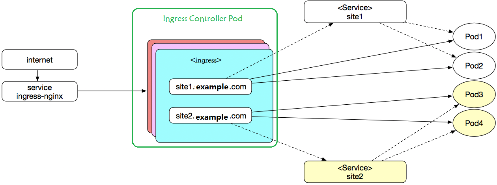
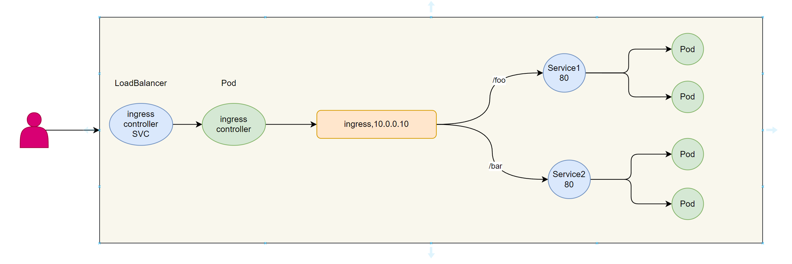
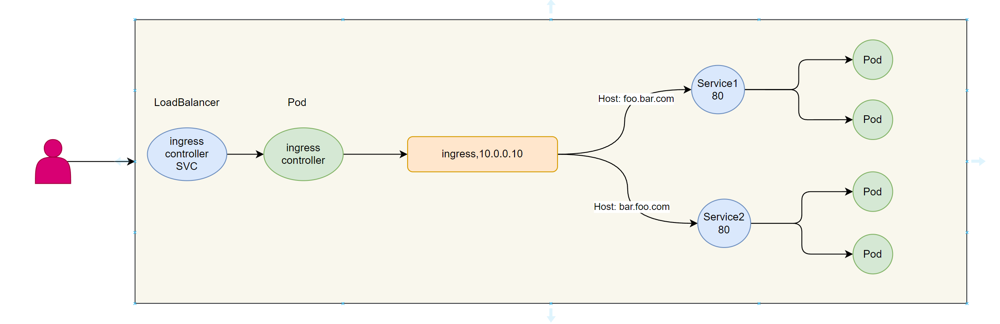
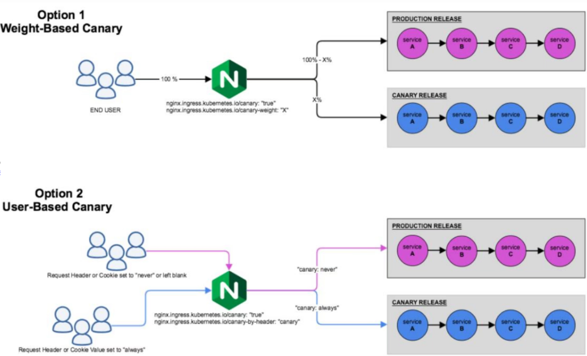

# Ingress原理

Ingress本质就是**七层代理**, 所以可以基于http/https的方式，将集群外部的流量统一的引入到集群内部

通过一个统一的流量入口，避免将集群内部大量的端口直接暴露给外部

Ingress 可为 Service 提供外部可访问的 URL、负载均衡流量、终止 SSL/TLS，以及基于名称的虚拟托管。 Ingress 控制器 通常负责通过负载均衡器来实现 Ingress，尽管它也可以配置边缘路由器或其他前端来帮助处理流量。

Ingress 不会公开任意端口或协议。 将 HTTP 和 HTTPS 以外的服务公开到 Internet 时，通常使用 Service.Type=NodePort 或 Service.Type=LoadBalancer 类型的 Service。

Ingress这种利用应用层协议来进行流量的负载均衡效果，它可以实现让用户通过域名来访问相应的 service就可以了，无需关心Node IP及Port是什么，避免了信息的泄露。

## 组件

**ingress 主要包含两个组件Ingress API和Ingress Controller**

ingress 其具备了动态更新并加载新配置的特性。而且ingress本身是不具备实现集群内外流量通信的功能的，这个功能是通过 controller来实现的。**Ingress Controller本身是运行于集群中的Pod资源对象**

| 组件               | 解析                                                         |
| ------------------ | ------------------------------------------------------------ |
| Ingress API        | Kubernetes上的标准API资源类型之一 仅定义了抽象路由配置信息，只是元数据，需要由相应的控制器动态加载 将代理配置抽象成一个Ingress对象，每个服务对应一个yaml配置文件 负责以k8s标准的资源格式定义流量调度、路由等规则 属于名称空间级资源,完成将同一个名空间的service资源进行暴露 |
| Ingress Controller | 七层反向代理服务程序 需要监视（watch）API Server上 Ingress资源的变动，并生成具体应用的自身的配 置文件格式，即将新加入的Ingress转化成反向代理的配置文件并动态加载使之生效，最终并据此完成流量转发 Ingress Controller非为内置的控制器，需要额外自行部署 通常以Pod形式运行于Kubernetes集群之上 一般应该由专用的LB Service负责为其接入集群外部流量 |

**因为ingress Controller是以pod的方式部署的,所以需要解决如下问题**

-   ingress的pod如何引入外部流量
    -   通过一个专用的service 即可实现
-   如何实现ingress的Pod的流量负载均衡
    -   关于pod负载均衡的流量，直接通过deployment/daemonset等controller转发给后端pod即可。
-   后端应用的 Pod 很多，如何找到要转发的目标？
    -   通过k8s的service对所有的pod进行分组管理，再用controller内部的负载均衡配置，找到对应的目标。
    -   **即后端应用的Pod对应的service 只是起到服务发现Pod的功能**，而从外部访问应用的Pod的流量转发过程中不需要再经过此service

## Ingress 访问过程

-   从外部流量调度到kubernetes中Ingress service，有多种实现方案，比如使用节点网络中的 EXTERNAL-IP或者NodePort方式
-   从service调度到ingress-controller
-   ingress-controller根据ingress Pod 中的定义，比如虚拟主机或者后端的url
-   根据虚拟主机名直接调度到后端的一组应用pod中



注意：

-   整个流程中涉及到了两处service内容
-   service ingress-nginx 是帮助 ingress controller Pod 接入外部流量的
-   **后端的服务对应的service**只起到帮助 ingress controller Pod 找到具体的服务的Pod，即**只用于服务发现** ，而**流量不需要经过后端服务的Service**，直接从ingress controller Pod转到至具体的Pod
-   虚线表示service对后端的应用进行分组，实线表示ingress实际的访问流向

## Ingress controller 常见的解决方案

对于Ingress controller的软件实现，其实没有特殊的要求，只要能够实现七层的负载均衡功能效果即可

Ingress controller 支持由任何具有反向代理功能的程序实现，如Nginx、Traefik、Envoy、HAProxy、 Vulcand等

Kubernetes支持同时部署二个或以上的数量的Ingress Controller

**Ingress资源配置指定Ingress Controller类型的方法**

-   专用的**annotation**：kubernetes.io/ingress.class，老版本用法
-   Ingress资源的spec的专有字段：**ingressClassName**，引用的IngressClass是一种特定的资源类 型，此方式v1.18版本起使用，新版本推荐

# Ingress-nginx Controller 安装和配置

## 基于YAML部署

[Installation Guide - Ingress-Nginx Controller](https://kubernetes.github.io/ingress-nginx/deploy/)

```shell
kubectl apply -f https://raw.githubusercontent.com/kubernetes/ingress-nginx/controller-v1.12.1/deploy/static/provider/cloud/deploy.yaml

kubectl get all -n ingress-nginx
NAME                                            READY   STATUS              RESTARTS   AGE
pod/ingress-nginx-admission-create-lwbbb        0/1     Completed           0          58s
pod/ingress-nginx-admission-patch-dp4qq         0/1     Completed           0          58s
pod/ingress-nginx-controller-665b599bc5-l97n6   0/1     Completed           0          58s

NAME                                         TYPE           CLUSTER-IP      EXTERNAL-IP   PORT(S)                      AGE
service/ingress-nginx-controller             LoadBalancer   10.98.174.228   10.0.0.10     80:31948/TCP,443:31606/TCP   58s
service/ingress-nginx-controller-admission   ClusterIP      10.97.141.116   <none>        443/TCP                      58s

NAME                                       READY   UP-TO-DATE   AVAILABLE   AGE
deployment.apps/ingress-nginx-controller   0/1     1            0           58s

NAME                                                  DESIRED   CURRENT   READY   AGE
replicaset.apps/ingress-nginx-controller-665b599bc5   1         1         0       58s

NAME                                       STATUS     COMPLETIONS   DURATION   AGE
job.batch/ingress-nginx-admission-create   Complete   1/1           40s        58s
job.batch/ingress-nginx-admission-patch    Complete   1/1           41s        58s
```

可修改配置

```yaml
#1）开放外部访问入口地址
kind: Service
...
metadata:
...
  annotations:                       # 添加如下三行，用于支持Prometheus监控，可选
      prometheus.io/scrape: "true"
      prometheus.io/port: "10254"
...
spec:
...
  type: LoadBalancer             # 这里使用LoadBalancer，因此需要部署MetalLB
...
#2）默认ingress-nginx-controller只有一个Pod副本的,
apiVersion: apps/v1
kind: Deployment
...
spec:
  replicas: 2  # 添加副本数
...

```

# Ingress命令式实现

```shell
# 创建Ingress命令
kubectl create ingress NAME --rule=domain/url=service:port[, tls[=secret]] [option]

# 常用option
--annotation=[]  # 注解信息：格式"annotation=value"
--rule=[]        # 代理规则，格式"host/path=service:port[,tls=secretname]",,注意:rule中外部域名要在所有的名称空间唯一
--class=''       # 此Ingress适配的Ingress Class Controller

# 基于URI方式代理不同应用的请求时，后端应用的URI若与代理时使用的URI不同，则需要启用URL Rewrite完成URI的重写
# Ingress-Nginx支持使用“annotation nginx.ingress.kubernetes.io/rewrite-target”注解进行
```

```shell
kubectl create deployment pod-test1 --image=harbor.l00n9.icu/public/pod-test:v0.1 --replicas=3
kubectl create service clusterip pod-test1 --tcp=80:80

kubectl create deployment pod-test2 --image=harbor.l00n9.icu/public/pod-test:v0.2 --replicas=3
kubectl create service clusterip pod-test2 --tcp=80:80

kubectl get svc
NAME         TYPE        CLUSTER-IP      EXTERNAL-IP   PORT(S)   AGE
kubernetes   ClusterIP   10.96.0.1       <none>        443/TCP   17d
pod-test1    ClusterIP   10.106.223.22   <none>        80/TCP    13s
pod-test2    ClusterIP   10.102.95.25    <none>        80/TCP    10s
```

## 单域名单URL

### **实现单域名不支持子URL**

范例：命令式实现单域名不支持子URL，子URL无法访问，返回404

```yaml
kubectl create ingress demo-ingress --rule="www.test.icu/=pod-test1:80" --class=nginx -o yaml --dry-run=client
apiVersion: networking.k8s.io/v1
kind: Ingress
metadata:
  creationTimestamp: null
  name: demo-ingress
spec:
  ingressClassName: nginx
  rules:
  - host: www.mystical.org
    http:
      paths:
      - backend:
          service:
            name: pod-test1
            port:
              number: 80
        path: /
        pathType: Exact # 表示精确匹配，--rule="www.wang.org/*=pod-test1:80",则为prefix
status:
  loadBalancer: {}
```

```shell
kubectl create ingress demo-ingress --rule="www.test.icu/=pod-test1:80" --class=nginx

kubectl get ingress
NAME           CLASS   HOSTS          ADDRESS     PORTS   AGE
demo-ingress   nginx   www.test.icu   10.0.0.10   80      18s

curl -H"host: www.test.icu" http://10.0.0.10
kubernetes pod-test v0.1!! ClientIP: 10.244.1.122, ServerName: pod-test1-8669794fd8-dwp87, ServerIP: 10.244.1.123!

# 访问子URL失败，原因是只发布了www.wang.org的根目录，其它URL没有发布
curl -H"host: www.test.icu" http://10.0.0.10/hostname
<html>
<head><title>404 Not Found</title></head>
<body>
<center><h1>404 Not Found</h1></center>
<hr><center>nginx</center>
</body>
</html>

kubectl delete ingress demo-ingress
```

### **实现单域名支持子URL**

```yaml
kubectl create ingress demo-ingress --class=nginx --rule="www.test.icu/*=pod-test1:80" -o yaml --dry-run=client
apiVersion: networking.k8s.io/v1
kind: Ingress
metadata:
  creationTimestamp: null
  name: demo-ingress
spec:
  ingressClassName: nginx
  rules:
  - host: www.test.icu
    http:
      paths:
      - backend:
          service:
            name: pod-test1
            port:
              number: 80
        path: /
        pathType: Prefix
status:
  loadBalancer: {}
```

```shell
kubectl create ingress demo-ingress --rule="www.test.icu/*=pod-test1:80" --class=nginx

# 测试访问，且支持子URL
curl -H"host: www.test.icu" http://10.0.0.10/hostname
ServerName: pod-test1-8669794fd8-dwp87
```

### 单域名多URL

在同一个FQDN下通过不同的URL完成不同应用间的流量分发

**单域名多URL不支持子URL**

范例: 命令式实现单域名多URL，不支持子URL，如果子URL访问，也全部转发至后端Pod的根路径 /

```yaml
kubectl create ingress demo-ingress1 --rule="www.test.icu/v1=pod-test1:80" --rule="www.test.icu/v2=pod-test2:80" --class=nginx
# 集群外访问失败，原因是后端服务没有对应的/v1或/v2这样的子URL资源

# 路径精确匹配,对于发往www.wang.org/v1和/v2的请求，分别代理至service/pod-test1和service/pod-test2的根
kubectl create ingress demo-ingress1 --rule="www.test.icu/v1=pod-test1:80" --rule="www.test.icu/v2=pod-test2:80" --class=nginx --annotation nginx.ingress.kubernetes.io/rewrite-target="/"

# --annotation nginx.ingress.kubernetes.io/rewrite-target="/" 表示代理至后端服务的根/，而非默认代理至后端服务的子URL/v1和/v2

root@master1:~/k8s/ingress# curl -H"host: www.test.icu" http://10.0.0.10/v1
kubernetes pod-test v0.1!! ClientIP: 10.244.1.122, ServerName: pod-test1-8669794fd8-9gdnc, ServerIP: 10.244.2.109!
root@master1:~/k8s/ingress# curl -H"host: www.test.icu" http://10.0.0.10/v2
kubernetes pod-test v0.2!! ClientIP: 10.244.1.122, ServerName: pod-test2-65858b8998-q726t, ServerIP: 10.244.3.73!

kubectl delete ingress demo-ingress1 
```

**单域名多URL支持子URL**

```yaml
kubectl create ingress demo-ingress2 --rule='www.test.icu/v1(/|$)(.*)=pod-test1:80' --rule='www.test.icu/v2(/|$)(.*)=pod-test2:80' --class=nginx --annotation nginx.ingress.kubernetes.io/rewrite-target='/$2' -o yaml --dry-run=client > demo-ingress2.yaml

apiVersion: networking.k8s.io/v1
kind: Ingress
metadata:
  annotations:
    nginx.ingress.kubernetes.io/rewrite-target: /$2
  creationTimestamp: null
  name: demo-ingress2
spec:
  ingressClassName: nginx
  rules:
  - host: www.test.icu
    http:
      paths:
      - backend:
          service:
            name: pod-test1
            port:
              number: 80
        path: /v1(/|$)(.*)
        pathType: ImplementationSpecific # Exact修改为ImplementationSpecific
      - backend:
          service:
            name: pod-test2
            port:
              number: 80
        path: /v2(/|$)(.*)
        pathType: ImplementationSpecific
status:
  loadBalancer: {}
  
curl -H"host: www.test.icu" http://10.0.0.10/v1/hostname
ServerName: pod-test1-8669794fd8-9gdnc
curl -H"host: www.test.icu" http://10.0.0.10/v2/hostname
ServerName: pod-test2-65858b8998-zdn66
```

## 多域名



```shell
kubectl create ingress demo-ingress3 --rule="test1.l00n9.icu/*=pod-test1:80" --rule="test2.l00n9.icu/*=pod-test2:80" --class=nginx

kubectl get ingress
NAME            CLASS   HOSTS                             ADDRESS     PORTS   AGE
demo-ingress3   nginx   test1.l00n9.icu,test2.l00n9.icu   10.0.0.10   80      2m40s

root@master1:~/k8s/ingress# curl -H'host: test1.l00n9.icu' 10.0.0.10
kubernetes pod-test v0.1!! ClientIP: 10.244.1.122, ServerName: pod-test1-8669794fd8-tgbnv, ServerIP: 10.244.3.72!
root@master1:~/k8s/ingress# curl -H'host: test2.l00n9.icu' 10.0.0.10
kubernetes pod-test v0.2!! ClientIP: 10.244.1.122, ServerName: pod-test2-65858b8998-tvhfw, ServerIP: 10.244.2.110!

kubectl delete ingress demo-ingress3 
```

## HTTPS

基于TLS的Ingress要求事先准备好专用的“kubernetes.io/tls”类型的Secret资源对象

```shell
ls
xx.org.crt  xx.org.key

kubectl create secret tls tls-xx --cert=./xx.org.crt --key=./xx.org.key

kubectl create ingress tls-demo-ingress --rule='www.xx.org/*=pod-test1:80, tls=tls-xx' --class=nginx

# 注意：启用tls后，该域名下的所有URI默认为强制将http请求利用308跳转至https，若不希望使用该跳转功能，可以使用如下注解选项
kubectl create ingress tls-demo-ingress -- rule='www.wang.org/*=pod-test1:80,tls=tls-wang' --class=nginx --annotation nginx.ingress.kubernetes.io/ssl-redirect=false


```

**证书更新**

HTTPS 的证书的有效期一般为1年,到期前需要提前更新证书

```shell
(umask 077; openssl genrsa -out wang.key 2048)
openssl req -new -x509 -key wang.key -out wang.crt -subj /C=CN/ST=Beijing/L=Beijing/O=SRE/CN=www.wang.org -days 3650

# 方法1：
#在线修改证书配置,需要提前先将新证书文件用base64编码并删除换行符
[root@master1 ~]# cat wang.crt |base64 | tr -d '\n' 
[root@master1 ~]# cat wang.key |base64 | tr -d '\n'

#上面生成的内容替换下面命令的内容,立即生效
[root@master1 ~]# kubectl edit secrets tls-wang 

# 方法2：
#方法2
#删除旧证书配置
[root@master1 ~]#kubectl delete secrets tls-wang 

#创建新证书配置
[root@master1 ~]# kubectl create secret tls tls-wang --cert=./wang.crt --key=./wang.key
```

# Ingress声明式实现

基于命令方式格式功能有限，且不利于后续的重复使用，**工作中更多的使用声明式实现Ingress**

在实际的工作中，可能会基于域名访问,也可能会基于不同的功能服务以子路径的方式来进行访问，以及 与https相关的访问。

## **配置文件解析**

```yaml
apiVersion: networking.k8s.io/v1
kind: Ingress
metadata:
  name: <string>
  annotations:                                 # 资源注解，v1beta1使用下面的注解来指定要解析该资源的控制器类型
    kubernetes.io/ingress.class: <string>      # 适配的Ingress控制器类别，便于多ingress组件场景下，挑选针对的类型
    # 用于URL重写
    nginx.ingress.kubernetes.io/rewrite-target: /   
  namespace: <string>
spec:
  rules: <[]object>                            # Ingress规则列表，也就是http转发时候用到的 url关键字
  - host: <string>                             # 虚拟主机的FQDN，支持"*"前缀通配，不支持IP，不支持指定端口
    http: <object>
      paths: <[]object>                        # 虚拟主机PATH定义的列表，由path和backend组成
      - path: <string>                         # 流量匹配的HTTP PATH，必须以/开头
        pathType: <string>                     # 支持Exact、Prefix和ImplementationSpecific, 必须
        backend: <object>                      # 匹配到的流量转发到的目标后端
          resource: <object>                   # 引用的同一名称空间下的资源，与下面两个字段互斥
          service: <object>                    # 关联的后端Service对象
            name: <string>                     # 后端Service的名称
            port: <string>                     # 后端Service上的端口对象
              name: <string>                   # 端口名称
              number: <integer>                # 后端Service的端口号cat
  tls: <[]Object>                              # TLS配置，用于指定上rules中定义的哪些host需要工作https模式
  - hosts: <[]string>                          # 使用同一组证书的主机名称列表
    secretName: <string>                       # 保存于数字证书和私钥信息的Secret资源名称，用于主机认证
  backend: <Object>                            # 默认backend的定义，可嵌套字段及使用格式跟rules字段中的相同
  ingressClassName: <string>                   # ingress类名称，用于指定适配的控制器，类似于注解的功能，未来代替                                                        annotations
```

## 三种 `pathType` 及其含义与使用方式

1️⃣ `Exact`

-   **含义**：完全匹配路径，只有请求路径与规则中的路径 **完全一致** 才会被匹配。
-   **场景**：适用于需要精确控制的 API 入口等情况。

**示例：**

```
path: /app
pathType: Exact
```


| 请求路径  | 是否匹配 |
| --------- | -------- |
| `/app`    | ✅ 是     |
| `/app/`   | ❌ 否     |
| `/app/v1` | ❌ 否     |

2️⃣ `Prefix`

-   **含义**：匹配以指定路径为前缀的请求路径，且路径分段（以 `/` 分隔）必须完整匹配。
-   **这是使用最广泛的类型**。

**示例：**

```
path: /app
pathType: Prefix
```

| 请求路径       | 是否匹配 |
| -------------- | -------- |
| `/app`         | ✅ 是     |
| `/app/`        | ✅ 是     |
| `/app/page`    | ✅ 是     |
| `/application` | ❌ 否     |

注意：**`/app/page`** ✅ 是因为它是以 `/app` 这个段开头，而 `/application` ❌ 是因为整个段不匹配。

3️⃣ `ImplementationSpecific`

-   **含义**：由 Ingress Controller 自己决定如何匹配路径，行为 **可能因控制器不同而异**。
-   **不推荐生产使用**，容易出现不一致行为。

**示例：**

```
path: /app
pathType: ImplementationSpecific
```

| 请求路径    | 是否匹配 |
| ----------- | -------- |
| `/app`      | 可能是   |
| `/app2`     | 可能也是 |
| `/app/test` | 可能是   |

取决于你用的是哪个 Ingress Controller，例如 NGINX、Traefik、HAProxy 等都实现略有不同。

## Ingress重定向实现

`nginx.ingress.kubernetes.io/rewrite-target: /` 这个 annotation 用于 **URL 重写**，它的作用是 **将进入 Ingress 的请求路径“修改后”再转发给后端服务**。

例子：URL 重写

**目标**

-   用户访问 **`http://example.org/app`** 时，后端实际收到的是 `/`。
-   适用于后端服务不希望处理 `app` 这个前缀的情况。

**1️⃣ 创建 Service**

```yaml
apiVersion: v1
kind: Service
metadata:
  name: echo-service
  namespace: default
spec:
  selector:
    app: echo
  ports:
    - protocol: TCP
      port: 80
      targetPort: 80
```

**2️⃣ 创建 Deployment**

```
apiVersion: apps/v1
kind: Deployment
metadata:
  name: echo-deployment
  namespace: default
spec:
  replicas: 2
  selector:
    matchLabels:
      app: echo
  template:
    metadata:
      labels:
        app: echo
    spec:
      containers:
      - name: echo-container
        image: hashicorp/http-echo
        args:
        - "-text=Hello from backend!"
        ports:
        - containerPort: 80=
```

**3️⃣ 创建 Ingress**

```yaml
apiVersion: networking.k8s.io/v1
kind: Ingress
metadata:
  name: echo-ingress
  namespace: default
  annotations:
    nginx.ingress.kubernetes.io/rewrite-target: /
spec:
  ingressClassName: nginx
  rules:
  - host: example.org
    http:
      paths:
      - path: /app
        pathType: Prefix
        backend:
          service:
            name: echo-service
            port:
              number: 80
```

**解析**

1.  **用户请求**：`http://example.org/app`
2.  Ingress 处理：
    -   由于 `rewrite-target: /`，请求的路径 `/app` 会被**替换成 `/`**。
    -   Nginx Ingress 发送请求给后端时，路径变为 `/`。
3.  后端收到请求：
    -   `echo-service` 只接收 `/`，返回 `Hello from backend!`。

## Ingress 实际上如何和 Pod 通信

虽然 `Ingress` 配置的是 `Service` 的端口，但 `Ingress Controller` **最终会绕过 `Service`，直接和 Pod 通信**（Service 主要用于发现 Pod）。

**流程如下：**

1.  用户请求 `example.org`

    ```shell
    curl http://example.org
    ```

2.  DNS 解析 `example.org`，指向 `Ingress Controller`

3.  `Ingress Controller` 根据 `Host` 和 `Path` 规则匹配到 `Service`

4.  `Ingress Controller` 查询 `Service` 的 `Endpoints`（实际的 Pod 列表）

5.  `Ingress Controller` 直接转发流量到后端`Pod`

    -   Ingress Controller **不会再经过 `Service` 负载均衡，而是直接选择一个 `Pod` 并转发请求**。

## 单域名

```yaml
apiVersion: apps/v1
kind: Deployment
metadata:
  name: deployment-test
spec:
  replicas: 3
  selector:
    matchLabels:
      app: pod-test
  template:
    metadata:
      labels:
        app: pod-test
    spec:
      containers:
      - name: pod-test
        image: harbor.l00n9.icu/public/pod-test:v0.1
        imagePullPolicy: IfNotPresent
        ports:
        - containerPort: 80
          name: http
---
apiVersion: v1
kind: Service
metadata:
  name: deployment-service
spec:
  selector:
    app: pod-test
  ports:
  - name: http
    port: 80
    targetPort: 80
---
apiVersion: networking.k8s.io/v1
kind: Ingress
metadata:
  name: ingress-test
spec:
  ingressClassName: nginx
  rules:
  - host: www.mystical.org
    http:
      paths:
      - path: /
        pathType: Prefix
        backend:
          service:
            name: deployment-service
            port:
              number: 80
```

## 获取真实客户端IP

```yaml
cat ingress-http-real-ip.yaml 
apiVersion: networking.k8s.io/v1
kind: Ingress
metadata:
  name: ingress-myapp
  annotations:
    nginx.ingress.kubernetes.io/enable-real-ip: "true" # 允许IP透传，此为默认值
spec:
  ingressClassName: nginx
  rules:
  - host: www.mystical.org
    http:
      paths:
      - backend:
          service:
            name: myapp
            port:
              number: 80
        path: /
        pathType: Prefix

# 查看ip
kubectl logs myapp-56cc856b4-k9hjv 
```

## 单域名多URL

### **不支持子URL**

```shell
cat ingress-http-mul-url.yaml 
apiVersion: networking.k8s.io/v1
kind: Ingress
metadata:
  name: ingress-mul-url
  annotations:
    nginx.ingress.kubernetes.io/rewrite-target: / # 默认会转发给后端时会带URL，添加此行，表示转发时删除后面的URL
spec:
  ingressClassName: nginx  # 新版建议使用此项指定controller类型
  rules:
  - host: www.mystical.org
    http:
      paths:
      - path: /flask
        pathType: Prefix # 表示以/flask为开始即可
        backend:
          service:
            name: deployment-service  # 指定对应Service的名称
            port:
              name: http
      - path: /nginx
        pathType: Prefix
        backend:
          service:
            name: nginx-service
            port:
              name: nginx
              
#注意事项：
#默认转给后端服务时会将url也同时转发，而后端服务有可能不存在此URL，所以需要在后端url转发的时候，取消转发关键字。
#方法就是，在annotation中添加一个重写的规则nginx.ingress.kubernetes.io/rewrite-target: / 即所有的请求把ingress匹配到的url关键字清除掉
```

### **支持子URL**

```yaml
cat ingress-http-mul-suburl.yaml 
apiVersion: networking.k8s.io/v1
kind: Ingress
metadata:
  annotations:
    nginx.ingress.kubernetes.io/rewrite-target: /$2  # 正则表达式
  name: ingress-http-mul-suburl
spec:
  ingressClassName: nginx
  rules:
  - host: www.mystical.org
    http:
      paths:
      - backend:
          service:
            name: pod-test1
            port:
              number: 80
        path: /v1(/|$)(.*)
        pathType: ImplementationSpecific
      - backend:
          service:
            name: pod-test2
            port:
              number: 80
        path: /v2(/|$)(.*)
        pathType: ImplementationSpecific
```

## 多域名

```yaml
cat ingress-http-mul-host.yaml 
apiVersion: networking.k8s.io/v1
kind: Ingress
metadata:
  name: ingress-mul-url
  annotations:
    nginx.ingress.kubernetes.io/use-regex: "true"           # 指定后面rules定义的path使用的正则表达式
    nginx.ingress.kubernetes.io/proxy-body-size: "100m"     # 客户端上传文件最大值，默认1m
    nginx.ingress.kubernetes.io/proxy-connect-timeout: "60" # 后端服务器的连接超时的时间，默认值为5s
    nginx.ingress.kubernetes.io/proxy-send-timeout: "120"   # 后端服务器数据回传超时时间，即规定时间之内后端服务器必须传完所有的数据，默认值为60s
    nginx.ingress.kubernetes.io/proxy-read-timeout: "120"   # 后端服务器响应的超时时间，默认60s
    #nginx.ingress.kubernetes.io/app-root: /index.html      #指定默认页面文件
spec:
  ingressClassName: nginx                                   # 新版建议使用此项指定controllerl类型
  rules:
  - host: flask.mystical.org
    http:
      paths:
      - path: /
        pathType: Prefix
        backend:
          service:
            name: deployment-service
            port:
              name: http                                  # 匹配service中的端口 name: http
  - host: nginx.mystical.org
    http:
      paths:
      - path: /
        pathType: Prefix
        backend:
          service:
            name: nginx-service
            port:
              name: nginx
```

## HTTPS 

```yaml
kubectl get secret
NAME           TYPE                DATA   AGE
tls-xx   kubernetes.io/tls   2      47h

cat ingress-http-tls-test.yaml 
apiVersion: networking.k8s.io/v1
kind: Ingress
metadata:
  name: ingress-test
spec:
  ingressClassName: nginx
  rules:
  - host: www.mystical.org
    http:
      paths:
      - path: /
        pathType: Prefix
        backend:
          service:
            name: deployment-service
            port:
              number: 80
# - host: m.mystical.org
# ...

# https证书配置
  tls:
  - hosts:
    - www.mystical.org
    secretName: tls-mystical
 #- hosts:                                             # 多个域名分别对应不同的证书
 #  - m.mystical.org
 #  secretName: ingress-tls-m
```

# Ingress Nginx 实现蓝绿BlueGreen 和灰度Canary 发布

Service 虽然支持流量分配,但是**只支持基于Pod的数量或比例实现**,而**不支持基于Header,cookie,权重等** 更为清确的流量发配策略

**Ingress-Nginx支持配置Ingress Annotations来实现不同场景下的灰度发布和测试**，它能够满足金丝雀 发布、蓝绿部署与A/B测试等不同的业务场景

**注意**：Ingress-Nginx 只能支持南北向的流量发布，而东西向流量的发布可以利用工作负载型如 deployment的更新策略或者服务网格技术实现

## **Ingress Nginx的流量发布机制**



-   蓝绿：
    -   production: 100%, canary: 0%
    -   production: 0%, canary: 100% --> Canary变成后面的Production
-   金丝雀Canary：
    -   **流量比例化切分**: 逐渐调整
    -   流量识别，将特定的流量分发给Canary：
        -   By-Header：基于特定的标头识别
            -   Header 值默认：只有Always 或 Nerver 两种值
            -   Header 值自定义
            -   Header 值可以基于正则表达式Pattern进行匹配
        -   By-Cookie: 基于Cookie识别

## **基于Ingress Nginx的Canary规则**

Ingress Nginx 的 Annotations支持的Canary规则， Annotations 和 Label 相似也是保存资源对象上的 元数据，但不能被标签选择器选择，且没有Label的名称最长63个字符的限制

-   **nginx.ingress.kubernetes.io/canary-weight**：
    -   基于服务权重进行流量切分，适用于蓝绿或灰度发布，权重范围0 - 100按百分比将请求路由到 Canary Ingress中指定的服务
    -   权重为 0 意味着该金丝雀规则不会向Canary入口的服务发送任何请求
    -   权重为100意味着所有请求都将被发送到 Canary 入口
-   **nginx.ingress.kubernetes.io/canary-by-cookie**：
    -   基于 cookie 的流量切分，适用于灰度发布与 A/B 测试
    -   cookie 的值设置为 always 时，它将被路由到Canary入口
    -   cookie 的值设置为 never 时，请求不会被发送到Canary入口
    -   对于任何其他值，将忽略 cookie 并将请求与其他金丝雀规则进行优先级的比较，默认转发给旧版 本

**规则的应用次序**

-   Canary规则会按特定的次序进行评估
-   优先级从低到高顺序：**canary -weight- -> canary-by-cookie --> canary-by-header**

## 案例

### 初始环境准备新旧两个版本应用

```yaml
 cat deploy-pod-test-v1.yaml 
apiVersion: apps/v1
kind: Deployment
metadata:
  labels:
    app: pod-test
  name: pod-test-v1
spec:
  replicas: 1
  selector:
    matchLabels:
      app: pod-test
      version: v0.1
  strategy: {}
  template:
    metadata:
      labels:
        app: pod-test
        version: v0.1
    spec:
      containers:
      - image: registry.cn-beijing.aliyuncs.com/wangxiaochun/pod-test:v0.1
        name: pod-test

---
apiVersion: v1
kind: Service
metadata:
  labels:
    app: pod-test
  name: pod-test-v1
spec:
  ports:
  - name: http-80
    port: 80
    protocol: TCP
    targetPort: 80
  selector:
    app: pod-test
    version: v0.1
  type: ClusterIP
```

```yaml
cat deploy-pod-test-v2.yaml 
apiVersion: apps/v1
kind: Deployment
metadata:
  labels:
    app: pod-test
  name: pod-test-v2
spec:
  replicas: 1
  selector:
    matchLabels:
      app: pod-test
      version: v0.2
  strategy: {}
  template:
    metadata:
      labels:
        app: pod-test
        version: v0.2
    spec:
      containers:
      - image: registry.cn-beijing.aliyuncs.com/wangxiaochun/pod-test:v0.2
        name: pod-test

---
apiVersion: v1
kind: Service
metadata:
  labels:
    app: pod-test
  name: pod-test-v2
spec:
  ports:
  - name: http-80
    port: 80
    protocol: TCP
    targetPort: 80
  selector:
    app: pod-test
    version: v0.2
  type: ClusterIP
```

### 蓝绿发布

```yaml
cat ingress-blue-green.yaml 
apiVersion: networking.k8s.io/v1
kind: Ingress
metadata:
  name: ingress-blue-green
spec:
  ingressClassName: nginx
  rules:
  - host: www.mystical.org
    http:
      paths:
      - backend:
          service:
            name: pod-test-v1
            port:
              number: 80 
        path: /
        pathType: Prefix
        
# 修改Ingress切换成v0.2版本
cat ingress-blue-green.yaml 
apiVersion: networking.k8s.io/v1
kind: Ingress
metadata:
  name: ingress-blue-green
spec:
  ingressClassName: nginx
  rules:
  - host: www.mystical.org
    http:
      paths:
      - backend:
          service:
            name: pod-test-v2              # 修改Service版本
            port:
              number: 80 
        path: /
        pathType: Prefix
```

### 基于权重的金丝雀发布

```yaml
cat canary-by-weight.yaml 
apiVersion: networking.k8s.io/v1
kind: Ingress
metadata:
  annotations:
    nginx.ingress.kubernetes.io/canary: "true"
    nginx.ingress.kubernetes.io/canary-weight: "10"  # 指定使用金丝雀新版占用百分比
  name: pod-test-canary-by-weight
spec:
  ingressClassName: nginx
  rules:
  - host: www.mystical.org
    http:
      paths:
      - backend:
          service:
            name: pod-test-v2
            port:
              number: 80
        path: /
        pathType: Prefix
```

### 基于Cookie实现金丝雀发布

```yaml
cat canary-by-cookie.yaml 
apiVersion: networking.k8s.io/v1
kind: Ingress
metadata:
  annotations:
    nginx.ingress.kubernetes.io/canary: "true"
    nginx.ingress.kubernetes.io/canary-by-cookie: "vip_user"  # cookie中vip_user=always时才用金丝雀发布下面新版本
  name: pod-test-canary-by-cookie
spec:
  ingressClassName: nginx
  rules:
  - host: www.mystical.org
    http:
      paths:
      - backend:
          service:
            name: pod-test-v2
            port:
              number: 80
        path: /
        pathType: Prefix
        
        
while true; do curl www.mystical.org; sleep 1; done

while true; do curl -b "vip_user=always" www.mystical.org; sleep 1; done
```

### 基于请求Header固定值的金丝雀发布

```yaml
cat canary-by-header.yaml 
apiVersion: networking.k8s.io/v1
kind: Ingress
metadata:
  annotations:
    nginx.ingress.kubernetes.io/canary: "true"
    nginx.ingress.kubernetes.io/canary-by-header: "X-Canary" # X-Canary首部字段值为always时才使用金丝雀发布下面新版本,否则为旧版本
  name: pod-test-canary-by-header
spec:
  ingressClassName: nginx
  rules:
  - host: www.mystical.org
    http:
      paths:
      - backend:
          service:
            name: pod-test-v2
            port:
              number: 80
        path: /
        pathType: Prefix
        
while true; do curl -H "X-Canary: always" www.mystical.org; sleep 1; done
```

### 基于请求 Header 精确匹配指定值的金丝雀发布

```yaml
cat canary-by-header-value.yaml 
apiVersion: networking.k8s.io/v1
kind: Ingress
metadata:
  annotations:
    nginx.ingress.kubernetes.io/canary: "true"
    nginx.ingress.kubernetes.io/canary-by-header: "IsVIP"
    nginx.ingress.kubernetes.io/canary-by-header-value: "true" #IsVIP首部字段的值为true就使用金丝雀发布下面新版本,否则为旧版本
  name: pod-test-canary-by-header-value
spec:
  ingressClassName: nginx
  rules:
  - host: www.mystical.org
    http:
      paths:
      - backend:
          service:
            name: pod-test-v2
            port: 
              number: 80
        path: /
        pathType: Prefix
        
while true; do curl -H "IsVIP: true" www.mystical.org; sleep 1; done
```

### 基于请求 Header 正则表达式模式匹配的指定值的金丝雀发布

```yaml
cat canary-by-header-pattern.yaml 
apiVersion: networking.k8s.io/v1
kind: Ingress
metadata:
  annotations:
    nginx.ingress.kubernetes.io/canary: "true"
    nginx.ingress.kubernetes.io/canary-by-header: "username"
    nginx.ingress.kubernetes.io/canary-by-header-pattern: "(vip|VIP)_.*" #首部字段的值为username且正则表达式匹配时使用新版，否则使用旧版
  name: pod-test-canary-by-header-pattern
spec:
  ingressClassName: nginx
  rules:
  - host: www.mystical.org
    http:
      paths:
      - backend:
          service:
            name: pod-test-v2
            port: 
              number: 80
        path: /
        pathType: Prefix
        
while true; do curl -H "username: vip_user" www.mystical.org; sleep 1; done
while true; do curl -H "username: VIP_man" www.mystical.org; sleep 1; done
```

## **Ingress 的不足之处**

-   Ingress只能根据 **Host** 和 **Path** 来对 HTTP/HTTPS 进行路由，但无法根据 **Query Parameter** 来路由请求
-   Ingress 只能用到了 **Host 请求头**，无法对其他 **Request / Reponse 头**进行 **增加 / 删除 / 修改** 动作
-   Ingress **对于一个Path**，**不支持多个Service作为Backend**，做不到多版本的Service
-   Ingress 不能支持跨名称空间的Service后端
-   不支持L4 和 非 HTTP/HTTPS 业务流量（如gRPC）

# Kubernetes Gateway API

为了克服Ingress的不足之处，Kubernetes提出来Gateway API

实现了Gateway API的开源Kubernetes生态软件是 **Istio**

## Gateway API 介绍

**官方网站**

```shell
https://gateway-api.sigs.k8s.io/
```